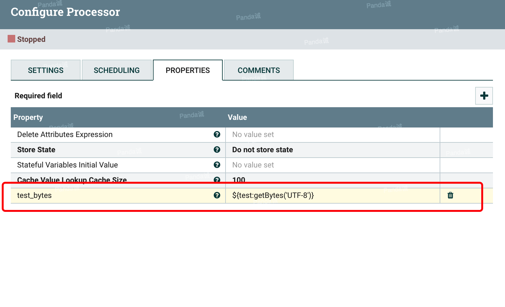

我们都知道NIFI设计了一套自己的表达式语言，在设计流程的时候表达式语言给我们提供了很大的灵活性，在官方文档中对表达式语言都有很详细的说明和示范，但有的时候我们期望增加一套特定情境，适合我们自己特殊的流程的表达式函数，本文主要介绍一个增加自定义NIFI表达式函数的demo。

## 场景假设

我们在属性中有一些中文，在流程里需要把这些值转bytes最后存储起来，那我们知道在Java中，String的getBytes()方法是得到一个操作系统默认的编码格式的字节数组。这个表示在不同OS下，返回的东西不一样！ String.getBytes(String decode)方法会根据指定的decode编码返回某字符串在该编码下的byte数组表示，那么我们就包装一个getBytes的函数


## NIFI开发

在nifi-expression-language子项目中进行自定义函数开发，在这个子项目中有个readme文件，里面较为详细的阐述了自定义开发表达式语言的流程和方法，在这里我直接复制一下
```

This document is intended to provide a walk-through of what is necessary
in order to add a new function to the Expression Language. Doing so requires
a handful of steps, so we will outline each of those steps here, in the order
that they must be done. While this documentation is fairly verbose, it is often
the case that reading the documentation takes longer than performing the tasks
outlined by the documentation.


1) In order to make the nifi-expression-language Maven module compile in your IDE, you may need to add the ANTLR-generated sources to your IDE's classpath.
   This can be done using Eclipse, as follows:
    - Right-click on the nifi-expression-language project
    - Go to "Properties" on the context menu
    - Go to the "Java Build Path" item in the left tree and choose the "Source" tab.
    - Click "Add Folder..."
    - Add the target/generated-sources/antlr3 folder. If this folder does not exist, first build the project from Maven and then
      right-click on the nifi-expression-language project in Eclipse and click Refresh.
    - Click OK to close all dialogs.

2) Add the method name to the Tokens for the Lexer
	- Open the src/main/antlr3/org/apache/nifi/attribute/expression/language/antlr/AttributeExpressionLexer.g file
	- Add the function name to the list of tokens in this file. These functions are grouped by the number of arguments
	  that they take. This grouping mechanism could probably be made better, perhaps grouping by the type of function
	  provided. However, for now, it is best to keep some sort of structure, at least. If the function has optional
	  arguments, the function should be grouped by the maximum number of arguments that it takes (for example, the
	  substring function can take 1 or 2 arguments, so it is grouped with the '2 argument functions').
	  The syntax to use is:

	  <Token Name> : '<function name>';

	  The Token Name should be all-caps and words should be separated by underscores. The Token Name is what will be used to
	  identify the token when ANTLR parses an Expression. The function name should use camel case starting with a lower-case
	  letter. This is the name of the function as it will be referenced in the Expression Language.
	- Save the AttributeExpressionLexer.g file

3) Add the method to the grammar
	- Open the src/main/antlr3/org/apache/nifi/attribute/expression/language/antlr/AttributeExpressionParser.g file
	- Starting around line 75, the functions are defined, grouped by the type of value returned. We can add the new function
	  into the grammar here. Please see the ANTLR documentation for syntax on the grammar used. Note that this is ANTLR 3, NOT ANTLR 4.
	  The idea here is to spell out the syntax that should be used for the function. So generally, we do this by specifying the function name,
	  "LPAREN!" (which indicates a left parenthesis and the ! indicates that we do not want this passed to us when obtaining the parsed tokens),
	  and then a list of arguments that are separated by "COMMA!" (again, indicating a comma character and that we do not want the token passed
	  to us when we are looking at parsed tokens). We then end with the matching "RPAREN!".
	- Save this file.

4) Rebuild via Maven
	- In order to make sure that we now can reference the tokens that are generated for our new function, we need to rebuild via Maven.
	  We can do this by building just the nifi-expression-language project, rather than rebuilding the entire NiFi code base.
	- If necessary, right-click on the nifi-expression-language project in your IDE and refresh / update project from new Maven build.
	  This is generally necessary when using Eclipse.

5) Add the logic for the function
	- In the src/main/java/org/apache/nifi/attribute/expression/language/evaluation/function package directory, we will need to create a new
	  class that is capable of implementing the logic of the new function. Create a class using the standard naming convention of
	  <function name>Evaluator and extends the appropriate abstract evaluator. If the function will return a String, the evaluator should extend
	  StringEvaluator. If the function will return a boolean, the evaluator should extend BooleanEvaluator. There are also evaluators for Date
	  and Number return types.
	- Generally the constructor for the evaluator will take an Evaluator for the "Subject" and an Evaluator for each argument. The subject is the
	  value that the function will be evaluated against. The substring function, for instance, takes a subject of type String. Thinking in terms of
	  Java, the "subject" is the object on which the function is being called. It is important to take Evaluator objects and not just a String,
	  for instance, as we have to ensure that we determine that actual values to use dynamically at runtime.
	- Implement the functionality as appropriate by implementing the abstract methods provided by the abstract Evaluator that is being extended by
	  your newly created Evaluator.
	- The Evaluator need not be thread-safe. The existing Evaluators are numerous and provide great examples for understanding the API.

6) Add the logic to the query parser
	- Generally, when using ANTLR, the preferred method to parse the input is to use a Tree Walker. However, this is far less intuitive for many
	  Java developers (including those of us who wrote the Expression Language originally). As a result, we instead use ANTLR to tokenize and parse the
	  input and then obtain an Abstract Syntax Tree and process this "manually" in Java code. This occurs in the Query class.
	- We can add the function into our parsing logic by updating the #buildFunctionEvaluator method of the org.apache.nifi.attribute.expression.compile.ExpressionCompiler class.
	  A static import will likely need to be added to the Query class in order to reference the new token. The token can then be added to the existing
	  'case' statement, which will return a new instance of the Evaluator that was just added.

7) Add Unit Tests!
	- Unit tests are critical for the Expression Language. These expressions can be used throughout the entire application and it is important that each function
	  perform its task properly. Otherwise, incorrect routing decisions could be made, or data could become corrupted as a result.
	- Each function should have its battery of unit tests added to the TestQuery class. This class includes a convenience method named #verifyEquals that is
	  used to ensure that the Expression returns the same value, regardless of how it is compiled and evaluated.

8) Add Documentation!
	- The documentation for each function is provided in the nifi-docs module, under src/main/asciidoc/expression-language-guide.adoc.
	  The format of the document is crucial to maintain, as this document is not only rendered as HTML in the NiFi Documentation page, but the
	  CSS classes that are used in the rendered docs are also made use of by the NiFi UI. When a user is entering an Expression Language expression and
	  presses Ctrl+Space, the UI provides auto-completion information as well as inline documentation for each function. This information is pulled
	  directly from the HTML that is generated from this expression-language-guide file.
	- Rebuild NiFi and run the application. Add an UpdateAttribute Processor to the graph and add a new property. For the value, type the Expression Language
	  opening tokens ${ and then press Ctrl+Space to ensure that the function and its documentation is presented as expected. Most functions that are added
	  will require a Subject. In order to see the function, then, you will need to provide a subject, such as typing "${myVariable:" (without the quotes)
	  and then press Ctrl+Space. This step is important, as it is quite easy to make a mistake when creating the documentation using a free-form text editor,
	  and this will ensure that users receive a very consistent and quality experience when using the new function.

```

下面我简单介绍一下我们设计的getBytes是怎么实现的

### 第一步 编辑antlr配置文件

(antlr是个什么自行查询资料，也不用想太多，照着上面的流程就能自己实现自定义表达式语言函数了)


### 第二步 新建Evaluator

具体该继承哪一个Evaluator，看上面的说明和源码，我这里期望getBytes返回的是byte数组的字符串


```java
public class GetBytesEvaluator extends StringEvaluator {

    private final Evaluator<String> subject;

    private final Evaluator<String> charSetStr;


    public GetBytesEvaluator(final Evaluator<String> subject, final Evaluator<String> charSetStr) {
        this.subject = subject;
        this.charSetStr = charSetStr;
    }

    @Override
    public QueryResult<String> evaluate(final EvaluationContext evaluationContext) {
        final String subjectValue = subject.evaluate(evaluationContext).getValue();
        String charSetStrValue = charSetStr.evaluate(evaluationContext).getValue();
        if (StringUtils.isBlank(charSetStrValue)) {
            charSetStrValue = StandardCharsets.UTF_8.name();
        }
        try {
            return new StringQueryResult(null == subjectValue ? null : Arrays.toString(subjectValue.getBytes(charSetStrValue)));
        } catch (UnsupportedEncodingException e) {
            return new StringQueryResult(subjectValue);
        }
    }

    @Override
    public Evaluator<?> getSubjectEvaluator() {
        return null;
    }

}

```

### 第三步 用maven重新编译一下

其实主要是把我们修改的antlr文件编译成新的类

### 第四步 注册getBytes函数


### 第五步 重新编译NIFI

也可以单独编译nifi-expression-language和引用nifi-expression-language的其他子项目，我觉得挨个找有些费劲，就重新编译NIFI了。

### 效果展示





