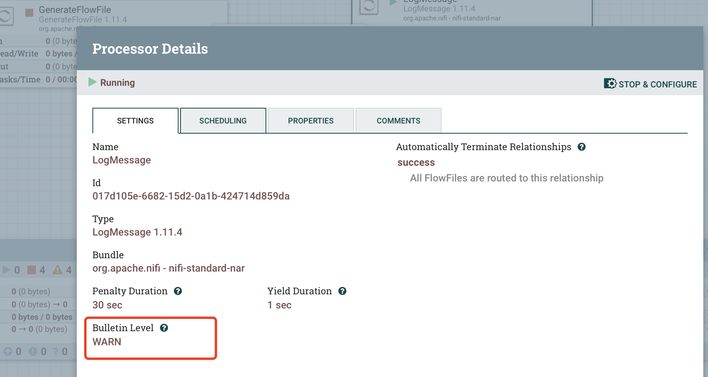
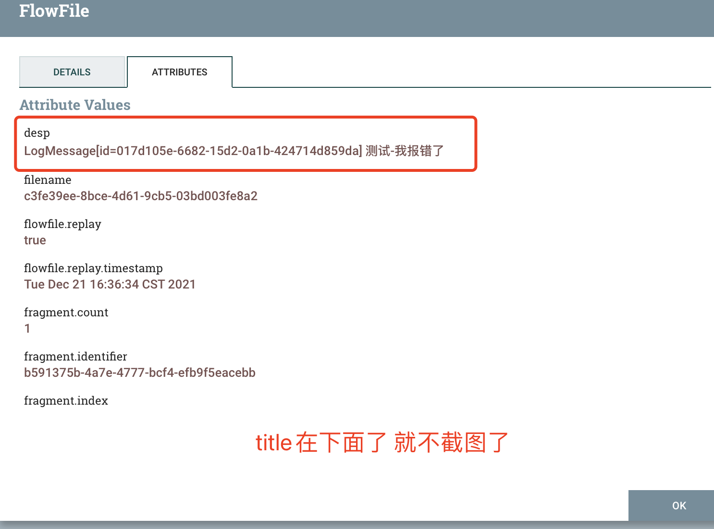

如何不写代码，只利用NIFI的组件，以及免费的资源，实现流程组件报错微信告警的功能？

先看效果图


## NiFi Bulletin Board

组件`Bulletin Level`可设置对应的日志级别(比如下面截图用到的LogMessage设置成warn)，组件输出的相应级别的日志会相应发送到`Bulletin Board`。




>`Bulletin Level`日志级别比如设置warn，那么error和warn级别的日志都会发送到`Bulletin Board`。

## SiteToSiteBulletinReportingTask

将`Bulletin Board`信息推送到NIFI的S2S接收端。(非常非常容易配置)

>`ReportingTask` 是一类报告型的定时任务。

按照如下配置你的`SiteToSiteBulletinReportingTask`，这里我就推送到当前的NIFI节点(调度时间记得改一下，默认一分钟有些长)。


然后在当前的NIFI节点配置一个接收数据的`Input Port`


将`SiteToSiteBulletinReportingTask`启动，将命名为`warn`的`Input Port`启动，然后人为造一个错误消息


这样我们就成功的获取到了组件发送到`Bulletin Board`的告警信息！

```json
[ {
  "objectId" : "1ee4396d-1cec-4c7f-b39e-5575bbb0a1fe",
  "platform" : "nifi",
  "bulletinId" : 254,
  "bulletinCategory" : "Log Message",
  "bulletinGroupId" : "017d1061-6682-15d2-b2ad-2e47bdd074bf",
  "bulletinGroupName" : "告警流程",
  "bulletinGroupPath" : "NiFi Flow / 告警流程",
  "bulletinLevel" : "WARNING",
  "bulletinMessage" : "LogMessage[id=017d105e-6682-15d2-0a1b-424714d859da] 测试-我报错了",
  "bulletinSourceId" : "017d105e-6682-15d2-0a1b-424714d859da",
  "bulletinSourceName" : "LogMessage",
  "bulletinSourceType" : "PROCESSOR",
  "bulletinTimestamp" : "2021-12-21T07:34:56.179Z"
} ]
```

## 微信推送

这里使用一个第三方的微信公众号告警的平台(Server酱 https://sct.ftqq.com/login)。微信扫码登陆，然后会获取一个带SendKey的URL，最简单的就是通过一个Get请求就可以发出告警信息了。比如我的 `https://sctapi.ftqq.com/SCT61343Tr8GxPpW7cNj7VY29IrVLyQx2.send?title=messagetitle`(messagetitle就是你的告警信息，这里我的SendKey已重置失效，大家要使用自己申请到的SendKey)

>怎么用Server酱这里就不详细说了，他的官网有详细的说明，其中免费的额度个人使用也是足够的了。本文Server酱使用的消息通道是方糖服务号。


怎么处理获取到的`Bulletin Board`的告警信息大家自己设计，我这里简单的`SplitJson`获取到单条的JSON数据：

```json
{
  "objectId" : "1ee4396d-1cec-4c7f-b39e-5575bbb0a1fe",
  "platform" : "nifi",
  "bulletinId" : 254,
  "bulletinCategory" : "Log Message",
  "bulletinGroupId" : "017d1061-6682-15d2-b2ad-2e47bdd074bf",
  "bulletinGroupName" : "告警流程",
  "bulletinGroupPath" : "NiFi Flow / 告警流程",
  "bulletinLevel" : "WARNING",
  "bulletinMessage" : "LogMessage[id=017d105e-6682-15d2-0a1b-424714d859da] 测试-我报错了",
  "bulletinSourceId" : "017d105e-6682-15d2-0a1b-424714d859da",
  "bulletinSourceName" : "LogMessage",
  "bulletinSourceType" : "PROCESSOR",
  "bulletinTimestamp" : "2021-12-21T07:34:56.179Z"
}
```

然后`EvaluateJsonPath`将`bulletinGroupPath`和`bulletinMessage`字段提取到attribute里。




最后使用`InvokeHTTP`发生到`https://sctapi.ftqq.com/SCT61343Tr8GxPpW7cNj7VY29IrVLyQx2.send?title=${bulletinGroupPath} ${bulletinLevel} ${bulletinMessage}`一个Get请求。


同时方糖服务号给我推送了一条消息：


由于Get请求有长度限制，所以推送给我的消息补全。

现在换POST请求再推一次(`InvokeHTTP` `https://sctapi.ftqq.com/SCT61343Tr8GxPpW7cNj7VY29IrVLyQx2.send`，Content-type要换成`application/x-www-form-urlencoded`)，先用`ReplaceText`拼一下要POST的body数据：


得到form表单格式数据数据：
```json
title=NiFi Flow / 告警流程&desp=LogMessage[id=017d105e-6682-15d2-0a1b-424714d859da] 测试-我报错了
```

最终收到方糖服务号推送消息：


