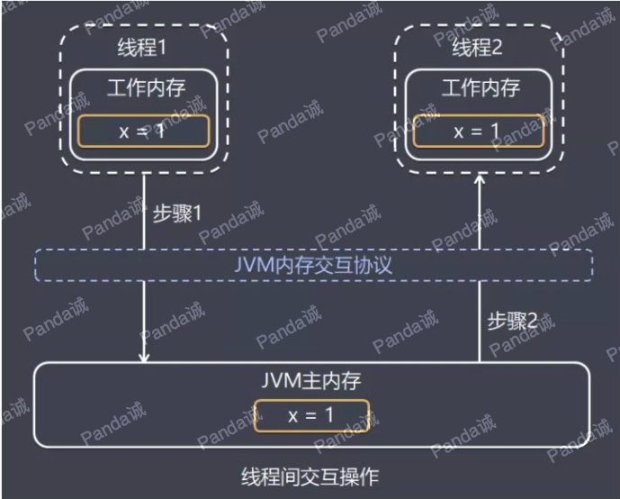

## 一、内存模型产生背景

在介绍 Java 内存模型之前，我们先了解一下物理计算机中的并发问题，理解这些问题可以搞清楚内存模型产生的背景。

物理机遇到的并发问题与虚拟机中的情况有不少相似之处，物理机的解决方案对虚拟机的实现有相当的参考意义。

### 1.物理机的并发问题

**硬件的效率问题**

计算机处理器处理绝大多数运行任务都不可能只靠处理器“计算”就能完成，处理器至少需要与内存交互，如读取运算数据、存储运算结果，这个 I/O 操作很难消除(无法仅靠寄存器完成所有运算任务)。

由于计算机的存储设备与处理器的运算速度有几个数量级的差距，为了避免处理器等待缓慢的内存完成读写操作，现代计算机系统通过加入一层读写速度尽可能接近处理器运算速度的高速缓存。

**缓存作为内存和处理器之间的缓冲：** 将运算需要使用到的数据复制到缓存中，让运算能快速运行，当运算结束后再从缓存同步回内存之中。


**缓存一致性问题**

基于高速缓存的存储系统交互很好的解决了处理器与内存速度的矛盾，但是也为计算机系统带来更高的复杂度，因为引入了一个新问题：缓存一致性。

在多处理器的系统中(或者单处理器多核的系统)，每个处理器(每个核)都有自己的高速缓存，而它们有共享同一主内存(Main Memory)。

当多个处理器的运算任务都涉及同一块主内存区域时，将可能导致各自的缓存数据不一致。 

为此，需要各个处理器访问缓存时都遵循一些协议，在读写时要根据协议进行操作，来维护缓存的一致性。


**代码乱序执行优化问题**

为了使得处理器内部的运算单元尽量被充分利用，提高运算效率，处理器可能会对输入的代码进行乱序执行。

处理器会在计算之后将乱序执行的结果重组，乱序优化可以保证在单线程下该执行结果与顺序执行的结果是一致的，但不保证程序中各个语句计算的先后顺序与输入代码中的顺序一致。


乱序执行技术是处理器为提高运算速度而做出违背代码原有顺序的优化。在单核时代，处理器保证做出的优化不会导致执行结果远离预期目标，但在多核环境下却并非如此。

在多核环境下， 如果存在一个核的计算任务依赖另一个核计算任务的中间结果。

而且对相关数据读写没做任何防护措施，那么其顺序性并不能靠代码的先后顺序来保证，处理器最终得出的结果和我们逻辑得到的结果可能会大不相同。


以上图为例进行说明，CPU 的 core2 中的逻辑 B 依赖 core1 中的逻辑 A 先执行：

* 正常情况下，逻辑 A 执行完之后再执行逻辑 B。
* 在处理器乱序执行优化情况下，有可能导致 flag 提前被设置为 true，导致逻辑 B 先于逻辑 A 执行。

## 二、Java 内存模型的组成分析

### 1、内存模型概念

为了更好解决上面提到的系列问题，内存模型被总结提出，我们可以把内存模型理解为在特定操作协议下，对特定的内存或高速缓存进行读写访问的过程抽象。

不同架构的物理计算机可以有不一样的内存模型，Java 虚拟机也有自己的内存模型。

Java 虚拟机规范中试图定义一种 Java 内存模型（Java Memory Model，简称 JMM）来屏蔽掉各种硬件和操作系统的内存访问差异，以实现让 Java 程序在各种平台下都能达到一致的内存访问效果，不必因为不同平台上的物理机的内存模型的差异，对各平台定制化开发程序。

更具体一点说，**Java 内存模型提出目标在于，定义程序中各个变量的访问规则，即在虚拟机中将变量存储到内存和从内存中取出变量这样的底层细节。**

此处的变量(Variables)与 Java 编程中所说的变量有所区别，它包括了实例字段、静态字段和构成数值对象的元素，但不包括局部变量与方法参数，因为后者是线程私有的。

注：如果局部变量是一个 reference 类型，它引用的对象在 Java 堆中可被各个线程共享，但是 reference 本身在 Java 栈的局部变量表中，它是线程私有的。

### 2、Java 内存模型的组成

**主内存**

Java 内存模型规定了所有变量都存储在主内存(Main Memory)中（此处的主内存与介绍物理硬件的主内存名字一样，两者可以互相类比，但此处仅是虚拟机内存的一部分）。

**工作内存**

每条线程都有自己的工作内存(Working Memory，又称本地内存，可与前面介绍的处理器高速缓存类比)，线程的工作内存中保存了该线程使用到的变量的主内存中的共享变量的副本拷贝。

工作内存是 JMM 的一个抽象概念，并不真实存在。它涵盖了缓存，写缓冲区，寄存器以及其他的硬件和编译器优化。

Java 内存模型抽象示意图如下：


### 3、JVM 内存操作的并发问题

结合前面介绍的物理机的处理器处理内存的问题，可以类比总结出 JVM 内存操作的问题，下面介绍的 Java 内存模型的执行处理将围绕解决这两个问题展开。

**工作内存数据一致性** 

各个线程操作数据时会保存使用到的主内存中的共享变量副本，当多个线程的运算任务都涉及同一个共享变量时，将导致各自的共享变量副本不一致，如果真的发生这种情况，数据同步回主内存以谁的副本数据为准？ 

Java 内存模型主要通过一系列的数据同步协议、规则来保证数据的一致性，后面再详细介绍。

**指令重排序优化** 

在不改变程序执行结果的前提下，尽可能提高并行度。JMM对底层尽量减少约束，使其能够发挥自身优势。因此，在执行程序时，为了提高性能，编译器和处理器常常会对指令进行重排序。一般重排序可以分为如下三种：


1.  编译器优化的重排序。编译器在不改变单线程程序语义的前提下，可以重新安排语句的执行顺序；
2.  指令级并行的重排序。现代处理器采用了指令级并行技术来将多条指令重叠执行。如果**不存在数据依赖性**，处理器可以改变语句对应机器指令的执行顺序；
3.  内存系统的重排序。由于处理器使用缓存和读/写缓冲区，这使得加载和存储操作看上去可能是在乱序执行的。

同样的，指令重排序不是随意重排序，它需要满足以下两个条件：

* **在单线程环境下不能改变程序运行的结果。** 即时编译器（和处理器）需要保证程序能够遵守 as-if-serial 属性。  
    通俗地说，就是在单线程情况下，要给程序一个顺序执行的假象。即经过重排序的执行结果要与顺序执行的结果保持一致。
* **存在数据依赖关系的不允许重排序。**

如图，1属于编译器重排序，而2和3统称为处理器重排序。这些重排序会导致线程安全的问题，一个很经典的例子就是DCL问题(双重检查锁)。**针对编译器重排序**，JMM的编译器重排序规则会禁止一些**特定类型的编译器重排序**；**针对处理器重排序**，编译器在生成指令序列的时候会通过**插入内存屏障指令来禁止某些特殊的处理器重排序**。

那么什么情况下，不能进行重排序了？下面就来说说数据依赖性。有如下代码：

```java
double pi = 3.14 //A

double r = 1.0 //B

double area = pi * r * r //C
```

这是一个计算圆面积的代码，由于A,B之间没有任何关系，对最终结果也不会存在关系，它们之间执行顺序可以重排序。因此可以执行顺序可以是A->B->C或者B->A->C执行最终结果都是3.14，即A和B之间没有数据依赖性。具体的定义为：**如果两个操作访问同一个变量，且这两个操作有一个为写操作，此时这两个操作就存在数据依赖性**这里就存在三种情况：1. 读后写；2.写后写；3. 写后读，者三种操作都是存在数据依赖性的，如果重排序会对最终执行结果会存在影响。**编译器和处理器在重排序时，会遵守数据依赖性，编译器和处理器不会改变存在数据依赖性关系的两个操作的执行顺序**

另外，还有一个比较有意思的就是as-if-serial语义。

as-if-serial语义的意思是：不管怎么重排序（编译器和处理器为了提供并行度），（单线程）程序的执行结果不能被改变。编译器，runtime和处理器都必须遵守as-if-serial语义。as-if-serial语义把单线程程序保护了起来，**遵守as-if-serial语义的编译器，runtime和处理器共同为编写单线程程序的程序员创建了一个幻觉：单线程程序是按程序的顺序来执行的**。比如上面计算圆面积的代码，在单线程中，会让人感觉代码是一行一行顺序执行上，实际上A,B两行不存在数据依赖性可能会进行重排序，即A，B不是顺序执行的。as-if-serial语义使程序员不必担心单线程中重排序的问题干扰他们，也无需担心内存可见性问题。

## 三、Java 内存间的交互操作

在理解 Java 内存模型的系列协议、特殊规则之前，我们先理解 Java 中内存间的交互操作。

### 1、交互操作流程

为了更好理解内存的交互操作，以线程通信为例，我们看看具体如何进行线程间值的同步：



线程 1 和线程 2 都有主内存中共享变量 x 的副本，初始时，这 3 个内存中 x 的值都为 0。

线程 1 中更新 x 的值为 1 之后同步到线程 2 主要涉及两个步骤： 

* 线程 1 把线程工作内存中更新过的 x 的值刷新到主内存中。
* 线程 2 到主内存中读取线程 1 之前已更新过的 x 变量。

从整体上看，这两个步骤是线程 1 在向线程 2 发消息，这个通信过程必须经过主内存。

JMM 通过控制主内存与每个线程本地内存之间的交互，来为各个线程提供共享变量的可见性。

### 2、内存交互的基本操作

关于主内存与工作内存之间的具体交互协议，即一个变量如何从主内存拷贝到工作内存、如何从工作内存同步回主内存之类的实现细节，Java 内存模型中定义了下面 8 种操作来完成。

虚拟机实现时必须保证下面介绍的每种操作都是原子的，不可再分的(对于 double 和 long 型的变量来说，load、store、read、和 write 操作在某些平台上允许有例外）。


**8 种基本操作，如下图：**

* **lock (锁定) ，** 作用于主内存的变量，它把一个变量标识为一条线程独占的状态。
* **unlock (解锁) ，** 作用于主内存的变量，它把一个处于锁定状态的变量释放出来，释放后的变量才可以被其他线程锁定。
* **read (读取) ，** 作用于主内存的变量，它把一个变量的值从主内存传输到线程的工作内存中，以便随后的 load 动作使用。
* **load (载入) ，** 作用于工作内存的变量，它把 read 操作从主内存中得到的变量值放入工作内存的变量副本中。
* **use (使用) ，** 作用于工作内存的变量，它把工作内存中一个变量的值传递给执行引擎，每当虚拟机遇到一个需要使用到变量的值的字节码指令时就会执行这个操作。
* **assign (赋值) ，** 作用于工作内存的变量，它把一个从执行引擎接收到的值赋给工作内存的变量，每当虚拟机遇到一个给变量赋值的字节码指令时执行这个操作。
* **store (存储) ，** 作用于工作内存的变量，它把工作内存中一个变量的值传送到主内存中，以便随后 write 操作使用。
* **write (写入) ，** 作用于主内存的变量，它把 Store 操作从工作内存中得到的变量的值放入主内存的变量中。


## 四、Java 内存模型运行规则

### 1、内存交互基本操作的 3 个特性

在介绍内存交互的具体的 8 种基本操作之前，有必要先介绍一下操作的 3 个特性。

Java 内存模型是围绕着在并发过程中如何处理这 3 个特性来建立的，这里先给出定义和基本实现的简单介绍，后面会逐步展开分析。

**原子性(Atomicity)** 

原子性，即一个操作或者多个操作要么全部执行并且执行的过程不会被任何因素打断，要么就都不执行。

即使在多个线程一起执行的时候，一个操作一旦开始，就不会被其他线程所干扰。

**可见性(Visibility)** 

可见性是指当多个线程访问同一个变量时，一个线程修改了这个变量的值，其他线程能够立即看得到修改的值。 

正如上面“交互操作流程”中所说明的一样，JMM 是通过在线程 1 变量工作内存修改后将新值同步回主内存，线程 2 在变量读取前从主内存刷新变量值，这种依赖主内存作为传递媒介的方式来实现可见性。

**有序性(Ordering)** 

有序性规则表现在以下两种场景：

* **线程内，** 从某个线程的角度看方法的执行，指令会按照一种叫“串行”（as-if-serial）的方式执行，此种方式已经应用于顺序编程语言。
* **线程间，** 这个线程“观察”到其他线程并发地执行非同步的代码时，由于指令重排序优化，任何代码都有可能交叉执行。  
    唯一起作用的约束是：对于同步方法，同步块(synchronized 关键字修饰)以及 volatile 字段的操作仍维持相对有序。

**Java 内存模型的一系列运行规则看起来有点繁琐，但总结起来，是围绕原子性、可见性、有序性特征建立。**

归根究底，是为实现共享变量的在多个线程的工作内存的数据一致性，多线程并发，指令重排序优化的环境中程序能如预期运行。

### 2、happens-before规则

上面的内容讲述了重排序原则，一会是编译器重排序一会是处理器重排序，如果让程序员再去了解这些底层的实现以及具体规则，那么程序员的负担就太重了，严重影响了并发编程的效率。因此，JMM为程序员在上层提供了六条规则，这样我们就可以根据规则去推论跨线程的内存可见性问题，而不用再去理解底层重排序的规则。下面以两个方面来说。

#### happens-before定义

happens-before的概念最初由Leslie Lamport在其一篇影响深远的论文（《Time，Clocks and the Ordering of Events in a Distributed System》）中提出，有兴趣的可以google一下。JSR-133使用happens-before的概念来指定两个操作之间的执行顺序。由于这两个操作可以在一个线程之内，也可以是在不同线程之间。因此，**JMM可以通过happens-before关系向程序员提供跨线程的内存可见性保证**（如果A线程的写操作a与B线程的读操作b之间存在happens-before关系，尽管a操作和b操作在不同的线程中执行，但JMM向程序员保证a操作将对b操作可见）。具体的定义为：

1）如果一个操作happens-before另一个操作，那么第一个操作的执行结果将对第二个操作可见，而且第一个操作的执行顺序排在第二个操作之前。

2）两个操作之间存在happens-before关系，并不意味着Java平台的具体实现必须要按照happens-before关系指定的顺序来执行。如果重排序之后的执行结果，与按happens-before关系来执行的结果一致，那么这种重排序并不非法（也就是说，JMM允许这种重排序）。

上面的**1）是JMM对程序员的承诺**。从程序员的角度来说，可以这样理解happens-before关系：如果A happens-before B，那么Java内存模型将向程序员保证——A操作的结果将对B可见，且A的执行顺序排在B之前。注意，这只是Java内存模型向程序员做出的保证！

上面的**2）是JMM对编译器和处理器重排序的约束原则**。正如前面所言，JMM其实是在遵循一个基本原则：只要不改变程序的执行结果（指的是单线程程序和正确同步的多线程程序），编译器和处理器怎么优化都行。JMM这么做的原因是：程序员对于这两个操作是否真的被重排序并不关心，程序员关心的是程序执行时的语义不能被改变（即执行结果不能被改变）。因此，happens-before关系本质上和as-if-serial语义是一回事。

**as-if-serial VS happens-before**

1.  as-if-serial语义保证单线程内程序的执行结果不被改变，happens-before关系保证正确同步的多线程程序的执行结果不被改变。
2.  as-if-serial语义给编写单线程程序的程序员创造了一个幻境：单线程程序是按程序的顺序来执行的。happens-before关系给编写正确同步的多线程程序的程序员创造了一个幻境：正确同步的多线程程序是按happens-before指定的顺序来执行的。
3.  as-if-serial语义和happens-before这么做的目的，都是为了在不改变程序执行结果的前提下，尽可能地提高程序执行的并行度。

#### happens-before八项规则

1.  程序次序规则：一个线程内，按照代码顺序，书写在前面的操作先行发生于书写在后面的操作； 
2.  锁定规则：一个unLock操作先行发生于后面对同一个锁额lock操作； 
3.  volatile变量规则：对一个变量的写操作先行发生于后面对这个变量的读操作； 
4.  传递规则：如果操作A先行发生于操作B，而操作B又先行发生于操作C，则可以得出操作A先行发生于操作C； 
5.  线程启动规则：Thread对象的start()方法先行发生于此线程的每个一个动作； 
6.  线程中断规则：对线程interrupt()方法的调用先行发生于被中断线程的代码检测到中断事件的发生； 
7.  线程终结规则：线程中所有的操作都先行发生于线程的终止检测，我们可以通过Thread.join()方法结束、Thread.isAlive()的返回值手段检测到线程已经终止执行； 
8.  对象终结规则：一个对象的初始化完成先行发生于他的finalize()方法的开始；

我们来详细看看上面每条规则（摘自《深入理解Java虚拟机第12章》）：

**程序次序规则（Program Order Rule）**：在一个线程内，按照控制流顺序，书写在前面的操作先行发生于书写在后面的操作。注意，这里说的是控制流顺序而不是程序代码顺序，因为要考虑分支、循环等结构。

**管程锁定规则（Monitor Lock Rule）**：一个unlock操作先行发生于后面对同一个锁的lock操作。这里必须强调的是“同一个锁”，而“后面”是指时间上的先后。

**volatile变量规则（Volatile Variable Rule）**：对一个volatile变量的写操作先行发生于后面对这个变量的读操作，这里的“后面”同样是指时间上的先后。

**线程启动规则（Thread Start Rule）**：Thread对象的start()方法先行发生于此线程的每一个动作。

**线程终止规则（Thread Termination Rule）**：线程中的所有操作都先行发生于对此线程的终止检测，我们可以通过Thread::join()方法是否结束、Thread::isAlive()的返回值等手段检测线程是否已经终止执行。

**线程中断规则（Thread Interruption Rule）**：对线程interrupt()方法的调用先行发生于被中断线程的代码检测到中断事件的发生，可以通过Thread::interrupted()方法检测到是否有中断发生。

**对象终结规则（Finalizer Rule）**：一个对象的初始化完成（构造函数执行结束）先行发生于它的finalize()方法的开始。

**传递性（Transitivity）**：如果操作A先行发生于操作B，操作B先行发生于操作C，那就可以得出操作A先行发生于操作C的结论。

下面八条是原生Java满足Happens-before关系的规则，但是我们可以对他们进行推导出其他满足happens-before的规则：

1.  将一个元素放入一个线程安全的队列的操作Happens-Before从队列中取出这个元素的操作 
2.  将一个元素放入一个线程安全容器的操作Happens-Before从容器中取出这个元素的操作 
3.  在CountDownLatch上的倒数操作Happens-Before CountDownLatch#await()操作 
4.  释放Semaphore许可的操作Happens-Before获得许可操作 
5.  Future表示的任务的所有操作Happens-Before Future#get()操作 
6.  向Executor提交一个Runnable或Callable的操作Happens-Before任务开始执行操作 

这里再说一遍happens-before的概念：**如果两个操作不存在上述（前面8条 + 后面6条）任一一个happens-before规则，那么这两个操作就没有顺序的保障，JVM可以对这两个操作进行重排序。如果操作A happens-before操作B，那么操作A在内存上所做的操作对操作B都是可见的。**

下面就用一个简单的例子来描述下happens-before原则：

```java
private int i = 0;
 
public void write(int j ){
    i = j;
}
 
public int read(){
    return i;
}
```

我们约定线程A执行write()，线程B执行read()，且线程A优先于线程B执行，那么线程B获得结果是什么？；我们就这段简单的代码一次分析happens-before的规则（规则5、6、7、8 + 推导的6条可以忽略，因为他们和这段代码毫无关系）：

1.  由于两个方法是由不同的线程调用，所以肯定不满足程序次序规则； 
2.  两个方法都没有使用锁，所以不满足锁定规则； 
3.  变量i不是用volatile修饰的，所以volatile变量规则不满足； 
4.  传递规则肯定不满足； 

所以我们无法通过happens-before原则推导出线程A happens-before线程B，虽然可以确认在时间上线程A优先于线程B指定，但是就是无法确认线程B获得的结果是什么，所以这段代码不是线程安全的。那么怎么修复这段代码呢？满足规则2、3任一即可。

> happen-before原则是JMM中非常重要的原则，它是判断数据是否存在竞争、线程是否安全的主要依据，保证了多线程环境下的可见性。

下图是happens-before与JMM的关系图（摘自《Java并发编程的艺术》）


### 3、内存屏障

Java 中如何保证底层操作的有序性和可见性？可以通过内存屏障。

内存屏障是被插入两个 CPU 指令之间的一种指令，用来禁止处理器指令发生重排序（像屏障一样），从而保障有序性的。

另外，为了达到屏障的效果，它也会使处理器写入、读取值之前，将主内存的值写入高速缓存，清空无效队列，从而保障可见性。

举个例子说明：

```
Store1; 
Store2;   
Load1;   
StoreLoad;  //内存屏障
Store3;   
Load2;   
Load3;
```

对于上面的一组 CPU 指令（Store 表示写入指令，Load 表示读取指令，StoreLoad 代表写读内存屏障），StoreLoad 屏障之前的 Store 指令无法与 StoreLoad 屏障之后的 Load 指令进行交换位置，即重排序。

但是 StoreLoad 屏障之前和之后的指令是可以互换位置的，即 Store1 可以和 Store2 互换，Load2 可以和 Load3 互换。

**常见有 4 种屏障：**

* **LoadLoad 屏障：** 对于这样的语句 Load1；LoadLoad；Load2，在 Load2 及后续读取操作要读取的数据被访问前，保证 Load1 要读取的数据被读取完毕。
* **StoreStore 屏障：** 对于这样的语句 Store1；StoreStore；Store2，在 Store2 及后续写入操作执行前，保证 Store1 的写入操作对其他处理器可见。
* **LoadStore 屏障：** 对于这样的语句 Load1；LoadStore；Store2，在 Store2 及后续写入操作被执行前，保证 Load1 要读取的数据被读取完毕。
* **StoreLoad 屏障：** 对于这样的语句 Store1；StoreLoad；Load2，在 Load2 及后续所有读取操作执行前，保证 Store1 的写入对所有处理器可见。它的开销是四种屏障中最大的（冲刷写缓冲器，清空无效化队列）。  在大多数处理器的实现中，这个屏障是个万能屏障，兼具其他三种内存屏障的功能。

Java 中对内存屏障的使用在一般的代码中不太容易见到，常见的有 volatile 和 synchronized 关键字修饰的代码块(后面再展开介绍)，还可以通过 Unsafe 这个类来使用内存屏障。

### 4、九种操作同步的规则

JMM 在执行前面介绍 8 种基本操作时，为了保证内存间数据一致性，JMM 中规定需要满足以下规则：

* **规则 1：** 如果要把一个变量从主内存中复制到工作内存，就需要按顺序的执行 read 和 load 操作，如果把变量从工作内存中同步回主内存中，就要按顺序的执行 store 和 write 操作。  
    但 Java 内存模型只要求上述操作必须按顺序执行，而没有保证必须是连续执行。
* **规则 2：** 不允许 read 和 load、store 和 write 操作之一单独出现。
* **规则 3：** 不允许一个线程丢弃它的最近 assign 的操作，即变量在工作内存中改变了之后必须同步到主内存中。
* **规则 4：** 不允许一个线程无原因的（没有发生过任何 assign 操作）把数据从工作内存同步回主内存中。
* **规则 5：** 一个新的变量只能在主内存中诞生，不允许在工作内存中直接使用一个未被初始化（load 或 assign ）的变量。  
    即对一个变量实施 use 和 store 操作之前，必须先执行过了 load 或 assign 操作。
* **规则 6：** 一个变量在同一个时刻只允许一条线程对其进行 lock 操作，但 lock 操作可以被同一条线程重复执行多次，多次执行 lock 后，只有执行相同次数的 unlock 操作，变量才会被解锁。所以 lock 和 unlock 必须成对出现。
* **规则 7：** 如果对一个变量执行 lock 操作，将会清空工作内存中此变量的值，在执行引擎使用这个变量前需要重新执行 load 或 assign 操作初始化变量的值。
* **规则 8：** 如果一个变量事先没有被 lock 操作锁定，则不允许对它执行 unlock 操作；也不允许去 unlock 一个被其他线程锁定的变量。
* **规则 9：** 对一个变量执行 unlock 操作之前，必须先把此变量同步到主内存中（执行 store 和 write 操作）。

看起来这些规则有些繁琐，其实也不难理解：

* **规则 1、规则 2，** 工作内存中的共享变量作为主内存的副本，主内存变量的值同步到工作内存需要 read 和 load 一起使用。  
    工作内存中的变量的值同步回主内存需要 store 和 write 一起使用，这 2 组操作各自都是一个固定的有序搭配，不允许单独出现。
* **规则 3、规则 4，** 由于工作内存中的共享变量是主内存的副本，为保证数据一致性，当工作内存中的变量被字节码引擎重新赋值，必须同步回主内存。如果工作内存的变量没有被更新，不允许无原因同步回主内存。
* **规则 5，** 由于工作内存中的共享变量是主内存的副本，必须从主内存诞生。
* **规则 6、7、8、9，** 为了并发情况下安全使用变量，线程可以基于 lock 操作独占主内存中的变量，其他线程不允许使用或 unlock 该变量，直到变量被线程 unlock。

### 5、volatile 型变量的特殊规则

volatile 的中文意思是不稳定的，易变的，用 volatile 修饰变量是为了保证变量的可见性。

**volatile 的语义**

volatile 主要有下面 2 种语义：

* **保证可见性**
* **禁止进行指令重排序**

保证可见性，保证了不同线程对该变量操作的内存可见性。这里保证可见性不等同于 volatile 变量并发操作的安全性，保证可见性具体一点解释：

* 线程对变量进行修改之后，要立刻回写到主内存。
* 线程对变量读取的时候，要从主内存中读，而不是从线程的工作内存。

但是如果多个线程同时把更新后的变量值同时刷新回主内存，可能导致得到的值不是预期结果。

**举个例子：** 定义 volatile int count = 0，2 个线程同时执行 count++ 操作，每个线程都执行 500 次，最终结果小于 1000。

原因是每个线程执行 count++ 需要以下 3 个步骤：

* 线程从主内存读取最新的 count 的值。
* 执行引擎把 count 值加 1，并赋值给线程工作内存。
* 线程工作内存把 count 值保存到主内存。

有可能某一时刻 2 个线程在步骤 1 读取到的值都是 100，执行完步骤 2 得到的值都是 101，最后刷新了 2 次 101 保存到主内存。

**禁止进行指令重排序，具体一点解释，禁止重排序的规则如下：**

* **当程序执行到 volatile 变量的读操作或者写操作时，** 在其前面的操作的更改肯定全部已经进行，且结果已经对后面的操作可见；在其后面的操作肯定还没有进行。
* **在进行指令优化时，** 不能将在对 volatile 变量访问的语句放在其后面执行，也不能把 volatile 变量后面的语句放到其前面执行。

普通的变量仅仅会保证该方法的执行过程中所有依赖赋值结果的地方都能获取到正确的结果，而不能保证赋值操作的顺序与程序代码中的执行顺序一致。

举个例子：

```java
volatile boolean initialized = false;

// 下面代码线程A中执行
// 读取配置信息，当读取完成后将initialized设置为true以通知其他线程配置可用
doSomethingReadConfg();
initialized = true;

// 下面代码线程B中执行
// 等待initialized 为true，代表线程A已经把配置信息初始化完成
while (!initialized) {
     sleep();
}
// 使用线程A初始化好的配置信息
doSomethingWithConfig();
```

上面代码中如果定义 initialized 变量时没有使用 volatile 修饰，就有可能会由于指令重排序的优化，导致线程 A 中最后一句代码 "initialized = true" 在 “doSomethingReadConfg()” 之前被执行。

这样会导致线程 B 中使用配置信息的代码可能出现错误，而 volatile 关键字就禁止重排序的语义可以避免此类情况发生。

volatile 型变量实现原理


具体实现方式是在编译期生成字节码时，会在指令序列中增加内存屏障来保证，下面是**基于保守策略的 JMM 内存屏障插入策略：**

* **在每个 volatile 写操作的前面插入一个 StoreStore 屏障。** 该屏障除了保证了屏障之前的写操作和该屏障之后的写操作不能重排序，还会保证了 volatile 写操作之前，任何的读写操作都会先于 volatile 被提交。
* **在每个** **volatile 写操作的后面插入一个 StoreLoad 屏障。** 该屏障除了使 volatile 写操作不会与之后的读操作重排序外，还会刷新处理器缓存，使 volatile 变量的写更新对其他线程可见。
* **在每个 volatile 读操作的后面插入一个 LoadLoad 屏障。** 该屏障除了使 volatile 读操作不会与之前的写操作发生重排序外，还会刷新处理器缓存，使 volatile 变量读取的为最新值。
* **在每个 volatile 读操作的后面插入一个 LoadStore 屏障。** 程只读取变量(不更新变量)，并根据变量的新值执行相应逻辑。例如状态标志位更新，观察者模型变量值发布。

### 6、final 型变量的特殊规则

final在Java中是一个保留的关键字，可以声明成员变量、方法、类以及本地变量。我们知道，final 成员变量必须在声明的时候初始化或者在构造器中初始化，否则就会报编译错误。

final 关键字的可见性是指：被 final 修饰的字段在声明时或者构造器中，一旦初始化完成，那么在其他线程无须同步就能正确看见 final 字段的值。这是因为一旦初始化完成，final 变量的值立刻回写到主内存。

对于final域，编译器和处理器要遵守两个重排序规则：

1.在构造函数内对一个final域的写入，与随后把这个被构造对象的引用赋值给一个引用变量，这两个操作之间不能重排序。

（先写入final变量，后调用该对象引用）

原因：编译器会在final域的写之后，插入一个StoreStore屏障

2.初次读一个包含final域的对象的引用，与随后初次读这个final域，这两个操作之间不能重排序。

（先读对象的引用，后读final变量）

编译器会在读final域操作的前面插入一个LoadLoad屏障

举个例子：

```java
public class FinalExample {

    int i; // 普通变量

    final int j; // final 变量

    static FinalExample obj;

    public void FinalExample() { // 构造函数

        i = 1; // 写普通域

        j = 2; // 写 final 域

    }

    public static void writer() { // 写线程 A 执行

        obj = new FinalExample();

    }

    public static void reader() { // 读线程 B 执行

        FinalExample object = obj; // 读对象引用

        int a = object.i; // 读普通域         a=1或者a=0或者直接报错i没有初始化

        int b = object.j; // 读 final域      b=2

    }

}
```

**第一种情况：假设写普通域的操作被编译器重排序到了构造函数之外**

而写 final 域的操作，被写 final 域的重排序规则“限定”在了构造函数之内，读线程 B 正确的读取了 final 变量初始化之后的值。

写 final 域的重排序规则可以确保：在对象引用为任意线程可见之前，对象的 final 域已经被正确初始化过了，而普通域不具有这个保障。


**第二种情况：假设读对象的普通域的操作被处理器重排序到读对象引用之前**

而读 final 域的重排序规则会把读对象 final 域的操作“限定”在读对象引用之后，此时该 final 域已经被 A 线程初始化过了，这是一个正确的读取操作。

读 final 域的重排序规则可以确保：在读一个对象的 final 域之前，一定会先读包含这个 final 域的对象的引用。


**示例2：如果 final 域是引用类型**

对于引用类型，写 final 域的重排序规则对编译器和处理器增加了如下约束：

在构造函数内对一个 final 引用的对象的成员域的写入，与随后在构造函数外把这个被构造对象的引用赋值给一个引用变量，这两个操作之间不能重排序。

```java
public class FinalReferenceExample {

    final int[] intArray; // final 是引用类型

    static FinalReferenceExample obj;

    public FinalReferenceExample() { // 构造函数

        intArray = new int[1]; // 1

        intArray[0] = 1; // 2

    }

    public static void writerOne() { // 写线程 A 执行

        obj = new FinalReferenceExample(); // 3

    }

    public static void writerTwo() { // 写线程 B 执行

        obj.intArray[0] = 2; // 4

    }

    public static void reader() { // 读线程 C 执行

        if (obj != null) { // 5

            int temp1 = obj.intArray[0]; // 6  temp1=1或者temp1=2，不可能等于0

        }

    }

}
```

假设首先线程 A 执行 writerOne() 方法，执行完后线程 B 执行 writerTwo() 方法，执行完后线程 C 执行 reader () 方法。


在上图中，1 是对 final 域的写入，2 是对这个 final 域引用的对象的成员域的写入，3 是把被构造的对象的引用赋值给某个引用变量。这里除了前面提到的 1 不能和 3 重排序外，2 和 3 也不能重排序。

JMM 可以确保读线程 C 至少能看到写线程 A 在构造函数中对 final 引用对象的成员域的写入。即 C 至少能看到数组下标 0 的值为 1。而写线程 B 对数组元素的写入，读线程 C 可能看的到，也可能看不到。JMM 不保证线程 B 的写入对读线程 C 可见，因为写线程 B 和读线程 C 之间存在数据竞争，此时的执行结果不可预知。

**一、final变量**

final成员变量表示常量，只能被赋值一次，赋值后值不再改变（final要求地址值不能改变）

当final修饰一个基本数据类型时，表示该基本数据类型的值一旦在初始化后便不能发生变化；如果final修饰一个引用类型时，则在对其初始化之后便不能再让其指向其他对象了，但该引用所指向的对象的内容是可以发生变化的。本质上是一回事，因为引用的值是一个地址，final要求值，即地址的值不发生变化。

final修饰一个成员变量（属性），必须要显示初始化。这里有两种初始化方式，一种是在变量声明的时候初始化；第二种方法是在声明变量的时候不赋初值，但是要在这个变量所在的类的所有的构造函数中对这个变量赋初值。

**二、final方法**

使用final方法的原因有两个。

第一个原因是把方法锁定，以防任何继承类修改它的含义，不能被重写；

第二个原因是效率，final方法比非final方法要快，因为在编译的时候已经静态绑定了，不需要在运行时再动态绑定。

（注：类的private方法会隐式地被指定为final方法）

**三、final类**

当用final修饰一个类时，表明这个类不能被继承。

final类中的成员变量可以根据需要设为final，但是要注意final类中的所有成员方法都会被隐式地指定为final方法。

在使用final修饰类的时候，要注意谨慎选择，除非这个类真的在以后不会用来继承或者出于安全的考虑，尽量不要将类设计为final类。

**final关键字的好处：**

（1）final关键字提高了性能。JVM和Java应用都会缓存final变量。

（2）final变量可以安全的在多线程环境下进行共享，而不需要额外的同步开销。

（3）使用final关键字，JVM会对方法、变量及类进行优化。

**关于final的重要知识点**

1、final关键字可以用于成员变量、本地变量、方法以及类。

2、final成员变量必须在声明的时候初始化或者在构造器中初始化，否则就会报编译错误。

3、你不能够对final变量再次赋值。

4、本地变量必须在声明时赋值。

5、在匿名类中所有变量都必须是final变量。

6、final方法不能被重写。

7、final类不能被继承。

8、final关键字不同于finally关键字，后者用于异常处理。

9、final关键字容易与finalize()方法搞混，后者是在Object类中定义的方法，是在垃圾回收之前被JVM调用的方法。

10、接口中声明的所有变量本身是final的。

11、final和abstract这两个关键字是反相关的，final类就不可能是abstract的。

12、final方法在编译阶段绑定，称为静态绑定(static binding)。

13、没有在声明时初始化final变量的称为空白final变量(blank final variable)，它们必须在构造器中初始化，或者调用this()初始化。不这么做的话，编译器会报错“final变量(变量名)需要进行初始化”。

14、将类、方法、变量声明为final能够提高性能，这样JVM就有机会进行估计，然后优化。

15、按照Java代码惯例，final变量就是常量，而且通常常量名要大写。

16、对于集合对象声明为final指的是引用不能被更改，但是你可以向其中增加，删除或者改变内容。


### 7、synchronized 的特殊规则

通过 synchronized 关键字包住的代码区域，对数据的读写进行控制：

* **读数据，**当线程进入到该区域读取变量信息时，对数据的读取也不能从工作内存读取，只能从内存中读取，保证读到的是最新的值。
* **写数据，**在同步区内对变量的写入操作，在离开同步区时就将当前线程内的数据刷新到内存中，保证更新的数据对其他线程的可见性。

### 8、long 和 double 型变量的特殊规则

Java 内存模型要求 lock、unlock、read、load、assign、use、store、write 这 8 种操作都具有原子性。

但是对于 64 位的数据类型(long 和 double)，在模型中特别定义相对宽松的规定：允许虚拟机将没有被 volatile 修饰的 64 位数据的读写操作分为 2 次 32 位的操作来进行。

也就是说虚拟机可选择不保证 64 位数据类型的 load、store、read 和 write 这 4 个操作的原子性。

由于这种非原子性，有可能导致其他线程读到同步未完成的“32 位的半个变量”的值。

不过实际开发中，Java 内存模型强烈建议虚拟机把 64 位数据的读写实现为具有原子性。

目前各种平台下的商用虚拟机都选择把 64 位数据的读写操作作为原子操作来对待，因此我们在编写代码时一般不需要把用到的 long 和 double 变量专门声明为 volatile。


参考：
- https://zhuanlan.zhihu.com/p/51613784
- https://www.jianshu.com/p/d52fea0d6ba5
- https://www.cnblogs.com/chenssy/p/6393321.html