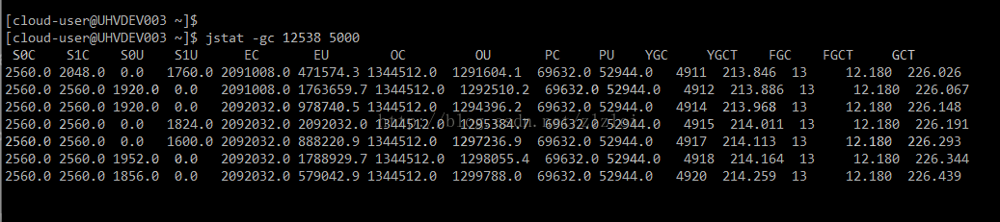

这个问题阿里经常问，参考：[阿里面试](https://www.cnblogs.com/aspirant/p/8625810.html)

结论：

**(1)栈信息：`jstack <pid>`输出的信息**。

**(2)堆信息：`jmap -dump <pid>`输出的文件**，

(3)jstat查看gc情况，`jstat -gc  <PID> `间隔毫秒数 比如  `jstat -gc 12345 5000`  也就是每隔5秒打印进程12345的 gc情况

## 一、看一下 jstack
```
    jstack -m \<pid\> >jvm_deadlocks.txt   
    jstack -l \<pid\> >jvm_listlocks.txt   
```
参考资料 [jstack - Stack Trace](https://docs.oracle.com/javase/6/docs/technotes/tools/share/jstack.html)

使用`top -H -p \<pid\>`找出某进程中要分析的线程ID，然后将线程ID转换为16进制后，在线程dump文件中搜索相关信息

首先看一下我自己在项目中使用 jstack如何查询问题：

可以使用jstat查看 gc情况  
```
    jstat -gc  12345  5000 （jstat -gc 进程号  间隔毫秒数）
```
定位问题

(1) 首先 找到相应的进程 使用 
```
    ps -ef | grep 'com.sankuai.qcs.regulation.dispatch'
```
找到进程的ID;==>21980

(2) `top -Hp 21980`（查询耗时最高的线程)，发现有个线程确实不正常；

(3)`jstack 21980 |grep '线程的16进制的ID'`

注意 在第二步查到线程的ID之后，转换成16进制的。放在(3)里面； 


进入系统 使用 
```
    grep -n 'java.lang.Thread.State:BLOCKED' jstack.log -A5;
```
查询： 


Java通过jvm自己管理内存，同时Java提供了一些命令行工具，用于查看内存使用情况。  
这里主要介绍一下jstat、jmap命令以及相关工具。 

很多情况下，都会出现dump这个字眼，java虚拟机jvm中也不例外，其中主要包括内存dump、线程dump。 

当发现应用内存溢出或长时间使用内存很高的情况下，通过内存dump进行分析可找到原因。

当发现cpu使用率很高时，通过线程dump定位具体哪个线程在做哪个工作占用了过多的资源。 

首先，内存dump是指通过`jmap -dump \<pid\>`输出的文件，而线程dump是指通过`jstack \<pid\>`输出的信息。

两个dump可以单独使用，也可以在特定场合下结合使用。 

在linux操作系统下（已安装jdk），执行jps命令，列出正在运行的java程序的进程ID。


使用top查看目前正在运行的进程使用系统资源情况。


其中进程号为24660的进程，jps输出列表和top列表中都出现，并且在top列表中显示是由java COMMAND启动的。

其中%MEM为2.9，说明占用系统内存为2.9%，当前系统大概8G内存；另外%CPU指的是当前进程使用CPU资源百分比；

## 二、看一下jmap:

使用  `jmap -heap pid` ，可以查看各个代的内存使用情况。
```
    jmap -heap 2083
```
可以观察到New Generation（Eden Space，From Space，To Space）,tenured generation,Perm Generation的内存使用情况 
```
    jmap -dump:format=b,file=heapdump.hprof <pid>
```
导出heap dump到文件heapdump.hprof
```
    jmap -histo 2083 ｜ jmap -histo:live 2083
```
可以观察heap中所有对象的情况（heap中所有生存的对象的情况）。包括对象数量和所占空间大小。 

jmap输出的 class name结果中：
```
    [C is a char[]
    [S is a short[]
    [I is a int[]
    [B is a byte[]
    [[I is a int[][] 
```
heap输出实例
```
    $ jmap -heap 12264
```
```
JVM version is 25.65-b01

using parallel threads in the new generation.
using thread-local object allocation.
Concurrent Mark-Sweep GC

Heap Configuration:
   MinHeapFreeRatio         = 40   MaxHeapFreeRatio         = 70   MaxHeapSize              = 8388608000 (8000.0MB)
   NewSize                  = 2006515712 (1913.5625MB)
   MaxNewSize               = 2006515712 (1913.5625MB)
   OldSize                  = 90636288 (86.4375MB)
   NewRatio                 = 2   SurvivorRatio            = 8   MetaspaceSize            = 21807104 (20.796875MB)
   CompressedClassSpaceSize = 1073741824 (1024.0MB)
   MaxMetaspaceSize         = 17592186044415 MB
   G1HeapRegionSize         = 0 (0.0MB)

Heap Usage:
New Generation (Eden + 1 Survivor Space):
   capacity = 1805910016 (1722.25MB)
   used     = 788045040 (751.5383148193359MB)
   free     = 1017864976 (970.7116851806641MB)
   43.637004779755316% used
Eden Space:
   capacity = 1605304320 (1530.9375MB)
   used     = 630378472 (601.1757583618164MB)
   free     = 974925848 (929.7617416381836MB)
   39.26847166274367% used
From Space:
   capacity = 200605696 (191.3125MB)
   used     = 157666568 (150.36255645751953MB)
   free     = 42939128 (40.94994354248047MB)
   78.59525982751757% used
To Space:
   capacity = 200605696 (191.3125MB)
   used     = 0 (0.0MB)
   free     = 200605696 (191.3125MB)
   0.0% used
concurrent mark-sweep generation:
   capacity = 6382092288 (6086.4375MB)
   used     = 4612472232 (4398.79630279541MB)
   free     = 1769620056 (1687.6411972045898MB)
   72.27210174745753% used

18841 interned Strings occupying 1633048 bytes. 
```

内存dump
```
    jmap –dump:live,format=b,file=heap.bin <pid>
```
参考资料：[jmap - Memory Map](http://docs.oracle.com/javase/6/docs/technotes/tools/share/jmap.html)

将生成的heap.bin文件，使用ha456.jar工具打开分析。java -jar -Xmx3000m ha456.jar

## 三、jstat查看 gc实时执行情况

jstat命令命令格式：
```
    jstat [Options] vmid [interval] [count]
```
命令参数说明：
```
    Options，一般使用 -gcutil 或  -gc 查看gc 情况
    pid，当前运行的 java进程号   
    interval，间隔时间，单位为秒或者毫秒   
    count，打印次数，如果缺省则打印无数次
```
Options 参数如下：
```
    -gc：统计 jdk gc时 heap信息，以使用空间字节数表示

    -gcutil：统计 gc时， heap情况，以使用空间的百分比表示

    -class：统计 class loader行为信息

    -compile：统计编译行为信息

    -gccapacity：统计不同 generations（新生代，老年代，持久代）的 heap容量情况

    -gccause：统计引起 gc的事件

    -gcnew：统计 gc时，新生代的情况

    -gcnewcapacity：统计 gc时，新生代 heap容量

    -gcold：统计 gc时，老年代的情况

    -gcoldcapacity：统计 gc时，老年代 heap容量

    -gcpermcapacity：统计 gc时， permanent区 heap容量
```
示例 
```
    $ jstat -gc 12538 5000
```
每5 秒一次显示进程号为 12538的 java进程的 GC情况，结果如下图：



结果说明

col 1 | col 2                         
----- | ------------------------------
标志    | 说明                            
S0C   | 年轻代中第一个survivor区的容量 (字节)      
S1C   | 年轻代中第二个survivor区的容量 (字节)      
S0U   | 年轻代中第一个survivor区目前已使用空间 (字节)  
S1U   | 年轻代中第二个survivor区目前已使用空间 (字节)  
EC    | 年轻代中Eden的容量 (字节)              
EU    | 年轻代中Eden目前已使用空间 (字节)          
OC    | Old代的容量 (字节)                  
OU    | Old代目前已使用空间 (字节)              
PC    | Perm(持久代)的容量 (字节)             
PU    | Perm(持久代)目前已使用空间 (字节)         
YGC   | 从应用程序启动到采样时年轻代中gc次数           
YGCT  | 从应用程序启动到采样时年轻代中gc所用时间(s)      
FGC   | 从应用程序启动到采样时old代(全gc)gc次数      
FGCT  | 从应用程序启动到采样时old代(全gc)gc所用时间(s) 
GCT   | 从应用程序启动到采样时gc用的总时间(s)         
NGCMN | 年轻代(young)中初始化(最小)的大小 (字节)    
NGCMX | 年轻代(young)的最大容量 (字节)          
NGC   | 年轻代(young)中当前的容量 (字节)         
OGCMN | old代中初始化(最小)的大小 (字节)          
OGCMX | old代的最大容量 (字节)                
OGC   | old代当前新生成的容量 (字节)             
PGCMN | perm代中初始化(最小)的大小 (字节)         
PGCMX | perm代的最大容量 (字节)               
PGC   | perm代当前新生成的容量 (字节)            
S0    | 年轻代中第一个survivor区已使用的占当前容量百分比  
S1    | 年轻代中第二个survivor区已使用的占当前容量百分比  
E     | 年轻代中Eden已使用的占当前容量百分比          
O     | old代已使用的占当前容量百分比              
P     | perm代已使用的占当前容量百分比             
S0CMX | 年轻代中第一个survivor区的最大容量 (字节)    
S1CMX | 年轻代中第二个survivor区的最大容量 (字节)    
ECMX  | 年轻代中Eden的最大容量 (字节)            
DSS   | 当前需要survivor区的容量 (字节)（Eden区已满）
TT    | 持有次数限制                        
MTT   | 最大持有次数限制       


jstatd 启动jvm 监控服务

它是一个基于 rmi的应用，向远程机器提供本机 jvm应用程序的信息。默认端口 1099。
```
    $ jstatd -J-Djava.security.policy=my.policy
```
二、jmap查看各个代的内存使用

jmap 可以从 core文件或进程中获得内存的具体匹配情况，包括 Heap size, Perm size等等。

jmap命令格式：
```
     jmap [ option ] <pid> | <executable core> | <[server-id@]remote-hostname-or-IP>
```
1）参数说明  
```
    pid：java进程 id

    executable：产生 core dump的 java可执行程序

    core：core dump文件

    remote-hostname-or-IP：远程 debug服务的主机名或 ip

    server-id：远程 debug服务的 id  
```
2） option参数：
```
    -heap 

    打印heap的概要信息，GC 使用的算法，heap的配置及使用情况 . 

    -histo[:live] 

    打印jvm heap 的直方图。输出类名、每个类的实例数目、对象占用大小。 VM的内部类名字开头会加上前缀 ”*”. 

    如果加上live 则只统计活的对象数量。 

    -dump:[live,]format=b,file=<filename> 

    使用hprof二进制形式，导出heap 内容到文件filename。

    假如指定live 选项，那么只输出活的对象到文件 .  

    -finalizerinfo 

    打印正等候回收的对象的信息 .

    -permstat 

    打印classload 和jvm heap 持久代的信息。

    包含每个classloader 的名字、是否存活、地址、父 classloade、加载的 class数量、内部 String的数量和占用内存数。

    -F

    当pid没有响应的时候，与-dump或者 -histo共同使用，强制生成 dump文件或 histo信息 . 在这个模式下 ,live子参数无效 . 

    -J

    传递参数给启动jmap 的jvm.
```
64位机上使用需要使用如下方式： `jmap -J-d64 -heap pid`

jmap 相关工具

jmap dump生成的 heap dump文件，可以使用 IBM HeapAnalyzer分析工具分析

  下载：

https://www.ibm.com/developerworks/community/groups/service/html/communityview?communityUuid=4544bafe-c7a2-455f-9d43-eb866ea60091

  运行：`java –Xmx800m –jar ha456.jar `

三、jstack和 jinfo分析java core文件

jstack工具可以用来获得 core文件的 java stack和 native stack的信息，从而可以知道 java程序是如何崩溃和在程序何处发生问题。

另外，jstack 工具还可以附属到正在运行的 java程序中，看到 java程序的 java stack和native stack 的信息，如果现在运行的 java程序呈现 hung的状态， jstack是非常有用的。

命令格式：`$ jstack pid `

jinfo可以从 core文件里面知道崩溃的 Java应用程序的配置信息。

命令额格式：`$ jinfo pid `