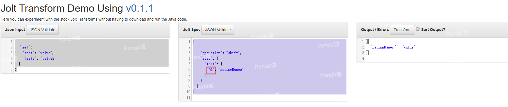
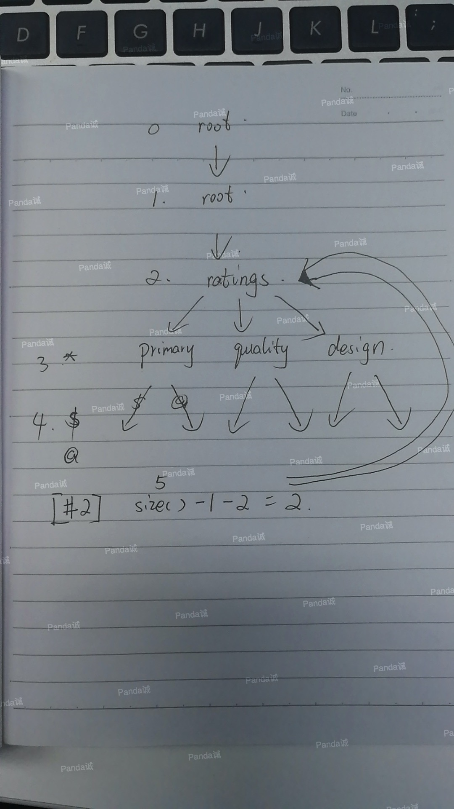
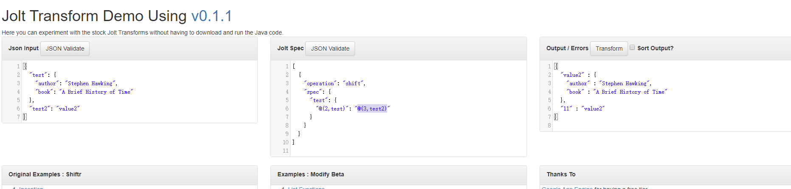

这是国内外目前第一篇较为详细系统的讲述Java JOLT用法及部分原理的文章，如有错误，请及时留言指出。如有转载，请标明出处。

<!-- more -->

Jolt GitHub: [https://github.com/bazaarvoice/jolt](https://github.com/bazaarvoice/jolt)

Jolt online demo: [https://jolt-demo.appspot.com](https://jolt-demo.appspot.com)

Jolt是用Java编写的JSON到JSON转换库，其中指示如何转换的"specification"本身就是一个JSON文档。以下文档中，我统一以 Spec 代替如何转换的"specification"json文档。以LHS(left hand side)代表Spec json的keys,RHS(right hand side)代表Spec json的values。部分示例都是摘取于Jolt源代码注释文档。

用处:
1.  将从ElasticSearch、MongoDb、Cassandra等等取出的数据转换后输出出来
2.  从大型JSON文档中提取数据供自己使用

## 概览

Jolt :

* 提供一组转换，可以将它们"链接(chained)"在一起，形成整个JSON到JSON的转换。
* 重点是转换JSON数据的结构，而不是操作特定的值

    * 其思想是:使用Jolt正确的来获得大部分结构，然后编写代码来修正值

* 消费和生产json : in-memory tree of Maps, Lists, Strings, etc.

    * 使用Jackson (或者其他工具) 来序列化和反序列化json文本

## 其他同类工具

- [jq](https://stedolan.github.io/jq)从JSON文件中提取数据的命令行工具(随时使用，可通过brew获得)

- [JsonPath](https://github.com/jayway/JsonPath)Java:使用类似XPATH的语法从JSON中提取数据。

- [JsonSurfer](https://github.com/jsurfer/JsonSurfer)Java:流式JsonPath处理器，专门处理大而复杂的JSON数据。

## 性能表现

Jolt的主要目标是提供一种可声明的方式快速的去转换json,也就是说，与上面列出的同类工具选项相比，Jolt应该有一个更好的运行效率。

实际运行中：

1. 转换可以使其Spec初始化一次，并在多线程环境中多次重用
2. '*'通配符逻辑被重做，以减少在常见情况下使用Regex，这是一个显著的速度改进。
3. 对Shiftr并行树步进行了优化。

有两点需要注意:

1. Jolt不是基于流的，所以如果有一个非常大的Json文档要转换，则需要有足够的内存来容纳它。
2. 转换过程将创建和丢弃大量对象，因此垃圾收集器将有工作要做。

## Stock Transforms


```
shift       : 复制输入json到输出json
default     : 为json树增加默认值
remove      : 从json树中去除数据
sort        : 按字母顺序排序映射键值(一般用于调试和增加人工可读性)
cardinality : 修正输入数据的基数。urls元素通常是一个List，但是如果只有一个，那么它就是一个字符串
modify-overwrite-beta:总是写
modify-default-beta:当键值对应的值是null时写入
modify-define-beta:当键值不存在时写入
自定义Java类全路径名称:实现Transform或ContextualTransform接口,可选择SpecDriven接口
```
每个转换都有自己的DSL(领域特定语言)，以便简化其工作。
目前，上面前五个转换只影响数据的结构。要进行数据操作，需要编写Java代码或者使用modify。如果你编写Java代码实现了转换接口，那么你可以将代码插入转换链中。
使用自定义Java转换实现数据操作，开箱即用的Java转换应该能够完成大多数结构转换

在线的谷歌文档PPT地址：[https://docs.google.com/presentation/d/1sAiuiFC4Lzz4-064sg1p8EQt2ev0o442MfEbvrpD1ls/edit?usp=sharing](https://docs.google.com/presentation/d/1sAiuiFC4Lzz4-064sg1p8EQt2ev0o442MfEbvrpD1ls/edit?usp=sharing)
## shift

Shiftr指定来自输入JSON的数据应该放在输出JSON中的什么位置，也就是输入JSON的数据应该如何进行移位，以生成输出JSON数据。

在底层，一个Shiftr命令是从输入路径到输出路径的映射，类似于Unix中的"mv"命令"mv /var/data/mysql/data /media/backup/mysql"。

在Shiftr中，输入路径是JSON树结构，输出路径是扁平的点标记法路径。

你可以从JSON输入数据的一个副本开始，然后通过为你关心的每段数据提供点表示法输出路径，将其修改为Shiftr Spec。

例如：给定如下输入的json
```json
{
  "rating": {
       "quality": {
          "value": 3,
          "max": 5
       }
    }
}
```
一个简单的Shiftr规范可以通过复制输入，并修改它来为每段数据提供输出路径:
```json
 {
    "rating": {
      "quality": {
          "value": "SecondaryRatings.quality.Value",     // copy 3 to "SecondaryRatings.quality.Value"
          "max": "SecondaryRatings.quality.RatingRange"  // copy 5 to "SecondaryRatings.quality.RatingRange"
      }   
    }
}
```
会得到如下的输出：
```json
  {
    "SecondaryRatings": {
      "quality": {
        "Value": 3,
        "RatingRange": 5
      }
    }
  }
```
如上所示，Shiftr Spec可以完全由文字字符串值组成，但是它的强大功能是来自通配符。通过使用通配符，你可以做到不仅知道数据及其直接键，而且知道到该数据的整个输入路径。

例如有如下输入json
```json
{
  "rating": {
      "primary": {
          "value": 3,   // want this value to goto output path "Rating"
          "max": 5      // want this value to goto output path "RatingRange"
      },
      "quality": {      // want output path "SecondaryRatings.quality.Id" = "quality", aka we want the value of the key to be used
          "value": 3,   // want this value to goto output path "SecondaryRatings.quality.Value"
          "max": 5      // want this value to goto output path "SecondaryRatings.quality.Range"
      },
      "sharpness": {   // want output path "SecondaryRatings.sharpness.Id" = "sharpness"
          "value": 7,  // want this value to goto output path "SecondaryRatings.sharpness.Value"
          "max": 10    // want this value to goto output path "SecondaryRatings.sharpness.Range"
      }
  }
}
```
Spec:
```json
{
  "rating": {
    "primary": {
        "value": "Rating",                       // 输出 -> "Rating" : 3
        "max": "RatingRange"                     // 输出 -> "RatingRange" : 5
    },
    "*": {                                       // 匹配类似 "rating.[除primary以外的节点]"
        "value": "SecondaryRatings.&1.Value",    // "rating.*.value"位置的数据移动到 "SecondaryRatings.*.Value"
                                                 // "&1" 表示取计算到&1式子时的WalkedPathTree的上一层的WalkedPath并取subKey(下面会有讲解， 例子中对应的值是"quality"或"sharpness" )
                                                 // 输出 -> "SecondaryRatings.quality.Value" : 3 
                                                 //         "SecondaryRatings.sharpness.Value" : 7

        "max": "SecondaryRatings.&1.Range",      // "rating.*.max"位置的数据移动到 "SecondaryRatings.*.Range"
                                                 // 输出 -> "SecondaryRatings.quality.Range" : 5 
                                                 //         "SecondaryRatings.sharpness.Range" : 10

        "$": "SecondaryRatings.&1.Id"            // $  表示使用输入键本身的值作为数据
                                                 // 输出 -> "SecondaryRatings.quality.Id" : "quality"
                                                 // 输出 -> "SecondaryRatings.sharpness.Id" : "sharpness"
    }
  }
}
```
得到以下输出：
```json
{
  "Rating": 3,
  "RatingRange": 5,
  "SecondaryRatings": {
     "quality": {
        "Range": 5,
        "Value": 3,
        "Id": "quality"     // the special $ operator allows us to use input key the text value of "quality", as the "Id" of the output
     },
     "sharpness": {
        "Range": 10,
        "Value": 7,
        "Id": "sharpness"   // the special $ operator allows us to use input key the text value of "sharpness", as the "Id" of the output
     }
  }
}
```
### Shiftr WalkedPathTree

首先，这部分在官方文档、国内外学习资料都是没有的，是本人在看了部分源码和实践后总结而来，可能会有些错误，如果有人看出，请一定留言指正！

**理论**：

Jolt在shiftr中，依据Spec处理input的时候，会时刻保持一颗动态的 WalkedPath，总体来讲是一个链表。当做新的匹配计算操作，就会把当前信息(其中有一颗refTree，refTree是input json的一个引用，还有一个subKey,是匹配到的键值)保存到WalkedPath中。当到Spec树中的树叶节点时计算完成时,也就是Spec树某一树枝下的最后一个计算操作完成时(完成包括匹配计算和输出计算)，会从WalkedPath中删除掉之前存储的当前信息。WalkedPath虽然外层是一个链表，但是因为通配符,同一级多个匹配等等的作用(代码里有递归)，画出完整的WalkedPath的轨迹图就成了一颗树。

比如说我们在上面的例子里看到了一个&1，&是取相应节点的键值的意思，会在下面有详细说明。依据上面的示例，我们画一下当第一次计算到&1时的WalkedPathTree

下面是程序debug到第一次计算到&1的时候的截图：

进一步获取&1结果的截图：


### Shiftr 通配符

#### '*'通配符

1. 只允许在LHS使用
2. 通配符 * 可以匹配整个key字符串，也可以用于匹配key字符串的一部分。

匹配整个key字符串：

输入：
```json
{
  "rating" : {
    "quality": {
      "value": 3,
      "max": 5
    },
    "sharpness" : {
      "value" : 7,
      "max" : 10
    }
  }
}
```
在这个例子中, "rating.quality"和"rating.sharpness" 都有相同的结构,这样我们可以使用通配符 * 来匹配"quality"和"sharpness"，避免为"quality"和"sharpness"编写非常相似的规则。
Spec:
```json
[
  {
    "operation": "shift",
    "spec": {
      "rating": {
        "*": {
          "max": "Rating.[#2].amx",
          "value": "Rating.[#2].value"
        }
      }
    }
  }
]
```


用于匹配key的一部分：

输入：
```json
{
   "tag-Pro": "Awesome",
   "tag-Con": "Bogus"
}
```
可以使用'tag-*'来匹配"tag-Pro"和"tag-Con"
Spec:
```json
[
  {
    "operation": "shift",
    "spec": {
      "tag-*": "&(0,1)"
    }
  }
]

```
结果:


#### '&'通配符

1. 在LHS和RHS都能使用，意义为取WalkedPath中的subKey的值来使用
2. 在Spec标准格式其实是 &(0,0),有两个参数，第一个参数是指明在当前WalkedPath向上几个level，第二个参数是指明使用第几个subKey。& = &0 = &(0) = &(0,0) ,第二个参数是与*通配符一起使用的。

例如，输入json:
```json
{
  "test": {
    "test": "value",
    "test2": "value2"
  }
}
```
Spec:
```json
[
  {
    "operation": "shift",
    "spec": {
      "test": {
        "&": "ratingNames"
      }
    }
  }
]
```
&计算取到的值是test，再去匹配test
结果：


&在输入路径寻找值：
```json
{
    "foo" : {
        "bar": {
            "baz":  // &0 = baz, &1 = bar, &2 = foo
        }
    }
}
```
需要指明使用第几个匹配值，比如说"tag-\*-\*"匹配到"tag-Foo-Bar"，那么:
```
 &(0,0) = "tag-Foo-Bar"
 &(0,1) = "Foo"
 &(0,2) = "Bar"
```

#### '$'通配符

1. 只在LHS使用
2. 这个通配符的存在反映了一个事实，即输出JSON的value既可以是输入JSON的value，也可以是输入JSON的key
3. Shiftr的基本操作是复制输入JSON的value，因此我们需要一种方法来指定我们想要复制输入JSON的key。因此，'$'指定我们希望使用输入键或输入键派生的值作为要放在输出JSON中的数据。

有两个使用场景：

1. 当输入JSON中的key需要是输出JSON中的id(某个位置)值时，请查看上面的例子"$":"SecondaryRatings.&1.Id"。
2. 需要列出所有输入键。

比如有如下输入json
```json
{
  "rating": {
    "primary": {
      "value": 3,
      "max": 5
    },
    "quality": {
      "value": 3,
      "max": 7
    }
  }
}
```
我们期望的输出结果：
```json
{
  "ratings" : [ "primary", "quality" ]    // Aside: this is an example of implicit JSON array creation in the output which is detailed further down.
                                          // For now just observe that the input keys "primary" and "quality" have both made it to the output.
}
```
那么相应的Spec：

```json
{
  "rating": {
    "*": {               // match all keys below "rating"
      "$": "ratings"     // output each of the "keys" to "ratings" in the output
    }
  }
}
```

#### '#'通配符

1. 在LHS RHS都可以使用，但是意义不同
2. 在RHS, #号只在数组中有效 比如[#2]，[#2]的意思是，向上两层(WalkedPathTree)并询问该节点有多少匹配，然后将其用作数组中的索引。这意味着，当Shiftr执行输入数据和Spec的并行树遍历时，它会跟踪在Spec树的每个级别上处理了多少匹配项。如果您想将一个JSON映射转换成一个JSON数组，而不关心数组的顺序，这是非常有用的。
3. 在LSH中，#允许您指定硬编码字符串作为输出中的值。
4. 在LSH中，#是根节点，不允许有子节点

示例Spec,如果hidden该值为布尔真，则写出"enabled"字符串。

```json
"hidden" : {
    "true" : {                             // 如果"hidden" 值是true
        "#disabled" : "clients.clientId"   //将 "disabled" 值写到 "clients.clientId",标准格式是 #(disabled) #disabled会自动转成#(disabled)
    }
}
```
按照这个例子，完全是可以在shiftr里做到为json添加常量。

再来看一个例子：

输入json
```json
{
  "ratings": {
    "primary": 5,
    "quality": 4,
    "design": 5
  }
}
```

Spec:
```json
[
  {
    "operation": "shift",
    "spec": {
      "ratings": {
        "*": {
          // 
          // #2 means go three levels up the tree (count from 0),
          //  and ask the "ratings" node, how many of it's
          //  children have been matched.
          //
          // This allows us to put the Name and the Value into
          //  the same object in the Ratings array.
          "$": "Ratings[#2].Name",//$上文已经讲解 使key作为输出value
          "@": "Ratings[#2].Value"//@下文会讲解 
        }
      }
    }
  }
]

```
输出json:
```json
{
  "Ratings" : [ {
    "Name" : "primary",
    "Value" : 5
  }, {
    "Name" : "quality",
    "Value" : 4
  }, {
    "Name" : "design",
    "Value" : 5
  } ]
}

```
Jolt demo注释说 '#2 means go three levels up the tree (count from 0)'，但我认为3层的叙述是模糊的，WalkedPath是一个数组，从0开始，假设长度为5，则向上2层对应的索引下标为5-1-2 = 2  向上2层的理解其实是最好的。
其中源码关键部分如下：

手绘图walkedPathTree如下：


#### '|'通配符

1. 只在LHS生效

或的意思，很简单，直接看Spec例子吧：

Spec:
```json
{
  "rating|Rating" : "rating-primary"   // match "rating" or "Rating" copy the data to "rating-primary"
}
```

#### '@'通配符

1. Spec LHS、RHS都有效，意义一样
2. 在LHS，@是根节点，不允许有子节点

如果希望将输入值和输入键都放在输出JSON中的某个位置，则必须使用这个通配符。

比如
```json
{
  "foo" : "place.to.put.value",  // leveraging the implicit operation of Shiftr which is to operate on input JSON values
}
```
如果我们想要对键和值做一些事情:
Spec
```json
{
   "foo" : {
     "$" : "place.to.put.key",
     "@" : "place.to.put.value"    // '@' explicitly tell Shiftr to operate on the input JSON value of the parent key "foo"
   }
}
```
因此，@通配符是将树中此级别的数据值复制到输出,比如上面例子中@是把foo对应的值copy到place.to.put.value

@的高级用法的标准格式是"@(3,title)"，上文中已经介绍过WalkedPathTree这个概念，3的意思在**计算到@(3,title)这一level时**，返回WalkedPathTree向上3level对应的refTree，然后在返回的数据中去匹配title。

示例：


计算@(2,test)时的debug截图：


然后在最后计算@(2,test2)的时候，walkedPathTree又增加了一层(其实@(2,test2) @(3,test2)分别返回1层和0层的treeRef，都是root根节点的子树，效果是一样的，如下图：)


将@(2,test2)换成@(3,test2)发现结果其实是一样的：


单独的@等价于@0：

因为@都是同一级，所以计算他们的时候WalkedPath是相同的


@通配符在RHS的示例：

input json
```json
{
   "author" : "Stephen Hawking",
   "book" : "A Brief History of Time"
}
```
期望输出json
```json
{
   "Stephen Hawking" : "A Brief History of Time"
}
```
Spec
```json
{
  "@author" : "@book"
}
```
@book RHS，其实是比计算@author时的walkedPathTree多一层的

### json数组

shift把json数组当做Map

#### 处理输入的json数组

例如有输入json:
```json
{
   "Photos": [ "AAA.jpg", "BBB.jpg" ]
}
```
Spec
```json
{
   "Photos" :
   {
     "1" : "photo-&-url"      // 指定只匹配数组下标为1的数据
   }
}
```
输出json:
```json
{
    "photo-1-url": "BBB.jpg"
}
```
#### 处理输出的json数组

[]用于在json数组中指定数组索引，只在RHS生效。

比如有输入json:
```json
{
  "photo-1-id": "327704",
  "photo-1-url": "http://bob.com/0001/327704/photo.jpg"
}
```
Spec:
```json
{
  "photo-1-id": "Photos[1].Id",   // Declare the "Photos" in the output to be an array,
  "photo-1-url": "Photos[1].Url"  // that the 1-th array location should have data
  // same as above but more powerful
  // note '&' logic can be used inside the '[ ]' notation "photo-*-url": "Photos[&(0,1)].Url"
}
```
输出json:
```json
{
  "Photos": [
    null ,                // note Photos[0] is null, because no data was pushed to it
    {
      "Id":"327704",
      "Url":"http://bob.com/0001/327704/photo.jpg"
    }
  ]
}
```

#### Spec中的json数组

同一个输入源，可以输出到多个目标输出处，可以使用数组的形式，如下

输入json:
```json
{ "foo" : 3 }
```
Spec:
```json
{ "foo" : [ "bar", "baz" ] }
```
输出json:
```json
{
  "bar" : 3,
  "baz" : 3
}
```

#### 隐式数组

如果Spec使得多个匹配写到同一个输出位置，输出变成数组

比如输入json:
```json
{
    "foo" : "bar",
    "tuna" : "marlin"
}
```
Spec:
```json
{
    "foo"  : "baz",
    "tuna" : "baz"
}
```
输出：
```json
{
    "baz" : [ "bar", "marlin" ]     // Note the order of this Array should not be relied upon
}
```

### 算法
(个人理解，有错请指出)

#### Algorithm High Level

同时处理输入数据和Shiftr规范，并在每次匹配时执行Shiftr命令/映射。

#### Algorithm Low Level

根据Spec的不同有两种算法，第一种是无通配符的，算法是同时处理输入数据和Shiftr规范，并在每次匹配时执行Shiftr命令/映射。

第二种含有多个通配符,算法是同时走Spec和输入JSon，并保持一个匹配输入路径数据结构。确定输入JSON键和RHS的匹配，按照以下顺序匹配spec键:

注意，'|'键的顺序要分割成他们的子键来算

1. 尝试将输入键与具体键值匹配
2. 如果没有找到匹配，尝试匹配'&'计算值。
  - 2.1如果存在一个以上的"&"键，按字母顺序应用/匹配它们。
3. 如果没有找到匹配，试着用"*"通配符值匹配
  - 3.1'*'通配符按字母顺序排序和应用/匹配。


注意，如果`@`和`$`的父键匹配，则始终执行`@`和`$`键的处理，并且不会阻止任何其他匹配。

## default

default它以一种非破坏性的方式应用默认值。

比较:

* Shitr遍历输入数据并询问它的Spec"它应该放在哪里?"
* Defaultr遍寻Spec并询问"数据中是否存在这种情况?"如果没有，那就加上去。"

例如，输入json:
```json
{
  "Rating":3,
  "SecondaryRatings":{
     "quality":{
        "Range":7,
        "Value":3,
        "Id":"quality"
     },
     "sharpness": {
        "Value":4,
        "Id":"sharpness"
     }
  }
}
```
期望输出：
```json
{
  "Rating":3,
  "RatingRange" : 5,
  "SecondaryRatings":{
     "quality":{
        "Range":7,
        "Value":3,
        "Id":"quality",
        "ValueLabel": null,
        "Label": null,
        "MaxLabel": "Great",
        "MinLabel": "Terrible",
        "DisplayType": "NORMAL"
     },
     "sharpness": {
        "Range":5,
        "Value":4,
        "Id":"sharpness",
        "ValueLabel": null,
        "Label": null,
        "MaxLabel": "High",
        "MinLabel": "Low",
        "DisplayType": "NORMAL"
     }
  }
}
```

Spec
```json
{
  "RatingRange" : 5,
  "SecondaryRatings": {
    "quality|value" : {
       "ValueLabel": null,
       "Label": null,
       "MaxLabel": "Great",
       "MinLabel": "Terrible",
       "DisplayType": "NORMAL"
    },
    "*": {
       "Range" : 5,
       "ValueLabel": null,
       "Label": null,
       "MaxLabel": "High",
       "MinLabel": "Low",
       "DisplayType": "NORMAL"
    }
  }
}
```


### 通配符

1. '*' 将这些默认值应用于此级别的所有输入键 
2. '|' 将这些默认值应用到输入键(如果存在的话)
3. '[]' 表名输入键应该是一个数组,这意味着这个条目下面的所有defaultr键必须是整数。

比如Spec:
```json
{
   "photos[]" : {
     "2" : {
       "url" : "http://www.bazaarvoice.com",
       "caption" : ""
     }
   }
}
```
算法：

1. 深度优先执行Spec
2. 在Spec树的每一层，Defaultr从最具体到最不具体的Spec键:
   - 优先匹配对比具体值
   - "|"，根据有多少个或值进行子排序，然后按字母顺序排序(用于确定性行为)
   - "*"

在Defaultr Spec树的给定级别上，只有文字键强制Defaultr在输入数据中创建新条目:要么作为单个文字值，要么添加新的嵌套数组或映射对象。通配符操作符是在文字键之后应用的，如果这些键在输入文档中还没有出现，则不会导致添加这些键(自然地或者已经从文字规范键中默认添加)。

- 1 遵循Spec
- 2 对于spec中的每个文字键(specKey)
  -  如果specKey是map或array，输入为null，则默认输出为空map或array
  -  递归文字键
  -  如果specKey是一个map或数组，而输入不是null，而是"wrong"类型，跳过，不要递归
  - 如果specKey是一个文字值，则默认输出的文字和值，不要递归
- 3 对于Spec中的每个通配符
  -  从默认值中找到所有匹配通配符的键值
  - 将每个键值视为一个文本speckey

为了避免歧义，如果输入为null, Defaultr抛出一个异常。

## remove

remove是一种从输入JSON中删除内容的转换。

对比：

* Shitr遍历输入数据并询问它的Spec"它应该放在哪里?"
* Defaultr遍寻Spec并询问"数据中是否存在这种情况?"如果没有，那就加上去。"
* Removr遍寻Spec并询问"如果存在，就删除"

例如:

输入json:
```json
{
  "~emVersion" : "2",
  "id":"123124",
  "productId":"31231231",
  "submissionId":"34343",
  "this" : "stays",
  "configured" : {
    "a" : "b",
    "c" : "d"
  }
}
```
期望输出：
```json
{
  "id":"123124",
  "this" : "stays",
  "configured" : {
    "a" : "b"
  }
}
```
Spec：
```json
{
  "~emVersion" : "",
  "productId":"",
  "submissionId":"",
  "configured" : {
    "c" : ""
  }
}
```


### 通配符

'*' 只在LHS，可匹配整个键值或者键值的一部分

比如匹配整个键值 输入json:
```json
{
  "ratings": {
    "Set1": {
      "a": "a",
      "b": "b"
    },
    "Set2": {
      "c": "c",
      "b": "b"
    }
  }
}
```
期望输出json：
```json
{
    "ratings": {
        "Set1": {
            "a": "a"
        },
        "Set2": {
            "c": "c"
        }
    }
}
```
Spec:
```json
{
 "ratings":{
    "*":{
      "b":""
    }
  }
}
```


比如匹配键值的一部分，输入json:
```json
{
    "ratings_legacy": {
        "Set1": {
            "a": "a",
            "b": "b"
        },
        "Set2": {
            "a": "a",
            "b": "b"
        }
    },
    "ratings_new": {
        "Set1": {
            "a": "a",
            "b": "b"
        },
        "Set2": {
            "a": "a",
            "b": "b"
        }
    }
}
```
Spec
```json
{
      "ratings_*": {
        "Set1": ""
      }
    }
```
输出json:
```json
{
  "ratings_legacy" : {
    "Set2" : {
      "a" : "a",
      "b" : "b"
    }
  },
  "ratings_new" : {
    "Set2" : {
      "a" : "a",
      "b" : "b"
    }
  }
}

```


再举两个匹配数组索引的例子：

匹配数组每个元素删除其中一个成员:

匹配删除索引为0的数组元素：


## cardinality

改变输入JSON数据元素的基数(单个还是数组)。CardinalityTransform的目的是处理与返回数据的基数不一致的数据源。

例如，假设您知道文档中将有一个"photos"元素。如果您的底层数据源想要变得更好，那么它可能会根据实际有多少张照片来调整photos元素的"类型"。

### 关键词

1. 只在RHS

'ONE':如果输入值是一个列表，则获取该列表中的第一个元素，并将其设置为该元素的数据,不支持其他类型

'MANY':如果输入不是列表，则创建一个列表并将第一个元素设置为输入值。如果输入是"null"，使它成为一个空列表。如果输入是一个列表，不支持。

比如：

输入json:
```json
{
  "review" : {
    "rating" : [ 5, 4 ]
  }
}
```
Spec:
```json
{
  "review" : {
    "rating" : "ONE"
  }
}
```
输出json:
```json
{
  "review" : {
    "rating" : 5
  }
}
```


### 通配符

'*' 只在RHS,只能匹配整个键值，不能匹配键值的一部分。

'@' 只在RHS,当需要修改嵌套在修改内容中的内容时，应该使用这个通配符。

比如：

输入json:
```json
{
  "views" : [
    { "count" : 1024 },
    { "count" : 2048 }
  ]
}
```
Spec
```json
{
  "views" : {
    "@" : "ONE",
    "count" : "MANY"
  }
}
```
输出json:
```json
{
  "views" : {
    "count" : [ 1024 ]
  }
}
```

## sort

递归地将JSON对象内的所有映射排序为新的已排序的LinkedHashMaps，从而使序列化的表示具有确定性。用于调试和测试。

注意，这将复制输入映射和列表对象。

排序顺序是标准的按字母顺序升序排列，带"~"前缀的键的特殊情况将被移到顶部。


## modify

这部分文档源码项目也没有整理，以下是个人由源码以及示例整理而出

overwrite modify-overwrite-beta Overwritr：总是写

default modify-default-beta Defaultr：当键值对应的值是null时写入

define modify-define-beta Definr：当键值不存在时写入

modify模式包含了一系列函数，函数其本质是Java自带的,在Spec以下是函数及其对应的源码：

```java
private static final Map<String, Function> STOCK_FUNCTIONS = new HashMap<>(  );

    static {
        STOCK_FUNCTIONS.put( "toLower", new Strings.toLowerCase() );
        STOCK_FUNCTIONS.put( "toUpper", new Strings.toUpperCase() );
        STOCK_FUNCTIONS.put( "concat", new Strings.concat() );
        STOCK_FUNCTIONS.put( "join", new Strings.join() );
        STOCK_FUNCTIONS.put( "split", new Strings.split() );
        STOCK_FUNCTIONS.put( "substring", new Strings.substring() );
        STOCK_FUNCTIONS.put( "trim", new Strings.trim() );
        STOCK_FUNCTIONS.put( "leftPad", new Strings.leftPad() );
        STOCK_FUNCTIONS.put( "rightPad", new Strings.rightPad() );

        STOCK_FUNCTIONS.put( "min", new Math.min() );
        STOCK_FUNCTIONS.put( "max", new Math.max() );
        STOCK_FUNCTIONS.put( "abs", new Math.abs() );
        STOCK_FUNCTIONS.put( "avg", new Math.avg() );
        STOCK_FUNCTIONS.put( "intSum", new Math.intSum() );
        STOCK_FUNCTIONS.put( "doubleSum", new Math.doubleSum() );
        STOCK_FUNCTIONS.put( "longSum", new Math.longSum() );
        STOCK_FUNCTIONS.put( "intSubtract", new Math.intSubtract() );
        STOCK_FUNCTIONS.put( "doubleSubtract", new Math.doubleSubtract() );
        STOCK_FUNCTIONS.put( "longSubtract", new Math.longSubtract() );
        STOCK_FUNCTIONS.put( "divide", new Math.divide() );
        STOCK_FUNCTIONS.put( "divideAndRound", new Math.divideAndRound() );


        STOCK_FUNCTIONS.put( "toInteger", new Objects.toInteger() );
        STOCK_FUNCTIONS.put( "toDouble", new Objects.toDouble() );
        STOCK_FUNCTIONS.put( "toLong", new Objects.toLong() );
        STOCK_FUNCTIONS.put( "toBoolean", new Objects.toBoolean() );
        STOCK_FUNCTIONS.put( "toString", new Objects.toString() );
        STOCK_FUNCTIONS.put( "size", new Objects.size() );

        STOCK_FUNCTIONS.put( "squashNulls", new Objects.squashNulls() );
        STOCK_FUNCTIONS.put( "recursivelySquashNulls", new Objects.recursivelySquashNulls() );

        STOCK_FUNCTIONS.put( "noop", Function.noop );
        STOCK_FUNCTIONS.put( "isPresent", Function.isPresent );
        STOCK_FUNCTIONS.put( "notNull", Function.notNull );
        STOCK_FUNCTIONS.put( "isNull", Function.isNull );

        STOCK_FUNCTIONS.put( "firstElement", new Lists.firstElement() );
        STOCK_FUNCTIONS.put( "lastElement", new Lists.lastElement() );
        STOCK_FUNCTIONS.put( "elementAt", new Lists.elementAt() );
        STOCK_FUNCTIONS.put( "toList", new Lists.toList() );
        STOCK_FUNCTIONS.put( "sort", new Lists.sort() );
    }
```

示例1

输入json:
```json
{
  "x": [ 3, 2, 1, "go"  ],
  "small": "small",
  "BIG": "BIG",

  "people": [
    {
      "firstName": "Bob",
      "lastName": "Smith",
      "address": {
        "state": null
      }
    },
    {
      "firstName": "Sterling",
      "lastName": "Archer"
    }
  ]
}

```
Spec 使用相应函数基本格式是  =函数名(参数1，参数2)
```json
[
  {
    "operation": "modify-default-beta",//值为null时写入
    "spec": {
      // String join the values in the array x, with a comma and a space
      "y": "=join(',',@(1,x))",
      "z": "=join(' ',@(1,x))",
      //
      // make small big, and make big small
      "small_toUpper": "=toUpper(@(1,small))",
      "BIG_toLower": "=toLower(@(1,BIG))",
      //
      // Here we are dealing with an array of people objects.
      // We want to build a fullName for them, and default them
      // to 'live' in Texas, only if they don't already have an address defined.
      "people": {
        "*": {
          // build the fullName from the first and last names
          //
          // @(1,firstName)
          //  -  is "evaluated" before being passed to the =concat function.
          //  -  means go up two levels, and then come back down and grab
          //      the value from firstName
          "fullName": "=concat(@(1,firstName),' ',@(1,lastName))",
          //
          // Suffix of "?" means only match if the input actually has an "address"
          "address?": {
            // The transform "modify-default-beta" will only match if the
            //  "left hand side" does not exist or is null
            "state": "Texas"
          }
        }
      }
    }
  }
]
```
举个例子，将一个json中key全部转小写:
```json
[
  {
    "operation": "shift",
    "spec": {
      "*": {
        "$": "&1.key",
        "@": "&1.value"
      }
    }
  },
  {
    "operation": "modify-overwrite-beta",
    "spec": {
      "*": {
        "key": "=toLower"
      }
    }
  },
  {
    "operation": "shift",
    "spec": {
      "*": {
        "value": "@(1,key)"
      }
    }
  }
]

```


举个例子，将一个json数组中key全部转小写:
```json
[{
	"operation": "shift",
	"spec": {
		"*": {
			"*": {
				"$": "[&2].&1.key",
				"@": "[&2].&1.value"
			}
		}
	}
}, {
	"operation": "modify-overwrite-beta",
	"spec": {
		"*": {
          "*":{
			"key": "=toLower"}
		}
	}
}, {
	"operation": "shift",
	"spec": {
		"*": {
          "*":{
			"value": "[&2].@(1,key)"}
		}
	}
}]
```


## 扩展自定义

完全限定的Java ClassName:类实现Transform 或ContextualTransform接口，并且可以选择是SpecDriven 的(标记接口)

[Transform](https://github.com/bazaarvoice/jolt/blob/master/jolt-core/src/main/java/com/bazaarvoice/jolt/Transform.java)

[SpecDriven](https://github.com/bazaarvoice/jolt/blob/master/jolt-core/src/main/java/com/bazaarvoice/jolt/SpecDriven.java)

Spec类似于：
```json
 [
      {
          "operation": "com.bazaarvoice.tuna.CustomTransform",
 
          "spec" : { ... } // optional spec to use to construct a custom {@link Transform} if it has the {@link SpecDriven} marker interface.
      },
      //...
  ]
```

## Chainr

Chainr是一种机制，可以把多个转换Spec连接在一起，类似于：
```json
 [
      {
          "operation": "[operation-name]",
          // stuff that the specific transform needs go here
      },
      //...
 ]
```
operation-name 可以是shift、default、remove、cardinality、sort、java、modify-overwrite-beta、modify-default-beta、modify-define-beta
示例：
```json
{
    // Input data for the unit test
    "input": {
        "rating": {
            "primary": {
                "value": 3,
                "max": 5
            },
            "sharpness": {
                "value": 5,
                "max": 5
            },
            "quality": {
                "value": 3,
                "max": 7
            }
        }
    },

    // The test uses this Chainr spec, on the input data to produce the "expected" JSON below
    "spec": [
        {
            // first operation is shift
            "operation": "shift",
            "spec": {
                "rating": {
                    "primary": {
                        "value": "Rating",
                        "max": "RatingRange"
                    },
                    "*": {
                        "value": "SecondaryRatings.&1.Value",
                        "max": "SecondaryRatings.&1.Range",
                        "$": "SecondaryRatings.&.Id"
                    }
                }
            }
        },
        {
            // second operation is to default some values
            "operation": "default",
            "spec": {
                "~z": "zz",
                "~a": "aa",
                "~id": "id",
                "zz": "zz",
                "~deleteme": "deleteme"
            }
        },
        {
            // third operation is to remove something
            "operation": "remove",
            "spec": {
                "~deleteme": ""
            }
        },
        {
            // last operation is to sort the JSON
            "operation": "sort"
        }
    ],

    // The expected result
    "expected": {
        "~a": "aa",
        "~id": "id",
        "~z": "zz",
        "Rating": 3,
        "RatingRange": 5,
        "SecondaryRatings": {
            "quality": {
                "Id": "quality",
                "Range": 7,
                "Value": 3
            },
            "sharpness": {
                "Id": "sharpness",
                "Range": 5,
                "Value": 5
            }
        },
        "zz": "zz"
    }
}
```


再举一个我在JOLT GitHub Issue(<a href="https://github.com/bazaarvoice/jolt/issues/900">Conditional based on a input field #900</a>)上看到的一个稍微比较复杂点的实际问题

输入json如下:
```json
{
  "addressBook": {
    "primaryAddress": "pxDdd",
    "addresses": [
      {
        "id": "pxDd",
        "fullName": "Daniel Garcia",
        "street": "Berenguer",
        "houseNumber": "234",
        "houseName": "",
        "floorNo": "",
        "streetType": "Str",
        "doorNo": "",
        "postOfficeBox": "",
        "city": "Barcelona",
        "zipCode": "08812",
        "state": "",
        "province": "",
        "addressLine1": "",
        "addressLine2": "",
        "addressLine3": "",
        "countryCode": "ES"
      },
      {
        "id": "pxDdd",
        "fullName": "Daniel Garcia",
        "street": "Berenguer",
        "houseNumber": "234",
        "houseName": "",
        "floorNo": "",
        "streetType": "Str",
        "doorNo": "",
        "postOfficeBox": "",
        "city": "Barcelona",
        "zipCode": "08812",
        "state": "",
        "province": "",
        "addressLine1": "",
        "addressLine2": "",
        "addressLine3": "",
        "countryCode": "ES"
      }
    ]
  }
}
```
需求是筛选出addresses数组中id的值与primaryAddress值相等的成员，如果primaryAddress字段不存在，则默认输出数据中第一个元素。如果有多个匹配值，则输出第一个匹配值。

我给出的Spec方案如下,这个Spec中就串联了default shift cardinality三种操作:
```json
[
  {
    "operation": "default",//如果不存在primaryAddress,则增加一个值为空的primaryAddress
    "spec": {
      "addressBook": {
        "primaryAddress": ""
      }
    }
  },
  {
    "operation": "shift",//第一次改变json格式，目的是能够做id与primaryAddress值匹配
    "spec": {
      "addressBook": {
        "primaryAddress": "addressBook.primaryAddress",
        "addresses": {
          "*": "addressBook.addresses.@(2,primaryAddress)"
        }
      }
    }
  },
  {
    "operation": "shift",
    "spec": {
      "addressBook": {
        "primaryAddress": {
          "": {             // 如果primaryAddress值是""，说明字段不存在，则去addresses数组第一个值输出
            "@(2,addresses)": {
              "": {
                "0": "address[]"
              }
            }
          }
        },
        "addresses": {
          "*": {
            "*": {
              "id": {
                "&2": {  // 如果primaryAddress与id值相同,则取当前这个元素输出
                  "@2": "address[]"
                }
              }
            }
          }
        }
      }
    }
  }, {
    "operation": "cardinality",
    "spec": {
      "address": "ONE"  //如果是多个输出，则取第一个
    }
  }
]


```
结果如图：


## Java调用

添加Maven Dependency
```xml
<dependency>
    <groupId>com.bazaarvoice.jolt</groupId>
    <artifactId>jolt-core</artifactId>
    <version>${latest.jolt.version}</version>
</dependency>
<dependency>
    <groupId>com.bazaarvoice.jolt</groupId>
    <artifactId>json-utils</artifactId>
    <version>${latest.jolt.version}</version>
</dependency>
```
[点击查看版本信息](https://github.com/bazaarvoice/jolt/releases)

- jolt-core :only one dependency on apache.commons for StringUtils.The goal is for the jolt-core artifact to be pure Java, so that it does not cause any dependency issues.

- json-utils : Jackson wrapper and testing utilities. Used by jolt-core as a test dependency.If you are willing to pull in Jackson 2, this artifact provides nice utility methods.

示例代码:

```java
package com.bazaarvoice.jolt.sample;

import com.bazaarvoice.jolt.Chainr;
import com.bazaarvoice.jolt.JsonUtils;

import java.io.IOException;
import java.util.List;

public class JoltSample {

    public static void main(String[] args) throws IOException {

        // How to access the test artifacts, i.e. JSON files
        //  JsonUtils.classpathToList : assumes you put the test artifacts in your class path
        //  JsonUtils.filepathToList : you can use an absolute path to specify the files

        List chainrSpecJSON = JsonUtils.classpathToList( "/json/sample/spec.json" );
        Chainr chainr = Chainr.fromSpec( chainrSpecJSON );

        Object inputJSON = JsonUtils.classpathToObject( "/json/sample/input.json" );

        Object transformedOutput = chainr.transform( inputJSON );
        System.out.println( JsonUtils.toJsonString( transformedOutput ) );
    }
}

```
输入json:
```json
{
    "rating": {
        "primary": {
            "value": 3
        },
        "quality": {
            "value": 3
        }
    }
}
```
Spec
```json
[
    {
        "operation": "shift",
        "spec": {
            "rating": {
                "primary": {
                    "value": "Rating"
                },
                "*": {
                    "value": "SecondaryRatings.&1.Value",
                    "$": "SecondaryRatings.&.Id"
                }
            }
        }
    },
    {
        "operation": "default",
        "spec": {
            "Range" : 5,
            "SecondaryRatings" : {
                "*" : {
                    "Range" : 5
                }
            }
        }
    }
]
```
输出json:
```json
{
    "Rating": 3,
    "Range": 5,
    "SecondaryRatings": {
        "quality": {
            "Id": "quality",
            "Value": 3,
            "Range": 5
        }
    }
}
```

## 一些例子

**E1**
在Github issue上看到一个[挺有意思的问题](https://github.com/bazaarvoice/jolt/issues/904)，说的是嵌套数组的问题，看数据是从ES查询出来的

输入数据如下,是一个嵌套数组，最外层root数组，里层hits数组，需求是想要把hits数组切分成一个个元素，比如示例中有两个hits数组，一共三个元素，最后结果数组里应该就有三个元素，详细请对照期望输出json
```json
[
  {
    "_id": "W55553",
    "inner_hits": {
      "items": {
        "hits": {
          "hits": [
            {
              "_source": {
                "status": 3200,
                "item_no": 1
              }
            }
          ]
        }
      }
    }
  },
  {
    "_id": "W55555",
    "inner_hits": {
      "items": {
        "hits": {
          "hits": [
            {
              "_source": {
                "status": 3500,
                "item_no": 2
              }
            },
            {
              "_source": {
                "status": 3200,
                "item_no": 3
              }
            }
          ]
        }
      }
    }
  }
]

```
期望输出如下:
```json
[
	{
		"id": "W55553",
		"order": {
			"customer_order": {
				"sales_order": {
					"sales_order_items": [
						{
							"status": 3200,
							"item_no": 1
						}
					]
				}
			}
		}
	},
	{
		"id": "W55555",
		"order": {
			"customer_order": {
				"sales_order": {
					"sales_order_items": [
						{
							"status": 3500,
							"item_no": 2
						}
					]
				}
			}
		}
	},
	{
		"id": "W55555",
		"order": {
			"customer_order": {
				"sales_order": {
					"sales_order_items": [
						{
							"status": 3200,
							"item_no": 3
						}
					]
				}
			}
		}
	}
]
```
我给出的方案如下:

The problem of nested arrays is really funny. And I try to get around it.

First, I add a ID field for each '_source' element of 'hits' array.

Then, I add every '_source' that JOLT found to an new array -> '_source:[].order......'

Finally, exact the id field

总的策略是化嵌套数组为非嵌套问题
```json
[
  {
    "operation": "modify-define-beta",
    "spec": {
      //第一步，循环处理每个_source,并为_source添加相应的id字段
      "*": {
        "inner_hits": {
          "items": {
            "hits": {
              "hits": {
                "*": {
                  "\\_source": {
                    "id": "@(7,_id)"
                  }
                }
              }
            }
          }
        }
      }
    }
  },
  {
    "operation": "shift",
    "spec": {
      //第二步，把处理过程中遇到的每一个_source都输出到一个新的数组中
      "*": {
        "inner_hits": {
          "items": {
            "hits": {
              "hits": {
                "*": {
                  "_source": "[].order.customer_order.sales_order.sales_order_items[]"
                }
              }
            }
          }
        }
      }
    }
  },
  {
    "operation": "shift",
    "spec": {
      //第三步 提取ID字段，达成期望json格式
      "*": {
        "order": {
          "customer_order": {
            "sales_order": {
              "sales_order_items": {
                "0": {
                  "*": {
                    "@": "[#8].order.customer_order.sales_order.sales_order_items[0].&"
                  },
                  "id": "[#7].id"
                }
              }
            }
          }
        }
      }
    }
  }
]
```


**E2**

jolt github issue上帮忙解决的第二个问题[Issue906](https://github.com/bazaarvoice/jolt/issues/906)，输入json如下

```json
{
  "params": {
    "key1": "value2",
    "key4": "value33",
    "key_mult5": ["value_mult11","value_mult12"]
  }
}
```
期望的输出如下，他想把输入json的params下的每一个元素的key和value都提到数组params里，但是，输入json的params每个元素的key有可能是数组，有可能不是，这就有些难度了。
```json
{
  "params": [
    { 
       "key": "key1",
       "value": "value2"   
   },
 { 
       "key": "key4",
       "value": "value33"   
   },
{ 
       "key": "key_mult5",
       "value": "value_mult11"   
   },
{ 
       "key": "key_mult5",
       "value": "value_mult12"   
   }
  ]
}
```
我提出的解决方案是
```json
[
  {
    "operation": "cardinality",//先统一格式，把每一个元素都变成数组
    "spec": {
      "params": {
        "*": "MANY"
      }
    }
  }, {
    "operation": "shift",//然后遍历每个元素数组下的value
    "spec": {
      "params": {
        "*": {
          "*": {
            "@": "params[].&2"
          }
        }
      }
    }
  },
  {
    "operation": "shift",//最后提取到key value
    "spec": {
      "params": {
        "*": {
          "*": {
            "$": "params[#3].key",
            "@": "params[#3].value"
          }
        }
      }
    }
  }
]
```


