@slidestart

---

## 二叉树的重要性

举个例子，比如说我们的经典算法「快速排序」和「归并排序」，对于这两个算法，如果你告诉我，快速排序就是个二叉树的前序遍历，归并排序就是个二叉树的后序遍历，那么我就知道你是个算法高手了。

--

快速排序的逻辑是，若要对 `nums[lo..hi]` 进行排序，我们先找一个分界点 `p`，通过交换元素使得 `nums[lo..p-1]` 都小于等于 `nums[p]`，且 `nums[p+1..hi]` 都大于 `nums[p]`，然后递归地去 `nums[lo..p-1]` 和 `nums[p+1..hi]` 中寻找新的分界点，最后整个数组就被排序了。

```java
void sort(int[] nums, int lo, int hi) {
    /****** 前序遍历位置 ******/
    // 通过交换元素构建分界点 p
    int p = partition(nums, lo, hi);
    /************************/
    sort(nums, lo, p - 1);
    sort(nums, p + 1, hi);
}
```
先构造分界点，然后去左右子数组构造分界点，你看这不就是一个二叉树的前序遍历吗？

--

归并排序的逻辑，若要对 `nums[lo..hi]` 进行排序，我们先对 `nums[lo..mid]` 排序，再对 `nums[mid+1..hi]` 排序，最后把这两个有序的子数组合并，整个数组就排好序了。

```java
void sort(int[] nums, int lo, int hi) {
    int mid = (lo + hi) / 2;
    sort(nums, lo, mid);
    sort(nums, mid + 1, hi);

    /****** 后序遍历位置 ******/
    // 合并两个排好序的子数组
    merge(nums, lo, mid, hi);
    /************************/
}
```
先对左右子数组排序，然后合并（类似合并有序链表的逻辑），你看这是不是二叉树的后序遍历框架？另外，这不就是传说中的分治算法嘛，不过如此呀。

--

## 912. 排序数组

给你一个整数数组 nums，请你将该数组升序排列。

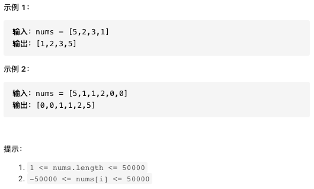

--

### 快速排序

```java
class Solution {
    private static final Random random = new Random();

    public int[] sortArray(int[] nums) {
        quickSort(nums, 0, nums.length-1);
        return nums;
    }

    private void quickSort(int[] nums, int l, int r){
        if (l >= r){
            return;
        }
        int preIndex = random.nextInt(r-l+1)+l;
        int preValue = nums[preIndex];
        swap(nums, l, preIndex);
        preIndex = l;
        for (int i = l+1; i<=r; i++){
            if (nums[i] < preValue){
                preIndex ++;
                swap(nums, i, preIndex);
            }
        }
        swap(nums, l, preIndex);
        quickSort(nums, l, preIndex);
        quickSort(nums, preIndex+1, r);
    }

    private void swap(int[] nums, int x, int y) {
        int temp = nums[x];
        nums[x] = nums[y];
        nums[y] = temp;
    }
}
```

---

## 写递归算法的秘诀

写递归算法的关键是要明确函数的「定义」是什么，然后相信这个定义，利用这个定义推导最终结果，绝不要跳入递归的细节。

比如说让你计算一棵二叉树共有几个节点：

```java
// 定义：count(root) 返回以 root 为根的树有多少节点
int count(TreeNode root) {
    // base case
    if (root == null) return 0;
    // 自己加上子树的节点数就是整棵树的节点数
    return 1 + count(root.left) + count(root.right);
}
```

写树相关的算法，简单说就是，先搞清楚当前 root 节点该做什么，然后根据函数定义递归调用子节点，递归调用会让孩子节点做相同的事情。

---

## 226-翻转二叉树

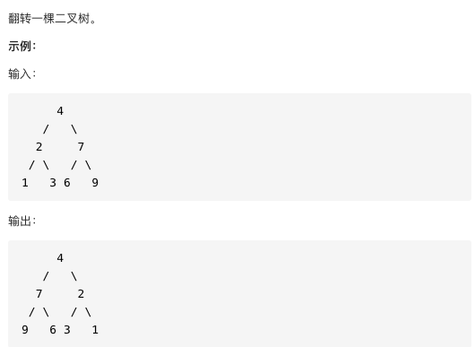

--

我们发现只要把二叉树上的每一个节点的左右子节点进行交换，最后的结果就是完全翻转之后的二叉树。
```java
// 将整棵树的节点翻转
TreeNode invertTree(TreeNode root) {
    // base case
    if (root == null) {
        return null;
    }

    /**** 前序遍历位置 ****/
    // root 节点需要交换它的左右子节点
    TreeNode tmp = root.left;
    root.left = root.right;
    root.right = tmp;

    // 让左右子节点继续翻转它们的子节点
    invertTree(root.left);
    invertTree(root.right);

    return root;
}
```

---

## 116-填充二叉树节点的右侧指针

给定一个 完美二叉树 ，其所有叶子节点都在同一层，每个父节点都有两个子节点。二叉树定义如下：
```java
struct Node {
  int val;
  Node *left;
  Node *right;
  Node *next;
}
```
填充它的每个 next 指针，让这个指针指向其下一个右侧节点。如果找不到下一个右侧节点，则将 next 指针设置为 NULL。初始状态下，所有 next 指针都被设置为 NULL。

进阶：

- 你只能使用常量级额外空间。
- 使用递归解题也符合要求，本题中递归程序占用的栈空间不算做额外的空间复杂度。

--

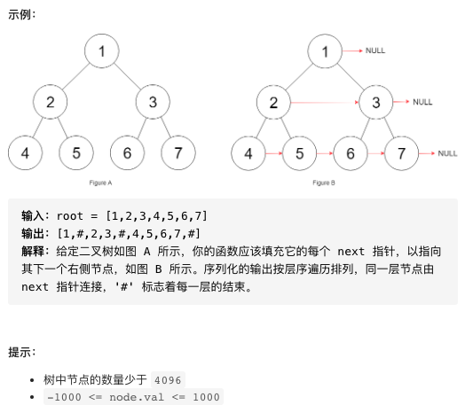

题目说了，输入是一棵「完美二叉树」，形象地说整棵二叉树是一个正三角形，除了最右侧的节点 next 指针会指向 null，其他节点的右侧一定有相邻的节点。

--

```java
class Solution {
    public Node connect(Node root) {
        if(null == root){
            return null;
        }
        Node left = root.left;
        Node right = root.right;
        if(null != left){
            // 连接直接儿子
            left.next = right;
            Node leftRight = left.right;
            Node rightLeft = right.left;
            // 连接若干孙子后代 左儿子最右连接右儿子最左
            while(null != leftRight){
                leftRight.next = rightLeft;
                leftRight = leftRight.right;
                rightLeft = rightLeft.left;
            }
        }
        connect(root.left);
        connect(root.right);
        return root;
    }
}
```

--

```java
// 主函数
Node connect(Node root) {
    if (root == null) return null;
    connectTwoNode(root.left, root.right);
    return root;
}

// 辅助函数
void connectTwoNode(Node node1, Node node2) {
    if (node1 == null || node2 == null) {
        return;
    }
    /**** 前序遍历位置 ****/
    // 将传入的两个节点连接
    node1.next = node2;

    // 连接相同父节点的两个子节点
    connectTwoNode(node1.left, node1.right);
    connectTwoNode(node2.left, node2.right);
    // 连接跨越父节点的两个子节点
    connectTwoNode(node1.right, node2.left);
}
```

---

## 114-二叉树展开为链表

给你二叉树的根结点 root ，请你将它展开为一个单链表：

- 展开后的单链表应该同样使用 TreeNode ，其中 right 子指针指向链表中下一个结点，而左子指针始终为 null 。
- 展开后的单链表应该与二叉树 先序遍历 顺序相同。

--

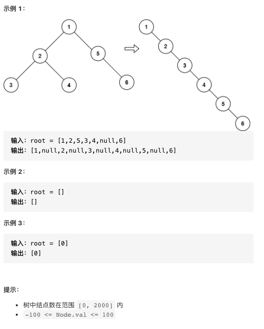

--

```java
/**
 * Definition for a binary tree node.
 * public class TreeNode {
 *     int val;
 *     TreeNode left;
 *     TreeNode right;
 *     TreeNode() {}
 *     TreeNode(int val) { this.val = val; }
 *     TreeNode(int val, TreeNode left, TreeNode right) {
 *         this.val = val;
 *         this.left = left;
 *         this.right = right;
 *     }
 * }
 */
class Solution {
    public void flatten(TreeNode root) {
        // base case
        if (root == null) return;

        flatten(root.left);
        flatten(root.right);

        /**** 后序遍历位置 ****/
        // 1、左右子树已经被拉平成一条链表
        TreeNode left = root.left;
        TreeNode right = root.right;

        // 2、将左子树作为右子树
        root.left = null;
        root.right = left;

        // 3、将原先的右子树接到当前右子树的末端
        TreeNode p = root;
        while (p.right != null) {
            p = p.right;
        }
        p.right = right;
    }
}
```

---

## 654-最大二叉树

给定一个不含重复元素的整数数组 nums 。一个以此数组直接递归构建的 最大二叉树 定义如下：

- 二叉树的根是数组 nums 中的最大元素。
- 左子树是通过数组中 最大值左边部分 递归构造出的最大二叉树。
- 右子树是通过数组中 最大值右边部分 递归构造出的最大二叉树。
- 返回有给定数组 nums 构建的 最大二叉树 。

--

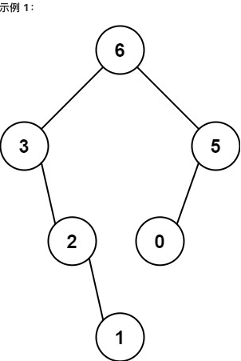
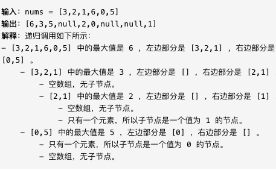

--

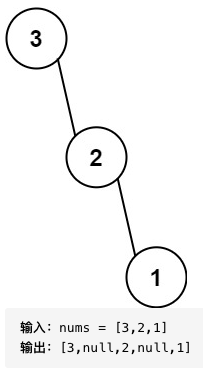
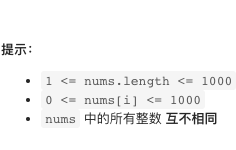

--

```java
class Solution {
    public TreeNode constructMaximumBinaryTree(int[] nums) {
        return build(nums, 0, nums.length - 1);
    }

    /* 将 nums[lo..hi] 构造成符合条件的树，返回根节点 */
    TreeNode build(int[] nums, int lo, int hi) {
        // base case
        if (lo > hi) {
            return null;
        }

        // 找到数组中的最大值和对应的索引
        int index = -1, maxVal = Integer.MIN_VALUE;
        for (int i = lo; i <= hi; i++) {
            if (maxVal < nums[i]) {
                index = i;
                maxVal = nums[i];
            }
        }

        TreeNode root = new TreeNode(maxVal);
        // 递归调用构造左右子树
        root.left = build(nums, lo, index - 1);
        root.right = build(nums, index + 1, hi);

        return root;
    }
}
```

---

## 106-从中序与后序遍历序列构造二叉树

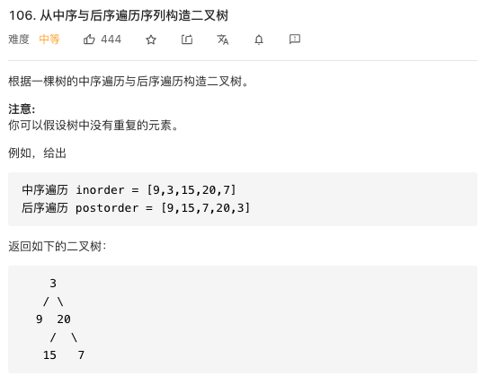

--

```java
class Solution {
    Map<Integer,Integer> indexMap = new HashMap();
    public TreeNode buildTree(int[] postorder, int[] inorder, int postStart, int postEnd, int inStart, int inEdn){
        if (postStart > postEnd) {
            return null;
        }
        int rootVal = postorder[postEnd];
        TreeNode root = new TreeNode(rootVal);
        int inRootIndex = indexMap.get(rootVal);
        // 得到左子树中的节点数目
        int size_left_subtree = inRootIndex - inStart;
        root.left = buildTree(postorder, inorder, postStart, postStart+size_left_subtree-1,inStart,inRootIndex-1);
        root.right = buildTree(postorder, inorder, postStart+size_left_subtree, postEnd-1,inRootIndex+1,inEdn);
        return root;
    }
    public TreeNode buildTree(int[] inorder, int[] postorder) {
        int length = inorder.length;
        for(int i=0;i< length;i++){
            indexMap.put(inorder[i],i);
        }
        return buildTree(postorder, inorder, 0, length-1,0,length-1);
    }
}
```

---

## 652-寻找重复的子树

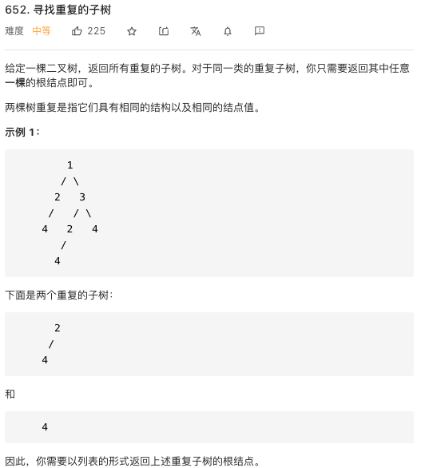

--

```java
class Solution {
    // 记录所有子树以及出现的次数
    HashMap<String, Integer> memo = new HashMap<>();
    // 记录重复的子树根节点
    LinkedList<TreeNode> res = new LinkedList<>();

    /* 主函数 */
    List<TreeNode> findDuplicateSubtrees(TreeNode root) {
        traverse(root);
        return res;
    }

    /* 辅助函数 */
    String traverse(TreeNode root) {
        if (root == null) {
            return "#";
        }

        String left = traverse(root.left);
        String right = traverse(root.right);

        String subTree = left + "," + right+ "," + root.val;

        int freq = memo.getOrDefault(subTree, 0);
        // 多次重复也只会被加入结果集一次
        if (freq == 1) {
            res.add(root);
        }
        // 给子树对应的出现次数加一
        memo.put(subTree, freq + 1);
        return subTree;
    }
}
```

--- 

## 236-二叉树的最近公共祖先

--

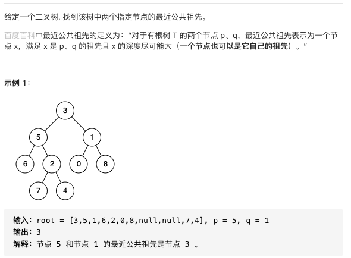

--

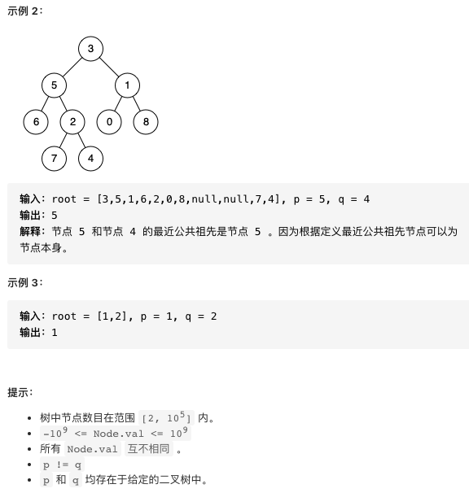

--

```java
class Solution {
    // 后续遍历 寻找最近公共祖先
    public TreeNode lowestCommonAncestor(TreeNode root, TreeNode p, TreeNode q) {
        // base case
        if (root == null) return null;
        if (root == p || root == q) return root;

        TreeNode left = lowestCommonAncestor(root.left, p, q);
        TreeNode right = lowestCommonAncestor(root.right, p, q);
        // 情况 1
        if (left != null && right != null) {
            return root;
        }
        // 情况 2
        if (left == null && right == null) {
            return null;
        }
        // 情况 3
        return left == null ? right : left;
    }
}
```

@slideend