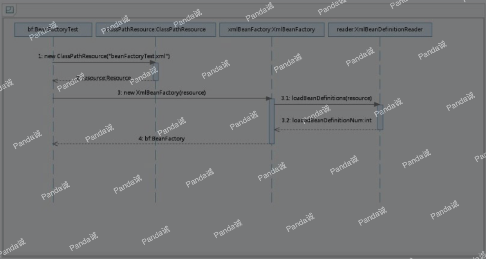

本文深入分析这段代码
```java
BeanFactory bf = new XmlBeanFactory(new ClassPathResource("beanFactoryTest.xml"));
```



时序图从BeanFactoryTest测试类开始，通过时序图我们可以一目了然地看到整个逻辑处理顺序。在测试的BeanFactoryTest类中首先调用ClassPathResource的构造函数来构造Resource
资源文件的实例对象，这样后续的资源处理就可以用Resource提供的各种服务来操作了，当我们有了Resource后就可以进行XmlBeanFactory的初始化了.那么Rsource资源是如何封装的呢？

## 配置文件封装

Spring的配置文件读取是通过ClassPathResource进行封装的，如newClassPathResource ("beanFactoryTest.xml")，那么ClassPathResource完成了什么功能呢？

>在Java中，将不同来源的资源抽象成URL，通过注册不同的handler（URLStreamHandler）来处理不同来源的资源的读取逻辑，一般handler的类型使用不同前缀（协议，Protocol）来识别，如“file:”、“http:”、“jar:”等，然而URL没有默认定义相对Classpath或ServletContext等资源的handler，虽然可以注册自己的URLStreamHandler来解析特定的URL前缀（协议），比如“classpath:”，然而这需要了解URL的实现机制，而且URL也没有提供一些基本的方法，如检查当前资源是否存在、检查当前资源是否可读等方法。因而Spring对其内部使用到的资源实现了自己的抽象结构：Resource接口来封装底层资源。

Spring定义了一个最基本的接口InputStreamSource,InputStreamSource封装任何能返回InputStream的类，比如File、Classpath下的资源和Byte Array等。它只有一个方法定义：getInputStream()，该方法返回一个新的InputStream对象。
```java
public interface InputStreamSource {
	/**
	 * Return an {@link InputStream} for the content of an underlying resource.
	 * <p>It is expected that each call creates a <i>fresh</i> stream.
	 * <p>This requirement is particularly important when you consider an API such
	 * as JavaMail, which needs to be able to read the stream multiple times when
	 * creating mail attachments. For such a use case, it is <i>required</i>
	 * that each {@code getInputStream()} call returns a fresh stream.
	 * @return the input stream for the underlying resource (must not be {@code null})
	 * @throws java.io.FileNotFoundException if the underlying resource doesn't exist
	 * @throws IOException if the content stream could not be opened
	 */
	InputStream getInputStream() throws IOException;
}
```
然后定义了Resource接口继承了InputStreamSource
```java
/**
 * Interface for a resource descriptor that abstracts from the actual
 * type of underlying resource, such as a file or class path resource.
 *
 * <p>An InputStream can be opened for every resource if it exists in
 * physical form, but a URL or File handle can just be returned for
 * certain resources. The actual behavior is implementation-specific.
 *
 * @author Juergen Hoeller
 * @since 28.12.2003
 * @see #getInputStream()
 * @see #getURL()
 * @see #getURI()
 * @see #getFile()
 * @see WritableResource
 * @see ContextResource
 * @see UrlResource
 * @see FileUrlResource
 * @see FileSystemResource
 * @see ClassPathResource
 * @see ByteArrayResource
 * @see InputStreamResource
 */
public interface Resource extends InputStreamSource {

	/**
	 * 确定此资源是否实际以物理形式存在。
	 * 此方法执行确定的存在性检查，而{@code Resource}句柄的存在仅保证有效的描述符句柄。
	 */
	boolean exists();

	/**
	 * 指示是否可以通过{@link #getInputStream（）}读取此资源的非空内容。
	 * <p>对于存在的典型资源描述符，将为{@code true}，因为从5.1开始，它严格隐含{@link #exists（）}语义。
	 * 请注意，尝试进行实际的内容读取仍可能会失败。
	 * 但是，值{@code false}是明确的指示资源内容无法读取。
	 * @see #getInputStream()
	 * @see #exists()
	 */
	default boolean isReadable() {
		return exists();
	}

	/**
	 * 指示此资源是否代表具有开放流的句柄。
	 * 如果{@code true}，则无法多次读取InputStream，
	 * 并且必须将其读取并关闭以避免资源泄漏。
	 * <p>对于典型的资源描述符，将为{@code false}。
	 */
	default boolean isOpen() {
		return false;
	}

	/**
	 * 确定此资源是否代表文件系统中的文件。
	 * A value of {@code true} strongly suggests (but does not guarantee)
	 * that a {@link #getFile()} call will succeed.
	 * <p>This is conservatively {@code false} by default.
	 * @since 5.0
	 * @see #getFile()
	 */
	default boolean isFile() {
		return false;
	}

	/**
	 * Return a URL handle for this resource.
	 * @throws IOException if the resource cannot be resolved as URL,
	 * i.e. if the resource is not available as descriptor
	 */
	URL getURL() throws IOException;

	/**
	 * Return a URI handle for this resource.
	 * @throws IOException if the resource cannot be resolved as URI,
	 * i.e. if the resource is not available as descriptor
	 * @since 2.5
	 */
	URI getURI() throws IOException;

	/**
	 * Return a File handle for this resource.
	 * @throws java.io.FileNotFoundException if the resource cannot be resolved as
	 * absolute file path, i.e. if the resource is not available in a file system
	 * @throws IOException in case of general resolution/reading failures
	 * @see #getInputStream()
	 */
	File getFile() throws IOException;

	/**
	 * Return a {@link ReadableByteChannel}.
	 * <p>It is expected that each call creates a <i>fresh</i> channel.
	 * <p>The default implementation returns {@link Channels#newChannel(InputStream)}
	 * with the result of {@link #getInputStream()}.
	 * @return the byte channel for the underlying resource (must not be {@code null})
	 * @throws java.io.FileNotFoundException if the underlying resource doesn't exist
	 * @throws IOException if the content channel could not be opened
	 * @since 5.0
	 * @see #getInputStream()
	 */
	default ReadableByteChannel readableChannel() throws IOException {
		return Channels.newChannel(getInputStream());
	}

	/**
	 * Determine the content length for this resource.
	 * @throws IOException if the resource cannot be resolved
	 * (in the file system or as some other known physical resource type)
	 */
	long contentLength() throws IOException;

	/**
	 * Determine the last-modified timestamp for this resource.
	 * @throws IOException if the resource cannot be resolved
	 * (in the file system or as some other known physical resource type)
	 */
	long lastModified() throws IOException;

	/**
	 * Create a resource relative to this resource.
	 * @param relativePath the relative path (relative to this resource)
	 * @return the resource handle for the relative resource
	 * @throws IOException if the relative resource cannot be determined
	 */
	Resource createRelative(String relativePath) throws IOException;

	/**
	 * Determine a filename for this resource, i.e. typically the last
	 * part of the path: for example, "myfile.txt".
	 * <p>Returns {@code null} if this type of resource does not
	 * have a filename.
	 */
	@Nullable
	String getFilename();

	/**
	 * Return a description for this resource,
	 * to be used for error output when working with the resource.
	 * <p>Implementations are also encouraged to return this value
	 * from their {@code toString} method.
	 * @see Object#toString()
	 */
	String getDescription();

}
```
InputStreamSource封装任何能返回InputStream的类，比如File、Classpath下的资源和ByteArray等。它只有一个方法定义：getInputStream()，该方法返回一个新的InputStream对象。Resource接口抽象了所有Spring内部使用到的底层资源：File、URL、Classpath等。首先，它定义了3个判断当前资源状态的方法：存在性（exists）、可读性（isReadable）、是否处于打开状态（isOpen）。另外，Resource接口还提供了不同资源到URL、URI、File类型的转换，以及获取lastModified属性、文件名（不带路径信息的文件名，getFilename()）的方法。为了便于操作，Resource还提供了基于当前资源创建一个相对资源的方法：createRelative()。在错误处理中需要详细地打印出错的资源文件，因而Resource还提供了getDescription()方法用于在错误处理中的打印信息。对不同来源的资源文件都有相应的Resource实现：文件（FileSystemResource）、Classpath资源（ClassPathResource）、URL资源（UrlResource）、InputStream资源（InputStreamResource）、Byte数组（ByteArrayResource）等。