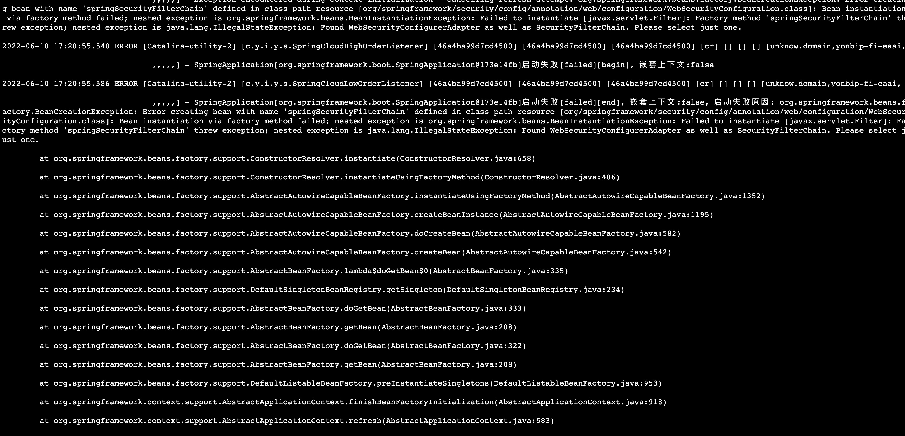
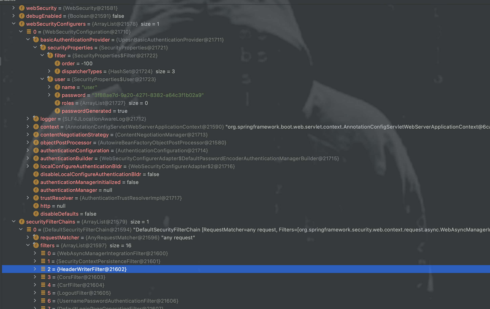

记一次security报错的问题排查。

问题背景，项目更新了本地包后，本地启动报错：



>Found WebSecurityConfigurerAdapter as well as SecurityFilterChain. Please select just one

通过截图堆栈看到是`org.springframework.security.config.annotation.web.configuration.WebSecurityConfiguration#springSecurityFilterChain`方法报的错。

翻看源码是`hasConfigurers`和`hasFilterChain`同时为true报错。
```java
/**
    * Creates the Spring Security Filter Chain
    * @return the {@link Filter} that represents the security filter chain
    * @throws Exception
    */
@Bean(name = AbstractSecurityWebApplicationInitializer.DEFAULT_FILTER_NAME)
public Filter springSecurityFilterChain() throws Exception {
    boolean hasConfigurers = this.webSecurityConfigurers != null && !this.webSecurityConfigurers.isEmpty();
    boolean hasFilterChain = !this.securityFilterChains.isEmpty();
    Assert.state(!(hasConfigurers && hasFilterChain),
            "Found WebSecurityConfigurerAdapter as well as SecurityFilterChain. Please select just one.");
    if (!hasConfigurers && !hasFilterChain) {
        WebSecurityConfigurerAdapter adapter = this.objectObjectPostProcessor
                .postProcess(new WebSecurityConfigurerAdapter() {
                });
        this.webSecurity.apply(adapter);
    }
    for (SecurityFilterChain securityFilterChain : this.securityFilterChains) {
        this.webSecurity.addSecurityFilterChainBuilder(() -> securityFilterChain);
        for (Filter filter : securityFilterChain.getFilters()) {
            if (filter instanceof FilterSecurityInterceptor) {
                this.webSecurity.securityInterceptor((FilterSecurityInterceptor) filter);
                break;
            }
        }
    }
    for (WebSecurityCustomizer customizer : this.webSecurityCustomizers) {
        customizer.customize(this.webSecurity);
    }
    return this.webSecurity.build();
}
```

打上断点再次启动，看看`webSecurityConfigurers`和`securityFilterChains`都是什么。



看到断点，`webSecurityConfigurers`里有个basicAuth这个是多的，猜测是这块的问题。对应的类叫`UpesnBasicAuthenticationProvider`，查找这个类对应所在的jar，继续找对应的负责人就可以了。

整个项目是通过公开SecurityFilterChain来配置安全性，而在这个第三方包里通过扩展WebSecurityConfigurerAdapter来配置安全性(加了个basicAuth)。Spring Security不允许您同时使用这两种配置样式，因为那样它就无法确定应该检查它们的顺序。


