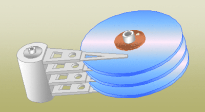
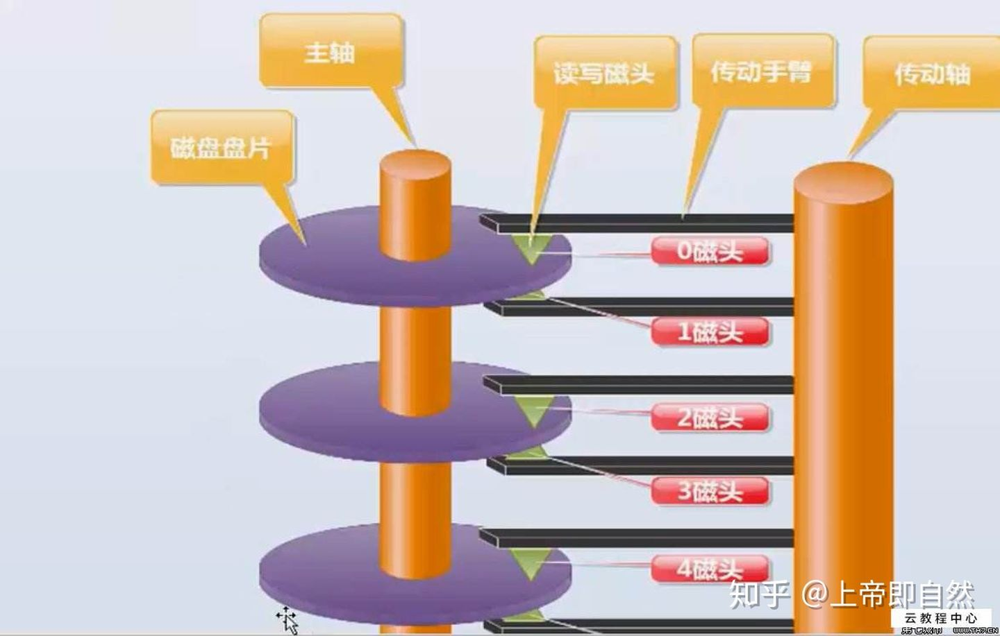
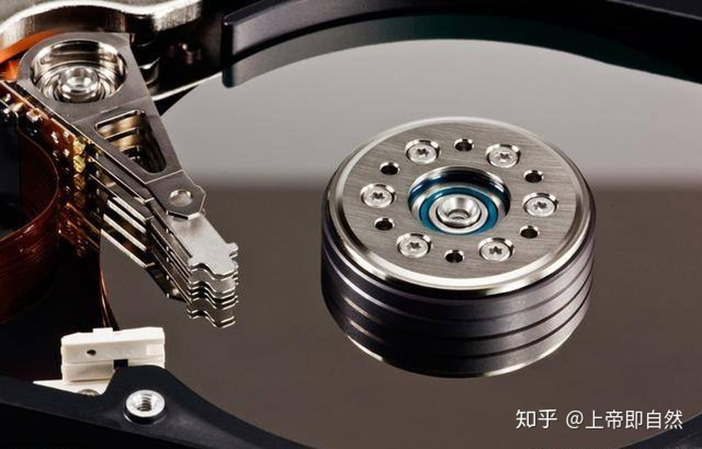
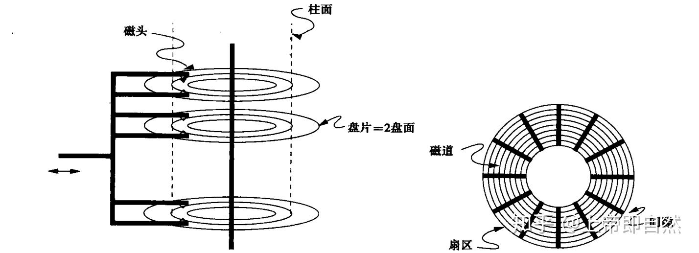

硬盘内部主要部件为磁盘盘片、传动手臂、读写磁头和主轴马达。实际数据都是写在盘片上，读写主要是通过传动手臂上的读写磁头来完成。实际运行时，主轴让磁盘盘片转动，然后传动手臂可伸展让读取头在盘片上进行读写操作。

可以看见，硬盘拆开后，里面存在多张磁盘和多个读写磁头，假如一张磁盘有8张磁盘，就会有16个盘面和16个读写磁头了，所有的盘面构成了磁盘组合。

磁盘组合由一个或多个圆盘组成，他们围绕一根中心主轴旋转，圆盘的上下表面涂抹了一层磁性材料，二进制位被存储在这些磁性材料上。其中，0和1在磁材料中表现位不同的模式。

## 磁头，磁道，扇区，柱面介绍

**磁头（head）**：不用说，主要就是读取磁盘表面磁方向和改变其方向，每个盘面有一个磁头，它极其贴近地悬浮在盘面上，但是绝对不与盘面接触，否则会损坏磁头和盘面；

**磁道（track）**：磁道是单个盘面上的同心圆，当磁盘旋转时，磁头若保持在一个位置上，则每个磁头都会在磁盘表面划出一个圆形轨迹，这些圆形轨迹就叫做磁道，一个盘面上的磁道可以有成千上万个。相邻磁道之间并不是紧挨着的，这是因为磁化单元相隔太近时磁性会产生相互影响，同时也为磁头的读写带来困难。

**柱面（cylinder）**：在有多个盘片构成的盘组中，由不同盘片的面，但处于同一半径圆的多个磁道组成的一个圆柱面。

**扇区（sector）**：磁盘上的每个磁道被等分为若干个弧段，这些弧段便是硬盘的扇区（Sector）。硬盘的第一个扇区，叫做引导扇区。扇区是被间隙（gap）分割的圆的片段，间隙未被磁化成0或者1。注意，扇区是读写磁盘最基本的单位，如果一个扇区因为某种原因被破坏，那么整个扇区的数据都会受影响。

## 磁盘容量的计算

早期的硬盘每磁道扇区数相同，此时由磁盘基本参数可以计算出硬盘的容量：存储容量=磁头数*磁道（柱面）数*每道扇区数*每扇区字节数。由于每磁道扇区数相同，外圈磁道半径大，里圈磁道半径小，外圈和里圈扇区面积自然会不一样。同时，为了更好的读取数据，即使外圈扇区面积再大也只能和内圈扇区一样存放相同的字节数（512字节）。这样一来，外圈的记录密度就要比内圈小，会浪费大量的存储空间。

>Megatron747磁盘是一个典型的vintage-2008的大容量驱动器，它具有以下特性：8个圆盘，16个盘面，每个盘面有65536个磁道，每个磁道（平均）有256个扇区，每个扇区可以存储4096个字节（byte）。

16个盘面，乘以65536个磁道，乘以256个扇区，再乘以4096字节，即16*65536*256*4096=2^40 byte，也就是1TB的容量。

如今的硬盘都使用ZBR（Zoned Bit Recording，区位记录）技术，盘片表面由里向外划分为数个区域，不同区域的磁道扇区数目不同，同一区域内各磁道扇区数相同，盘片外圈区域磁道长扇区数目较多，内圈区域磁道短扇区数目较少，大体实现了等密度，从而获得了更多的存储空间。此时，由于每磁道扇区数各不相同，所以传统的容量计算公式就不再适用。实际上如今的硬盘大多使用LBA（Logical Block Addressing）逻辑块寻址模式，知道LBA后即可计算出硬盘容量。

## 影响硬盘性能的因素

影响磁盘的关键因素是磁盘服务时间，即磁盘完成一个I/O请求所花费的时间，它由寻道时间、旋转延迟和数据传输时间三部分构成。

### 1. 寻道时间

Tseek是指将读写磁头移动至正确的磁道上所需要的时间。寻道时间越短，I/O操作越快，目前磁盘的平均寻道时间一般在3-15ms。

### 2. 旋转延迟

Trotation是指盘片旋转将请求数据所在的扇区移动到读写磁盘下方所需要的时间。旋转延迟取决于磁盘转速，通常用磁盘旋转一周所需时间的1/2表示。比如：7200rpm的磁盘平均旋转延迟大约为60*1000/7200/2 = 4.17ms，而转速为15000rpm的磁盘其平均旋转延迟为2ms。

### 3. 数据传输时间

Ttransfer是指完成传输所请求的数据所需要的时间，它取决于数据传输率，其值等于数据大小除以数据传输率。目前IDE/ATA能达到133MB/s，SATA II可达到300MB/s的接口数据传输率，数据传输时间通常远小于前两部分消耗时间。简单计算时可忽略。

