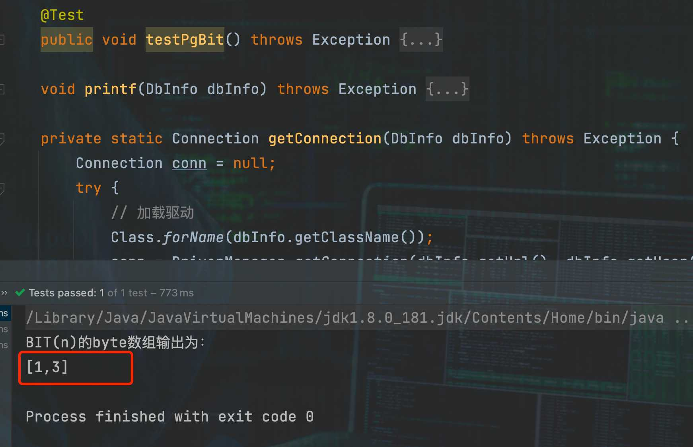

## 前言

以前真没有注意过字节序这个东西，直到最近在做Debezium开发并研读源码时，发现了一段有意思的代码。

简单来说这段代码是用来转BIT型的数据的，BIT(1)转成Boolean就不说了。重点是BIT(n > 1)的时候，读取到的数据是byte[]或者BitSet。
byte[]是通过JDBC方式获取到的数据的格式，BitSet是采集CDC日志获取到的数据格式，都最终都会以 byte[]的格式输出出去。然后这里涉及
了一个字节序的问题。看这段代码的意思是只有MySQL的JDBC方式获取到的数据的格式是大端字节序，其他所有情况都是小端字节序。

```java
// 转换bit(n)
protected Object convertBits(Column column, Field fieldDefn, Object data, int numBytes) {
    return convertValue(column, fieldDefn, data, new byte[0], (r) -> {
        if (data instanceof Boolean) {
            Boolean value = (Boolean) data;
            r.deliver(new byte[]{ value.booleanValue() ? (byte) 1 : (byte) 0 });
        }
        else if (data instanceof byte[]) {
            byte[] bytes = (byte[]) data;
            if (bytes.length == 1) {
                r.deliver(bytes);
            }
            if (byteOrderOfBitType() == ByteOrder.BIG_ENDIAN) { // 只有MySQL是true 其他数据库(SQL Server oracle pg db2等都是false)
                // Reverse it to little endian ...
                int i = 0;
                int j = bytes.length - 1;
                byte tmp;
                while (j > i) {
                    tmp = bytes[j];
                    bytes[j] = bytes[i];
                    bytes[i] = tmp;
                    ++i;
                    --j;
                }
            }
            r.deliver(padLittleEndian(numBytes, bytes));
        }
        else if (data instanceof BitSet) {
            byte[] bytes = ((BitSet) data).toByteArray();
            r.deliver(padLittleEndian(numBytes, bytes));
        }
    });
}
```

## 字节序

计算机硬件有两种储存数据的方式：大端字节序（big endian）和小端字节序（little endian）。

举例来说，现在MySQL有一个BIT(16)，在数据库中存值是`0000000100000011`，对应的整型应该是259

1.  大端字节序：高位字节在前，低位字节在后，这是人类读写数值的方法，那么`byte[]`应该就是 `[1,3]`。
2.  小端字节序：低位字节在前，高位字节在后，那么`byte[]`应该就是 `[3,1]`。

计算机电路先处理低位字节，效率比较高，因为计算都是从低位开始的。所以，计算机的内部处理都是小端字节序。但是，人类还是习惯读写大端字节序。所以，除了计算机的内部处理，其他的场合几乎都是大端字节序，比如网络传输和文件储存。

## MySQL bit 字节序


MySQL通过JDBC读取到的是大端字节序`[1,3]`。

再查看binlog日志解析得到的`byte[]`得到的是小端字节序`[3,1]`


>之前用的解析binlog的第三方jar都是
>```xml
><dependency>
>    <groupId>com.github.shyiko</groupId>
>    <artifactId>mysql-binlog-connector-java</artifactId>
></dependency>
>```
>如今这个项目是被Debezium团队的开发人员维护
>```xml
> <dependency>
>    <groupId>com.zendesk</groupId>
>    <artifactId>mysql-binlog-connector-java</artifactId>
></dependency>
>```

## SQL Server

SQL Server的bit就只能存1,0 NULL。

## Oracle

没有BIT字段哈

## Postgre SQL




Pg(Gp)通过JDBC读取到的是大端字节序`[1,3]`。

通过插槽CDC获得是小端字节序`[3,1]`


