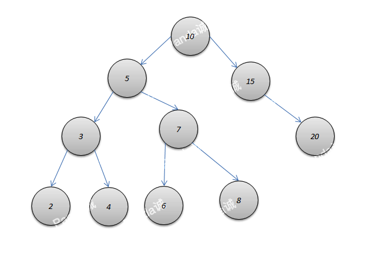

前驱节点 val值小于该节点val值并且值最大的节点
后继节点 val值大于该节点val值并且值最小的节点

<!-- more -->



前驱节点
1 如果x存在左孩子，则"x的前驱结点"为 "以其左孩子为根的子树的最大结点"
(例如:节点10,前驱就是8);
2 如果x没有左孩子。则x有以下两种可能;
2.1 x是"一个右孩子"，则"x的前驱结点"为 "它的父结点";
2.2 x是"一个左孩子"，则查找"x的最低的父结点，并且该父结点要具有右孩子"，找到的这个"最低的父结点"就是"x的前驱结点";


后继节点
1 如果x存在右孩子，则"x的后继结点"为 "以其右孩子为根的子树的最小结点"
(例如:节点5,后继就是6);
2 如果x没有右孩子。则x有以下两种可能;
2.1 x是"一个左孩子"，则"x的后继结点"为 "它的父结点";
2.2 x是"一个左孩子"，则查找"x的最低的父结点，并且该父结点要具有左孩子"，找到的这个"最低的父结点"就是"x的前驱结点";


```java
//前驱元素
//节点val值小于该节点val值并且值最大的节点
Node *predecessor(Node *node) {
    Node *ret = NULL;
    // 如果x存在左孩子，则"x的前驱结点"为 "以其左孩子为根的子树的最大结点"。
    if(node->left != NULL) {
        Node *r = node->left;
        while(r->right) {
            r = r->right;
        }
        ret = r;
    } else {
        // 如果x没有左孩子。则x有以下两种可能：
        // (01) x是"一个右孩子"，则"x的前驱结点"为 "它的父结点"。
        // (01) x是"一个左孩子"，则查找"x的最低的父结点，并且该父结点要具有右孩子"，找到的这个"最低的父结点"就是"x的前驱结点"。
        ret = node->parent;
        while ((ret != NULL) && (node == ret->left)) {
            node = ret;
            ret = ret->parent;
        }
    }
    return ret;
}

//后继元素
//节点val值大于该节点val值并且值最小的节点
Node *successor(Node *node) {
    Node *ret = NULL;
    if(node->right != NULL) {
        Node *l = node->right;
        while(l->left) {
            l = l->left;
        }
        ret = l;
    } else {
        // 如果x没有右孩子。则x有以下两种可能：
        // (01) x是"一个左孩子"，则"x的后继结点"为 "它的父结点"。
        // (02) x是"一个右孩子"，则查找"x的最低的父结点，并且该父结点要具有左孩子"，找到的这个"最低的父结点"就是"x的后继结点"。
        ret = node->parent;
        while ((ret != NULL) && (node == ret->right)) {
            node = ret;
            ret = ret->parent;
        }
    }
    return ret;
}
```
