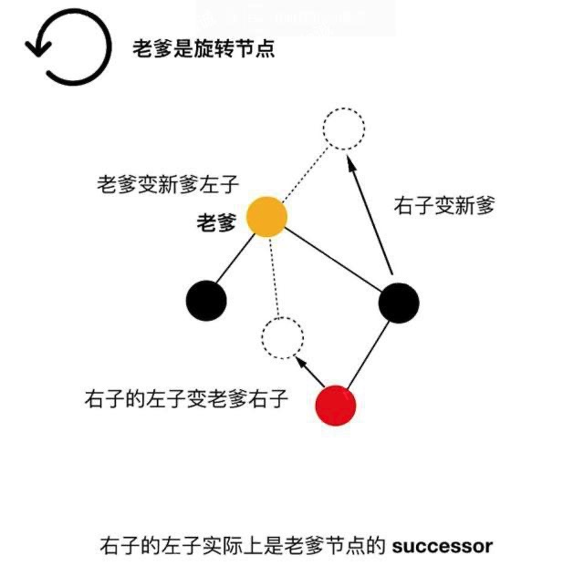
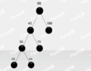
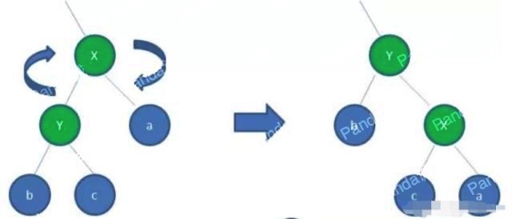
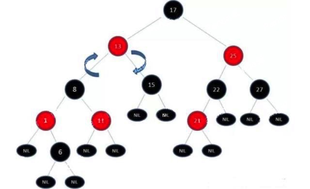

什么是二叉查找树(BST)?

1. 左子树上所有的节点的值均小于或等于他根节点的值
2. 右子树上所有的节点的值均大于或等于他根节点的值
3. 左右子树也分别是二叉排序树

<!-- more -->

下面为标准的二叉排序树

那么这种结构有什么好处呢？现在试着查找226节点

初始状态：

其实想要搜索值为226的节点很简单，搜索动画过程如下：

其实这就是二分查找的思想，最大的查找次数等同于二叉树的高度，插入节点的时候也是这样，一层一层的查找合适的位置然后插入，但他也有明显的缺陷，比如：

这样不行，得想办法解决这个问题，需要一种策略来平衡二叉树，其中红黑树算法，就可以让二分查找树变成平衡二叉查找树

红黑树就是一种平衡的二叉查找树，说他平衡的意思是他不会变成“瘸子”，左腿特别长或者右腿特别长。除了符合二叉查找树的特性之外，还具体下列的特性：

1. 节点是红色或者黑色

2. 根节点是黑色

3. 每个叶子的节点都是黑色的空节点（NULL）

4. 每个红色节点的两个子节点都是黑色的。

5. 从任意节点到其每个叶子的所有路径都包含相同的黑色节点。

下面为标准的红黑树，建议对照下面的图理解上边写的红黑树的性质

（黑色的NULL节点可忽略）

当然，我们很容易就会发现，当插入或者删除一个节点，就会很容易破坏红黑树的特性，例如上面标准的红黑树，插入值为12的节点。

插入之后发现仍然满足红黑树的要求！

但是如果插入值为21的节点呢？

如下图所示：

插入21这个节点就破坏了红黑树，那么我们需要重新调整使其重新满足红黑树的特性，主要方法包括 变色、左旋、右旋。

先来看一下变色！为了符合红黑树的规则，会把节点红变黑或者黑变红。下图展示的是红黑树的部分，需要注意节点25并非根节点。因为21和22链接出现红色，不符合规则4，所以把22红变黑：

但这样还是不符合规则5，所以需要把25黑变红，看下图：

那么27也要变色

这样局部的变色完成了，现在看一下红黑树的全貌：

17和25是两个连续的红色节点，而根节点13不可能再变色了，那17只能是红色了，现在只变色是已经没有办法到达平衡的效果了，所以只能进行旋转了

接下来先讲一下什么是左旋转！通过动画举个例子吧！

左旋转思想示意图如下

通俗点讲一下，可以看下面的左旋转静态示意图

按照左旋转，对上边已经变色完成之后图进行左旋转。

根节点必须是黑色，那么需要变色

但是，我们发现 17-13-8-1-6-NULL 经历了4个黑球，而17到其他叶子节点都是3个黑球，那么现在要考虑一下右旋了

可见右旋转的思想总结如下：

通俗点讲一下，可以看下面的右旋转静态示意图

接下来，对上边经过左旋转之后的图进行右旋转。

最后再变色

在Java中的Tree Map用的就是红黑树，函数中实现关联数组、实时计算、图像处理中的几何运算都会用到红黑树

<!-- 

 -->