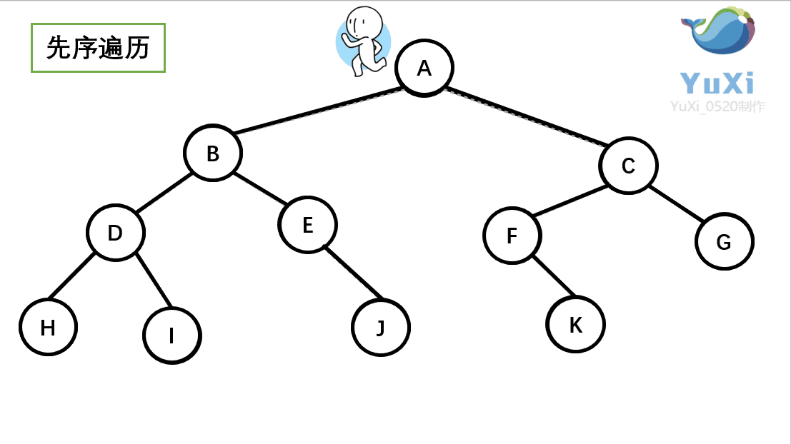
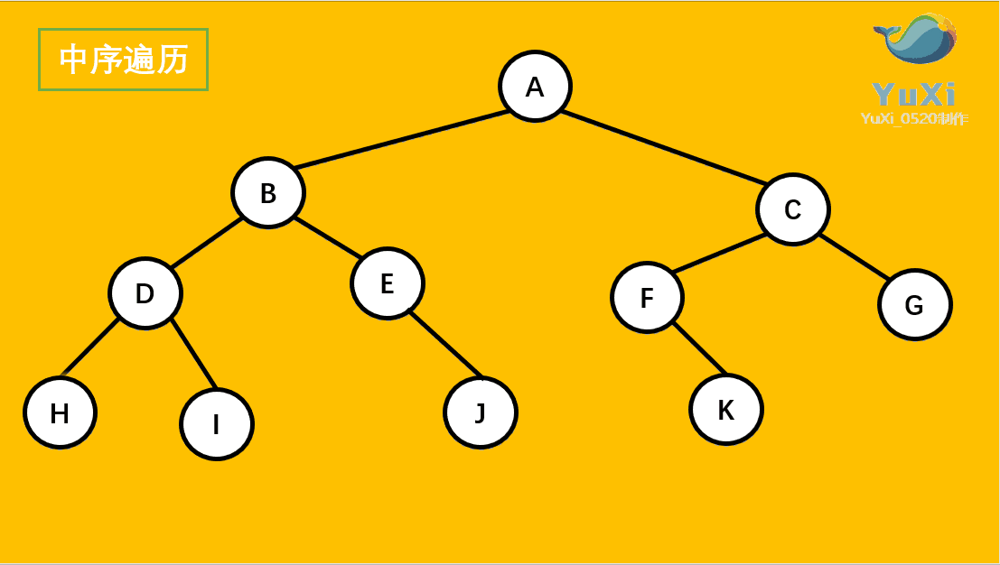
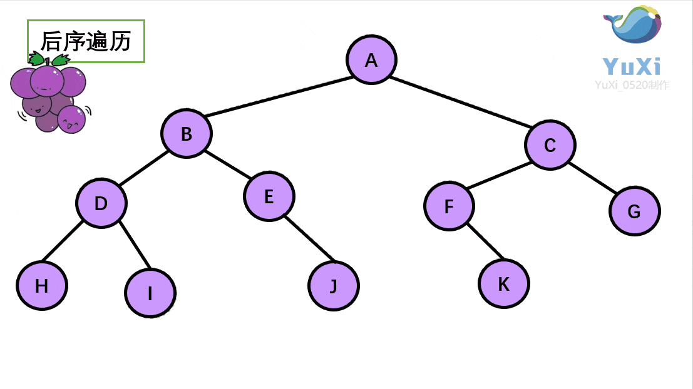
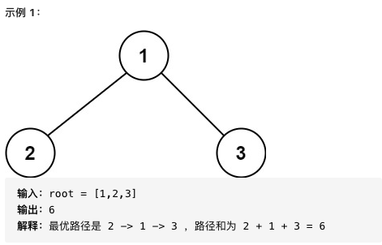
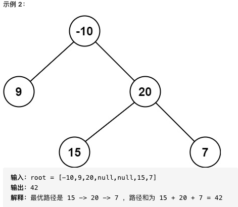
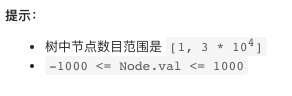
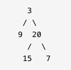
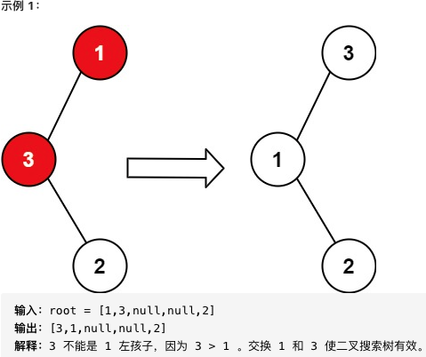
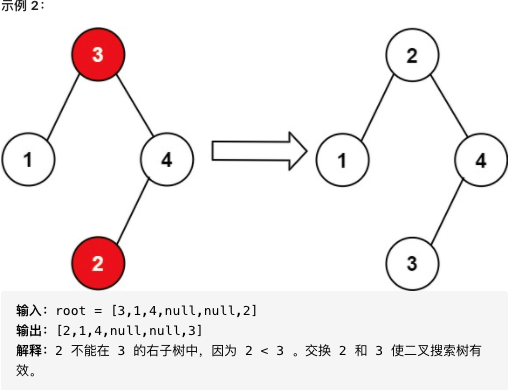

@slidestart

---

## 数据结构的存储方式

- 数据结构的存储方式只有两种：<font color=red>数组（顺序存储）</font>和<font color=green>链表（链式存储）</font>。
- 不是还有散列表、栈、队列、堆、树、图等等各种数据结构吗？那些都属于「上层建筑」，而数组和链表才是「结构基础」。因为那些多样化的数据结构，究其源头，都是在链表或者数组上的特殊操作，API 不同而已。
- 数组由于是紧凑连续存储,可以随机访问，通过索引快速找到对应元素，而且相对节约存储空间。但正因为连续存储，内存空间必须一次性分配够，所以说数组如果要扩容，需要重新分配一块更大的空间，再把数据全部复制过去，时间复杂度 O(N)；而且你如果想在数组中间进行插入和删除，每次必须搬移后面的所有数据以保持连续，时间复杂度 O(N)。
- 链表因为元素不连续，而是靠指针指向下一个元素的位置，所以不存在数组的扩容问题；如果知道某一元素的前驱和后驱，操作指针即可删除该元素或者插入新元素，时间复杂度 O(1)。但是正因为存储空间不连续，你无法根据一个索引算出对应元素的地址，所以不能随机访问；而且由于每个元素必须存储指向前后元素位置的指针，会消耗相对更多的储存空间。

---

## 数据结构的基本操作

- 对于任何数据结构，其基本操作无非遍历 + 访问，再具体一点就是：<font color=red>增删查改</font>。
- 数据结构种类很多，但它们存在的目的都是在不同的应用场景，尽可能<font color=green>高效</font>地增删查改。
- 从最高层来看，各种数据结构的遍历 + 访问无非两种形式：<font color=purple>线性的和非线性的</font>。
- 线性就是 for/while 迭代为代表，非线性就是递归为代表。

---

## 算法刷题指南

- 数据结构是工具，算法是通过合适的工具解决特定问题的方法。
- <font color=red>先刷二叉树</font> <font color=green>先刷二叉树</font> <font color=blue>先刷二叉树！</font>
- 为什么要先刷二叉树呢，因为二叉树是最容易培养框架思维的，而且大部分算法技巧，本质上都是树的遍历问题。

---

## 刷二叉树思路

不要小看这几行破代码，几乎所有二叉树的题目都是一套这个框架就出来了。
```java
void traverse(TreeNode root) {
    // 前序遍历
    traverse(root.left)
    // 中序遍历
    traverse(root.right)
    // 后序遍历
}
```

--

## 前序遍历 Pre Order Traverse

从树根开始绕着整棵树的外围转一圈，经过结点的顺序就是先序遍历的顺序



--

## 中序遍历 In Order Traverse

按树画好的左右位置投影下来就可以了



--

## 后序遍历 Post Order Traverse

剪葡萄，我们要把一串葡萄剪成一颗一颗的。



---

## 124-二叉树中的最大路径和
- <font color=red>路径</font>：被定义为一条从树中<font color=amber>任意节点</font>出发，沿父节点-子节点连接，达到任意节点的序列。该路径<font color=green>至少包含一个</font>节点，且不一定经过根节点。
- <font color=blue>路径和</font>是路径中各节点值的总和。
- 给你一个二叉树的根节点 root ，返回其 最大路径和。




--

```java
class Solution {
    int maxPath = Integer.MIN_VALUE;
    public int maxPathSum(TreeNode root) {
        postOrder(root);
        return maxPath;
    }
    // 后续遍历
    int postOrder(TreeNode node){
        if(null == node){
            return 0;
        }
        int maxLeft = Math.max(0,postOrder(node.left));
        int maxRight = Math.max(0,postOrder(node.right));
        maxPath = Math.max(maxPath, maxLeft+maxRight+node.val);
        return Math.max(maxLeft,maxRight)+node.val;
    }
}
```

---

## 105-从前序与中序遍历序列构造二叉树

- 根据一棵树的前序遍历与中序遍历构造二叉树。
- 注意: 你可以假设树中没有重复的元素。
- 例如，给出
    - 前序遍历 preorder = [3,9,20,15,7]
    - 中序遍历 inorder = [9,3,15,20,7]
- 返回如下的二叉树：




---


从前序遍历和中序遍历的结果中不断找到那个root节点

```java
class Solution {

    Map<Integer,Integer> indexMap = new HashMap();
    public TreeNode buildTree(int[] preorder, int[] inorder, int preStart, int preEnd, int inStart, int inEdn){
        if (preStart > preEnd) {
            return null;
        }
        int rootVal = preorder[preStart];
        TreeNode root = new TreeNode(rootVal);
        int inRootIndex = indexMap.get(rootVal);
        // 得到左子树中的节点数目
        int size_left_subtree = inRootIndex - inStart;
        root.left = buildTree(preorder, inorder, preStart+1, preStart+size_left_subtree,inStart,inRootIndex-1);
        root.right = buildTree(preorder, inorder, preStart+size_left_subtree+1, preEnd,inRootIndex+1,inEdn);
        return root;
    }
    public TreeNode buildTree(int[] preorder, int[] inorder) {
        int length = preorder.length;
        for(int i=0;i< length;i++){
            indexMap.put(inorder[i],i);
        }
        return buildTree(preorder, inorder, 0, length-1,0,length-1);
    }
}
```

---

## 99-恢复二叉搜索树

- 给你二叉搜索树的根节点 root ，该树中的两个节点被错误地交换。请在不改变其结构的情况下，恢复这棵树。
- 进阶：使用 O(n) 空间复杂度的解法很容易实现。你能想出一个只使用常数空间的解决方案吗？

- 二叉搜索树是一种节点值之间具有一定数量级次序的二叉树，对于树中每个节点：
    - 若其左子树存在，则其左子树中每个节点的值都不大于该节点值；
    - 若其右子树存在，则其右子树中每个节点的值都不小于该节点值。 

--

## 示例



--

## 示例



--

## 显式中序遍历

```java
class Solution {
    public void recoverTree(TreeNode root) {
        List<Integer> nums = new ArrayList<Integer>();
        inorder(root, nums);
        int[] swapped = findTwoSwapped(nums);
        recover(root, 2, swapped[0], swapped[1]);
    }

    public void inorder(TreeNode root, List<Integer> nums) {
        if (root == null) {
            return;
        }
        inorder(root.left, nums);
        nums.add(root.val);
        inorder(root.right, nums);
    }

    public int[] findTwoSwapped(List<Integer> nums) {
        int n = nums.size();
        int x = -1, y = -1;
        for (int i = 0; i < n - 1; ++i) {
            if (nums.get(i + 1) < nums.get(i)) {
                y = nums.get(i + 1);
                if (x == -1) {
                    x = nums.get(i);
                } else {
                    break;
                }
            }
        }
        return new int[]{x, y};
    }

    public void recover(TreeNode root, int count, int x, int y) {
        if (root != null) {
            if (root.val == x || root.val == y) {
                root.val = root.val == x ? y : x;
                if (--count == 0) {
                    return;
                }
            }
            recover(root.right, count, x, y);
            recover(root.left, count, x, y);
        }
    }
}
```

--

- `Interface Deque<E>` 支持两端元素插入和移除的线性集合。 名称deque是“双端队列”的缩写，通常发音为“deck”。 大多数Deque实现对它们可能包含的元素的数量没有固定的限制，但是该接口支持容量限制的deques以及没有固定大小限制的deques。

## 隐式中序遍历
```java
class Solution {
    public void recoverTree(TreeNode root) {
        Deque<TreeNode> stack = new ArrayDeque<TreeNode>();
        TreeNode x = null, y = null, pred = null;

        while (!stack.isEmpty() || root != null) {
            while (root != null) {
                stack.push(root);
                root = root.left;
            }
            root = stack.pop();
            if (pred != null && root.val < pred.val) {
                y = root;
                if (x == null) {
                    x = pred;
                } else {
                    break;
                }
            }
            pred = root;
            root = root.right;
        }

        swap(x, y);
    }

    public void swap(TreeNode x, TreeNode y) {
        int tmp = x.val;
        x.val = y.val;
        y.val = tmp;
    }
}
```

--

## Morris 中序遍历

- Morris 遍历算法，该算法能将非递归的中序遍历空间复杂度降为 O(1)O。
- Morris 遍历算法整体步骤如下（假设当前遍历到的节点为 x）：
    - 如果 x 无左孩子，则访问 x 的右孩子，即 x=x.right。
    - 如果 x 有左孩子，则找到 x 左子树上最右的节点（即左子树中序遍历的最后一个节点，x在中序遍历中的前驱节点），我们记为 predecessor。根据 predecessor 的右孩子是否为空，进行如下操作。
        - 如果 predecessor 的右孩子为空，则将其右孩子指向 x，然后访问 x的左孩子，即 x=x.left。
        - 如果 predecessor 的右孩子不为空，则此时其右孩子指向 x，说明我们已经遍历完 x的左子树，我们将 predecessor 的右孩子置空，然后访问 x的右孩子，即x=x.right。
    - 重复上述操作，直至访问完整棵树。

--

```java
class Solution {
    public void recoverTree(TreeNode root) {
        TreeNode x = null, y = null, pred = null, predecessor = null;

        while (root != null) {
            if (root.left != null) {
                // predecessor 节点就是当前 root 节点向左走一步，然后一直向右走至无法走为止
                predecessor = root.left;
                while (predecessor.right != null && predecessor.right != root) {
                    predecessor = predecessor.right;
                }
                
                // 让 predecessor 的右指针指向 root，继续遍历左子树
                if (predecessor.right == null) {
                    predecessor.right = root;
                    root = root.left;
                }
                // 说明左子树已经访问完了，我们需要断开链接
                else {
                    if (pred != null && root.val < pred.val) {
                        y = root;
                        if (x == null) {
                            x = pred;
                        }
                    }
                    pred = root;

                    predecessor.right = null;
                    root = root.right;
                }
            }
            // 如果没有左孩子，则直接访问右孩子
            else {
                if (pred != null && root.val < pred.val) {
                    y = root;
                    if (x == null) {
                        x = pred;
                    }
                }
                pred = root;
                root = root.right;
            }
        }
        swap(x, y);
    }

    public void swap(TreeNode x, TreeNode y) {
        int tmp = x.val;
        x.val = y.val;
        y.val = tmp;
    }
}
```

---


@slideend