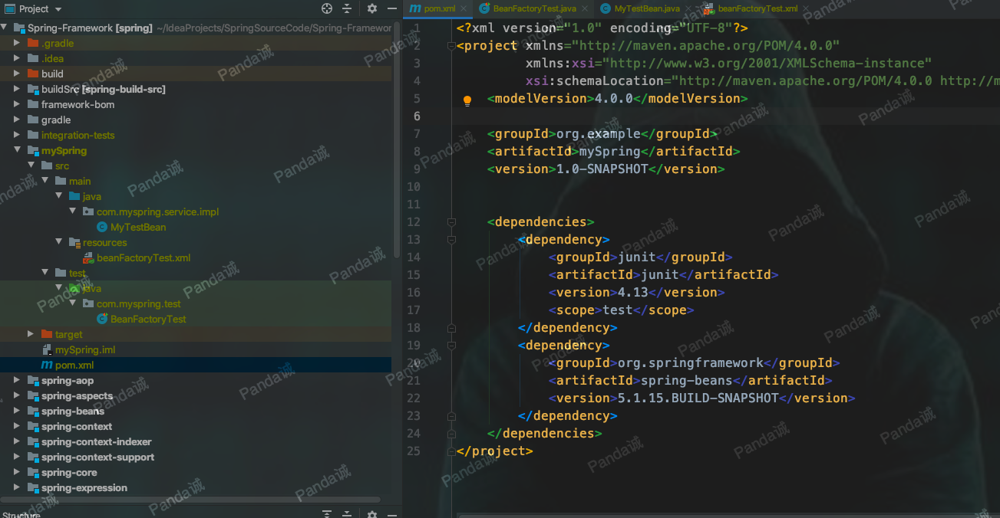
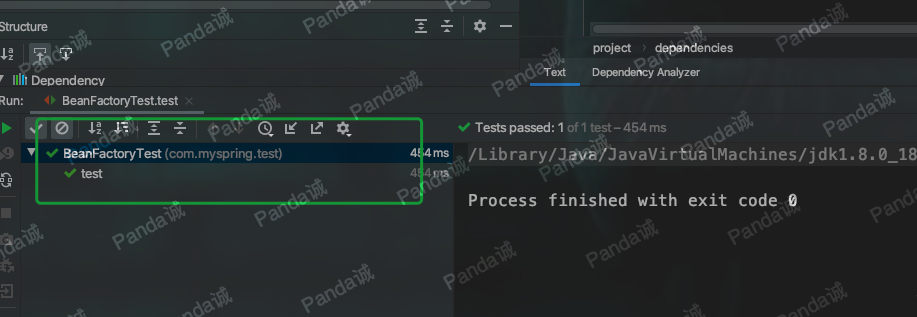
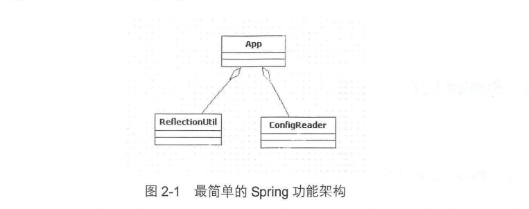
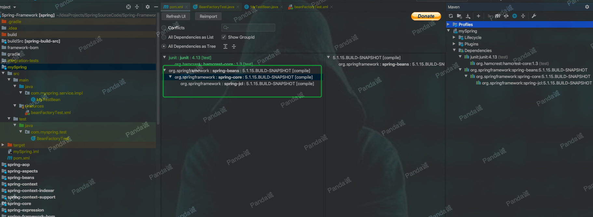
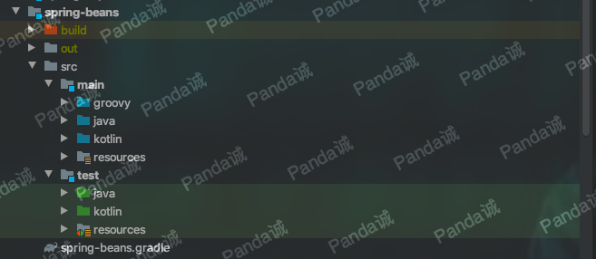
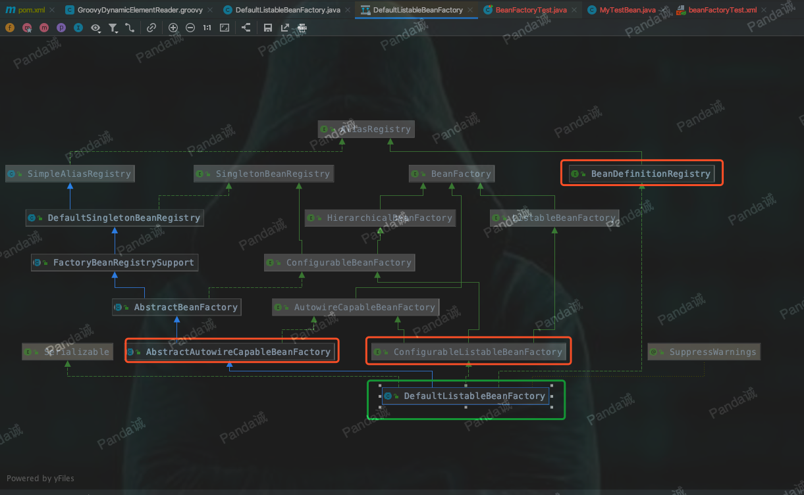
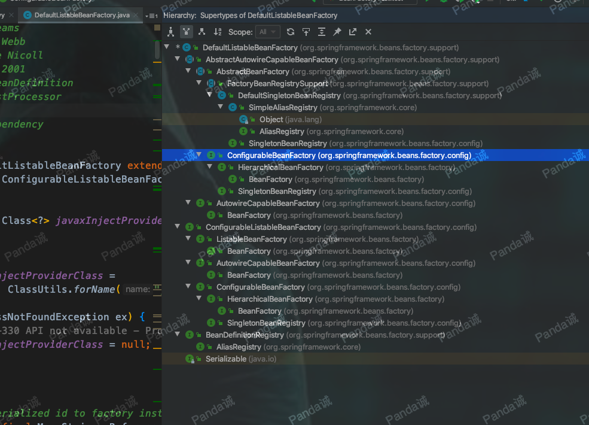
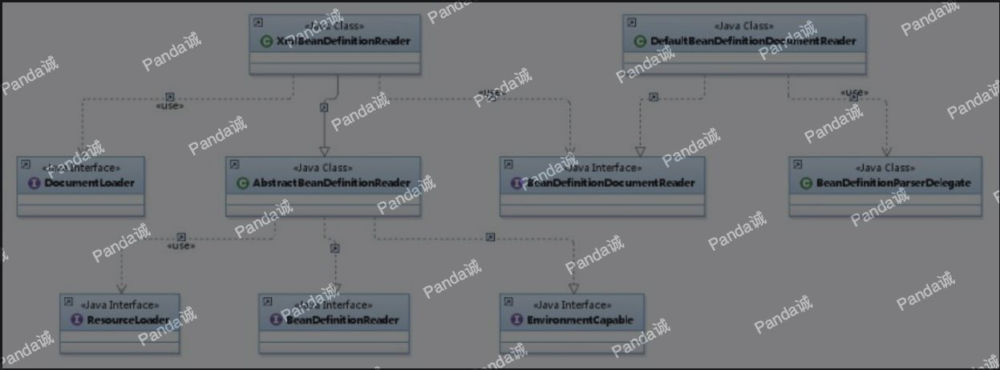

如何安装Gradle、下载Spring源码，构建源码等等就不记录的。用惯了Maven，用Gradle编译确实一开始有些懵，但其实IDEA的强大使这些都变得非常简单了。

## 新建测试Spring项目



我编译的源码是5.1.15，并install到本地仓库

```xml
<?xml version="1.0" encoding="UTF-8"?>
<project xmlns="http://maven.apache.org/POM/4.0.0"
		 xmlns:xsi="http://www.w3.org/2001/XMLSchema-instance"
		 xsi:schemaLocation="http://maven.apache.org/POM/4.0.0 http://maven.apache.org/xsd/maven-4.0.0.xsd">
	<modelVersion>4.0.0</modelVersion>

	<groupId>org.example</groupId>
	<artifactId>mySpring</artifactId>
	<version>1.0-SNAPSHOT</version>
	<dependencies>
		<dependency>
			<groupId>junit</groupId>
			<artifactId>junit</artifactId>
			<version>4.13</version>
			<scope>test</scope>
		</dependency>
		<dependency>
			<groupId>org.springframework</groupId>
			<artifactId>spring-beans</artifactId>
			<version>5.1.15.BUILD-SNAPSHOT</version>
		</dependency>
	</dependencies>
</project>
```
新建一个bean
```java
package com.myspring.service.impl;

public class MyTestBean {

	public String testStr = "testStr";
	public String getTestStr() {
		return testStr;
	}
	public void setTestStr(String testStr) {
		this.testStr = testStr;
	}
}

```
这么看来bean并没有任何特之处，的确，Spring目的就是让我们的bean能成为纯粹的 POJO ，这也是spring所追求的.接下来看看配置文件beanFactoryTest.xml：
```xml
<?xml version="1.0" encoding="UTF-8"?>
<beans xmlns="http://www.springframework.org/schema/beans"
       xmlns:xsi="http://www.w3.org/2001/XMLSchema-instance"
       xsi:schemaLocation="http://www.springframework.org/schema/beans http://www.springframework.org/schema/beans/spring-beans.xsd">

	<bean id="myTestBean" class="com.myspring.service.impl.MyTestBean"></bean>
</beans>
```
新建一个测试类，点击运行
```java
package com.myspring.test;

import com.myspring.service.impl.MyTestBean;
import org.junit.Assert;
import org.junit.Test;
import org.springframework.beans.factory.BeanFactory;
import org.springframework.beans.factory.xml.XmlBeanFactory;
import org.springframework.core.io.ClassPathResource;

public class BeanFactoryTest {

	@Test
	public void test() {
		BeanFactory bf = new XmlBeanFactory(new ClassPathResource("beanFactoryTest.xml"));
		MyTestBean myTestBean = (MyTestBean)bf.getBean("myTestBean");
		Assert.assertEquals("testStr",myTestBean.getTestStr());
	}

}

```



直接使用BeanFactory作为容器对于Spring的使用来说并不多见，甚至是甚少使用，因为在企业级的应用中大多数都会使用的是ApplicationContext。

## 功能分析

现在我们可以来好好分析一下上面测试代码的功能，来探索上面的测试代码中Spring究竟帮助我们完成了什么工作？不管之前你是否使用过 Spring ，当然，你应该使用过的，毕你都应该能猜出来，这段测试代码完成的功能无非就是以下几点

- 读取配置文件 beanFactoryTest.xml
- 根据 beanFactoryTest.xml 中的配置找到对应的类的配置，并实例化
- 调用实例化后的实例

如果想完成我们预想的功能，至少需要3个类

- ConfigReader ：用于读取及验证配置文件，我们要用配置文件里面的东西，当然首先要做的就是读取，然后放置在内存中
- ReflectionUtil ：用于根据配置文件中的配置进行反射实例化，比如在上例中beanFactoryTest.xml出现的 `<bean id="myTestBean" class="com.myspring.service.impl.MyTestBean"></bean>`，我们就可以根据MyTestBean进行实例化
- App ：用于完成整个逻辑的串联



## beans 包的层级结构及核心类介绍

上面的测试项目我们只引入了`spring-beans`(当然spring-core是必需的)



我们先看看整个beans工程的源码结构



- src/main/java 用于展现Spring的主要逻辑
- src/main/resources 用于存放系统的配置文件
- src/test/java用于对主要逻辑进行单元测试
- src/test/resources用于存放测试用的配直文件

### DefaultListableBeanFactory

XmlBeanFactory继承自DefaultListableBeanFactory，而DefaultListableBeanFactory是整个bean加载的核心部分，是Spring注册及加载bean的默认实现，而对于 XmlBeanFactory与DefaultListableBeanFactory不同的地方其实是在XmlBeanFactory中使用了自定义的XML读取器XmlBeanDefinitionReader，实现了个性化的BeanDefinitionReader读取，DefaultListableBeanFacto1y继承了AbstractAutowireCapableBeanFactory并实现了ConfigurableListableBeanFacto以及BeanDefinitionRegistry接口。





让我们先简单地了解上面类图中各个类的作用

- AliasRegistry:定义对alias的简单增删改等操作
- SimpleAiasRegistry:主要使用map作为alias的缓存，并对接口AliasRegistry进行实现
- SingletonBeanRegistry ：定义对单例的注册及获取
- BeanFactory ：定义获取bean及bean的各种属性
- DefaultSingletonBeanRegistry：对接口SingletonBeanRegistry各函数的实现
- HierarchicalBeanFactory ：继承BeanFactory,也就是在BeanFactory定义的功能的基础上增加了对parentFactory支持
- BeanDefinitionRegistry：定义对BeanDefinition的各种增删改操作
- FactoryBeanRegistrySupport ：在DefaultSingletonBeanRegist基础上增加了对FactoryBean的特殊处理功能
- ConfigurableBeanFactory ：提供配直Factory的各种方法
- ListableBeanFactory ：根据各种条件获取bean的配置清单
- AbstractBeanFactory ：综合FactoryBeanRegistrySupport和ConfigurableBeanFactory功能
- AutowireCapableBeanFactory ：提供创建bean、自动注入、初始化以及应用bean的后处理器
- AbstractAutowireCapableBeanFactory ：综合AbstractBeanFacto1y并对接口AutowireCapableBeanFactory进行实现
- ConfigurableListableBeanFactory : Beanfactory配置清单，指定忽略类型及接口等
- DefaultListableBeanFactory：综合上面所有功能，主要是对bean注册后的处理

### XmlBeanDefinitionReader

XML 置文件的读取是spring重要的功能 ，因为Spring的大部分功能都是以配置作为切入点的，那么我们可以从 XmlBeanDefinitionReader中梳理一下资源文件读取、解析及注册的
大致脉络，首先我们看看各个类的功能



- ResourceLoader ：定义资源加载器，主妥应用于根据给定的资源文件地址返回对应的Resource
- BeanDefinitionReader ：主要定义资源文件读取并转换为BeanDefinition的各个功能
- EnvironmentCapable ：定义获取Environment方法
- DocumentLoader ：定义从资源、文件加载到转换为Document的功能
- AbstractBeanDefinitionReader ：对EnvironmentCapable和BeanDefinitionReader类定义的功能进行实现
- BeanDefinitionDocumentReader ：定义读取Docuemnt并注册BeanDefinition功能
- BeanDefinitionParserDelegate ：定义解析Element的各种方法

经过以上分析，我们可以梳理出整个XML配置文件读取的大致流程，如图所示，在XmlBeanDifinitionReader中主要包含以下几步的处理

1. 通过继承AbstractBeanDefinitionReader中的方法，来使用ResoureLoader将资源文件路径转换为对应的Resource文件。
2. 通过DocumentLoader对Resource文件进行转换，将Resource文件转换为Document文件 
3. 通过实现接口BeanDefinitionDocumentReader的DefaultBeanDefinitionDocumentReader类对Document进行解析，并使用 BeanDefinitionParserDelegate对Element进行解析

## 公众号

关注公众号 得到第一手文章/文档更新推送。

