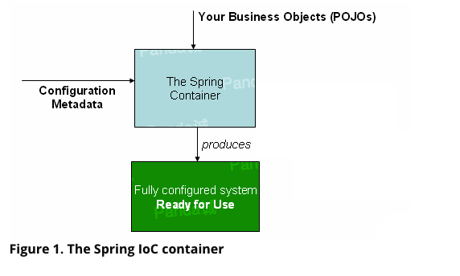
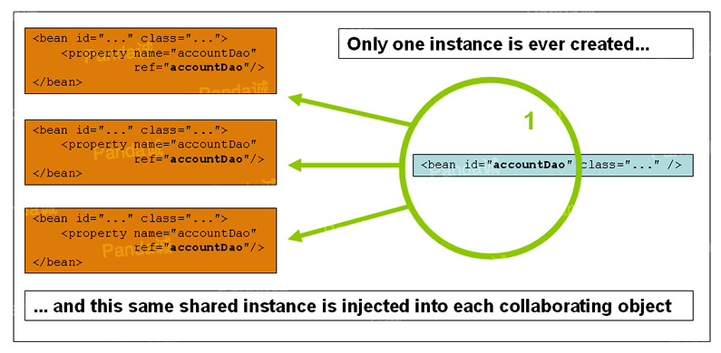
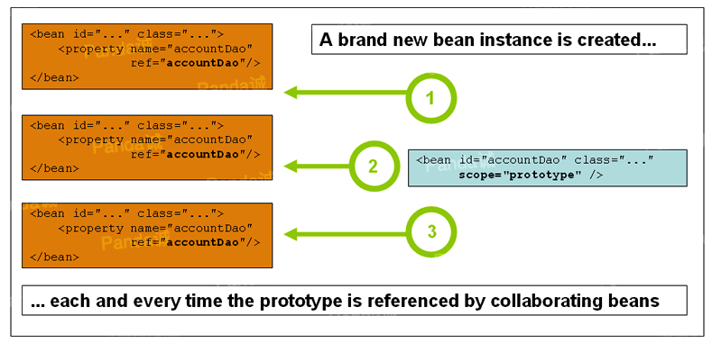

>Version 5.2.7.RELEASE

参考文档的这一部分涵盖了Spring框架绝对必要的所有技术。

其中最重要的是Spring框架的控制反转(IoC  Inversion of Control )容器。对Spring框架的IoC容器进行彻底的介绍之后,将全面介绍Spring的面向切面的编程(AOP Aspect-Oriented Programming )技术。 Spring框架具有自己的AOP框架,该框架在概念上易于理解,并且成功解决了Java企业编程中AOP要求的80％的难题。

还提供了Spring与AspectJ的集成。

## 一、IoC容器

### 1.1介绍Spring IoC容器和Beans

本章介绍了`控制反转(IoC)`原理的Spring框架实现。 `IoC也称为依赖注入(DI)`。在此过程中,对象仅通过`构造函数参数`,`工厂方法的参数`,在`构造`或从`工厂方法返回后在对象实例`上设置的属性来`定义其依赖项`(即,与它们一起使用的其他对象)。然后,容器在创建bean时注入那些依赖项。这个过程基本上是反向的,因此命名为控制反转(IoC),它通过直接使用构造类来控制实例化,或者定义它们之间的依赖关系,或者类似于服务定位模式的一种机制。

`org.springframework.beans`和`org.springframework.context`是Spring框架中IoC容器的基础,`BeanFactory`接口提供一种高级的配置机制能够管理任何类型的对象。`ApplicationContext`是`BeanFactory`的子接口。

`ApplicationContext`增加了:

- 更容易集成Spring的AOP功能
- 消息资源处理(用于国际化)
- 事件发布
- 特定的上下文应用层比如在网站应用中的`WebApplicationContext`。

简而言之,`BeanFactory`提供了配置框架和基本方法,ApplicationContext添加更多的企业特定的功能。ApplicationContext是BeanFactory的一个子接口,在本章它被专门用于Spring的IoC容器描述。更多关于使用BeanFactory替代ApplicationContext的信息请参考[The BeanFactory](#_1-16-the-beanfactory)

在Spring中,构成应用程序主干并由`Spring IoC`容器管理的对象称为`beans`。 bean是由`Spring IoC`容器实例化,组装和以其他方式管理的对象。此外bean只是你应用中许多对象中的一个。 Beans以及他们之间的依赖关系是通过容器`配置元数据`反映出来的。

### 1.2. 容器概述

`org.springframework.context.ApplicationContext`接口代表了`Spring IoC`容器,它负责实例化,配置和组装Bean。容器通过读取`配置元数据`获取对象的实例化、配置和组装的描述信息。 `配置元数据`以XML,Java注解或Java代码方式表示。它使你能表示出组成你应用的对象以及这些对象之间丰富的内部依赖关系。

Spring提供几个开箱即用的`ApplicationContext`接口的实现类。在独立应用程序中通常创建一个[`ClassPathXmlApplicationContext`](https://docs.spring.io/spring-framework/docs/5.2.7.RELEASE/javadoc-api/org/springframework/context/support/ClassPathXmlApplicationContext.html)或[`FileSystemXmlApplicationContext`](https://docs.spring.io/spring-framework/docs/5.2.7.RELEASE/javadoc-api/org/springframework/context/support/FileSystemXmlApplicationContext.html)实例对象。虽然XML是用于定义`配置元数据`的传统格式,但是你可以通过提供少量XML配置来声明性地启用对其他元数据格式的支持,从而指示容器使用`Java注解`或`代码`作为元数据格式。

在大多数的应用程序中,并不需要用显式的代码去实例化一个或多个的Spring IoC 容器实例。比如在web应用场景中,在`web.xml`中简单的8行(或多点)样板式的xml配置文件就可以搞定(参见[ApplicationContext在WEB应用中的实例化](#_1-15-4-applicationcontext在web应用中的实例化))。如果你正在使用Eclipse开发环境中的[Spring Tool Suite](https://spring.io/tools/sts)插件,你只需要鼠标点点或者键盘敲敲就能轻松搞定这几行配置。

下图显示了Spring的工作原理。你的应用程序中的`类`与`配置元数据`结合在一起,以便在创建和初始化`ApplicationContext`之后,你将拥有一个完全配置且可执行的系统或应用程序。


#### 1.2.1. 配置元数据

如上图所示,Spring IoC容器使用一种形式的`配置元数据`。此`配置元数据`表示作为应用程序开发人员的你应如何告诉Spring容器去**实例化**,**配置**和**组装**应用程序中的对象。

`配置元数据`传统上以简单直观的`XML`格式提供,本章大部分都使用这种格式来表达Spring IoC容器的核心概念和特性。

>基于XML的元数据并不是允许`配置元数据`的唯一形式,`Spring IoC`容器与实际写入配置元数据的格式是分离(解耦)的。如今,许多开发人员为他们的Spring应用程序选择[基于Java的配置](#_1-12-基于Java的容器配置)。

更多关于Spring容器使用其他形式的元数据配置的信息,请查看:

* [基于注解的容器配置](#_1.9-基于注解的容器配置): Spring 2.5引入了对基于 注解的配置元数据的支持。
* [基于Java的配置](#_1-12-基于Java的容器配置)。:从Spring 3.0开始,Spring JavaConfig项目提供的许多功能都已成为Spring Framework核心的一部分。 因此,你可以使用Java而不是XML文件来定义应用程序类外部的bean。 使用这些新功能,可以查看[`@Configuration`](https://docs.spring.io/spring-framework/docs/current/javadoc-api/org/springframework/context/annotation/Configuration.html),[`@Bean`](https://docs.spring.io/spring-framework/docs/current/javadoc-api/org/springframework/context/annotation/Bean.html),[`@Import`](https://docs.spring.io/spring-framework/docs/current/javadoc-api/org/springframework/context/annotation/Import.html),和[`@DependsOn`](https://docs.spring.io/spring-framework/docs/current/javadoc-api/org/springframework/context/annotation/DependsOn.html) 这些注解。

Spring配置由必须是容器管理的一个或通常多个定义好的bean组成。基于XML配置的元数据中,这些bean通过标签定义在顶级标签`<beans/>`内部。在Java配置中通常在使用`@Configuration`注解的类中使用`@Bean`注解的方法。

这些bean的定义所对应的实际对象就组成了你的应用。通常你会定义服务层对象,数据访问层对象(DAO),展现层对象比如Struts的Action实例,底层对象比如Hibernate的SessionFactories,JMSQueues等等。通常在容器中不定义细粒度的域对象,因为一般是由DAO层或者业务逻辑处理层负责创建和加载这些域对象。但是,你可以使用Spring集成Aspectj来配置IoC容器管理之外所创建的对象。[使用AspectJ通过Spring依赖注入域对象](_5-10-1-使用AspectJ通过Spring依赖注入域对象)

接下来这个例子展示了基于XML配置元数据的基本结构:
```xml
<?xml version="1.0" encoding="UTF-8"?>
<beans xmlns="http://www.springframework.org/schema/beans"
    xmlns:xsi="http://www.w3.org/2001/XMLSchema-instance"
    xsi:schemaLocation="http://www.springframework.org/schema/beans
        https://www.springframework.org/schema/beans/spring-beans.xsd">

    <bean id="..." class="...">  
         <!-- 在这里写 bean 的配置和相关引用 -->
    </bean>

    <bean id="..." class="...">
         <!-- 在这里写 bean 的配置和相关引用 -->
    </bean>

    <!-- more bean definitions go here -->

</beans>
```
- id属性用来使用标识每个独立的bean定义的字符串。
- class属性定义了bean的类型,这个类型必须使用`全路径类名`(必须是包路径+类名)。

id属性值是可以被依赖对象引用(该例中没有体现XML引用其他依赖对象)。

#### 1.2.2. 实例化容器

`ApplicationContext`构造函数可接受一个或多个字符串类型的位置路径,这允许容器从各种外部资源(例如本地文件系统,Java CLASSPATH等)加载`配置元数据`。
```java
ApplicationContext context = new ClassPathXmlApplicationContext("services.xml", "daos.xml");
```
>了解了`Spring IoC`容器后,你可能想了解更多有关Spring`Resource`抽象的知识 ([Resources](#_2-resources)), 它提供了一种方便的机制,用于从URI语法中定义的位置读取InputStream,特别是,`Resource`路径用于构造应用程序上下文,像[应用程序上下文和资源路径](_2-7-应用程序上下文和资源路径)描述的一样.

以下示例显示了服务层对象(`services.xml`)配置文件:
```xml
<?xml version="1.0" encoding="UTF-8"?>
<beans xmlns="http://www.springframework.org/schema/beans"
    xmlns:xsi="http://www.w3.org/2001/XMLSchema-instance"
    xsi:schemaLocation="http://www.springframework.org/schema/beans
        https://www.springframework.org/schema/beans/spring-beans.xsd">

    <!-- services -->

    <bean id="petStore" class="org.springframework.samples.jpetstore.services.PetStoreServiceImpl">
        <property name="accountDao" ref="accountDao"/>
        <property name="itemDao" ref="itemDao"/>
        <!-- additional collaborators and configuration for this bean go here -->
    </bean>

    <!-- more bean definitions for services go here -->

</beans>
```
以下示例显示了数据访问对象`daos.xml`文件:

```xml
<?xml version="1.0" encoding="UTF-8"?>
<beans xmlns="http://www.springframework.org/schema/beans"
    xmlns:xsi="http://www.w3.org/2001/XMLSchema-instance"
    xsi:schemaLocation="http://www.springframework.org/schema/beans
        https://www.springframework.org/schema/beans/spring-beans.xsd">

    <bean id="accountDao"
        class="org.springframework.samples.jpetstore.dao.jpa.JpaAccountDao">
        <!-- additional collaborators and configuration for this bean go here -->
    </bean>

    <bean id="itemDao" class="org.springframework.samples.jpetstore.dao.jpa.JpaItemDao">
        <!-- additional collaborators and configuration for this bean go here -->
    </bean>

    <!-- more bean definitions for data access objects go here -->

</beans>
```

在前面的示例中,服务层由`PetStoreServiceImpl`对象和两个`JpaAccountDao`和`JpaItemDao`的数据访问对象(DAO)组成(基于 JPA Object-Relational Mapping 标准)。 `property name`元素引用 `JavaBean property` 的 `name`,`ref`元素引用另一个 `bean` 定义的 `name`。 id和ref元素之间的这种联系表达了objects之间的依赖关系。有关配置object依赖项的详细信息,请参阅[依赖](#_1-4-依赖关系)。

在前面的示例中,服务层由PetStoreServiceImpl类和两个JpaAccountDao和JpaItemDao类型的数据访问对象组成(基于JPA对象关系映射标准)。 `property name`元素引用JavaBean属性的名称,而`ref`元素引用另一个bean定义的名称。 id和`ref`元素之间的这种联系表达了协作对象之间的依赖性。 有关配置对象依赖性的详细信息,请参见 [Dependencies](#_1-4-依赖关系).

##### 组成基于XML的配置元数据

使bean定义跨越多个XML文件可能很有用。通常,每个单独的XML配置文件都代表体系结构中的逻辑层或模块。

你可以使用应用程序上下文构造函数从所有这些XML片段中加载bean定义。如[上一节](#_1-2-2-实例化容器)中所示,此构造函数具有多个Resource位置。或者,使用一个或多个`<import/>`元素从另一个文件中加载bean定义。以下示例显示了如何执行此操作:

```xml
<beans>
    <import resource="services.xml"/>
    <import resource="resources/messageSource.xml"/>
    <import resource="/resources/themeSource.xml"/>

    <bean id="bean1" class="..."/>
    <bean id="bean2" class="..."/>
</beans>
```

在前面的示例中,外部bean定义是从以下三个文件加载的:`services.xml`,`messageSource.xml`和`themeSource.xml`。 所有位置路径都相对于进行导入的定义文件,因此,`services.xml`必须与进行导入的文件位于同一目录或类路径位置,而`messageSource.xml`和`themeSource.xml`必须位于该位置下方的`resources`位置导入文件。 如你所见,`斜杠会被忽略`。但是,鉴于这些路径是相对的,最好不要使用斜线。根据Spring Schema,导入的文件的内容(包括顶级`<beans/>`元素)必须是有效的XML bean定义。

>可以但不建议使用相对的`../`路径引用父目录中的文件。这样做会创建对当前应用程序外部文件的依赖。 特别是,不建议对`classpath:`URLs(例如,`classpath:../services.xml`)使用此引用,在URL中,运行时解析过程会选择最近的类路径根,然后查看其父目录。类路径配置的更改可能导致选择其他错误的目录。
>你始终可以使用完全限定的资源位置来代替相对路径:例如,`file:C:/config/services.xml`或`classpath:/config/services.xml`。但是,请注意,这样的话就会把应用程序的配置耦合到特定的绝对位置。 通常,最好为这样的绝对位置保留一个间接寻址,例如通过使用在运行时针对JVM系统属性解析的"${…}"占位符。

命名空间本身提供了导入指令功能。 Spring所提供的一系列XML名称空间(例如,`context`和`util`名称空间)中提供了超出普通bean定义的其他配置功能。

##### Groovy Bean定义DSL

从Grails框架中可以知道,作为外部化配置元数据的另一个示例,Bean定义也可以在Spring的Groovy Bean定义DSL中表达。 通常,这种配置位于`.groovy`文件中,其结构如以下示例所示:

```groovy
beans {
    dataSource(BasicDataSource) {
        driverClassName = "org.hsqldb.jdbcDriver"
        url = "jdbc:hsqldb:mem:grailsDB"
        username = "sa"
        password = ""
        settings = [mynew:"setting"]
    }
    sessionFactory(SessionFactory) {
        dataSource = dataSource
    }
    myService(MyService) {
        nestedBean = { AnotherBean bean ->
            dataSource = dataSource
        }
    }
}
```

这种配置样式在很大程度上等同于XML Bean定义,甚至支持Spring的XML配置名称空间。它还允许通过importBeans指令导入XML bean定义文件。

#### 1.2.3. 使用容器

`ApplicationContext`是高级工厂的接口,该工厂能够维护不同bean及其依赖关系的注册表。通过使用方法`T getBean(String name, Class<T> requiredType)`,可以检索bean的实例。

通过`ApplicationContext`,你可以读取Bean定义并访问它们,如以下示例所示:

```java
// create and configure beans
ApplicationContext context = new ClassPathXmlApplicationContext("services.xml", "daos.xml");

// retrieve configured instance
PetStoreService service = context.getBean("petStore", PetStoreService.class);

// use configured instance
List<String> userList = service.getUsernameList();
```

使用Groovy配置,引导看起来非常相似。它有一个不同的上下文实现类,该类可以识别Groovy(但也可以理解XML bean定义)。以下示例显示了Groovy配置:

```java
ApplicationContext context = new GenericGroovyApplicationContext("services.groovy", "daos.groovy");
```

最灵活的变体是`GenericApplicationContext`与`reader`结合在一起,例如,与XML文件的`XmlBeanDefinitionReader`结合使用,如以下示例所示:

```java
GenericApplicationContext context = new GenericApplicationContext();
new XmlBeanDefinitionReader(context).loadBeanDefinitions("services.xml", "daos.xml");
context.refresh();
```

你还可以将`GroovyBeanDefinitionReader`用于Groovy文件,如以下示例所示:
```java
GenericApplicationContext context = new GenericApplicationContext();
new GroovyBeanDefinitionReader(context).loadBeanDefinitions("services.groovy", "daos.groovy");
context.refresh();
```

你可以在同一`ApplicationContext`上混合使用不同的`reader`,从不同的配置源读取Bean定义。

然后,你可以使用`getBean`检索bean的实例。 `ApplicationContext`接口还有其他几种检索bean的方法,但是理想情况下,你的应用程序代码应该永远不要使用它们。 确实,你的应用程序代码应该根本不调用`getBean`方法,这样完全不依赖于Spring API。 例如,Spring与Web框架的集成为各种Web框架组件(例如控制器和JSF管理的Bean)提供了依赖项注入,使你可以通过元数据(例如自动装配 注解)声明对特定Bean的依赖项。

### 1.3. Bean总览

`Spring IoC`容器管理一个或多个bean,这些bean是使用你提供给容器的配置元数据创建的(例如,以XML`<bean/>`定义的形式)。

在容器本身内,这些bean定义表示为`BeanDefinition`对象,其中包含(除其他信息外)以下元数据:

- 包限定的类名:通常,定义了Bean的实际实现类。
- Bean行为配置元素,用于声明Bean在容器中的行为(作用域,生命周期回调等)。
- 对其他bean的引用,这些引用也称为协作者或依赖项。
- 要在新创建的对象中设置的其他配置设置,例如,池的大小限制或在管理连接池的bean中使用的连接数。

此元数据转换为构成每个bean定义的一组properties,以下表描述了这些properties:

属性                       | 参考             
------------------------ | ----------------------
Class                    | [实例化Beans](#_1-3-2-实例化beans)            
Name                     | [命名Beans](#_1-3-1-命名beans)              
Scope                    | [Bean的作用域](#_1-5-bean的作用)                 
Constructor arguments    | [依赖注入](#_1-4-1-依赖注入)                    
Properties               | [依赖注入](#_1-4-1-依赖注入)                    
Autowiring mode          | [自动装配依赖](#_1-4-5-自动装配依赖)                 
Lazy initialization mode | [延迟初始化Beans](#_1-4-4-延迟初始化Beans)   
Initialization method    | [初始化回调](#初始化回调)                    
Destruction method       | [析构回调](#析构回调)                     

除了包含有关如何创建特定Bean的信息的`bean definitions`之外,`ApplicationContext`的实现还允许注册在容器外部(由用户)创建的现有对象。 这是通过`getBeanFactory()`方法访问`ApplicationContext`的`BeanFactory`来完成的,该方法返回`BeanFactory`的`DefaultListableBeanFactory`实现。 `DefaultListableBeanFactory`通过`registerSingleton(..)`和`registerBeanDefinition(..)`方法支持此注册。 但是,典型的应用程序只能与通过常规bean定义元数据定义的bean一起使用。

>Bean元数据和手动提供的单例实例需要尽早注册,以使容器在自动装配和其他自省步骤中正确地推理它们。 虽然在某种程度上支持覆盖现有的元数据和现有的单例实例,但在运行时(与对工厂的实时访问同时)对新bean的注册未得到正式支持,并且可能导致并发访问异常,bean容器中的状态不一致。

#### 1.3.1. 命名Beans

每个bean具有一个或多个标识符。这些标识符在承载Bean的容器内必须是唯一的。一个bean通常只有一个标识符。但是,如果需要多个,则可以将多余的视为别名。

在基于XML的配置元数据中,你可以使用`id`属性和`name`属性,或同时使用两者来指定bean标识符。 `id`属性可让你精确指定一个id。通常,这些名称是字母数字("myBean","someService"等),但它们也可以包含特殊字符。 如果要为bean引入其他别名,也可以在`name`属性中指定它们,并用逗号(`,`)或分号(`;`)或空格分隔。 在Spring 3.1之前的版本中,`id`属性定义为`xsd:ID`类型,它限制了可能的字符。 从3.1开始,它被定义为`xsd:string`类型。 注意,bean`id`的唯一性尽管不再由XML解析器执行,但仍然由容器强制执行。

你不需要为bean提供一个`name`或`id`。如果你未明确提供`name`或`id`,则容器将为该bean生成一个唯一的名称。 但是,如果你想通过使用`ref`元素或`Service Locator`来按名称引用该bean,则必须提供一个名称。不提供name的情况可以参考[内部beans](#内部beans)和[自动装配依赖](#_1-4-5-自动装配依赖).

>**Bean命名约定**:约定是在命名bean时将标准Java约定用于实例字段名称。也就是说,bean名称以小写字母开头,并从那里开始使用驼峰式大小写。比如`accountManager`,`accountService`,`userDao`,`loginController`等。一致地命名Bean使你的​​配置更易于阅读和理解。另外,如果你使用`Spring AOP`,则在将建议应用于名称相关的一组bean时,它会很有帮助。

>通过在类路径中进行组件扫描,Spring会按照前面描述的规则为未命名的组件生成Bean名称:本质上,`采用简单的类名并将其初始字符转换为小写`。但是,在(不寻常的)特殊情况下,如果有多个字符并且第一个和第二个字符均为大写字母,则会保留原始大小写。 这些规则与`java.beans.Introspector.decapitalize`定义的规则相同。

##### 在Bean定义之外别名Bean

在bean定义本身中,可以通过使用`id`属性指定的一个名称和`name`属性指定任意数量的其他名称的组合来为bean提供多个名称。这些名称可以是同一个bean的等效别名,并且在某些情况下很有用,例如,通过使用特定于该组件本身的bean名称,让应用程序中的每个组件都引用一个公共依赖项。

但是,在实际定义bean的地方指定所有别名并不总是足够的。有时需要为在别处定义的bean引入别名。 在大型系统中通常会有这种情况,在大型系统中,每个子系统都有自己的配置,每个子系统都有自己的对象定义集。在基于XML的配置元数据中,可以使用`<alias/>`元素来完成此操作。以下示例显示了如何执行此操作:

```xml
<alias name="fromName" alias="toName"/>
```

在这种情况下,使用别名定义后,名为`fromName`的bean(在同一容器中)也可以称为`toName`。

例如,子系统A的配置元数据可以通过`subsystemA-dataSource`的名称引用数据源。子系统B的配置元数据可以通过`subsystemB-dataSource`的名称引用数据源。 组成使用这两个子系统的主应用程序时,主应用程序通过`myApp-dataSource`的名称引用数据源。 要使所有三个名称都引用同一个对象,可以将以下别名定义添加到配置元数据中:
```xml
<alias name="myApp-dataSource" alias="subsystemA-dataSource"/>
<alias name="myApp-dataSource" alias="subsystemB-dataSource"/>
```
现在,每个组件和主应用程序都可以通过唯一的名称引用数据源,并且可以保证不与任何其他定义冲突(有效地创建名称空间),但是它们引用的是同一bean。

>Java-configuration : 如果使用基于Java的配置,则`@Bean`注解可用于提供别名。请参考[使用@Bean注解](#_1-12-3-使用@bean注解)

#### 1.3.2. 实例化beans

从本质上来说,bean定义描述了如何创建一个或多个对象实例。当需要的时候,容器会从bean定义列表中取得一个指定的bean定义,并根据bean定义里面的配置元数据来创建(或取得)一个实际的对象。

当采用XML描述配置元数据时,将通过`<bean/>`元素的`class`属性来指定实例化对象的类型。`class`属性 (对应BeanDefinition实例的 `Class`属性)通常是必须的(不过也有两种例外的情形,请参见[用实例工厂方法实例化](#用实例工厂方法实例化)和[Bean定义的继承](#_1-7-Bean定义的继承)

class属性主要有两种用途 :

- 通常,在容器本身通过反射性地调用其构造函数直接创建Bean的情况下,指定要构造的Bean类,这在某种程度上等同于使用new运算符的Java代码。
- 在极少数情况下,容器将调用类的静态工厂方法来创建bean实例,class属性将用来指定实际具有静态工厂方法的类(至于调用静态工厂方法创建的对象类型是当前class还是其他的class则无关紧要)

>内部类<br/>
>如果需要你希望将一个静态的内部类配置为一个bean的话,那么内部类的名字需要采用二进制的写法。<br/>
>例如,如果你在`com.example`包中有一个名为`SomeThing`的类,并且此`SomeThing`类具有一个名为`OtherThing`的静态内部类,则bean上`class`属性的值定义为`com.example.SomeThing$OtherThing`。<br/>
>注意这里我们使用了`$`字符将内部类和外部类进行分隔

##### 用构造函数实例化

当采用构造器来创建bean实例时,Spring对class并没有特殊的要求, 我们通常使用的class都适用。也就是说,被创建的类并不需要实现任何特定的接口,或以特定的方式编码,只要指定bean的class属性即可。不过根据所采用的IoC类型,class可能需要一个默认的空构造器。

此外,IoC容器不仅限于管理JavaBean,它可以管理任意的类。不过大多数使用Spring的人喜欢使用实际的JavaBean(具有默认的(无参)构造器及setter和getter方法),但在容器中使用非bean形式(non-bean style)的类也是可以的。比如遗留系统中的连接池,很显然它与JavaBean规范不符,但Spring也能管理它。

当使用基于XML的元数据配置文件,可以这样来指定bean类:
```xml
<bean id="exampleBean" class="examples.ExampleBean"/>
<bean name="anotherExample" class="examples.ExampleBeanTwo"/>
```
给构造函数指定参数以及为bean实例设置属性将在随后的[依赖注入](#_1-4-1-依赖注入)中谈及。

##### 用静态工厂方法实例化

当采用静态工厂方法创建bean时,除了需要指定`class`属性外,还需要通过`factory-method`属性来指定创建bean实例的工厂方法。Spring将调用此方法(其可选参数接下来介绍)返回实例对象,就此而言,这跟通过普通构造器创建类实例没什么两样。

下面的bean定义展示了如何通过工厂方法来创建bean实例。注意,此定义并未指定返回对象的类型,仅指定该类包含的工厂方法。在此例中, `createInstance()`必须是一个static方法。
```xml
<bean id="clientService"
    class="examples.ClientService"
    factory-method="createInstance"/>
```
以下示例显示了可与前面的bean定义一起使用的类:
```java
public class ClientService {
    private static ClientService clientService = new ClientService();
    private ClientService() {}

    public static ClientService createInstance() {
        return clientService;
    }
}
```
##### 用实例工厂方法实例化

与[用静态工厂方法实例化](#用静态工厂方法实例化)类似,用来进行实例化的非静态实例工厂方法位于另外一个bean中,容器将调用该bean的工厂方法来创建一个新的bean实例。为使用此机制,`class`属性必须为空,而`factory-bean`属性必须指定为当前(或其祖先)容器中包含工厂方法的bean的名称,而该工厂bean的工厂方法本身必须通过`factory-method`属性来设定。
```xml
<!-- the factory bean, which contains a method called createInstance() -->
<bean id="serviceLocator" class="examples.DefaultServiceLocator">
    <!-- inject any dependencies required by this locator bean -->
</bean>

<!-- the bean to be created via the factory bean -->
<bean id="clientService"
    factory-bean="serviceLocator"
    factory-method="createClientServiceInstance"/>
```
```java
public class DefaultServiceLocator {

    private static ClientService clientService = new ClientServiceImpl();

    public ClientService createClientServiceInstance() {
        return clientService;
    }
}
```
一个工厂类也可以包含多个工厂方法,如以下示例所示:
```xml
<bean id="serviceLocator" class="examples.DefaultServiceLocator">
    <!-- inject any dependencies required by this locator bean -->
</bean>

<bean id="clientService"
    factory-bean="serviceLocator"
    factory-method="createClientServiceInstance"/>

<bean id="accountService"
    factory-bean="serviceLocator"
    factory-method="createAccountServiceInstance"/>
```

```java
public class DefaultServiceLocator {

    private static ClientService clientService = new ClientServiceImpl();

    private static AccountService accountService = new AccountServiceImpl();

    public ClientService createClientServiceInstance() {
        return clientService;
    }

    public AccountService createAccountServiceInstance() {
        return accountService;
    }
}
```

这种方法表明,工厂Bean本身可以通过依赖项注入(DI)进行管理和配置。请参见[依赖与配置的详细说明](#_1-4-2-依赖与配置的详细说明).

>在Spring文档中,"factory bean"是指在Spring容器中配置的,并通过[instance](#用实例工厂方法实例化)或[static](#用静态工厂方法实例化)工厂方法创建的bean。相比之下,`FactoryBean`(注意大小写)是指特定于Spring的[`FactoryBean`](#_1-8-3-使用FactoryBean自定义实例化逻辑)的实现类。

##### 确定Bean的运行时类型

确定特定bean的运行时类型并非易事。 Bean元数据定义中的指定类只是初始类引用,可能与声明的`工厂方法`结合使用,或者是`FactoryBean`类,这可能导致Bean的运行时类型不同,或者在实例工厂方法根本没有设置类型(通过指定的`factory-bean`名称解析)。 此外,AOP代理可以使用基于接口的代理包装bean实例,而目标Bean的实际类型(仅是其实现的接口)的暴露程度有限。

找出特定bean的实际运行时类型的推荐方法是对指定bean名称的`BeanFactory.getType`方法的调用。这考虑了以上所有情况,并返回了根据相同bean名称调用`BeanFactory.getBean`方法返回相同的对象的类型。

### 1.4. 依赖

典型的企业应用不会只由单一的对象(或Spring的术语bean)组成。毫无疑问,即使最简单的系统也需要多个对象共同来展示给用户一个整体的应用。接下来的的内容除了阐述如何单独定义一系列bean外,还将描述如何让这些bean对象一起协同工作来实现一个完整的真实应用。

#### 1.4.1. 依赖注入

`依赖注入(DI)`背后的基本原理是`对象之间的依赖关系`(即一起工作的其它对象)只会通过以下几种方式来实现:`构造器的参数`、`工厂方法的参数`,或给由`构造函数或者工厂方法创建的对象设置属性`。因此,`容器的工作就是创建bean时注入那些依赖关系`。相对于由bean自己来控制其实例化、直接在构造器中指定依赖关系或者类似服务定位器(Service Locator)模式这3种自主控制依赖关系注入的方法来说,`控制从根本上发生了倒转`,这也正是`控制反转(Inversion of Control, IoC)`名字的由来。

应用DI原则后,代码将更加清晰。而且当bean自己不再担心对象之间的依赖关系(甚至不知道依赖的定义指定地方和依赖的实际类)之后,实现更高层次的松耦合将易如反掌。DI主要有两种注入方式,即[基于构造函数的依赖注入](#基于构造函数的依赖注入)和 [基于Setter的依赖注入](#基于Setter的依赖注入).

##### 基于构造函数的依赖注入

基于构造器的DI通过调用带参数的构造器来实现,每个参数代表着一个依赖。此外,还可通过给static工厂方法传参数来构造bean。接下来的介绍将默认给构造器传参与给静态工厂方法传参的方法是类似的。下面展示了只使用构造器参数来注入依赖关系的例子。请注意,这个类并没有什么特别之处。

```java
public class SimpleMovieLister {

    // the SimpleMovieLister has a dependency on a MovieFinder
    private MovieFinder movieFinder;

    // a constructor so that the Spring container can inject a MovieFinder
    public SimpleMovieLister(MovieFinder movieFinder) {
        this.movieFinder = movieFinder;
    }

    // business logic that actually uses the injected MovieFinder is omitted...
}
```

###### 构造函数参数解析

构造器参数解析根据参数类型进行匹配,如果bean的构造器参数类型定义非常明确,那么在bean被实例化的时候,bean定义中构造器参数的定义顺序就是这些参数的顺序,依次进行匹配,比如下面的代码
```java
package x.y;

public class ThingOne {

    public ThingOne(ThingTwo thingTwo, ThingThree thingThree) {
        // ...
    }
}
```
假设`ThingTwo`和`ThingThree`类没有继承关系,则不存在潜在的歧义。因此,以下配置可以正常工作,并且你无需在`<constructor-arg/>`元素中显式指定构造函数参数索引或类型。
```xml
<beans>
    <bean id="beanOne" class="x.y.ThingOne">
        <constructor-arg ref="beanTwo"/>
        <constructor-arg ref="beanThree"/>
    </bean>

    <bean id="beanTwo" class="x.y.ThingTwo"/>

    <bean id="beanThree" class="x.y.ThingThree"/>
</beans>
```
我们再来看另一个bean,该bean的构造参数类型已知,匹配也没有问题(跟前面的例子一样)。但是当使用简单类型时,比如`<value>true<value>`,Spring将无法知道该值的类型。不借助其他帮助,他将无法仅仅根据参数类型进行匹配,比如下面的这个例子:
```java
package examples;

public class ExampleBean {

    // Number of years to calculate the Ultimate Answer
    private int years;

    // The Answer to Life, the Universe, and Everything
    private String ultimateAnswer;

    public ExampleBean(int years, String ultimateAnswer) {
        this.years = years;
        this.ultimateAnswer = ultimateAnswer;
    }
}
```
###### 构造函数参数类型匹配

针对上面的场景可以通过使用`type`属性来显式指定那些简单类型的构造参数的类型,比如:
```xml
<bean id="exampleBean" class="examples.ExampleBean">
  <constructor-arg type="int" value="7500000"/>
  <constructor-arg type="java.lang.String" value="42"/>
</bean>
```

###### 构造函数参数索引

我们还可以通过`index`属性来显式指定构造参数的索引,比如下面的例子:
```xml
<bean id="exampleBean" class="examples.ExampleBean">
  <constructor-arg index="0" value="7500000"/>
  <constructor-arg index="1" value="42"/>
</bean>
```
>通过使用索引属性不但可以解决多个简单属性的混淆问题,还可以解决有可能有相同类型的2个构造参数的混淆问题了,注意index是从0开始。

###### 构造函数参数名称

你还可以使用构造函数参数名称来消除歧义,比如下面的例子:
```xml
<bean id="exampleBean" class="examples.ExampleBean">
    <constructor-arg name="years" value="7500000"/>
    <constructor-arg name="ultimateAnswer" value="42"/>
</bean>
```
请记住,要使此工作立即可用,必须在启用调试标志的情况下编译代码,以便Spring可以从构造函数中查找参数名称。 如果你不能或不希望使用debug标志编译代码,则可以使用`@ConstructorProperties`JDK注解显式命名构造函数参数。示例代码如下所示:
```java
package examples;

public class ExampleBean {

    // Fields omitted

    @ConstructorProperties({"years", "ultimateAnswer"})
    public ExampleBean(int years, String ultimateAnswer) {
        this.years = years;
        this.ultimateAnswer = ultimateAnswer;
    }
}
```

##### 基于Setter的依赖注入

通过调用无参构造器或无参static工厂方法实例化bean之后,调用该bean的setter方法,即可实现基于setter的DI。下面的例子将展示使用setter注入依赖。注意,这个类并没有什么特别之处,它就是普通的Java类。

```java
public class SimpleMovieLister {

    // the SimpleMovieLister has a dependency on the MovieFinder
    private MovieFinder movieFinder;

    // a setter method so that the Spring container can inject a MovieFinder
    public void setMovieFinder(MovieFinder movieFinder) {
        this.movieFinder = movieFinder;
    }

    // business logic that actually uses the injected MovieFinder is omitted...
}
```
`ApplicationContext`对于它所管理的bean提供两种注入依赖方式(实际上它也支持同时使用构造器注入和Setter方式注入依赖)。需要注入的依赖将保存在`BeanDefinition`中,它能根据指定的`PropertyEditor实现`将属性从一种格式转换成另外一种格式。但是,大多数Spring用户并不直接(即以编程方式)使用这些类,而是使用XML的方式定义bean定义,或使用带注解的组件(即以`@Component`,`@Controller`等进行注解的类)或在被`@Configuration`注解标注的类中的方法上使用`@Bean`。然后将这些信息在内部转换为`BeanDefinition`实例,并用于加载整个`Spring IoC`容器实例。

>使用构造函数还是使用setter方法进行依赖注入?<br/>
>因为可以混合使用基于构造函数的DI和基于setter的DI,所以将构造函数用于必需的依赖项并将setter方法或配置方法用于可选依赖项是最好的方案。请注意,可以在setter方法上使用[@Required](#_1-9-1-@required)注解,使该属性成为必需的依赖项。但是,必需的依赖项最好还使用带有参数的程序验证的构造函数注入。<br/>
>Spring团队通常`提倡构造函数注入`,因为它使你可以将应用程序组件最后实现为不可变的对象,并确保所需的依赖项不为null。此外,注入构造函数的组件始终以完全初始化的状态返回给客户端(调用)代码。附带说明一下,太多的构造函数参数说明代码设计的可能不是很好,这表明该类可能承担了太多的职责,应进行重构以更好地解决关注点并分离问题。<br/>
>Setter注入主要应用于可以在类中分配合理的默认值的可选依赖项。否则,必须在代码使用依赖项的任何地方执行非空检查。setter注入的一个好处是,setter方法可使该类的对象在以后重新配置或重新注入。通过[JMX MBean](https://docs.spring.io/spring/docs/5.2.7.RELEASE/spring-framework-reference/integration.html#jmx)进行管理bean就是用于setter注入的最好的例子。<br/>
>对于注入类型的选择并没硬性的规定。只要能适合你的应用,无论使用何种类型的DI都可以。对于那些没有源代码的第三方类,或者没有提供setter方法的遗留代码,我们则别无选择－－构造器注入将是你唯一的选择。

##### 依赖性解析过程

处理bean依赖关系通常按以下步骤进行:

- 使用描述bean的`配置元数据`创建和初始化`ApplicationContext`(可以通过XML,Java代码或注解指定配置元数据)。
- 对于每个bean,其依赖项都以属性,构造函数参数或静态工厂方法的参数的形式表示。在实际创建Bean时,会将这些依赖项提供给Bean。
- 每个属性或构造器参数既可以是一个实际的值,也可以是对该容器中另一个bean的引用。
- 每个指定的属性或构造器参数值必须能够被转换成特定的格式或构造参数所需的类型。默认情况下,Spring会以String类型提供值转换成各种内置类型,比如int、long、String、boolean等。

Spring会在容器被创建时验证容器中每个bean的配置,包括验证那些bean所引用的属性是否指向一个有效的bean(即被引用的bean也在容器中被定义)。然而,`在bean被实际创建之前,bean的属性并不会被设置`。对于那些单例的类型和被设置为提前实例化的bean(比如`ApplicationContext中`的`singleton bean`)而言,bean实例将与容器同时被创建。而另外一些bean则会在需要的时候被创建,伴随着bean被实际创建,作为该bean的依赖bean以及依赖bean的依赖bean(依此类推)也将被创建和分配。

>循环依赖<br/>
>如果主要采用构造器注入的方式配置bean,很有可能会产生循环依赖的情况。<br/>
>比如说,一个类A,需要通过构造器注入类B,而类B又需要通过构造器注入类A。如果为类A和B配置的bean被互相注入的话,那么Spring IoC容器将检测出循环引用,并抛出 `BeanCurrentlyInCreationException`异常。<br/>
>对于此问题,一个解决方法就是修改源代码,`将某些构造器注入改为setter注入`。另一个解决方法就是完全放弃构造器注入,只使用setter注入。换句话说,除了极少数例外,大部分的循环依赖都是可以避免的,不过采用setter注入产生循环依赖的可能性也是存在的。<br/>
>与通常我们见到的非循环依赖的情况有所不同,在两个bean之间的循环依赖将导致一个bean在被完全初始化的时候被注入到另一个bean中(如同我们常说的先有蛋还是先有鸡的情况)。

通常情况下,你可以信赖Spring,它会在容器加载时发现配置错误(比如对`无效bean的引用`以及`循环依赖`)。Spring会在bean创建时才去设置属性和依赖关系(只在需要时创建所依赖的其他对象)。这意味着即使Spring容器被正确加载,当获取一个bean实例时,如果在创建bean或者设置依赖时出现问题,仍然会抛出一个异常。因缺少或设置了一个无效属性而导致抛出一个异常的情况的确是存在的。因为一些配置问题而导致潜在的可见性被延迟,所以在默认情况下,`ApplicationContext`实现中的bean采用`提前实例化的单例模式`。在实际需要之前创建这些bean将带来时间与内存的开销,但这样做的好处就是`ApplicationContext`被加载的时候可以尽早的发现一些配置的问题。不过用户也可以根据需要采用延迟实例化来替代默认的单例模式。

如果撇开循环依赖不谈,当协作bean被注入到依赖bean时,协作bean必须在依赖bean之前完全配置好。例如`bean A`对`bean B`存在依赖关系,那么`Spring IoC`容器在调用`bean A`的`setter`方法之前,`bean B`必须被完全配置,这里所谓完全配置的意思就是bean将被实例化(如果不是采用提前实例化的单例模式),相关的依赖也将被设置好,而且所有相关的生命周期的方法(如[初始化回调](#初始化回调)的`init`方法以及`callback`方法)也将被调用。

##### 依赖注入的例子

首先是一个用XML格式定义的`Setter`的DI例子。相关的XML配置如下:
```xml
<bean id="exampleBean" class="examples.ExampleBean">
    <!-- setter injection using the nested ref element -->
    <property name="beanOne">
        <ref bean="anotherExampleBean"/>
    </property>

    <!-- setter injection using the neater ref attribute -->
    <property name="beanTwo" ref="yetAnotherBean"/>
    <property name="integerProperty" value="1"/>
</bean>

<bean id="anotherExampleBean" class="examples.AnotherBean"/>
<bean id="yetAnotherBean" class="examples.YetAnotherBean"/>
```
```java
public class ExampleBean {

    private AnotherBean beanOne;

    private YetAnotherBean beanTwo;

    private int i;

    public void setBeanOne(AnotherBean beanOne) {
        this.beanOne = beanOne;
    }

    public void setBeanTwo(YetAnotherBean beanTwo) {
        this.beanTwo = beanTwo;
    }

    public void setIntegerProperty(int i) {
        this.i = i;
    }
}
```
正如你所看到的,bean类中的setter方法与xml文件中配置的属性是一一对应的。接着是构造器注入的例子:
```xml
<bean id="exampleBean" class="examples.ExampleBean">
    <!-- constructor injection using the nested ref element -->
    <constructor-arg>
        <ref bean="anotherExampleBean"/>
    </constructor-arg>

    <!-- constructor injection using the neater ref attribute -->
    <constructor-arg ref="yetAnotherBean"/>

    <constructor-arg type="int" value="1"/>
</bean>

<bean id="anotherExampleBean" class="examples.AnotherBean"/>
<bean id="yetAnotherBean" class="examples.YetAnotherBean"/>
```
```java
public class ExampleBean {

    private AnotherBean beanOne;

    private YetAnotherBean beanTwo;

    private int i;

    public ExampleBean(
        AnotherBean anotherBean, YetAnotherBean yetAnotherBean, int i) {
        this.beanOne = anotherBean;
        this.beanTwo = yetAnotherBean;
        this.i = i;
    }
}
```
如你所见,在xml bean定义中指定的构造器参数将被用来作为传递给类ExampleBean构造器的参数。现在来研究一个替代构造器的方法,采用静态工厂方法返回对象实例:
```xml
<bean id="exampleBean" class="examples.ExampleBean" factory-method="createInstance">
    <constructor-arg ref="anotherExampleBean"/>
    <constructor-arg ref="yetAnotherBean"/>
    <constructor-arg value="1"/>
</bean>

<bean id="anotherExampleBean" class="examples.AnotherBean"/>
<bean id="yetAnotherBean" class="examples.YetAnotherBean"/>
```
```java
public class ExampleBean {

    // a private constructor
    private ExampleBean(...) {
        ...
    }
    // a static factory method; the arguments to this method can be
    // considered the dependencies of the bean that is returned,
    // regardless of how those arguments are actually used.
    public static ExampleBean createInstance (
        AnotherBean anotherBean, YetAnotherBean yetAnotherBean, int i) {

        ExampleBean eb = new ExampleBean (...);
        // some other operations...
        return eb;
    }
}
```
请注意,传给静态工厂方法的参数由`constructor-arg`元素提供,这与使用构造器注入时完全一样。而且,重要的是,工厂方法所返回的实例的类型并不一定要与包含static工厂方法的类类型一致。尽管在此例子中它的确是这样。非静态的实例工厂方法与此相同(除了使用`factory-bean`属性替代`class`属性外),因而不在此细述。

#### 1.4.2. 依赖与配置的详细说明

正如前面章节所提到的,bean的属性及构造器参数既可以引用容器中的其他bean,也可以是内部(inline)bean。在spring的XML配置中使用`<property/>`和`<constructor-arg/>`元素定义。

##### 直接值(基本类型, String类型等等)

`<value/>`元素通过人可以理解的字符串来指定属性或构造器参数的值。正如[The ConversionService API](_3-4-4-the-conversionservice-api)所提到的,`JavaBean PropertyEditor`将用于把字符串从`java.lang.String类型`转化为`实际的属性或参数类型`。
```xml
<bean id="myDataSource" class="org.apache.commons.dbcp.BasicDataSource" destroy-method="close">
    <!-- results in a setDriverClassName(String) call -->
    <property name="driverClassName" value="com.mysql.jdbc.Driver"/>
    <property name="url" value="jdbc:mysql://localhost:3306/mydb"/>
    <property name="username" value="root"/>
    <property name="password" value="masterkaoli"/>
</bean>
```
下面的示例将[p-namespace](#具有p-命名空间的XML快捷方式)用于更简洁的XML配置:
```xml
<beans xmlns="http://www.springframework.org/schema/beans"
    xmlns:xsi="http://www.w3.org/2001/XMLSchema-instance"
    xmlns:p="http://www.springframework.org/schema/p"
    xsi:schemaLocation="http://www.springframework.org/schema/beans
    https://www.springframework.org/schema/beans/spring-beans.xsd">

    <bean id="myDataSource" class="org.apache.commons.dbcp.BasicDataSource"
        destroy-method="close"
        p:driverClassName="com.mysql.jdbc.Driver"
        p:url="jdbc:mysql://localhost:3306/mydb"
        p:username="root"
        p:password="masterkaoli"/>
</beans>
```
虽然上面说的XML已经很简洁了。但是,除非在创建bean定义时使用支持自动属性完成的IDE(例如IntelliJ IDEA或Eclipse的Spring Tools),否则错误是在运行时而不是设计时发现的。强烈建议你使用此类IDE帮助。

你还可以配置`java.util.Properties`实例,如下所示:

```xml
<bean id="mappings"
    class="org.springframework.context.support.PropertySourcesPlaceholderConfigurer">

    <!-- typed as a java.util.Properties -->
    <property name="properties">
        <value>
            jdbc.driver.className=com.mysql.jdbc.Driver
            jdbc.url=jdbc:mysql://localhost:3306/mydb
        </value>
    </property>
</bean>
```

Spring容器通过使用JavaBeans的PropertyEditor机制将`<value/>`元素内的文本转换为`java.util.Properties`实例。由于这种做法的简单,因此Spring团队在很多地方也会采用内嵌的<value/>元素来代替value属性。

**idref元素**

`idref`元素用来将容器内其它bean的id传给`<constructor-arg/>`或`<property/>`元素,同时提供`错误验证`功能。
```xml
<bean id="theTargetBean" class="..."/>

<bean id="theClientBean" class="...">
    <property name="targetName">
        <idref bean="theTargetBean"/>
    </property>
</bean>
```
上述bean定义片段完全地等同于(在运行时)以下的片段:
```xml
<bean id="theTargetBean" class="..." />

<bean id="client" class="...">
    <property name="targetName" value="theTargetBean" />
</bean>
```
第一种形式比第二种更可取的主要原因是,使用`idref`标记允许容器在部署时 `验证所被引用的bean是否存在`。而第二种方式中,传给client bean的`targetName`属性值并没有被验证。任何的输入错误仅在`client`bean实际实例化时才会被发现(可能伴随着致命的错误)。如果`client`bean是原型类型的bean,则此输入错误(及由此导致的异常)可能在容器部署很久以后才会被发现。

> `4.0 bean XSD`不再支持`idref`元素上的`local`属性,因为它不再提供常规bean引用的值。升级到4.0模式时,将现有的"`idref local`"引用更改为`idref bean`。

上面的例子中,与在`ProxyFactoryBean`bean定义中使用`<idref/>`元素指定[AOP interceptor](#_6-4-1-概览)的相同之处在于:如果使用`<idref/>`元素指定拦截器名字,可以避免因一时疏忽导致的拦截器ID拼写错误。

##### 对其他Bean的引用(协作者)

`ref`元素是`<constructor-arg/>`或`<property/>`定义元素内的最后一个元素。在这里,你将bean的指定属性的值设置为受容器所管理的另一个bean(协作者)的引用。该引用bean将被作为依赖注入,并且在设置属性之前根据需要对其进行初始化(如果是单例bean,则它可能已经由容器初始化了。)所有引用最终都是对另一个对象的引用。范围和验证取决于你是通过`bean`还是`parent`属性指定另一个对象的`id`或`name`。

通过`<ref/>`标记的bean属性指定目标bean是最通用的形式,并且允许创建对同一容器或父容器中任何bean的引用,而不管它是否在同一XML文件中。bean属性的值可以与目标bean的id属性相同,也可以与目标bean的name属性中的值之一相同。下面的示例演示如何使用`ref`元素:

```xml
<ref bean="someBean"/>
```
通过`parent`属性指定目标bean将创建对当前容器的`父容器`中bean的引用。`parent`属性的值可以与目标Bean的id属性或目标Bean的名称属性中的值之一相同。目标Bean必须位于当前容器的父容器中。 使用parent属性的主要用途是为了用某个与父容器中的bean同名的代理来包装父容器中的一个bean。以下清单对显示了如何使用parent属性:
```xml
<!-- in the parent context -->
<bean id="accountService" class="com.something.SimpleAccountService">
    <!-- insert dependencies as required as here -->
</bean>
```
```xml
<!-- in the child (descendant) context -->
<bean id="accountService" <!-- bean name is the same as the parent bean -->
    class="org.springframework.aop.framework.ProxyFactoryBean">
    <property name="target">
        <ref parent="accountService"/> <!-- 注意我们如何引用父bean -->
    </property>
    <!-- insert other configuration and dependencies as required here -->
</bean>
```
> `4.0 bean XSD`不再支持`idref`元素上的`local`属性,因为它不再提供常规bean引用的值。升级到4.0模式时,将现有的"`idref local`"引用更改为`idref bean`。

##### 内部Beans

所谓的`内部bean`(inner bean)是指在一个bean的`<property/>`或 `<constructor-arg/>`元素中使用`<bean/>`元素定义的bean。
```xml
<bean id="outer" class="...">
    <!-- instead of using a reference to a target bean, simply define the target bean inline -->
    <property name="target">
        <bean class="com.example.Person"> <!-- this is the inner bean -->
            <property name="name" value="Fiona Apple"/>
            <property name="age" value="25"/>
        </bean>
    </property>
</bean>
```

`内部bean`定义不需要有id或name属性,即使指定`id`或`name`属性值也将会**被容器忽略**。内部bean中的`scope`标记也会被忽略。**因为内部bean始终是匿名的,并且总是使用外部bean创建的。**不可能独立地访问内部bean或将内部bean注入到包含该内部bean之外的bean。

##### Collections

通过`<list/>`、`<set/>`、`<map/>`及`<props/>`元素可以定义和设置与Java`Collection`类型对应`List`、`Set`、`Map`及`Properties`的值。
```xml
<bean id="moreComplexObject" class="example.ComplexObject">
    <!-- results in a setAdminEmails(java.util.Properties) call -->
    <property name="adminEmails">
        <props>
            <prop key="administrator">administrator@example.org</prop>
            <prop key="support">support@example.org</prop>
            <prop key="development">development@example.org</prop>
        </props>
    </property>
    <!-- results in a setSomeList(java.util.List) call -->
    <property name="someList">
        <list>
            <value>a list element followed by a reference</value>
            <ref bean="myDataSource" />
        </list>
    </property>
    <!-- results in a setSomeMap(java.util.Map) call -->
    <property name="someMap">
        <map>
            <entry key="an entry" value="just some string"/>
            <entry key ="a ref" value-ref="myDataSource"/>
        </map>
    </property>
    <!-- results in a setSomeSet(java.util.Set) call -->
    <property name="someSet">
        <set>
            <value>just some string</value>
            <ref bean="myDataSource" />
        </set>
    </property>
</bean>
```
注意:map的key或value值,或set的value值还可以是以下元素:
```xml
bean | ref | idref | list | set | map | props | value | null
```

**合并集合**:Spring容器还支持合并集合。应用程序开发人员可以定义父`<list/>`,`<map/>`,`<set/>`或`<props/>`元素,并具有子`<list/>`,`<map/>`,`<set/>`或`<props/>`元素。子元素继承并覆盖父集合的值。也就是说,父子集合元素合并后的值就是子集合中的最终结果,而且子集合中的元素值将覆盖父集全中对应的值。关于合并的这一节讨论了**父子bean机制**。不熟悉父bean和子bean定义的读者可能希望先阅读[bean定义的继承](#_1-7-bean定义的继承)相关部分,然后再继续。
```xml
<beans>
    <bean id="parent" abstract="true" class="example.ComplexObject">
        <property name="adminEmails">
            <props>
                <prop key="administrator">administrator@example.com</prop>
                <prop key="support">support@example.com</prop>
            </props>
        </property>
    </bean>
    <bean id="child" parent="parent">
        <property name="adminEmails">
            <!-- the merge is specified on the child collection definition -->
            <props merge="true">
                <prop key="sales">sales@example.com</prop>
                <prop key="support">support@example.co.uk</prop>
            </props>
        </property>
    </bean>
<beans>
```
在上面的例子中,`child`bean的`adminEmails`属性的`<props/>`元素上使用了`merge=true`属性。当`child`bean被容器实际解析及实例化时,其`adminEmails`将与父集合的`adminEmails`属性进行合并。
```xml
administrator=administrator@example.com
sales=sales@example.com
support=support@example.co.uk
```
注意到这里子bean的`Properties`集合将从父`<props/>`继承所有属性元素。同时子`bean`的`support`值将覆盖父集合的相应值。

对于`<list/>`、`<map/>`及`<set/>`集合类型的合并处理都基本类似,在某个方面`<list/>`元素比较特殊,这涉及到`List`集合本身的语义学,就拿维护一个有序集合中的值来说,父bean的列表内容将排在子bean列表内容的前面。对于`Map`、`Set`及`Properties`集合类型没有顺序的概念,因此作为相关的`Map`、`Set`及`Properties`实现基础的集合类型在容器内部没有排序的语义。

**合并集合的局限性**

不同的集合类型是不能合并的(如`map`和`list`是不能合并的),否则将会抛出相应的`Exception`,`merge`属性必须在继承的子bean中定义,而在父bean的集合属性上指定的`merge`属性将被忽略。

**强类型集合**

随着Java 5中泛型类型的引入,你可以使用`强类型集合`,也就是说,可以声明一个`Collection`类型,使其只能包含(例如)`String`元素。如果使用Spring将强类型的`Collection`依赖注入到Bean中,则可以利用Spring的类型转换支持,以便在将强类型的`Collection`实例的元素添加到Bean中之前,先将其转换为适当的类型。
```java
public class SomeClass {

    private Map<String, Float> accounts;

    public void setAccounts(Map<String, Float> accounts) {
        this.accounts = accounts;
    }
}
```
```xml
<beans>
    <bean id="something" class="x.y.SomeClass">
        <property name="accounts">
            <map>
                <entry key="one" value="9.99"/>
                <entry key="two" value="2.75"/>
                <entry key="six" value="3.99"/>
            </map>
        </property>
    </bean>
</beans>
```
当准备注入`something`bean的`accounts`属性时,可以通过反射获得有关强类型`Map<String,Float>`的元素类型的泛型信息。因此,Spring的类型转换基础结构将各种值元素识别为`Float`类型,并将字符串值(`9.99、2.75和3.99`)转换为实际的`Float`类型。

##### Null值和空字符串

Spring将属性等的空参数视为空字符串,以下基于XML的配置元数据片段将`email`属性设置为空的字符串("")。
```xml
<bean class="ExampleBean">
    <property name="email" value=""/>
</bean>
```
等价于:
```java
exampleBean.setEmail("");
```
`<null/>`用于处理null值。
```xml
<bean class="ExampleBean">
    <property name="email">
        <null/>
    </property>
</bean>
```
等价于
```java
exampleBean.setEmail(null);
```

##### 具有p-命名空间的XML快捷方式

使用`p-命名空间`,你可以使用`bean`元素的属性(而不是嵌套的`<property/>`元素)来描述协作bean的属性值,或同时使用两者。

Spring支持带有名称空间的可扩展配置格式,这些名称空间基于XML Schema定义。本章讨论的bean配置格式在XML Schema文档中定义。但是,`p-命名空间`未在XSD文件中定义,仅存在于Spring的核心中。以下示例显示了两个XML代码段(第一个使用标准XML格式,第二个使用p-命名空间),它们可以解析为相同的结果:
```xml
<beans xmlns="http://www.springframework.org/schema/beans"
    xmlns:xsi="http://www.w3.org/2001/XMLSchema-instance"
    xmlns:p="http://www.springframework.org/schema/p"
    xsi:schemaLocation="http://www.springframework.org/schema/beans
        https://www.springframework.org/schema/beans/spring-beans.xsd">

    <bean name="classic" class="com.example.ExampleBean">
        <property name="email" value="someone@somewhere.com"/>
    </bean>

    <bean name="p-namespace" class="com.example.ExampleBean"
        p:email="someone@somewhere.com"/>
</beans>
```
从上面的bean定义中,我们采用`p名称空间`的方式包含了一个叫`email`的属性,而Spring会知道我们的bean包含了一个属性(property)定义。我们前面说了,`p名称空间`是不需要schema定义的,因此属性(attribute)的名字就是你bean的property的名字。下一个示例包括另外两个bean定义,它们都引用了另一个bean:
```xml
<beans xmlns="http://www.springframework.org/schema/beans"
    xmlns:xsi="http://www.w3.org/2001/XMLSchema-instance"
    xmlns:p="http://www.springframework.org/schema/p"
    xsi:schemaLocation="http://www.springframework.org/schema/beans
        https://www.springframework.org/schema/beans/spring-beans.xsd">

    <bean name="john-classic" class="com.example.Person">
        <property name="name" value="John Doe"/>
        <property name="spouse" ref="jane"/>
    </bean>

    <bean name="john-modern"
        class="com.example.Person"
        p:name="John Doe"
        p:spouse-ref="jane"/>

    <bean name="jane" class="com.example.Person">
        <property name="name" value="Jane Doe"/>
    </bean>
</beans>
```
此示例不仅包括使用`p-命名空间`的属性值,而且还使用特殊格式来声明属性引用。第一个bean定义使用`<property name ="spouse" ref ="jane" />`创建从bean `john-classic`到bean`jane`的引用,而第二个bean`john-modern`定义使用`p:spouse-ref="jane"`作为属性达到了同样的目的。在这种情况下,`spouse`是属性名称,而`-ref`部分表示这不是一个直接值,而是对另一个bean的引用。

>需要注意的是,`p名称空间`没有标准的XML格式定义灵活,比如说,bean的属性名是以Ref结尾的,那么采用p名称空间定义就会导致冲突,而采用标准的XML格式定义则不会出现这种问题。这里我们提醒大家在项目中还是仔细权衡来决定到底采用那种方式,同时也可以在团队成员都理解不同的定义方式的基础上,在项目中根据需要同时选择三种定义方式。

##### 具有c-namespace的XML快捷方式

与带有`p命名空间`的XML快捷方式类似,在Spring 3.1中引入的`c命名空间`允许使用`内联属性`来配置构造函数参数,而不是嵌套的`constructor-arg`元素。
```xml
<beans xmlns="http://www.springframework.org/schema/beans"
    xmlns:xsi="http://www.w3.org/2001/XMLSchema-instance"
    xmlns:c="http://www.springframework.org/schema/c"
    xsi:schemaLocation="http://www.springframework.org/schema/beans
        https://www.springframework.org/schema/beans/spring-beans.xsd">

    <bean id="beanTwo" class="x.y.ThingTwo"/>
    <bean id="beanThree" class="x.y.ThingThree"/>

    <!-- 具有可选参数名称的传统声明 -->
    <bean id="beanOne" class="x.y.ThingOne">
        <constructor-arg name="thingTwo" ref="beanTwo"/>
        <constructor-arg name="thingThree" ref="beanThree"/>
        <constructor-arg name="email" value="something@somewhere.com"/>
    </bean>

    <!-- 具有参数名称的c名称空间声明 -->
    <bean id="beanOne" class="x.y.ThingOne" c:thingTwo-ref="beanTwo"
        c:thingThree-ref="beanThree" c:email="something@somewhere.com"/>

</beans>
```

`c-命名空间`使用与`p-命名空间`具有相同的约定(后面是`-ref`)以按名称设置构造函数参数。同样,即使未在XSD模式中定义它(也存在于Spring内核中),也需要在XML文件中声明它。对于极少数情况下无法使用构造函数参数名称的情况(通常,如果字节码是在没有调试信息的情况下编译的),则可以使用参数索引,如下所示:
```xml
<!-- c-namespace index declaration -->
<bean id="beanOne" class="x.y.ThingOne" c:_0-ref="beanTwo" c:_1-ref="beanThree"
    c:_2="something@somewhere.com"/>
```
>由于XML语法的原因,索引符号要求前缀`_`的存在,因为XML属性名称不能以数字开头(即使某些IDE允许)。相应的索引符号也可用于`<constructor-arg>`元素,但不常用,因为在那里的普通声明顺序就足够了。

实际上,[构造函数参数解析](#构造函数参数解析)在匹配参数方面非常有效,因此除非你确实需要,否则我们建议在整个配置过程中使用名称表示法。

##### 复合属性名称

当设置bean的复合属性时,除了最后一个属性外,只要其他属性值不为null,组合或嵌套属性名是完全合法的。例如,下面bean的定义:
```xml
<bean id="something" class="things.ThingOne">
    <property name="fred.bob.sammy" value="123" />
</bean>
```
`something` bean有个`fred`属性,此属性有个`bob`属性,而`bob`属性又有个`sammy`属性,最后把`sammy`属性设置为123。为了让此定义能工作, `something`的`fred`属性及`fred`的`bob`属性在bean被构造后都必须非空,否则将抛出`NullPointerException`异常。

#### 1.4.3. 使用depends-on

多数情况下,一个bean对另一个bean的依赖最简单的做法就是将一个bean设置为另外一个bean的属性。在xml配置文件中最常见的就是使用`<ref/>`元素。在少数情况下,有时候bean之间的依赖关系并不是那么的直接(例如,当类中的静态块的初始化时,如数据库驱动的注册)。`depends-on`属性可以用于当前bean初始化之前显式地强制一个或多个bean被初始化。下面的例子中使用了`depends-on`属性来指定一个bean的依赖。

```xml
<bean id="beanOne" class="ExampleBean" depends-on="manager"/>
<bean id="manager" class="ManagerBean" />
```
若需要表达对多个bean的依赖,可以在`depends-on`中将指定的多个用分隔符进行分隔的bean名字,分隔符可以是逗号、空格及分号等。下面的例子中使用了`depends-on`来表达对多个bean的依赖。
```xml
<bean id="beanOne" class="ExampleBean" depends-on="manager,accountDao">
    <property name="manager" ref="manager" />
</bean>

<bean id="manager" class="ManagerBean" />
<bean id="accountDao" class="x.y.jdbc.JdbcAccountDao" />
```
>`depends-on`属性不仅用来指定初始化时的依赖,同时也用来指定相应的`销毁`时的依赖(该依赖只针对[单例](#_1-5-1-单例的作用域)bean)。`depends-on`属性中指定的依赖bean会在相关bean销毁之前被销毁,从而可以**让用户控制销毁顺序**。

#### 1.4.4. 延迟初始化Beans

`ApplicationContext`实现的默认行为就是在启动时将所有单例bean提前进行实例化。提前实例化意味着作为初始化过程的一部分,`ApplicationContext`实例会创建并配置所有的单例bean。通常情况下这是件好事,因为这样在配置中的任何错误就会即刻被发现(否则的话可能要花几个小时甚至几天)。有时候这种默认处理可能并不是你想要的。如果你不想让一个单例bean在`ApplicationContext`初始化时被提前实例化,那么可以将bean设置为延迟实例化。一个延迟初始化bean将告诉IoC容器是在启动时还是在第一次被用到时实例化。在XML配置文件中,延迟初始化将通过`<bean/>`元素中的`lazy-init`属性来进行控制。例如:
```xml
<bean id="lazy" class="com.something.ExpensiveToCreateBean" lazy-init="true"/>
<bean name="not.lazy" class="com.something.AnotherBean"/>
```
当`ApplicationContext`实现加载上述配置时,设置为`lazy`的bean将不会在`ApplicationContext`启动时提前被实例化,而非延迟的却会被提前实例化。

需要说明的是,如果一个bean被设置为延迟初始化,而另一个非延迟初始化的单例bean依赖于它,那么当`ApplicationContext`提前实例化单例bean时,它必须也确保所有上述单例的依赖bean也被预先初始化,当然也包括设置为延迟实例化的bean。因此,如果Ioc容器在启动的时候创建了那些设置为延迟实例化的bean的实例,你也不要觉得奇怪,因为那些延迟初始化的bean可能在配置的某个地方被注入到了一个非延迟初始化单例bean里面。

在容器层次上通过在`<beans/>`元素上使用`default-lazy-init`属性来控制延迟初始化也是可能的。如下面的配置:
```xml
<beans default-lazy-init="true">
    <!-- no beans will be pre-instantiated... -->
</beans>
```

##### 1.4.5. 自动装配依赖

Spring容器可以**自动装配**相互协作bean之间的关系。因此,如果可能的话,可以自动让Spring通过检查`ApplicationContext`中的内容,来替我们指定bean的协作者(其他被依赖的bean)。自动装配具有以下优点:

- 自动装配可以大大减少指定属性或构造函数参数的需要。(在本章其他地方讨论的[其他机制](#_1-7-Bean定义的继承),例如Bean模板,在这方面也很有价值。)
- 自动装配可以使配置与java代码同步更新。例如,如果你需要给一个java类增加一个依赖,那么该依赖将被自动实现而不需要修改配置。因此强烈推荐在开发过程中采用自动装配,而在系统趋于稳定的时候改为显式装配的方式。

使用基于XML的`配置元数据`时(请参见[依赖注入](#_1-4-1-依赖注入)),可以使用`<bean/>`元素的`autowire`属性为bean定义指定自动装配模式。 自动装配功能具有四种模式。你可以为每个bean指定自动装配,也就是说可以选择那些bean自动装配。下表描述了四种自动装配模式:

|Mode  |Explanation  |
|---------|---------|
|no     |(默认)无自动装配。 Bean引用必须由`ref`元素定义。对于大型部署,不建议更改默认设置,因为显式指定协作者可提供更好的控制和清晰度。在某种程度上,它记录了系统的结构。|
|byName     |根据属性名自动装配。此选项将检查容器并根据名字查找与属性完全一致的bean,并将其与属性自动装配。例如,在bean定义中将autowire设置为`by name`,而该bean包含`master`属性(同时提供`setMaster(..)`方法),Spring就会查找名为`master`的bean定义,并用它来装配给`master`属性。|
|byType     |如果容器中存在一个与指定属性**类型相同**的bean,那么将与该属性自动装配。如果存在多个该类型的bean,那么将会抛出异常,并指出不能使用`byType`方式进行自动装配。若没有找到相匹配的bean,则什么事都不发生,属性也不会被设置。|
|constructor     |与`byType`的方式类似,不同之处在于它应用于**构造器参数**。如果在容器中没有找到与构造器参数类型一致的bean,那么将会抛出异常。|

**自动装配的局限性和缺点**

当在项目中一致使用自动装配时,自动装配效果最佳。如果通常不使用自动装配,那么使用开发人员仅连接一个或两个bean定义可能会使开发人员感到困惑。

自动装配的局限性和缺点:

- 属性和构造器参数设置中的显式依赖项始终会**覆盖自动装配**。你**不能自动装配简单属性**,例如基本类型,字符串和类(以及此类简单属性的数组)。此限制是设计使然。
- 自动装配**不如显式装配精确**。但是,正如上面所提到的,Spring会尽量避免在装配不明确的时候进行猜测,因为装配不明确可能出现难以预料的结果,而且Spring所管理的对象之间的关联关系也不再能清晰的进行文档化。
- 装配信息可能不适用于可能从Spring容器生成文档的工具。
- 容器内的多个bean定义可能与要自动装配的setter方法或构造函数参数指定的类型匹配。对于数组,集合或Map实例,这不一定是问题。但是,但是对于单值依赖来说,就会存在模棱两可的问题。如果bean定义不唯一,装配时就会抛出异常。

在后一种情况下,你有几种选择:

- 放弃自动装配,转而使用明确的装配。
- 通过将其bean的`autowire-candidate`属性设置为false,避免自动装配bean定义,如下一节所述。
- 通过将其`<bean/>`元素的`primary`属性设置为true,将单个bean定义指定为主要候选对象。
- 如[基于注解的容器配置](#_1-9-基于注解的容器配置)中所述,通过**基于注解的配置**实现更细粒度的控件。

##### 将bean排除在自动装配之外

在每个bean的基础上,你可以从自动装配中排除一个bean。使用Spring的XML格式,将`<bean/>`元素的`autowire-candidate`属性设置为false。该容器使特定的bean定义不适用于自动装配基础结构(包括注解样式配置,例如[@Autowired](#_1-9-2-使用@autowired))。

>`autowire-candidate`属性被设计为仅影响基于类型的**自动装配**。它不会影响**按名称的显式引用**,即使未将指定的Bean标记为自动装配候选,该名称也可得到解析。因此,如果名称匹配,按名称自动装配仍会注入Bean。

另一个做法就是使用对bean名字进行模式匹配来对自动装配进行限制。其做法是在`<beans/>`元素的`default-autowire-candidates`属性中进行设置。比如,将自动装配限制在名字以`Repository`结尾的bean,那么可以设置为`*Repository`。对于多个匹配模式则可以使用逗号进行分隔。注意,如果在bean定义中的`autowire-candidate`属性显式的设置为`true`或`false`,那么该容器在自动装配的时候优先采用该属性的设置,而模式匹配将不起作用。

对于那些从来就不会被其它bean采用自动装配的方式来注入的bean而言,这是有用的。不过这并不意味着被排除的bean自己就不能使用自动装配来注入其他bean,它是可以的,或者更准确地说,应该是它不会被考虑作为其他bean自动装配的候选者。

#### 1.4.6. 方法注入

在大多数应用场景中,容器中的大多数bean是单例的。当单例Bean需要与另一个单例Bean协作或非单例Bean需要与另一个非单例Bean协作时,通常可以通过将一个Bean定义为另一个Bean的属性来处理依赖项。不过对于具有不同生命周期的bean来说这样做就会有问题了,比如在调用一个singleton类型bean`A`的某个方法时，需要引用另一个非singleton（prototype）类型的bean`B`，对于bean`A`来说，容器只会创建一次，这样就没法在需要的时候每次让容器为bean`A`提供一个新的的bean`B`实例。

上述问题的一个解决办法就是放弃控制反转。。你可以通过实现`ApplicationContextAware`接口,并通过对容器进行[getBean("B")](#_1-2-3-使用容器)调用来使[bean A知道该容器](#1-6-2-applicationcontextaware-and-beannameaware),以便每次bean`A`需要它时都请求一个(通常是新的)bean`B`实例。以下示例显示了此方法:
```java
// a class that uses a stateful Command-style class to perform some processing
package fiona.apple;

// Spring-API imports
import org.springframework.beans.BeansException;
import org.springframework.context.ApplicationContext;
import org.springframework.context.ApplicationContextAware;

public class CommandManager implements ApplicationContextAware {

    private ApplicationContext applicationContext;

    public Object process(Map commandState) {
        // 获取新实例
        Command command = createCommand();
        // 在（希望是全新的）Command实例上设置状态
        command.setState(commandState);
        return command.execute();
    }

    protected Command createCommand() {
        // 注意Spring API的依赖！
        return this.applicationContext.getBean("command", Command.class);
    }

    public void setApplicationContext(
            ApplicationContext applicationContext) throws BeansException {
        this.applicationContext = applicationContext;
    }
}
```
上面的例子显然不是最好的，因为业务代码和Spring Framework产生了耦合。方法注入，作为Spring IoC容器的一种高级特性，可以以一种干净的方法来处理这种情况。

>You can read more about the motivation for Method Injection in [this blog entry](https://spring.io/blog/2004/08/06/method-injection/).

##### Lookup方法注入

Lookup方法注入利用了容器的覆盖受容器管理的bean方法的能力，从而返回指定名字的bean实例。在上述场景中，Lookup方法注入适用于原型bean。Lookup方法注入的内部机制是Spring利用了CGLIB库在运行时生成二进制代码功能，通过动态创建Lookup方法bean的子类而达到复写Lookup方法的目的。

- 为了使此动态子类起作用,Spring Bean容器子类的类也不能是final,而要覆盖的方法也不能是final。
- 对具有抽象方法的类进行单元测试需要你自己对该类进行子类化,并提供抽象方法的实现。
- 具体的方法对于组件扫描也是必要的,这需要具体的类来获取。
- 另一个关键限制是查找方法不能与工厂方法一起工作,特别是不能与配置类中的`@Bean`方法一起工作,因为在这种情况下,容器不负责创建实例,因此无法动态创建运行时生成的子类。

如果你看下上个代码段中的代码(CommandManager类),Spring容器动态覆盖了createCommand()方法的实现。你的CommandManager类不会有一点对Spring的依赖,在下面这个例子中也是一样的:
```java
package fiona.apple;

// no more Spring imports!

public abstract class CommandManager {

    public Object process(Object commandState) {
        // grab a new instance of the appropriate Command interface
        Command command = createCommand();
        // set the state on the (hopefully brand new) Command instance
        command.setState(commandState);
        return command.execute();
    }

    // 该方法的实现在哪里呢？
    protected abstract Command createCommand();
}
```
在包含被注入方法的客户类中(此处是CommandManager),此方法的定义必须按以下形式进行:
```java
<public|protected> [abstract] <return-type> theMethodName(no-arguments);
```
如果方法是抽象的,动态生成的子类会实现该方法。否则,动态生成的子类会覆盖类里的具体方法。让我们来看个例子:
```xml
<!-- a stateful bean deployed as a prototype (non-singleton) -->
<bean id="myCommand" class="fiona.apple.AsyncCommand" scope="prototype">
    <!-- inject dependencies here as required -->
</bean>

<!-- commandProcessor uses statefulCommandHelper -->
<bean id="commandManager" class="fiona.apple.CommandManager">
    <lookup-method name="createCommand" bean="myCommand"/>
</bean>
```
在上面的例子中,标识为`commandManager`的bean在需要一个新的`myCommand`实例时,会调用`createCommand`方法。重要的一点是,必须将command生命周期设置为`prototype`,当然也可以指定为`singleton`,如果是这样的话,那么每次将返回相同的`myCommand`实例！

##### 任意方法替换

比起`Lookup方法注入`来，还有一种很少用到的方法注入形式，该注入能使用bean的另一个方法实现去替换自定义的方法。除非你真的需要该功能，否则可以略过本节。

当使用基于XML配置元数据文件时，可以在bean定义中使用`replaced-method`元素来达到用另一个方法来取代已有方法的目的。考虑下面的类，我们将覆盖`computeValue`方法:
```java
public class MyValueCalculator {

    public String computeValue(String input) {
        // some real code...
    }

    // some other methods...
}
```
实现org.springframework.beans.factory.support.MethodReplacer接口的类提供了新的方法定义。
```java
/**
 * meant to be used to override the existing computeValue(String)
 * implementation in MyValueCalculator
 */
public class ReplacementComputeValue implements MethodReplacer {

    public Object reimplement(Object o, Method m, Object[] args) throws Throwable {
        // get the input value, work with it, and return a computed result
        String input = (String) args[0];
        ...
        return ...;
    }
}
```
下面的bean定义中指定了要配置的原始类和将要覆写的方法:
```xml
<bean id="myValueCalculator" class="x.y.z.MyValueCalculator">
    <!-- arbitrary method replacement -->
    <replaced-method name="computeValue" replacer="replacementComputeValue">
        <arg-type>String</arg-type>
    </replaced-method>
</bean>

<bean id="replacementComputeValue" class="a.b.c.ReplacementComputeValue"/>
```
在`<replaced-method/>`元素内可包含一个或多个`<arg-type/>`元素，这些元素用来标明被覆写的方法签名。只有被覆写（override）的方法存在重载（overload）的情况（同名的多个方法变体）才会使用方法签名。为了方便，参数的类型字符串可以采用全限定类名的简写。例如，下面的字符串都表示参数类型为`java.lang.String`。
```properties
    java.lang.String
    String
    Str
```
参数的个数通常足够用来区别每个可能的选择，这个捷径能减少很多键盘输入的工作，它允许你只输入最短的匹配参数类型的字符串。

### 1.5. Bean的作用域

创建一个bean定义，其实质是用该bean定义对应的类来创建真正实例的`配方(recipe)`。把bean定义看成一个`配方(recipe)`很有意义，它与class很类似，只根据一张`配方(recipe)`就可以创建多个实例。你不仅可以控制注入到对象中的各种依赖和配置值，还可以控制该对象的作用域。这样你可以灵活选择所建对象的作用域，而不必在Java Class级定义作用域。。Spring Framework支持6种作用域（其中有4种只能用在基于web的Spring`ApplicationContext`）。你也可以[自定义一个作用域](#自定义一个作用域)

| 作用域 | 描述 |
|--|--|
| [singleton](#_1-5-1-单例的作用域) | (Default)在每个`Spring IoC`容器中一个bean定义对应一个对象实例。 |
| [prototype](#_1-5-2-原型的作用域) | 一个bean定义对应多个对象实例。 |
| [request](#request作用域) | 在一次HTTP请求中，一个bean定义对应一个实例；即每次HTTP请求将会有各自的bean实例， 它们依据某个bean定义创建而成。该作用域仅在基于web的Spring`ApplicationContext`情形下有效。 |
| [session](#session作用域) | 在一个HTTP Session中，一个bean定义对应一个实例。该作用域仅在基于web的Spring ApplicationContext情形下有效。 |
| [application](#application作用域) | 在一个ServletContext的生命周期内,一个bean定义对应一个实例。该作用域仅在基于web的Spring`ApplicationContext`情形下有效。 |
| [websocket](https://docs.spring.io/spring/docs/5.2.7.RELEASE/spring-framework-reference/web.html#websocket-stomp-websocket-scope) | 在一个websocket的生命周期内,一个bean定义对应一个实例。该作用域仅在基于web的Spring`ApplicationContext`情形下有效。 |

>从Spring 3.0开始，线程作用域可用，但默认情况下未注册。 有关更多信息，请参见[SimpleThreadScope文档](https://docs.spring.io/spring-framework/docs/5.2.7.RELEASE/javadoc-api/org/springframework/context/support/SimpleThreadScope.html)。 有关如何注册此或任何其他自定义范围的说明，请参阅[使用自定义作用域](#使用自定义作用域)。

#### 1.5.1. 单例的作用域

当一个bean的作用域为singleton, 那么Spring IoC容器中只会存在一个共享的bean实例，并且所有对bean的请求，只要id与该bean定义相匹配，则只会返回bean的同一实例。换言之，当把一个bean定义设置为singlton作用域时，Spring IoC容器只会创建该bean定义的唯一实例。这个单一实例会被存储到单例缓存（singleton cache）中，并且所有针对该bean的后续请求和引用都将返回被缓存的对象实例。



请注意Spring的singleton bean概念与"Gang of Four"（GoF）模式一书中定义的Singleton模式是完全不同的。经典的GoF Singleton模式中所谓的对象范围是指在每一个ClassLoader中指定class创建的实例有且仅有一个。把Spring的singleton作用域描述成一个container对应一个bean实例最为贴切。亦即，假如在单个Spring容器内定义了某个指定class的bean，那么Spring容器将会创建一个且仅有一个由该bean定义指定的类实例。Singleton作用域是Spring中的缺省作用域。要在XML中将bean定义成singleton，可以这样配置：
```xml
<bean id="accountService" class="com.something.DefaultAccountService"/>

<!-- the following is equivalent, though redundant (singleton scope is the default) -->
<bean id="accountService" class="com.something.DefaultAccountService" scope="singleton"/>
```

#### 1.5.2. 原型的作用域

Prototype作用域的bean会导致在每次对该bean请求（将其注入到另一个bean中，或者以程序的方式调用容器的getBean()方法）时都会创建一个新的bean实例。根据经验，对有状态的bean应该使用prototype作用域，而对无状态的bean则应该使用singleton作用域。下图演示了Spring的prototype作用域。请注意，通常情况下，DAO不会被配置成prototype，因为DAO通常不会持有任何会话状态，因此应该使用singleton作用域。



要在XML中将bean定义成prototype，可以这样配置：
```xml
<bean id="accountService" class="com.something.DefaultAccountService" scope="prototype"/>
```
对于prototype作用域的bean，有一点非常重要，那就是Spring不能对一个prototype bean的整个生命周期负责：容器在初始化、配置、装饰或者是装配完一个prototype实例后，将它交给客户端，随后就对该prototype实例不闻不问了。不管何种作用域，容器都会调用所有对象的初始化生命周期回调方法。但对prototype而言，任何配置好的析构生命周期回调方法都将不会被调用。清除prototype作用域的对象并释放任何prototype bean所持有的昂贵资源，都是客户端代码的职责。（让Spring容器释放被prototype作用域bean占用资源的一种可行方式是，通过[使用BeanPostProcessor自定义Bean](#_1-8-1-使用beanpostprocessor自定义bean)，该处理器持有要被清除的bean的引用。）谈及prototype作用域的bean时，在某些方面你可以将Spring容器的角色看作是Java new操作的替代者。任何迟于该时间点的生命周期事宜都得交由客户端来处理。（在[生命周期回调](_1-6-1-生命周期回调)一节中会进一步讲述Spring容器中的bean生命周期。）

#### 1.5.3. 具有原型Bean依赖关系的单例Bean

当使用依赖于`原型作用域`的bean的`单例作用域`的bean时，请注意依赖是在实例化时处理的。这也就是说，如果要把一个`原型作用域`的bean注入到`单例作用域`的bean，实际上只是实例化一个新的`原型作用域`的bean注入到`单例作用域`的bean。这种情况下，`单例作用域`bean获得的`原型作用域`实例是唯一的。然而，你可能需要在运行期让`单例作用域`的bean每次都获得`原型作用域`的bean的新实例。在这种情况下，只将`原型作用域`的bean注入到你的`单例作用域`bean中是没有用的，因为正如上文所说的，仅仅在当Spring容器实例化`单例作用域`bean并且处理注入的依赖时，生成唯一实例。如果你需要在运行期一次又一次的生成(prototype)bean的新实例，你可以参考[方法注入](#_1-4-6-方法注入)

#### 1.5.4. Request,Session,Application,和WebSocket作用域

仅当您使用可基于Web的Spring`ApplicationContext`实现（例如`XmlWebApplicationContext`）时，`Request`,`Session`,`Application`,和`WebSocket`作用域才可用。 如果您将这些作用域与常规的`Spring IoC`容器（例如`ClassPathXmlApplicationContext`）一起使用，则会抛出一个`IllegalStateException`（未知的bean作用域）。

##### 初始Web配置

要使用`request`,`session`,`application`,`websocket`作用域的bean（即具有web作用域的bean）， 在开始设置bean定义之前，还要做少量的初始配置。请注意，假如你只想要常规的作用域，（singleton和prototype），就不需要这一额外的设置。如何完成此初始设置取决于您的特定Servlet环境。

如果你用Spring Web MVC，即用`DispatcherServlet`来处理请求，则不需要做特别的配置：`DispatcherServlet`已经处理了所有有关的状态。

如果您使用Servlet 2.5 Web容器，并且在Spring的DispatcherServlet之外处理请求（例如，使用JSF或Struts时），则需要注册`org.springframework.web.context.request.RequestContextListener` `ServletRequestListener`。 对于Servlet 3.0+，可以使用`WebApplicationInitializer`接口以编程方式完成此操作。或者对于较旧的容器，将以下声明添加到Web应用程序的`web.xml`文件中：
```xml
<web-app>
    ...
    <listener>
        <listener-class>
            org.springframework.web.context.request.RequestContextListener
        </listener-class>
    </listener>
    ...
</web-app>
```
另外，如果您的监听器设置存在问题，请考虑使用Spring的`RequestContextFilter`。过滤器映射取决于周围的Web应用程序配置，因此您必须适当地对其进行更改。以下清单显示了Web应用程序的过滤器部分：
```xml
<web-app>
    ...
    <filter>
        <filter-name>requestContextFilter</filter-name>
        <filter-class>org.springframework.web.filter.RequestContextFilter</filter-class>
    </filter>
    <filter-mapping>
        <filter-name>requestContextFilter</filter-name>
        <url-pattern>/*</url-pattern>
    </filter-mapping>
    ...
</web-app>
```
DispatcherServlet，RequestContextListener和RequestContextFilter都做完全相同的事情，即将HTTP请求对象绑定到为该请求提供服务的线程上。这使得在request和session作用域内的Bean可以在调用链的更下游使用。

##### Request作用域

考虑下面bean定义：
```xml
<bean id="loginAction" class="com.something.LoginAction" scope="request"/>
```
针对每次HTTP请求，Spring容器会根据loginAction bean定义创建一个全新的LoginAction bean实例， 且该loginAction bean实例仅在当前HTTP request内有效，因此可以根据需要放心的更改所建实例的内部状态， 而其他请求中根据loginAction bean定义创建的实例，将不会看到这些特定于某个请求的状态变化。 当处理请求结束，request作用域的bean实例将被销毁。

当使用注解驱动的组件或Java配置时，`@RequestScope`注解可用于将这个组件设置为request作用域。以下示例显示了如何执行此操作：
```java
@RequestScope
@Component
public class LoginAction {
    // ...
}
```
##### Session作用域

考虑下面bean定义：
```xml
<bean id="userPreferences" class="com.foo.UserPreferences" scope="session"/>
```
针对某个`HTTP Session`，Spring容器会根据`userPreferences`bean定义创建一个全新的`userPreferences`bean实例，且该`userPreferences`bean仅在当前`HTTP Session`内有效。 与`request作用域`一样，你可以根据需要放心的更改所创建实例的内部状态，而别的`HTTP Session`中根据`userPreferences`创建的实例，将不会看到这些特定于某个`HTTP Session`的状态变化。当`HTTP Session`最终被废弃的时候，在该`HTTP Session`作用域内的bean也会被废弃掉。

当使用注解驱动的组件或Java配置时，`@SessionScope`注解可用于将这个组件设置为session作用域。以下示例显示了如何执行此操作：
```java
@SessionScope
@Component
public class UserPreferences {
    // ...
}
```
##### Application作用域

考虑下面bean定义：
```xml
<bean id="appPreferences" class="com.something.AppPreferences" scope="application"/>
```
Spring容器通过对整个Web应用程序使用`AppPreferences`bean定义来创建一次实例。 也就是说，`appPreferences`bean的作用域位于`ServletContext`级别，并存储为常规`ServletContext属性`。 这有点类似于Spring单例bean，但有两个重要的区别：它是**每个ServletContext的单例**，而不是Spring`ApplicationContext`的单例（在任何给定的Web应用程序中可能都有多个），它实际上是公开的，因此可见为ServletContext属性。

当使用注解驱动的组件或Java配置时，`@ApplicationScope`注解可用于将这个组件设置为application作用域。以下示例显示了如何执行此操作：
```java
@ApplicationScope
@Component
public class AppPreferences {
    // ...
}
```
##### 作用域bean与依赖

Spring IoC容器除了管理对象（bean）的实例化，同时还负责协作者（或者叫依赖）的实例化。如果你打算将一个Http request范围的bean注入到另一个bean中，那么需要注入一个AOP代理来替代被注入的作用域bean。也就是说，你需要注入一个代理对象，该对象具有与被代理对象一样的公共接口，而容器则可以足够智能的从相关作用域中（比如一个HTTP request）获取到真实的目标对象，并把方法调用委派给实际的对象。
>您还可以在单例作用域的bean之间使用`<aop：scoped-proxy/>`，然后引用通过经过可序列化的中间代理，从而能够在反序列化时重新获得目标单例bean。
>当针对原型作用域的bean声明`<aop：scoped-proxy/>`时，共享代理上的每个方法调用都会导致创建新的目标实例，然后将该调用转发到该目标实例。
>同样，作用域代理不是以生命周期安全的方式从较短的作用域访问bean的唯一方法。您也可以将注入点（即构造函数或setter参数或自动装配的字段）声明为`ObjectFactory<MyTargetBean>`，从而允许`getObject()`调用在需要时按需检索当前实例。实例或将其单独存储。
>作为扩展的变体，您可以声明`ObjectProvider<MyTargetBean>`，它提供了几个其他的访问变体，包括`getIfAvailable`和`getIfUnique`。
>JSR-330的这种变体称为Provider，并与`Provider<MyTargetBean>`声明和每次检索尝试的相应get()调用一起使用。有关JSR-330总体的更多详细信息，请参见[此处](#_1-11-使用JSR-330标准注解)。

以下示例中的配置只有一行，但是了解其背后的原因和方式很重要：
```xml
<?xml version="1.0" encoding="UTF-8"?>
<beans xmlns="http://www.springframework.org/schema/beans"
    xmlns:xsi="http://www.w3.org/2001/XMLSchema-instance"
    xmlns:aop="http://www.springframework.org/schema/aop"
    xsi:schemaLocation="http://www.springframework.org/schema/beans
        https://www.springframework.org/schema/beans/spring-beans.xsd
        http://www.springframework.org/schema/aop
        https://www.springframework.org/schema/aop/spring-aop.xsd">

    <!-- an HTTP Session-scoped bean exposed as a proxy -->
    <bean id="userPreferences" class="com.something.UserPreferences" scope="session">
        <!-- instructs the container to proxy the surrounding bean -->
        <aop:scoped-proxy/> 
    </bean>

    <!-- a singleton-scoped bean injected with a proxy to the above bean -->
    <bean id="userService" class="com.something.SimpleUserService">
        <!-- a reference to the proxied userPreferences bean -->
        <property name="userPreferences" ref="userPreferences"/>
    </bean>
</beans>
```
要创建这样的代理，请将子`<aop：scoped-proxy/>`元素插入到作用域bean定义中（请参阅[选择要创建的代理类型](#选择要创建的代理类型)和[基于XML Schema的配置](_9-1-xml-schemas)）。为什么在请求，会话和自定义范围级别定义的bean定义都需要`<aop：scoped-proxy/>`元素？考虑以下单例bean定义，并将其与您需要为上述范围定义的内容进行对比（请注意，以下userPreferences bean定义不完整）：
```xml
<bean id="userPreferences" class="com.something.UserPreferences" scope="session"/>

<bean id="userManager" class="com.something.UserManager">
    <property name="userPreferences" ref="userPreferences"/>
</bean>
```
在前面的示例中，单例bean（userManager）注入了对HTTP session作用域bean（userPreferences）的引用。这里的重点是`userManager`bean是单例的：每个容器只实例化一次，并且它的依赖项（在这种情况下，只有一个，`userPreferences`bean）也只注入一次。这意味着`userManager`bean仅在完全相同的`userPreferences`对象（即最初与之注入对象）上操作。

将寿命较短的作用域bean注入寿命较长的作用域bean时，这不是您想要的行为（例如，将HTTP会话作用域的协作bean作为依赖项注入到singleton bean中）。相反，您只需要一个`userManager`对象，并且在HTTP会话的生存期内，您需要一个特定于HTTP会话的`userPreferences`对象。因此，容器创建一个对象，该对象公开与`UserPreferences`类完全相同的公共接口（理想情况下是一个`UserPreferences`实例的对象），该对象可以从作用域机制（HTTP请求，Session等）中获取实际的`UserPreferences`对象。容器将此代理对象注入到`userManager`bean中，而后者不知道此**UserPreferences引用是代理**。在此示例中，当`UserManager`实例在注入依赖项的UserPreferences对象上调用方法时，它实际上是在代理上调用方法。然后，代理从HTTP会话（在本例中）获取真实的`UserPreferences`对象，并将方法调用委托给检索到的真实的`UserPreferences`对象。因此，在将request和session作用域的bean注入到协作对象中时，需要以下（正确和完整）配置，如以下示例所示：
```xml
<bean id="userPreferences" class="com.something.UserPreferences" scope="session">
    <aop:scoped-proxy/>
</bean>

<bean id="userManager" class="com.something.UserManager">
    <property name="userPreferences" ref="userPreferences"/>
</bean>
```
###### 选择要创建的代理类型

默认情况下，当一个bean有`<aop:scoped-proxy/>`标记时，Spring容器将为它创建一个基于CGLIB的类代理，这意味着你需要 将CGLIB库添加到应用的classpath中。
>注意：CGLIB代理仅仅拦截public方法的调用！对于非public的方法调用，不会对目标对象产生委托。

你可以将`<aop:scoped-proxy/>`的属性'proxy-target-class'设置为'false'来选择标准JDK推荐的基于接口的代理，这样就不需要在应用的classpath中增加额外的库。但是，这就意味着类必须实现至少一个接口。并且所有的协作者必须通过某一个 接口来引用bean。
```xml
<!-- DefaultUserPreferences implements the UserPreferences interface -->
<bean id="userPreferences" class="com.stuff.DefaultUserPreferences" scope="session">
    <aop:scoped-proxy proxy-target-class="false"/>
</bean>

<bean id="userManager" class="com.stuff.UserManager">
    <property name="userPreferences" ref="userPreferences"/>
</bean>
```
有关选择基于类或基于接口的代理的更多详细信息，请参阅[代理机制](#_5-8-代理机制)。

#### 1.5.5. 自定义作用域

Spring的bean作用域机制是可以扩展的。这意味着，你不仅可以使用Spring提供的预定义bean作用域；还可以定义自己的作用域，甚至重新定义现有的作用域（不提倡这么做，而且你不能覆盖内置的singleton和prototype作用域）。

##### 自定义一个作用域

作用域是由org.springframework.beans.factory.config.Scope接口定义的。要将你自己的自定义作用域集成到Spring容器中，需要实现该接口。你可能想参考Spring框架本身提供的Scope实现来了解如何创建自己的实现，[Scope Javadoc](https://docs.spring.io/spring-framework/docs/5.2.7.RELEASE/javadoc-api/org/springframework/beans/factory/config/Scope.html)展示了创建自定义作用域的实现的更多细节

Scope接口提供了四个方法来处理获取对象，移除对象和必要的时候销毁对象。

第一个方法可以从作用域中获取对象。例如，Session作用域的实现会返回一个session-scoped bean(如果不存在，则返回一个绑定了Session引用的新实例)。
```java
Object get(String name, ObjectFactory objectFactory)
```
第二个方法可以从作用域中移除对象。例如，session作用域的实现可以从session中移除并返回session-scoped bean(如果没有找到相应名称的对象昂，则可以返回null)。
```java
Object remove(String name)
```
第三个方法是注册作用域析构的回调方法，当作用域销毁或作用域中的某个对象销毁时候会执行。请参考Javadoc或Spring Scope的实现获得更多析构回调的信息。
```java
void registerDestructionCallback(String name, Runnable destructionCallback)
```
最后一个方法处理作用域的会话标识。对每一个作用域来说标识是不一样的。例如，对于session，将获得session标识
```java
String getConversationId()
```

##### 使用自定义作用域

在你编写和测试完一个或多个自定义Scope实现后，你需要让Spring容器装配你的作用域。把一个新的Scope注册到Spring容器中的核心方法定义在`ConfigurableBeanFactory`接口中，下面就是这个方法的示例:
```java
void registerScope(String scopeName, Scope scope);
```
`ConfigurableBeanFactory`接口可通过Spring附带的大多数具体`ApplicationContext`实现上的`BeanFactory`属性获得。
registerScope(..) 方法的第一个参数是一个作用域的唯一名称，例如，Spring 容器中的'singleton'和'prototype'。registerScope(..) 方法的第二个参数是你要注册和使用的自定义Scope的实例。假如你实现了自定义的Scope，并像下面例子一样进行了注册:
>下一个示例使用SimpleThreadScope，它包含在Spring中，但默认情况下未注册。对于你自己的自定义作用域的注册方法都是相同的。
```java
Scope threadScope = new SimpleThreadScope();
beanFactory.registerScope("thread", threadScope);
```
你可以象下面一样来创建自定义作用域的规则:
```xml
<bean id="..." class="..." scope="thread">
```
有了自定义作用域的实现，你将不仅仅可以使用以上的注册方式，还可以使用`CustomScopeConfigurer`类来进行声明式注册，以下是使用`CustomScopeConfigurer`来进行声明式注册的自定义作用域的例子:
```xml
<?xml version="1.0" encoding="UTF-8"?>
<beans xmlns="http://www.springframework.org/schema/beans"
    xmlns:xsi="http://www.w3.org/2001/XMLSchema-instance"
    xmlns:aop="http://www.springframework.org/schema/aop"
    xsi:schemaLocation="http://www.springframework.org/schema/beans
        https://www.springframework.org/schema/beans/spring-beans.xsd
        http://www.springframework.org/schema/aop
        https://www.springframework.org/schema/aop/spring-aop.xsd">

    <bean class="org.springframework.beans.factory.config.CustomScopeConfigurer">
        <property name="scopes">
            <map>
                <entry key="thread">
                    <bean class="org.springframework.context.support.SimpleThreadScope"/>
                </entry>
            </map>
        </property>
    </bean>

    <bean id="thing2" class="x.y.Thing2" scope="thread">
        <property name="name" value="Rick"/>
        <aop:scoped-proxy/>
    </bean>

    <bean id="thing1" class="x.y.Thing1">
        <property name="thing2" ref="thing2"/>
    </bean>

</beans>
```
>当将<aop:scoped-proxy/>放置在FactoryBean实现中时，作用域是工厂bean本身，而不是从getObject（）返回的对象。


### 1.6. 定制bean特性

Spring框架提供了许多接口，可用于自定义Bean的性质。本节将它们分组如下：

#### 1.6.1. 生命周期回调

为了与容器对bean生命周期的管理进行交互，您的bean可以实现Spring`InitializingBean`和`DisposableBean`接口,容器为前者调用`afterPropertiesSet（）`，为后者调用`destroy（）`，以使Bean在初始化和销毁​​Bean时执行某些操作。

>JSR-250 `@PostConstruct`和`@PreDestroy`注解通常被认为是在现代Spring应用程序中接收生命周期回调的最佳实践。使用这些注解意味着您的bean没有耦合到特定于Spring的接口。有关详细信息，请参见[使用@PostConstruct和@PreDestroy](#_1-9-9-使用@postconstruct和@predestroy)。如果不想使用JSR-250注解，但仍然想删除耦合，请考虑使用`init-method`和`destroy-method`定义Bean元数据。

Spring在内部使用`BeanPostProcessor`实现来处理它能找到的**任何标志接口并调用相应的方法**。如果你需要自定义特性或者生命周期行为，你可以实现自己的 `BeanPostProcessor`。关于这方面更多的内容可以看第[容器扩展点](#_1-8-容器扩展点)。

除了初始化和销毁​​回调，Spring管理的对象还可以实现`Lifecycle`接口，以便这些对象可以在容器自身的生命周期的驱动下参与启动和关闭过程。

##### 初始化回调

实现org.springframework.beans.factory.InitializingBean接口允许容器在设置好bean的所有必要属性后，执行初始化事宜。InitializingBean接口仅指定了一个方法：
```java
void afterPropertiesSet() throws Exception;
```
不建议使用`InitializingBean`接口,这样会与Spring代码耦合. 建议使用[`@PostConstruct`](#_1-9-9-使用@postconstruct和@predestroy)注解或者显示指定一个POJO的初始化方法(比如使用XML配置元数据可以使用`init-method`属性指定一个无参数无返回的方法. 而使用Java配置元数据时可以使用[`@Bean`注解的`initMethod`属性](#接收生命周期回调). 
```xml
<bean id="exampleInitBean" class="examples.ExampleBean" init-method="init"/>
```
```java
public class ExampleBean {

    public void init() {
        // do some initialization work
    }
}
```
前面的示例与下面的示例几乎具有完全相同的效果：
```xml
<bean id="exampleInitBean" class="examples.AnotherExampleBean"/>
```
```java
public class AnotherExampleBean implements InitializingBean {

    @Override
    public void afterPropertiesSet() {
        // do some initialization work
    }
}
```
但是，前面两个示例中的第一个示例并未将代码耦合到Spring。

##### 析构回调

通过实现`org.springframework.beans.factory.DisposableBean`接口,当包含bean的容器被销毁时,它可以获取回调。 `DisposableBean`接口指定一个方法:
```java
void destroy() throws Exception;
```
不建议使用`DisposableBean`接口,这样会与Spring代码耦合. 建议使用[`@PreDestroy`](#_1-9-9-使用@postconstruct和@predestroy)注解或者显示指定一个POJO的初始化方法(比如使用XML配置元数据可以使用`destroy-method`属性指定一个无参数无返回的方法. 而使用Java配置元数据时可以使用[`@Bean`注解的`destroyMethod`属性](#接收生命周期回调). 
```xml
<bean id="exampleInitBean" class="examples.ExampleBean" destroy-method="cleanup"/>
```
```java
public class ExampleBean {

    public void cleanup() {
        // do some destruction work (like releasing pooled connections)
    }
}
```
前面的示例与下面的示例几乎具有完全相同的效果：
```xml
<bean id="exampleInitBean" class="examples.AnotherExampleBean"/>
```
```java
public class AnotherExampleBean implements DisposableBean {

    @Override
    public void destroy() { 
        // do some destruction work (like releasing pooled connections)
    }
}
```
但是，前面两个示例中的第一个示例并未将代码耦合到Spring。
>您可以为`<bean>`元素的`destroy-method`属性分配一个特殊的（推断的）值，该值指示Spring自动检测特定bean类上的公共关闭或关闭方法。 (任何实现java.lang.AutoCloseable或java.io.Closeable的类都将匹配。) 您还可以在`<beans>`元素的`default-destroy-method`属性上设置此特殊（推断）值，以将此行为应用于整个bean集（请参阅[默认的初始化和析构方法](#默认的初始化和析构方法)）。请注意，这是Java配置的默认行为。

##### 默认的初始化和析构方法

如果有人没有采用Spring所指定的`InitializingBean`和`DisposableBean`回调接口来编写初始化和析构方法回调，会发现自己正在编写的方法，其名称莫过于`init()`， `initialize()`，`dispose()`等等。这种生命周期回调方法的名称最好在一个项目范围内标准化，这样团队中的开发人员就可以使用同样的方法名称，并且确保了某种程度的一致性。Spring容器通过配置可以实现对每个bean初始化时的查找和销毁时的回调调用。这也就是说，一个应用的开发者可以借助于初始化的回调方法init() 轻松的写一个类（不必想XML配置文件那样为每个bean都配置一个'init-method="init"'属性）。Spring IoC容器在创建bean的时候将调用这个方法 （这和之前描述的标准生命周期回调一致）。假设一个项目的编码规范中约定所有的初始化回调方法都被命名为init()而析构回调方法被命名为destroy()。遵循此规则写成的类如下所示：
```java
public class DefaultBlogService implements BlogService {

    private BlogDao blogDao;

    public void setBlogDao(BlogDao blogDao) {
        this.blogDao = blogDao;
    }

    // this is (unsurprisingly) the initialization callback method
    public void init() {
        if (this.blogDao == null) {
            throw new IllegalStateException("The [blogDao] property must be set.");
        }
    }
}
```
```xml
<beans default-init-method="init">

    <bean id="blogService" class="com.something.DefaultBlogService">
        <property name="blogDao" ref="blogDao" />
    </bean>

</beans>
```
注意在顶级的`<beans/>`元素中的`default-init-method`属性。这个属性的含义是Spring IoC容器在bean创建和装配的时候会将`init`方法作为实例化回调方法。如果类有这个方法，则会在适当的时候执行。销毁回调方法配置是相同的 (XML配置)，在顶级的`<beans/>`元素中使用`default-destroy-method`属性。当已经存在的类的初始化方法的命名规则与惯例有差异的时候，你应该始终使用`<bean/>`元素中的`init-method`和`destroy-method`属性(在XML配置中)来覆盖默认的方式。

最后，请注意Spring容器保证在bean的所有依赖都满足后立即执行配置的初始化回调。这意味着初始化回调在原生bean上调用，这也意味着这个时候任何诸如AOP拦截器之类的将不能被应用。一个目标bean是首先完全创建，然后才应用诸如AOP代理等拦截器链。注意，如果目标bean和代理是分开定义了，你的代码甚至可以绕开代理直接和原生bean通信。因此，在初始化方法上使用拦截器将产生未知的结果，因为这将目标bean和它的代理/拦截器的生命周期绑定并且留下了和初始bean直接通信这样奇怪的方式。

##### 组合生命周期机制

在Spring2.5中有三种方式可以控制bean的生命周期行为：
 
- [InitializingBean](初始化回调)和[DisposableBean](析构回调)回调接口;
- 自定义init()和destroy()方法; 
- [@PostConstruct和@PreDestroy注解](#_1-9-9-使用@postconstruct和@predestroy);

如果为一个bean配置了多个生命周期机制，并且为每个机制配置了不同的方法名称，则将按照下面列出的顺序执行每个已配置的方法。 但是，如果为多个生命周期机制中的多个生命周期机制配置了相同的方法名称（例如，为初始化方法使用init（）），则该方法将执行一次。当组合不同的生命周期机制时 - 例如，类层次中使用了不同的生命周期机制 - 开发者必须注意这些机制的应用顺序，下面是初始化方法中的顺序：

1. `@PostConstruct`方法注解
2. `InitializingBean`接口的`afterPropertiesSet()`回调方法
3. 自定义`init()`方法

析构方法调用顺序是相同的:
1. `@PreDestroy`方法注解
2. `DisposableBean`接口的`destroy()`方法
3. 自定义的`destroy()`方法

##### Startup和Shutdown回调

`Lifecycle`接口为具有自己的生命周期要求（例如启动和停止某些后台进程）的任何对象定义了基本方法：
```java
public interface Lifecycle {

    void start();

    void stop();

    boolean isRunning();
}
```
任何Spring管理的对象都可以实现`Lifecycle`接口。 然后，当ApplicationContext本身接收到启动和停止信号时（例如，对于运行时的停止/重新启动情景），它将把这些调用级联到在该上下文中定义的所有`Lifecycle`实现。 这些都是通过委派给`LifecycleProcessor`来实现的，如以所示：
```java
public interface LifecycleProcessor extends Lifecycle {

    void onRefresh();

    void onClose();
}
```
请注意，`LifecycleProcessor`本身是`Lifecycle`接口的扩展。它还添加了两种其他方法来响应正在刷新和关闭的上下文。

>请注意，常规的org.springframework.context.Lifecycle接口是用于显式启动和停止通知的普通协议，并不意味着在上下文刷新时自动启动。为了对特定bean的自动启动（包括启动阶段）进行细粒度的控制，请考虑改为实现org.springframework.context.SmartLifecycle。此外，请注意，不能保证在销毁通知之前会发出停止通知。定期关闭时，在传播常规销毁回调之前，所有Lifecycle Bean都会首先收到停止通知。但是，在上下文的生命周期内进行热刷新或刷新尝试失败时，仅调用destroy方法。

启动和关闭调用的顺序可能很重要。如果任何两个对象之间存在依赖关系，则依赖方在其依赖之后开始，并且在依赖之前停止。但是，有时直接依赖项是未知的。您可能只知道某种类型的对象应该先于另一种类型的对象开始。在这些情况下，SmartLifecycle接口定义了另一个选项，即在其超级接口Phased上定义的getPhase（）方法。以下显示了Phased接口的定义：
```java
public interface Phased {

    int getPhase();
}
```
以下显示了SmartLifecycle接口的定义：
```java
public interface SmartLifecycle extends Lifecycle, Phased {

    boolean isAutoStartup();

    void stop(Runnable callback);
}
```
启动时，相位最低的对象首先启动,停止时，遵循相反的顺序。因此，实现SmartLifecycle并且其getPhase（）方法返回Integer.MIN_VALUE的对象将是第一个启动且最后一个停止的对象。在频谱的另一端，Integer.MAX_VALUE的相位值将指示该对象应最后启动并首先停止（可能是因为它依赖于正在运行的其他进程）。在考虑相位值时，重要的是要知道未实现SmartLifecycle的任何Lifecycle对象的默认相位为0。因此，任何负相位值都表明对象应在这些标准组件之前开始（然后停止）在他们之后）。对于任何正相位值，反之亦然。

SmartLifecycle定义的stop方法接受回调。任何实现都必须在该实现的关闭过程完成后调用该回调的run（）方法。这将在必要时启用异步关闭，因为LifecycleProcessor接口的默认实现DefaultLifecycleProcessor会等待其超时值，以等待每个阶段内的对象组调用该回调。默认的每阶段超时是30秒。您可以通过在上下文中定义一个名为lifecycleProcessor的bean来覆盖默认的生命周期处理器实例。如果只想修改超时，则定义以下内容即可：
```xml
<bean id="lifecycleProcessor" class="org.springframework.context.support.DefaultLifecycleProcessor">
    <!-- timeout value in milliseconds -->
    <property name="timeoutPerShutdownPhase" value="10000"/>
</bean>
```
如前所述，LifecycleProcessor接口还定义了用于刷新和关闭上下文的回调方法。后者驱动关机过程，就像已经显式调用了stop（）一样，是在上下文关闭时发生的。另一方面，刷新回调启用SmartLifecycle bean的另一个功能,刷新上下文后（在所有对象都被实例化和初始化之后），该回调将被调用。届时，默认生命周期处理器将检查每个SmartLifecycle对象的isAutoStartup（）方法返回的布尔值，如果为true，则从那时开始启动该对象，而不是等待上下文或它自己的start（）方法的显式调用（与上下文刷新不同，对于标准上下文实现，上下文启动不会自动发生）。而如上面所述相位值和依赖关系决定了启动顺序。

##### 在非web应用中优雅地关闭Spring IoC容器

>在基于web的ApplicationContext实现中已有相应的代码来处理关闭web应用时如何恰当地关闭Spring IoC容器。

如果你正在一个非web应用的环境下使用Spring的IoC容器，例如在桌面富客户端环境下，你想让容器优雅的关闭，并调用单例bean上的相应析构回调方法，你需要在JVM里注册一个“关闭钩子”（shutdown hook）。这一点非常容易做到，并且将会确保你的Spring IoC容器被恰当关闭，以及所有由单例持有的资源都会被释放（当然，为你的单例配置销毁回调，并正确实现销毁回调方法，依然是你的工作）。

为了注册“关闭钩子”，你只需要简单地调用在`ConfigurableApplicationContext`实现中的`registerShutdownHook()`方法即可。也就是：
```java
import org.springframework.context.ConfigurableApplicationContext;
import org.springframework.context.support.ClassPathXmlApplicationContext;

public final class Boot {

    public static void main(final String[] args) throws Exception {
        ConfigurableApplicationContext ctx = new ClassPathXmlApplicationContext("beans.xml");

        // add a shutdown hook for the above context...
        ctx.registerShutdownHook();

        // app runs here...

        // main method exits, hook is called prior to the app shutting down...
    }
}
```

#### 1.6.2. ApplicationContextAware和BeanNameAware

当`ApplicationContext`创建实现了`org.springframework.context.ApplicationContextAware`接口的对象实例时，将为该实例提供对该`ApplicationContext`的引用。以下清单显示了`ApplicationContextAware`接口的定义：
```java
public interface ApplicationContextAware {

    void setApplicationContext(ApplicationContext applicationContext) throws BeansException;
}
```
因此，bean可以通过`ApplicationContext`接口或通过将引用强转为该接口的已知子类（例如`ConfigurableApplicationContext`，它增加了其他功能）来获得更多的功能。它主要用于通过编程来取得`ApplicationContext`所管理的其他bean。虽然此功能很有用，但是通常应避免使用它，因为它将代码耦合到Spring，并且不遵循控制反转(协作者应该作为属性提供给bean)。 ApplicationContext的其他方法提供对文件资源的访问，发布应用程序事件以及访问MessageSource。这些附加功能在[ApplicationContext的其他功能](#_1-15-applicationcontext的其他功能)中进行了描述。

自动注入是获得对`ApplicationContext`的引用的另一种方法。传统的构造函数和byType的自动注入模式（如[自动装配依赖](#_1-4-5-自动装配依赖)中所述）可以分别为构造函数参数或setter方法参数提供`ApplicationContext`类型的依赖项。要获得更大的灵活性，包括能够自动连接字段和使用多个参数方法，请使用基于注解的自动装配功能。如果这样做，则将`ApplicationContext`自动连接到需要使用`ApplicationContext类型`的字段，构造函数参数或方法参数中。有关更多信息，请参见使用[@Autowired](#_1-9-2-使用@autowired)。

当`ApplicationContext`创建实现了`org.springframework.beans.factory.BeanNameAware`接口的类时，该类将获得对在其关联对象定义中定义的名称的引用。以下清单显示了`BeanNameAware`接口的定义：
```java
public interface BeanNameAware {

    void setBeanName(String name) throws BeansException;
}
```
在填充正常的bean属性之后，但在初始化回调（例如`InitializingBean`，`afterPropertiesSet`或自定义`init-method`）之前，调用该回调。

#### 1.6.3.其他Aware接口

除了`ApplicationContextAware`和`BeanNameAware`（前面已经讨论过）之外，Spring还提供了多种Aware回调接口，这些接口使Bean向容器指示它们需要某种基础结构依赖性。 通常，名称表示依赖项类型。下表总结了最重要的Aware接口：

| Name | 注入的依赖 | 描述 |
|--|--|--|
| ApplicationContextAware | ApplicationContext | [ApplicationContextAware和BeanNameAware](##_1-6-2-applicationcontextaware和beannameaware) |
| ApplicationEventPublisherAware | 封装了ApplicationContext的事件发布者。 | [ApplicationContext的其他功能](#_1-15-applicationcontext的其他功能) |
| BeanClassLoaderAware | 用于加载Bean类的类加载器。 | [实例化beans](#_1-3-2-实例化beans) |
| BeanFactoryAware | BeanFactory | [ApplicationContextAware和BeanNameAware](##_1-6-2-applicationcontextaware和beannameaware) |
| BeanNameAware | 声明bean的名称。 | [ApplicationContextAware和BeanNameAware](##_1-6-2-applicationcontextaware和beannameaware) |
| BootstrapContextAware | 容器在其中运行的资源适配器BootstrapContext。 通常仅在支持JCA的ApplicationContext实例中可用。 | [JCA CCI](https://docs.spring.io/spring/docs/5.2.7.RELEASE/spring-framework-reference/integration.html#cci) |
| LoadTimeWeaverAware | 定义的编织器，用于在加载时处理类定义。 | [在Spring应用中使用AspectJ加载时织入(LTW)](#_5-10-4-在spring应用中使用aspectj加载时织入(ltw)) |
| MessageSourceAware | 已配置的用于解析消息的策略(支持参数化和国际化)。 | [ApplicationContext的其他功能](#_1-15-applicationcontext的其他功能) |
| NotificationPublisherAware | Spring JMX通知发布者。 | [Notifications](https://docs.spring.io/spring/docs/5.2.7.RELEASE/spring-framework-reference/integration.html#jmx-notifications) |
| ResourceLoaderAware | 配置的加载程序，用于对资源的低级别访问。 | [资源](#_2-资源) |
| ServletConfigAware | 容器运行的当前ServletConfig。仅在支持web的Spring ApplicationContext中有效。 | [Spring MVC](https://docs.spring.io/spring/docs/5.2.7.RELEASE/spring-framework-reference/web.html#mvc) |
| ServletContextAware | 容器运行的当前ServletContext。仅在支持web的Spring ApplicationContext中有效。 | [Spring MVC](https://docs.spring.io/spring/docs/5.2.7.RELEASE/spring-framework-reference/web.html#mvc) |

再次注意，使用这些接口会将您的代码与Spring API绑定在一起，并且不遵循控制反转。因此，我们建议将它们用于需要以编程方式访问容器的基础结构Bean。

### 1.7. Bean定义的继承

Bean定义可以包含许多配置信息,包括构造函数参数,属性值和特定于容器的信息,例如初始化方法,静态工厂方法名称等。 子bean定义从父定义继承配置数据。 子定义可以覆盖某些值或根据需要添加其他值。 使用父bean和子bean定义可以节省很多输入。实际上,这是一种模板形式。当以编程的方式使用`ApplicationContext`时，子bean定义用`ChildBeanDefinition`类表示。大多数用户从来不需要以这个方式使用它们，而是以类似`ClassPathXmlApplicationContext`中的声明方式去配置bean定义。当使用基于XML的配置元数据时，给`parent`属性指定值，意味着子bean定义的声明。
```xml
<bean id="inheritedTestBean" abstract="true"
        class="org.springframework.beans.TestBean">
    <property name="name" value="parent"/>
    <property name="age" value="1"/>
</bean>

<bean id="inheritsWithDifferentClass"
        class="org.springframework.beans.DerivedTestBean"
        parent="inheritedTestBean" init-method="initialize">  
    <property name="name" value="override"/>
    <!-- the age property value of 1 will be inherited from parent -->
</bean>
```
如果子bean定义没有指定class属性，它将使用父bean定义的class属性，当然也可以覆盖它。在后面一种情况中，子bean的class属性值必须同父bean兼容，也就是说它必须接受父bean的属性值。一个子bean定义可以从父bean继承作用域、构造器参数值、属性值以及覆盖父bean的方法，并且可以有选择地增加新的值。如果指定了作用域、初始化回调，析构回调或静态工厂方法，它们就会覆盖父bean相应的设置。剩余的设置将总是从子bean定义处得到：依赖、自动装配模式、依赖检查、singleton和延迟初始化。注意在上面的例子中，我们使用`abstract`属性显式地将父bean定义标记为抽象的。下面是个父bean定义并没有指定class属性的例子，其中父bean必须显式地标上`abstract`：
```xml
<bean id="inheritedTestBeanWithoutClass" abstract="true">
    <property name="name" value="parent"/>
    <property name="age" value="1"/>
</bean>

<bean id="inheritsWithClass" class="org.springframework.beans.DerivedTestBean"
        parent="inheritedTestBeanWithoutClass" init-method="initialize">
    <property name="name" value="override"/>
    <!-- age will inherit the value of 1 from the parent bean definition-->
</bean>
```
由于这样的父bean是不完整的，而且还被显式标记为抽象的，因而它无法得到自己的实例。抽象bean定义可作为子bean定义的模板。若要尝试单独使用这样的父bean（比如将它作为其他bean的ref属性而引用，或者直接使用这个父bean的id作为参数调用`getBean()`方法），将会导致错误。同样地，容器内部的`preInstantiateSingletons()`方法会完全忽略abstract的bean定义。
>默认情况下，ApplicationContext会预实例化所有singleton的bean。因此很重要的一点是：如果你只想把一个（父）bean定义当作模板使用，而它又指定了class属性，那么你就得将'abstract'属性设置为'true'，否则应用上下文将会（试着）预实例化抽象bean。

### 1.8. 容器扩展点

Spring框架的IoC容器被设计为可扩展的。通常我们并不需要子类化各个ApplicationContext实现类。而通过可插拔的各种集成接口实现来进行扩展。下面几节专门描述这些不同的集成接口。

#### 1.8.1. 使用BeanPostProcessor定制bean

`BeanPostProcessor`接口定义了几个回调方法，实现该接口可提供自定义（或覆盖默认实现）的实例化逻辑、依赖解析逻辑等。如果你想在Spring容器完成bean的实例化、配置和其它的初始化后执行一些自定义逻辑，你可以插入一个或多个的`BeanPostProcessor`实现。如果配置了多个`BeanPostProcessor`，那么可以通过设置`order`属性来控制`BeanPostProcessor`的执行次序（仅当`BeanPostProcessor`实现了Ordered接口时，你才可以设置此属性，因此在编写自己的`BeanPostProcessor`实现时，就得考虑是否需要实现`Ordered`接口）；请参考[BeanPostProcessor](https://docs.spring.io/spring-framework/docs/5.2.7.RELEASE/javadoc-api/org/springframework/beans/factory/config/BeanPostProcessor.html)和[Ordered](https://docs.spring.io/spring-framework/docs/5.2.7.RELEASE/javadoc-api/org/springframework/core/Ordered.html)接口的JavaDoc以获取更详细的信息。

>BeanPostProcessor可以对bean（或对象）的多个实例进行操作；也就是说，Spring IoC容器会为你实例化bean，然后BeanPostProcessor去处理它。BeanPostProcessor的作用域是容器级的，它只和所在容器有关。如果你在容器中定义了BeanPostProcessor，它仅仅对此容器中的bean进行后置处理。BeanPostProcessor将不会对定义在另一个容器中的bean进行后置处理，即使这两个容器都处在同一层次上。如果你想修改实际的bean定义，则会用到[BeanFactoryPostProcessor](#_1-8-2-使用beanfactorypostprocessor定制配置元数据)。

`org.springframework.beans.factory.config.BeanPostProcessor`接口定义了两个回调方法。将此类注册为容器的后处理器时，对于容器创建的每个bean实例，后处理器都会在容器初始化方法（例如InitializingBean.afterPropertiesSet（）或任何声明的init方法），并在任何bean初始化回调之后被调用。后处理器可以对bean实例执行任何操作，包括完全忽略回调。 Bean后处理器通常检查回调接口，或者可以用代理包装Bean。一些Spring AOP基础结构类被实现为bean后处理器，以提供代理包装逻辑。`ApplicationContext`自动检测配置元数据中定义的实现了`BeanPostProcessor`接口的所有bean。 `ApplicationContext`将这些bean注册为`post-processors`，以便以后在bean创建时可以调用它们。 `post-processors`可以以与其他任何Bean相同的方式部署在容器中。请注意，在配置类上使用`@Bean`工厂方法声明`BeanPostProcessor`时，工厂方法的返回类型应该是实现类本身，或者至少是`org.springframework.beans.factory.config.BeanPostProcessor`接口,来指示该bean的是`post-processors`，否则，`ApplicationContext`无法在完全创建之前按类型自动检测它。 由于需要早期实例化`BeanPostProcessor`以便将其应用于上下文中的其他Bean初始化，因此这种早期类型检测至关重要。

>以编程方式注册BeanPostProcessor实例:尽管建议的`BeanPostProcessor`注册方法是交给`ApplicationContext`的自动检测，但是您可以使用`ConfigurableBeanFactory`的`addBeanPostProcessor`方法以编程方式注册它们。当您在注册`BeanPostProcessor`之前有其他的处理逻辑，甚至需要跨层次结构的上下文复制post processors时，这将非常有用。但是请注意，以编程方式添加的`BeanPostProcessor`实例不遵守`Ordered`接口,而是默认注册的顺序就决定了执行的顺序。还要注意，以编程方式注册的`BeanPostProcessor`实例始终在通过自动检测注册的实例之前进行处理，而不考虑任何明确的顺序。
>BeanPostProcessor实例和AOP自动代理:实现BeanPostProcessor接口的类是特殊的，并且容器对它们的处理方式有所不同。 作为ApplicationContext特殊启动阶段的一部分，所有BeanPostProcessor实例和它们直接引用的Bean都会在启动时实例化。接下来，以排序方式注册所有BeanPostProcessor实例，并将其应用于容器中的所有其他bean。 因为AOP自动代理是作为BeanPostProcessor本身实现的，所以BeanPostProcessor实例或它们直接引用的bean都没有资格进行自动代理，因此也就没有切面。对于任何此类bean，您应该看到一条参考日志消息： Bean someBean is not eligible for getting processed by all BeanPostProcessor interfaces (for example: not eligible for auto-proxying).如果您使用自动装配或@Resource（可能会退回到自动装配）将Bean注入到BeanPostProcessor中，则Spring在搜索类型匹配的依赖项候选对象时可能会访问意外的Bean，因此要让这些bean不符合自动代理或不是其他的BeanPostProcessor。例如，如果您有一个用@Resource注解的依赖项，其中字段或设置器名称不直接与bean的声明名称相对应，并且不使用name属性，那么Spring将访问其他bean以按类型匹配它们。

下面的示例演示如何在ApplicationContext中编写，注册和使用BeanPostProcessor实例。

**使用BeanPostProcessor的Hello World示例**

第一个实例似乎不太吸引人，但是它适合用来阐述BeanPostProcessor的基本用法。我们所有的工作是编写一个BeanPostProcessor的实现，它仅仅在容器创建每个bean时调用bean的toString()方法并且将结果打印到系统控制台。它是没有很大的用处，但是可以让我们对BeanPostProcessor有一个基本概念。下面是BeanPostProcessor具体实现类的定义：
```java
package scripting;

import org.springframework.beans.factory.config.BeanPostProcessor;

public class InstantiationTracingBeanPostProcessor implements BeanPostProcessor {

    // simply return the instantiated bean as-is
    public Object postProcessBeforeInitialization(Object bean, String beanName) {
        return bean; // we could potentially return any object reference here...
    }

    public Object postProcessAfterInitialization(Object bean, String beanName) {
        System.out.println("Bean '" + beanName + "' created : " + bean.toString());
        return bean;
    }
}
```
以下bean元素使用InstantiationTracingBeanPostProcessor：
```xml
<?xml version="1.0" encoding="UTF-8"?>
<beans xmlns="http://www.springframework.org/schema/beans"
    xmlns:xsi="http://www.w3.org/2001/XMLSchema-instance"
    xmlns:lang="http://www.springframework.org/schema/lang"
    xsi:schemaLocation="http://www.springframework.org/schema/beans
        https://www.springframework.org/schema/beans/spring-beans.xsd
        http://www.springframework.org/schema/lang
        https://www.springframework.org/schema/lang/spring-lang.xsd">

    <lang:groovy id="messenger"
            script-source="classpath:org/springframework/scripting/groovy/Messenger.groovy">
        <lang:property name="message" value="Fiona Apple Is Just So Dreamy."/>
    </lang:groovy>

    <!--
    when the above bean (messenger) is instantiated, this custom
    BeanPostProcessor implementation will output the fact to the system console
    -->
    <bean class="scripting.InstantiationTracingBeanPostProcessor"/>

</beans>
```
注意InstantiationTracingBeanPostProcessor是如此简单，甚至没有名字，由于被定义成一个bean，因而它跟其它的bean没什么两样(上面的配置中也定义了由Groovy脚本支持的bean。Spring动态语言支持在标题为[Dynamic Language Support](https://docs.spring.io/spring/docs/5.2.7.RELEASE/spring-framework-reference/languages.html#dynamic-language)的一章中有详细介绍。）下面是测试代码：
```java
import org.springframework.context.ApplicationContext;
import org.springframework.context.support.ClassPathXmlApplicationContext;
import org.springframework.scripting.Messenger;

public final class Boot {

    public static void main(final String[] args) throws Exception {
        ApplicationContext ctx = new ClassPathXmlApplicationContext("scripting/beans.xml");
        Messenger messenger = ctx.getBean("messenger", Messenger.class);
        System.out.println(messenger);
    }

}
```
上面程序执行时的输出将是（或象）下面这样：
```properties
Bean 'messenger' created : org.springframework.scripting.groovy.GroovyMessenger@272961
org.springframework.scripting.groovy.GroovyMessenger@272961
```

**RequiredAnnotationBeanPostProcessor示例**

在Spring的BeanPostProcessor实现中调用标志接口或使用注解是扩展Spring IoC容器的常用方法。 Spring的RequiredAnnotationBeanPostProcessor是一个示例，它是Spring发行版附带的BeanPostProcessor实现，可确保标有（任意）注解的bean上的JavaBean属性实际上（被配置为）依赖注入了一个值。

#### 1.8.2 使用BeanFactoryPostProcessor定制配置元数据

我们将看到的下一个扩展点是org.springframework.beans.factory.config.BeanFactoryPostProcessor。这个接口跟BeanPostProcessor类似，BeanFactoryPostProcessor可以对bean的定义（配置元数据）进行处理。也就是说，Spring IoC容器允许BeanFactoryPostProcessor在容器实际实例化任何其它的bean之前读取配置元数据，并有可能修改它。如果你愿意，你可以配置多个BeanFactoryPostProcessor。你还能通过设置'order'属性来控制BeanFactoryPostProcessor的执行次序（仅当BeanFactoryPostProcessor实现了Ordered接口时你才可以设置此属性，因此在实现BeanFactoryPostProcessor时，就应当考虑实现Ordered接口）；请参考[BeanPostProcessor](https://docs.spring.io/spring-framework/docs/5.2.7.RELEASE/javadoc-api/org/springframework/beans/factory/config/BeanPostProcessor.html)和[Ordered](https://docs.spring.io/spring-framework/docs/5.2.7.RELEASE/javadoc-api/org/springframework/core/Ordered.html)接口的JavaDoc以获取更详细的信息。

>如果你想改变实际的bean实例（例如从配置元数据创建的对象），那么你最好使用BeanPostProcessor（见上面[1.8.1. 使用BeanPostProcessor定制bean](_1-8-1-使用beanpostprocessor定制bean)中的描述）从技术上讲，可以在BeanFactoryPostProcessor中改变Bean实例（例如，通过使用BeanFactory.getBean（）），但这样做会导致Bean实例化过早，从而违反了标准容器的生命周期。这可能会导致负面影响，例如绕过bean post-processor。同样地，BeanFactoryPostProcessor的作用域范围是容器级的。它只和你所使用的容器有关。如果你在容器中定义一个BeanFactoryPostProcessor，它仅仅对此容器中的bean进行后置处理。BeanFactoryPostProcessor不会对定义在另一个容器中的bean进行后置处理，即使这两个容器都是在同一层次上。

Bean工厂post-processor在ApplicationContext中声明时会自动执行，以便将更改应用于定义容器的配置元数据。 Spring包含许多预定义的bean工厂post-processor，例如PropertyOverrideConfigurer和PropertySourcesPlaceholderConfigurer。您也可以使用自定义BeanFactoryPostProcessor，例如注册自定义属性编辑器。ApplicationContext自动检测实现BeanFactoryPostProcessor接口的部署到其中的所有Bean。它在适当的时候将这些bean用作bean工厂的post-processor。您可以像部署其他任何bean一样部署这些post-processor bean。
>与BeanPostProcessors一样，请不要将BeanFactoryPostProcessors标记为延迟加载。如果没有其他bean引用Bean（Factory）PostProcessor，则该post-processor将完全不会实例化。因此，将其标记为延迟初始化将被忽略，即使您在`<beans/>`元素的声明中将`default-lazy-init`属性设置为true，Bean（Factory）PostProcessor也会被实例化。

**使用PropertySourcesPlaceholderConfigurer替换类名称示例**

PropertyPlaceholderConfigurer是个bean工厂后置处理器的实现，可以将BeanFactory定义中的一些属性值放到另一个单独的标准Java Properties文件中。这就允许用户在部署应用时只需要在属性文件中对一些关键属性（例如数据库URL，用户名和密码）进行修改，而不用对主XML定义文件或容器所用文件进行复杂和危险的修改。考虑下面的XML配置元数据定义，它用占位符定义了DataSource。我们在外部的Properties文件中配置一些相关的属性。在运行时，我们为元数据提供一个PropertyPlaceholderConfigurer，它将会替换dataSource的属性值。
```xml
<bean class="org.springframework.context.support.PropertySourcesPlaceholderConfigurer">
    <property name="locations" value="classpath:com/something/jdbc.properties"/>
</bean>

<bean id="dataSource" destroy-method="close"
        class="org.apache.commons.dbcp.BasicDataSource">
    <property name="driverClassName" value="${jdbc.driverClassName}"/>
    <property name="url" value="${jdbc.url}"/>
    <property name="username" value="${jdbc.username}"/>
    <property name="password" value="${jdbc.password}"/>
</bean>
```
该示例显示了从外部属性文件配置的属性。在运行时，将PropertySourcesPlaceholderConfigurer应用于替换数据源某些属性的元数据。将要替换的值指定为${property-name}格式的占位符，该格式遵循Ant和log4j和JSP EL样式。实际的值来自于另一个标准Java Properties格式的文件：
```properties
jdbc.driverClassName=org.hsqldb.jdbcDriver
jdbc.url=jdbc:hsqldb:hsql://production:9002
jdbc.username=sa
jdbc.password=root
```
因此，${jdbc.username}字符串在运行时将被替换为值“sa”，并且与属性文件中的键匹配的其他占位符值也是如此。 PropertySourcesPlaceholderConfigurer检查Bean定义的大多数属性和属性中的占位符。此外，您可以自定义占位符前缀和后缀。在Spring 2.5中，context名字空间可能采用单一元素属性占位符的方式(多个路径提供一个逗号分隔的列表)
```xml
<context:property-placeholder location="classpath:com/foo/jdbc.properties"/>
```
PropertySourcesPlaceholderConfigurer不仅在您指定的属性文件中查找属性。默认情况下，如果无法在指定的属性文件中找到属性，则会检查Spring Environment属性和常规Java System属性。PropertyPlaceholderConfigurer可以在必须在运行时选择一个特性实现类时可以用来替代类名。例如：
```xml
<bean class="org.springframework.beans.factory.config.PropertySourcesPlaceholderConfigurer">
    <property name="locations">
        <value>classpath:com/something/strategy.properties</value>
    </property>
    <property name="properties">
        <value>custom.strategy.class=com.something.DefaultStrategy</value>
    </property>
</bean>

<bean id="serviceStrategy" class="${custom.strategy.class}"/>
```
如果类在运行时无法变为有效。则这个bean会创建失败（当对非延迟实例化bean执行ApplicationContext的preInstantiateSingletons()方法的情况下）。

**PropertyOverrideConfigurer示例**

另一个bean工厂后置处理器PropertyOverrideConfigurer类似于PropertyPlaceholderConfigurer。但是与后者相比，前者对于bean属性可以有缺省值或者根本没有值。如果起覆盖作用的Properties文件没有某个bean属性的内容，那么将使用缺省的上下文定义。bean工厂并不会意识到被覆盖，所以仅仅察看XML定义文件并不能立刻知道覆盖配置是否被使用了。在多个PropertyOverrideConfigurer实例中对一个bean属性定义了不同的值时，最后定义的值将被使用（由于覆盖机制）。Properties文件的配置应该是如下的格式：
```properties
beanName.property=value
```
一个properties文件可能是下面这样的：
```properties
dataSource.driverClassName=com.mysql.jdbc.Driver
dataSource.url=jdbc:mysql:mydb
```
这个示例文件可用在这样一个bean容器：包含一个名为dataSource的bean，并且这个bean有driver和url属性。注意它也支持组合的属性名称，只要路径中每个组件除了最后要被覆盖的属性外全都是非空的（比如通过构造器来初始化），在下例中：
```properties
tom.fred.bob.sammy=123
```
>指定的替代值始终是文字值。它们不会转换为bean引用。当XML bean定义中的原始值指定bean引用时，此约定也适用。

使用Spring 2.5中引入的上下文名称空间，可以使用专用配置元素配置属性覆盖，如以下示例所示：
```xml
<context:property-override location="classpath:override.properties"/>
```

#### 1.8.3. 使用FactoryBean自定义实例化逻辑

您可以为本身就是工厂的对象实现`org.springframework.beans.factory.FactoryBean`接口。`FactoryBean`接口在Spring IoC容器的实例化逻辑中是可扩展的。 如果您有复杂的初始化代码,而不是(可能)冗长的XML,可以用Java更好地表示,则可以创建自己的`FactoryBean`,在该类中编写复杂的初始化,然后将自定义`FactoryBean`插入容器。

`FactoryBean`接口提供了三种方法:
- `Object getObject()`: 返回此工厂创建的对象的实例。实例可以共享,具体取决于该工厂是否返回单例或原型。
- `boolean isSingleton()`: 如果此FactoryBean返回单例,则返回`true`,否则返回`false`。
- `Class getObjectType()`: 返回由`getObject()`方法返回的对象类型；如果类型未知,则返回`null`。

在Spring框架中`FactoryBean`的概念和接口被用于多个地方；在本文写作时，Spring本身提供的`FactoryBean`接口实现超过了50个。最后，有时需要向容器请求一个真实的`FactoryBean`实例本身，而不是它创建的bean。这可以通过在`ApplicationContext`中调用`getBean()`方法时在bean`id`前加`&`来完成。因此对于一个假定id为`myBean`的`FactoryBean`，在容器上调用`getBean("myBean")`将返回`FactoryBean`创建的bean实例，但是调用`getBean("&myBean")`将返回`FactoryBean`本身的实例。

### 1.9. 基于注解的容器配置

>**注解在配置Spring方面比XML更好吗？**基于注解的配置的介绍提出了一个问题，即这种方法是否比XML更好。答案就是各有其优缺点，通常，由开发人员决定哪种策略更适合他们。由于定义方式的不同，注解在声明中提供了很多上下文，从而使配置更短，更简洁。但是，XML擅长注入组件而不需要改变其源代码或重新编译它们。一些开发人员更喜欢将注入放置在靠近源码的位置，而另一些开发人员则认为带注解的类不再是POJO，而且，该配置变得分散且难以控制。无论选择如何，Spring都可以容纳两种样式，甚至可以将它们混合在一起。值得指出的是，通过其[JavaConfig](#_1-12-基于java的容器配置)选项，Spring允许以非侵入方式使用注解，而无需接触目标组件的源代码，并且就工具而言，[Spring Tools for Eclipse](https://spring.io/tools)支持所有配置样式。

除了选择XML方式配置元数据还可以选择注解方式，使用注解配置依赖字节码元数据来注入组件，而不是尖括号声明。通过使用相关类，方法或字段声明上的注解，开发人员无需使用XML来描述bean的依赖注入关系，而是将配置移入组件类本身。如[RequiredBeansProcessor](#_1-8-2-使用beanfactorypostprocessor定制配置元数据)示例中所述，结合使用`BeanPostProcessor`和注解，是扩展Spring IoC容器的常用方法。例如，Spring 2.0引入了[@Required](#_1-9-1-@required)注解。 在 Spring 2.5中已经可以用注解的方式去驱动Spring的依赖注入了。`@Autowired`注解提供的功能与[自动装配依赖](#_1-4-5-自动装配依赖)中所述的功能相同，并且提供了更细致的控制与更好的适应性。 Spring 2.5还添加了对JSR-250注解的支持，例如`@PostConstruct`和`@PreDestroy`。 Spring 3.0增加了对`javax.inject`包中包含的JSR-330（Java依赖注入） 注解的支持，例如`@Inject`和`@Named`。有关这些 注解的详细信息，请参见相关章节。

>注释注入在XML注入之前执行。因此，相同的属性XML配置将覆盖注解的配置。

这些注解可以被注册为独立bean的定义，但它们也可以被隐式地注册，通过基于XML的配置方式，如下例（请注意包含'context'命名空间）：
```xml
<?xml version="1.0" encoding="UTF-8"?>
<beans xmlns="http://www.springframework.org/schema/beans"
    xmlns:xsi="http://www.w3.org/2001/XMLSchema-instance"
    xmlns:context="http://www.springframework.org/schema/context"
    xsi:schemaLocation="http://www.springframework.org/schema/beans
        https://www.springframework.org/schema/beans/spring-beans.xsd
        http://www.springframework.org/schema/context
        https://www.springframework.org/schema/context/spring-context.xsd">

    <context:annotation-config/>

</beans>
```
（隐式注册 post-processors 包括了 AutowiredAnnotationBeanPostProcessor，CommonAnnotationBeanPostProcessor,PersistenceAnnotationBeanPostProcessor，也包括了前面提到的 RequiredAnnotationBeanPostProcessor。）

>`<context：annotation-config/>`仅在定义它的相同应用程序上下文中查找关于bean的注解。这意味着，如果将`<context：annotation-config/>`放在`DispatcherServlet`的`WebApplicationContext`中，它将仅检查Controller中的`@Autowired`bean，而不检查service的。有关更多信息，请参见[DispatcherServlet](https://docs.spring.io/spring/docs/5.2.7.RELEASE/spring-framework-reference/web.html#mvc-servlet)。

#### 1.9.1. @Required

`@Required`注解适用于bean属性setter方法，如以下示例所示：
```java
public class SimpleMovieLister {

    private MovieFinder movieFinder;

    @Required
    public void setMovieFinder(MovieFinder movieFinder) {
        this.movieFinder = movieFinder;
    }

    // ...
}
```
此注释指示必须在配置时通过bean定义中的显式属性值或通过自动装配来赋值对应的bean属性。如果相应的bean属性尚未填充，则容器将发生异常，这会导致立即明显的失败，以避免以后再出现NullPointerException实例等。我们仍然建议您将断言放入bean类本身中（例如，放入init方法中）。这样做会强制执行那些必需的引用和值，即使您在容器外部使用该类也是如此。

>从Spring Framework 5.1开始，`@Required`注解已正式弃用，推荐使用构造函数注入进行必需的设置（或InitializingBean.afterPropertiesSet（）的自定义实现以及bean属性setter方法）。

#### 1.9.2. 使用@Autowired

>在本节中的示例中，可以使用JSR 330的`@Inject`注释代替Spring的`@Autowired`注释。有关更多详细信息，请参见[此处](#_1-11-使用jsr-330标准注解)。

可以在构造方法上使用`@Autowired`注释：
```java
public class MovieRecommender {

    private final CustomerPreferenceDao customerPreferenceDao;

    @Autowired
    public MovieRecommender(CustomerPreferenceDao customerPreferenceDao) {
        this.customerPreferenceDao = customerPreferenceDao;
    }

    // ...
}
```
>从Spring Framework 4.3开始，如果目标bean仅定义一个构造函数，则不再需要在此类构造函数上使用@Autowired注解。但是，如果有多个构造函数可用，并且没有主/默认构造函数，则至少一个构造函数必须使用@Autowired注释，以指示容器使用哪个构造方法。有关详细信息，请参见下面有关构造函数解析的讨论。

`@Autowired`注解可以用于“传统的”setter方法:
```java
public class SimpleMovieLister {

    private MovieFinder movieFinder;

    @Autowired
    public void setMovieFinder(MovieFinder movieFinder) {
        this.movieFinder = movieFinder;
    }

    // ...
}
```
您还可以将注释应用于具有任意名称和多个参数的方法，如以下示例所示：
```java
public class MovieRecommender {

    private MovieCatalog movieCatalog;

    private CustomerPreferenceDao customerPreferenceDao;

    @Autowired
    public void prepare(MovieCatalog movieCatalog,
            CustomerPreferenceDao customerPreferenceDao) {
        this.movieCatalog = movieCatalog;
        this.customerPreferenceDao = customerPreferenceDao;
    }

    // ...
}
```
您也可以将`@Autowired`应用于字段，甚至将其与构造函数混合使用，如以下示例所示：
```java
public class MovieRecommender {

    private final CustomerPreferenceDao customerPreferenceDao;

    @Autowired
    private MovieCatalog movieCatalog;

    @Autowired
    public MovieRecommender(CustomerPreferenceDao customerPreferenceDao) {
        this.customerPreferenceDao = customerPreferenceDao;
    }

    // ...
}
```
>确保目标组件（例如，MovieCatalog或CustomerPreferenceDao）和由@Autowired注释的注入点的类型一致。否则，注入可能会由于运行时出现“找不到类型匹配”错误而失败。对于通过类路径扫描找到的XML定义的bean或组件类，容器通常预先知道具体的类型。但是，对于@Bean工厂方法，您需要确保声明的返回类型具有足够的表现力。对于实现多个接口的组件或可能由其实现类型引用的组件，请考虑在工厂方法中声明最具体的返回类型（至少根据引用您的bean的注入点的要求进行声明）。

您还可以通过将`@Autowired`注解添加到需要该`类型数组`的字段或方法中，来指示Spring从ApplicationContext提供特定类型的所有bean，如以下示例所示：
```java
public class MovieRecommender {

    @Autowired
    private MovieCatalog[] movieCatalogs;

    // ...
}
```
如以下示例所示，这同样适用于集合：
```java
public class MovieRecommender {

    private Set<MovieCatalog> movieCatalogs;

    @Autowired
    public void setMovieCatalogs(Set<MovieCatalog> movieCatalogs) {
        this.movieCatalogs = movieCatalogs;
    }

    // ...
}
```
>如果您希望数组或列表中的项目以特定顺序排序，则目标bean可以实现`org.springframework.core.Ordered`接口或使用`@Order`或标准`@Priority`注解。否则，它们的顺序将遵循容器中相应目标bean定义的注册顺序。您可以在目标类级别和`@Bean`方法上声明`@Order`注解，这可能适用于单个bean定义（如果使用同一bean类的多个定义）。 `@Order`值可能会影响注入点的优先级，但请注意它们不会影响单例启动顺序，这是由依赖关系和`@DependsOn`声明共同决定的。注意，标准`javax.annotation.Priority`注释在`@Bean`级别不可用，因为无法在方法上声明它。它的语义可以通过`@Order`值与`@Primary`结合在每种类型的单个bean上进行建模。

甚至是 Maps 也可以这样注解，只要这个 Map 的 key 类型为 String。这个 Map 的 values 应该是已知的类型，并且 keys 应该包含符合 bean 的命名：
```java
public class MovieRecommender {

    private Map<String, MovieCatalog> movieCatalogs;

    @Autowired
    public void setMovieCatalogs(Map<String, MovieCatalog> movieCatalogs) {
        this.movieCatalogs = movieCatalogs;
    }

    // ...
}
```
默认情况下，当定注入点没有匹配的候选bean时，自动装配将失败。对于声明的数组，集合或映射，至少应有一个匹配元素。默认行为是将带注释的方法和字段视为指示所需的依赖项。您可以按照以下示例中所示的方式更改此行为，从而使框架可以通过将其标记为不需要来跳过不满足要求的注入点（将@Autowired中的required属性设置为false）：
```java
public class SimpleMovieLister {

    private MovieFinder movieFinder;

    @Autowired(required = false)
    public void setMovieFinder(MovieFinder movieFinder) {
        this.movieFinder = movieFinder;
    }

    // ...
}
```
如果non-required的方法（或者在多个参数的情况下，其中一个依赖项）不可用，则根本不会调用该方法。在这种情况下，完全不需要填充非必需字段，而保留其默认值。注入的构造函数和工厂方法参数是一种特殊情况，因为由于Spring的构造函数解析算法可能会处理多个构造函数，因此@Autowired中的required属性的含义有所不同。默认情况下，有效地需要构造函数和工厂方法参数，但是在单构造函数场景中有一些特殊规则，例如，如果没有可用的匹配bean，则将多元素注入点（数组，集合，映射）解析为空实例。这允许一种通用的实现模式，其中所有依赖项都可以在唯一的多参数构造函数中声明-例如，声明为不带@Autowired注解的单个公共构造函数。

>任何给定bean类的构造函数都只能声明@Autowired，并将必选属性设置为true，这表示在用作Spring bean时可以自动装配的构造函数。因此，如果必填属性保留为默认值true，则@Autowired只能注释单个构造函数。如果多个构造函数声明了注释，则它们都必须声明required = false才能被视为自动装配的候选对象（类似于XML中的autowire = constructor）。将选择通过匹配Spring容器中的bean可以满足的依赖项数量最多的构造函数。如果没有一个候选者满意，则将使用主/默认构造函数（如果存在）。同样，如果一个类声明了多个构造函数，但都没有使用@Autowired进行注释，则将使用主/默认构造函数（如果存在）。如果一个类只声明一个单一的构造函数开始，即使没有注释，也将始终使用它。请注意，带注释的构造函数不必是公共的。建议在设置方法上使用@Autowired的required属性，而不推荐使用已弃用的@Required注解。将required属性设置为false表示该属性对于自动装配不是必需的，并且如果无法自动装配，则将忽略该属性。另一方面，@Required更为强大，因为它可以通过容器支持的任何方式强制设置属性，并且如果未定义任何值，则会引发相应的异常。

另外，您可以通过Java 8的`java.util.Optional`表示特定依赖项的非必需性质，如以下示例所示：
```java
public class SimpleMovieLister {

    @Autowired
    public void setMovieFinder(Optional<MovieFinder> movieFinder) {
        ...
    }
}
```
从Spring Framework 5.0开始，您还可以使用`@Nullable`注解（在任何包中为任何形式，例如JSR-305中的`javax.annotation.Nullable`）或仅利用Kotlin内置的null安全支持：
```java
public class SimpleMovieLister {

    @Autowired
    public void setMovieFinder(@Nullable MovieFinder movieFinder) {
        ...
    }
}
```
您也可以将`@Autowired`也能用于总所周知的“可解决的依赖”：BeanFactory，ApplicationContext，Environment，ResourceLoader，ApplicationEventPublisher和MessageSource。这些接口及其扩展接口（例如ConfigurableApplicationContext或ResourcePatternResolver）将自动解析，而无需进行特殊设置。下面的示例自动装配ApplicationContext对象：
```java
public class MovieRecommender {

    @Autowired
    private ApplicationContext context;

    public MovieRecommender() {
    }

    // ...
}
```
>@Autowired，@Inject，@Value和@Resource注解由Spring BeanPostProcessor实现处理。这意味着您不能在自己的BeanPostProcessor或BeanFactoryPostProcessor类型（如果有）中应用这些注释。必须使用XML或Spring @Bean方法显式连接这些类型。

#### 1.9.3. 使用@Primary微调基于注解的自动装配

由于按类型自动布线可能会导致多个候选对象，因此通常有必要对选择过程进行更多控制。实现此目标的一种方法是使用Spring的@Primary注释。 @Primary表示当多个bean是自动装配到单值依赖项的候选对象时，应优先考虑特定的bean。如果候选对象中确实存在一个主bean，则它将成为自动装配的值。请考虑以下配置，将firstMovieCatalog定义为主MovieCatalog：
```java
@Configuration
public class MovieConfiguration {

    @Bean
    @Primary
    public MovieCatalog firstMovieCatalog() { ... }

    @Bean
    public MovieCatalog secondMovieCatalog() { ... }

    // ...
}
```
通过前面的配置，以下MovieRecommender与firstMovieCatalog自动连接：
```java
public class MovieRecommender {

    @Autowired
    private MovieCatalog movieCatalog;

    // ...
}
```
相应的bean定义如下：
```xml
<?xml version="1.0" encoding="UTF-8"?>
<beans xmlns="http://www.springframework.org/schema/beans"
    xmlns:xsi="http://www.w3.org/2001/XMLSchema-instance"
    xmlns:context="http://www.springframework.org/schema/context"
    xsi:schemaLocation="http://www.springframework.org/schema/beans
        https://www.springframework.org/schema/beans/spring-beans.xsd
        http://www.springframework.org/schema/context
        https://www.springframework.org/schema/context/spring-context.xsd">

    <context:annotation-config/>

    <bean class="example.SimpleMovieCatalog" primary="true">
        <!-- inject any dependencies required by this bean -->
    </bean>

    <bean class="example.SimpleMovieCatalog">
        <!-- inject any dependencies required by this bean -->
    </bean>

    <bean id="movieRecommender" class="example.MovieRecommender"/>

</beans>
```

#### 1.9.4. 使用限定符微调基于注解的自动装配

当可以确定一个主要候选对象时，`@Primary`是在几种情况下按类型使用自动装配的有效方法。当您需要对选择过程进行更多控制时，可以使用Spring的`@Qualifier`注解。您可以将限定符值与特定的参数相关联，从而缩小类型匹配的范围，以便为每个参数选择特定的bean。在最简单的情况下，它可以是简单的描述性值，如以下示例所示：
```java
public class MovieRecommender {

    @Autowired
    @Qualifier("main")
    private MovieCatalog movieCatalog;

    // ...
}
```
您还可以在各个构造函数参数或方法参数上指定`@Qualifier`注解，如以下示例所示：
```java
public class MovieRecommender {

    private MovieCatalog movieCatalog;

    private CustomerPreferenceDao customerPreferenceDao;

    @Autowired
    public void prepare(@Qualifier("main") MovieCatalog movieCatalog,
            CustomerPreferenceDao customerPreferenceDao) {
        this.movieCatalog = movieCatalog;
        this.customerPreferenceDao = customerPreferenceDao;
    }

    // ...
}
```
以下示例显示了相应的bean定义。
```xml
<?xml version="1.0" encoding="UTF-8"?>
<beans xmlns="http://www.springframework.org/schema/beans"
    xmlns:xsi="http://www.w3.org/2001/XMLSchema-instance"
    xmlns:context="http://www.springframework.org/schema/context"
    xsi:schemaLocation="http://www.springframework.org/schema/beans
        https://www.springframework.org/schema/beans/spring-beans.xsd
        http://www.springframework.org/schema/context
        https://www.springframework.org/schema/context/spring-context.xsd">

    <context:annotation-config/>

    <bean class="example.SimpleMovieCatalog">
        <qualifier value="main"/> 

        <!-- inject any dependencies required by this bean -->
    </bean>

    <bean class="example.SimpleMovieCatalog">
        <qualifier value="action"/> 

        <!-- inject any dependencies required by this bean -->
    </bean>

    <bean id="movieRecommender" class="example.MovieRecommender"/>

</beans>
```
1. 具有主限定符值的Bean与限定有相同值的构造函数参数关联。
2. 具有动作限定符值的Bean与限定有相同值的构造函数参数关联。

对于fallback匹配，bean名称被视为默认限定符值。因此，可以用main而不是嵌套的限定符元素来定义bean，从而得到相同的匹配结果。然而，尽管您可以使用此约定按名称来引用特定的bean，但`@Autowired`基本上是关于带有可选语义限定符的类型驱动注入。这意味着，限定符值，即使使用bean名称fallback，在类型匹配集中始终具有缩小的语义。它们在语义上不表示对唯一`bean`id的引用。好的限定符值是main、EMEA或persistent，表示独立于`bean`id的特定组件的特性，如果是匿名bean定义（如前例中的定义），则可以自动生成这些特性。限定符还适用于类型化的集合，如前面所述（例如，应用于`Set<MovieCatalog>`）。在这种情况下，根据声明的限定符，将所有匹配的bean作为集合注入。这意味着限定词不必是唯一的。相反，它们构成了过滤标准。例如，您可以使用相同的限定符值`action`定义多个`MovieCatalog`Bean，所有这些都注入到以`@Qualifier(“action”)`注释的`Set<MovieCatalog>`中。

>在类型匹配的候选对象中，让限定符值针对目标Bean名称进行选择，在注入点不需要@Qualifier注释。如果没有其他解析度指示符（例如限定词或主标记），则对于非唯一依赖性情况，Spring将注入点名称（即字段名称或参数名称）与目标Bean名称进行匹配，然后选择同名候选人（如果有）。

就是说，如果您打算按名称表示注释驱动的注入，则即使它能够在类型匹配的候选对象中按bean名称进行选择，也不要主要使用`@Autowired`。而是使用JSR-250 `@Resource`注释，该注释在语义上定义为通过其唯一名称标识特定目标组件，而声明的类型与匹配过程无关。 `@Autowired`具有不同的语义：按类型选择候选bean之后，仅在那些类型选择的候选中考虑指定的String限定符值（例如，将帐户限定符与标记有相同限定符标签的bean进行匹配）。对于本身定义为集合，映射或数组类型的bean，`@Resource`是一个很好的解决方案，它通过唯一的名称引用特定的集合或数组bean。就是说，从4.3版本开始，只要元素类型信息保留在@Bean返回类型签名或集合继承层次结构中，就可以通过Spring的`@Autowired`类型匹配算法来匹配Map和数组类型。在这种情况下，您可以使用限定符值在同类型的集合中进行选择，如上一段所述。从4.3开始，`@Autowired`还考虑了自我引用以进行注入（即，引用回当前注入的Bean）。请注意，自我注入是一个后备。对其他组件的常规依赖始终优先。从这个意义上说，自我推荐不参与常规的候选人选择，因此尤其是绝不是主要的。相反，它们总是以最低优先级结束。实际上，您应该仅将自我引用用作最后的手段（例如，通过Bean的事务代理在同一实例上调用其他方法）。在这种情况下，请考虑将受影响的方法分解为单独的委托bean。或者，您可以使用`@Resource`，它可以通过其唯一名称获取返回到当前bean的代理。

>尝试将`@Bean`方法的结果注入相同的配置类也实际上是一种自引用方案。要么在实际需要的方法签名中懒散地解析此类引用（与配置类中的自动装配字段相对），要么将受影响的`@Bean`方法声明为静态，将它们与包含的配置类实例及其生命周期脱钩。否则，仅在回退阶段考虑此类Bean，而将其他配置类上的匹配Bean选作主要候选对象（如果可用）。

`@Autowired`适用于字段，构造函数和多参数方法，从而允许在参数级别缩小限定符注释的范围。相反，只有具有单个参数的字段和bean属性设置器方法才支持`@Resource`。因此，如果注入目标是构造函数或多参数方法，则应坚持使用限定符。您可以创建自己的自定义限定符注释。为此，请定义一个注释并在定义中提供@Qualifier注释，如以下示例所示：
```java
@Target({ElementType.FIELD, ElementType.PARAMETER})
@Retention(RetentionPolicy.RUNTIME)
@Qualifier
public @interface Genre {

    String value();
}
```
然后，您可以在自动连接的字段和参数上提供自定义限定符，如以下示例所示：
```java
public class MovieRecommender {

    @Autowired
    @Genre("Action")
    private MovieCatalog actionCatalog;

    private MovieCatalog comedyCatalog;

    @Autowired
    public void setComedyCatalog(@Genre("Comedy") MovieCatalog comedyCatalog) {
        this.comedyCatalog = comedyCatalog;
    }

    // ...
}
```
接下来，您可以提供有关候选bean定义的信息。您可以将`<qualifier/>`标记添加为`<bean/>`标记的子元素，然后指定类型和值以匹配您的自定义限定符注释。该类型与注释的完全限定的类名匹配。另外，为方便起见，如果不存在名称冲突的风险，则可以使用简短的类名。下面的示例演示了两种方法：
```xml
<?xml version="1.0" encoding="UTF-8"?>
<beans xmlns="http://www.springframework.org/schema/beans"
    xmlns:xsi="http://www.w3.org/2001/XMLSchema-instance"
    xmlns:context="http://www.springframework.org/schema/context"
    xsi:schemaLocation="http://www.springframework.org/schema/beans
        https://www.springframework.org/schema/beans/spring-beans.xsd
        http://www.springframework.org/schema/context
        https://www.springframework.org/schema/context/spring-context.xsd">

    <context:annotation-config/>

    <bean class="example.SimpleMovieCatalog">
        <qualifier type="Genre" value="Action"/>
        <!-- inject any dependencies required by this bean -->
    </bean>

    <bean class="example.SimpleMovieCatalog">
        <qualifier type="example.Genre" value="Comedy"/>
        <!-- inject any dependencies required by this bean -->
    </bean>

    <bean id="movieRecommender" class="example.MovieRecommender"/>

</beans>
```
在[类路径扫描和托管组件](#_1-10-类路径扫描和托管组件)中，您可以看到基于注释的替代方法，以XML形式提供限定符元数据。具体来说，请参阅为带修饰符的限定符元数据提供。在某些情况下，使用没有值的注释就足够了。当注释用于更一般的用途并且可以应用于几种不同类型的依赖项时，这将很有用。例如，您可以提供一个脱机目录，当没有Internet连接可用时，可以对其进行搜索。首先，定义简单的注释，如以下示例所示：
```java
@Target({ElementType.FIELD, ElementType.PARAMETER})
@Retention(RetentionPolicy.RUNTIME)
@Qualifier
public @interface Offline {

}
```
然后将注释添加到要自动装配的字段或属性，如以下示例所示：
```java
public class MovieRecommender {

    @Autowired
    @Offline 
    private MovieCatalog offlineCatalog;

    // ...
}
```
现在，bean定义仅需要限定符类型，如以下示例所示：
```xml
<bean class="example.SimpleMovieCatalog">
    <qualifier type="Offline"/> 
    <!-- inject any dependencies required by this bean -->
</bean>
```
您还可以定义自定义限定符批注，该批注除了简单值属性之外或代替简单值属性，都接受命名属性。如果随后在要自动装配的字段或参数上指定了多个属性值，则bean定义必须与所有此类属性值匹配才能被视为自动装配候选。例如，请考虑以下注释定义：
```java
@Target({ElementType.FIELD, ElementType.PARAMETER})
@Retention(RetentionPolicy.RUNTIME)
@Qualifier
public @interface MovieQualifier {

    String genre();

    Format format();
}
```
在这种情况下，Format是一个枚举，定义如下：
```java
public enum Format {
    VHS, DVD, BLURAY
}
```
要自动连线的字段将用自定义限定符进行注释，并包括两个属性的值：体裁和格式，如以下示例所示：
```java
public class MovieRecommender {

    @Autowired
    @MovieQualifier(format=Format.VHS, genre="Action")
    private MovieCatalog actionVhsCatalog;

    @Autowired
    @MovieQualifier(format=Format.VHS, genre="Comedy")
    private MovieCatalog comedyVhsCatalog;

    @Autowired
    @MovieQualifier(format=Format.DVD, genre="Action")
    private MovieCatalog actionDvdCatalog;

    @Autowired
    @MovieQualifier(format=Format.BLURAY, genre="Comedy")
    private MovieCatalog comedyBluRayCatalog;

    // ...
}
```
最后，bean定义应包含匹配的限定符值。此示例还演示了可以使用bean元属性代替`<qualifier/>`元素。如果可用，`<qualifier/>`元素及其属性优先，但是如果没有这样的限定符，则自动装配机制将退回到`<meta/>`标记内提供的值，如以下示例中的最后两个bean定义：
```xml
<?xml version="1.0" encoding="UTF-8"?>
<beans xmlns="http://www.springframework.org/schema/beans"
    xmlns:xsi="http://www.w3.org/2001/XMLSchema-instance"
    xmlns:context="http://www.springframework.org/schema/context"
    xsi:schemaLocation="http://www.springframework.org/schema/beans
        https://www.springframework.org/schema/beans/spring-beans.xsd
        http://www.springframework.org/schema/context
        https://www.springframework.org/schema/context/spring-context.xsd">

    <context:annotation-config/>

    <bean class="example.SimpleMovieCatalog">
        <qualifier type="MovieQualifier">
            <attribute key="format" value="VHS"/>
            <attribute key="genre" value="Action"/>
        </qualifier>
        <!-- inject any dependencies required by this bean -->
    </bean>

    <bean class="example.SimpleMovieCatalog">
        <qualifier type="MovieQualifier">
            <attribute key="format" value="VHS"/>
            <attribute key="genre" value="Comedy"/>
        </qualifier>
        <!-- inject any dependencies required by this bean -->
    </bean>

    <bean class="example.SimpleMovieCatalog">
        <meta key="format" value="DVD"/>
        <meta key="genre" value="Action"/>
        <!-- inject any dependencies required by this bean -->
    </bean>

    <bean class="example.SimpleMovieCatalog">
        <meta key="format" value="BLURAY"/>
        <meta key="genre" value="Comedy"/>
        <!-- inject any dependencies required by this bean -->
    </bean>

</beans>
```

#### 1.9.5. 将泛型用作自动装配限定符


#### 1.9.9. 使用@PostConstruct和@PreDestroy

### 1.10.类路径扫描和托管组件

#### 1.10.2. 使用元注解和组合注解

#### 1.10.8. 用注解提供限定符元数据


### 1.11. 使用JSR 330标准注解
### 1.12. 基于Java的容器配置

本节介绍如何在Java代码中使用注解来配置Spring容器。它包括以下主题:

* [基本概念: @Bean和@Configuration](#_1-12-1-基本概念:-@bean和@configuration)
* [使用AnnotationConfigApplicationContext实例化Spring容器](#_1-12-2-使用annotationconfigapplicationcontext实例化spring容器)
* [使用@Bean注解](#_1-12-3-使用@bean注解)
* [使用@Configuration注解](#_1-12-4-使用@configuration注解)
* [编写基于java的配置](#_1-12-5-编写基于java的配置)

* [Bean Definition Profiles](https://docs.spring.io/spring/docs/5.2.7.RELEASE/spring-framework-reference/core.html#beans-definition-profiles)

* [`PropertySource` Abstraction](https://docs.spring.io/spring/docs/5.2.7.RELEASE/spring-framework-reference/core.html#beans-property-source-abstraction)

* [Using `@PropertySource`](https://docs.spring.io/spring/docs/5.2.7.RELEASE/spring-framework-reference/core.html#beans-using-propertysource)

* [Placeholder Resolution in Statements](https://docs.spring.io/spring/docs/5.2.7.RELEASE/spring-framework-reference/core.html#beans-placeholder-resolution-in-statements)

#### 1.12.1. 基本概念: @Bean和@Configuration

#### 1.12.2. 使用AnnotationConfigApplicationContext实例化Spring容器

#### 1.12.3. 使用@Bean注解

##### 接收生命周期回调

#### 1.12.4. 使用@Configuration注解

#### 1.12.5. 编写基于java的配置

Spring的基于Java的配置功能使你可以编写注解,从而降低配置的复杂性。

#### 1.13.1. Bean的profiles定义

Bean的profiles定义在Spring容器中提供了一种机制,该机制允许在不同环境中注册不同的Bean。 环境一词对不同的用户可能具有不同的含义,并且此功能可以帮助解决许多问题,包括:

* 在开发环境中使用内存数据库进行工作,而不是使用跟生产环境一样的数据库。

* 当把应用部署在可执行的环境中时注册监控基础架构。

* 为客户A和客户B部署注册不同的bean的自定义实现。

让我首先考虑在一个需要数据源的应用中使用这个例子。在测试环境中,配置可能如下:

```java
@Bean
public DataSource dataSource() {
    return new EmbeddedDatabaseBuilder()
        .setType(EmbeddedDatabaseType.HSQL)
        .addScript("my-schema.sql")
        .addScript("my-test-data.sql")
        .build();
}
```

让我现在考虑一下,如何把这个应用部署在测试环境或者生产环境中,假设应用所需的数据源将会被注册在生产应用环境中的JNDI目录。现在我们的数据源bean看起来像这样:
>JNDI(Java Naming and Directory Interface,Java命名和目录接口)是SUN公司提供的一种标准的Java命名系统接口,JNDI提供统一的客户端API,通过不同的访问提供者接口JNDI服务供应接口(SPI)的实现,由管理者将JNDI API映射为特定的命名服务和目录系统,使得Java应用程序可以和这些命名服务和目录服务之间进行交互。
```java
@Bean(destroyMethod="")
public DataSource dataSource() throws Exception {
    Context ctx = new InitialContext();
    return (DataSource) ctx.lookup("java:comp/env/jdbc/datasource");
}
```
问题就是如何根据当前的环境在这两种变量之间进行切换。随着时间的推移,Spring的用户已经设计了很多种方法来实现此功能,通常依赖于系统环境变量和包含`${placeholder}`的`<import/>`的XML语句,根据环境变量的值可以获得正确的文件路径配置。Bean定义profiles是容器为了解决这个问题而提供的一个核心功能。

如果我们概括一下上面bean定义环境变量的示例,我们最终需要在特定的上下文中注册特定的bean,而不是其他的bean。你可以说你想要在情形A中注册一个特定的Bean定义的profile,在情形B中注册另外一个profile。我们首先看下如何更新我们的配置以实现这种需求。

##### 使用@Profile

当一个或者多个特定的profiles被激活,[`@Profile`](https://docs.spring.io/spring-framework/docs/5.2.7.RELEASE/javadoc-api/org/springframework/context/annotation/Profile.html) 注解允许你指定一个合适的组件来注册。使用我们上面的例子,我们可以按照下面的重写dataSource配置:

```java
@Configuration
@Profile("development")
public class StandaloneDataConfig {

    @Bean
    public DataSource dataSource() {
        return new EmbeddedDatabaseBuilder()
            .setType(EmbeddedDatabaseType.HSQL)
            .addScript("classpath:com/bank/config/sql/schema.sql")
            .addScript("classpath:com/bank/config/sql/test-data.sql")
            .build();
    }
}
```
```java
@Configuration
@Profile("production")
public class JndiDataConfig {

    @Bean(destroyMethod="")
    public DataSource dataSource() throws Exception {
        Context ctx = new InitialContext();
        return (DataSource) ctx.lookup("java:comp/env/jdbc/datasource");
    }
}
```
>如前所述,使用`@Bean`方法,通常会选择使用程序化的JNDI查找:要么使用Spring的`JndiTemplate/JndiLocatorDelegate`帮助要么直接使用上面展示的JNDI `InitialContext`,而不是强制声明返回类型为`FactoryBean`的`JndiObjectFactoryBean`变体。

profile字符串可以包含简单的profile名称(例如`production`)或profile表达式。 profile表达式允许更复杂的表达(例如`production & us-east`). profile表达式支持以下运算符:

* `!`: A logical "not" of the profile
* `&`: A logical "and" of the profiles
* `|`: A logical "or" of the profiles

>要带括号才能混合使用`&`和`|`,比如`production & us-east | eu-central`就不规范,而应该是`production & (us-east | eu-central)`.

`@Profile`可以被用作为创建一个自定义组合注解的元注解。下面的例子定义了一个`@Production`注解,它可以被用作替换`@Profile("production")`的注解。


### 1.15. ApplicationContext的其他功能

#### 1.15.4. ApplicationContext在WEB应用中的实例化

你可以使用例如`ContextLoader`声明性地创建`ApplicationContext`实例。 当然,你也可以使用`ApplicationContext`的一个实现类来以编程的方式创建`ApplicationContext`实例。

你可以使用`ContextLoaderListener`注册`ApplicationContext`,如以下示例所示:

```xml
<context-param>
    <param-name>contextConfigLocation</param-name>
    <param-value>/WEB-INF/daoContext.xml /WEB-INF/applicationContext.xml</param-value>
</context-param>

<listener>
    <listener-class>org.springframework.web.context.ContextLoaderListener</listener-class>
</listener>
```

`listener`会检查`contextConfigLocation`的参数.如果该参数不存在,那么`listener`将使用`/WEB-INF/applicationContext.xml`作为默认值。当参数确实存在时,`listener`将使用预定义的定界符(逗号,分号和空格)来分隔String,并将这些值用作搜索应用程序上下文的位置。可以支持ant-风格的路径模式, 如/WEB-INF/*Context.xml(WEB-INF文件夹下所有以"Context.xml"结尾的文件)。或者/WEB-INF/**/*Context.xml(WEB-INF文件夹及子文件夹下的以"Context.xml"结尾的文件)。

### 1.16. The BeanFactory

#### 1.8.1. 使用BeanPostProcessor自定义Bean

## 2. 资源

### 2.7. 应用程序上下文和资源路径

#### 2.7.1. Constructing Application Contexts

## 3. Validation, Data Binding, and Type Conversion
### 3.4. Spring Type Conversion
#### 3.4.4. The ConversionService API

## 5. Spring面向切面的编程

面向切面的编程(AOP)通过提供另一种思考程序结构的方式来补充面向对象的编程(OOP)。 OOP中模块化的关键单元是类,而在AOP中模块化是切面。切面使关注点(例如事务管理)的模块化跨多个类型和对象。 (这种关注在AOP文献中通常被称为“跨领域”关注。)
### 5.8. 代理机制
### 5.10

#### 5.10.4. 在Spring应用中使用AspectJ加载时织入(LTW)

#### 5.10.1. 使用AspectJ通过Spring依赖注入域对象

## 6. Spring AOP APIs

上一章通过`@AspectJ`和基于schema的方面定义描述了Spring对AOP的支持。在本章中,我们讨论了较低级别的Spring AOP API。如上一章所述,对于常见的应用程序,我们建议将`Spring AOP`与`AspectJ切面`一起使用。

### 6.4. 使用ProxyFactoryBean创建AOP代理


#### 6.4.1. 概览

像其他Spring FactoryBean实现一样,ProxyFactoryBean引入了一个间接级别。 如果定义一个名为foo的ProxyFactoryBean,则引用foo的对象将看不到ProxyFactoryBean实例本身,而是看到由ProxyFactoryBean中的getObject()方法的实现创建的对象。 此方法创建一个包装目标对象的AOP代理。


## 9. Appendix
### 9.1. XML Schemas

#### 9.1.1. The util Schema

顾名思义，util标签处理常见的实用程序配置问题，例如配置集合，引用常量等。要在util模式中使用标签，您需要在Spring XML配置文件的顶部具有以下序言（代码段中的文本引用了正确的模式，以便您可以使用util名称空间中的标签）：