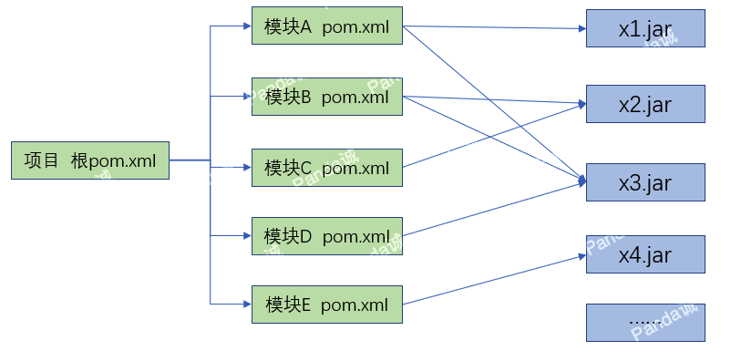

pom.xml中依赖的定义样例：

```xml
<dependencies>
　　<dependency>
　　 　　<groupId>org.mybatis.spring.boot</groupId>
　　 　　<artifactId>mybatis-spring-boot-starter</artifactId>
　　 　　<version>2.1.1</version>
　　</dependency>
</dependencies>
```
但是，实际使用中，会发现pom.xml中很多依赖是没有指定`<version>`的，如：

```xml
<dependency>
　　<groupId>org.springframework.boot</groupId>
　　<artifactId>spring-boot-starter-data-jdbc</artifactId>
</dependency>
<dependency>
　　<groupId>org.springframework.boot</groupId>
　　<artifactId>spring-boot-starter-web</artifactId>
</dependency>
```

为什么呢？这就涉及到Maven中依赖的版本锁定。

实际项目开发中，一个项目包含很多模块，不同模块有不同的依赖，也有多个模块存在共同的依赖。如：



希望一个项目中，不同模块使用的同一依赖采用相同的版本。可以：

（1）方式一：在每个模块的pom.xml文件中指定依赖版本，人为确保不同模块的pom.xml中相同依赖版本号一致。这样会导致维护复杂，后续如果变更依赖版本，需要每个模块排查修改。

（2）方式二：把所有的模块的依赖，都在根目录的pom.xml定义，然后被所有子模块引用。这样会导致子模块引用冗余，对于子模块不需要的依赖，也会被引用过来。

（3）方式三：maven提供了更好的方式，即maven依赖的版本锁定：

整个项目，在根pom.xml中通过`<dependencyManagement>`标签定义依赖的版本： 

```xml
　　　　<dependencyManagement>
　　　　　　<dependencies>
　　　　　　　　<dependency>
　　　　　　　　　　<groupId>org.eclipse.persistence</groupId>
　　　　　　　　　　<artifactId>org.eclipse.persistence.jpa</artifactId>
　　　　　　　　　　<version>1.3</version>
　　　　　　　　</dependency>
　　　　　　　　<dependency>
　　　　　　　　　　<groupId>javax</groupId>
　　　　　　　　　　<artifactId>javaee-api</artifactId>
　　　　　　　　　　<version>2.1.1</version>
　　　　　　　　</dependency>
　　　　　　</dependencies>
　　　　</dependencyManagement>
```

根目录的pom.xml作为每个模块pom.xml的父pom（通过在pom.xml文件中用`<parent>`指定），在模块的pom.xml仅指定依赖，不指定版本即可：

```xml
      　<dependencies> 
　　　　　　<dependency> 
　　　　　　　　<groupId>org.eclipse.persistence</groupId> 
　　　　　　　　<artifactId>org.eclipse.persistence.jpa</artifactId> 
　　　　　　</dependency> 
　　　　　　<dependency> 
　　　　　　　　<groupId>javax</groupId> 
　　　　　　　　<artifactId>javaee-api</artifactId> 
　　　　　　</dependency> 
　　　　</dependencies> 
```

实际上，maven在解析子模块的pom.xml文件中依赖时，采用的就是父pom中`<dependencyManagement>`标签定义的版本。

`<dependencyManagement>`和`<dependencies>`的区别：

（1）`<dependencyManagement>`用于定义依赖版本，并不是真实的依赖，所以maven在解析pom.xml文件时并不会把`<dependencyManagement>`内的内容作为真实依赖来做查找更新动作。

（2）`<dependencies>`是真实的依赖，maven在解析pom.xml时，需要进行查找更新。

通过IDEA等创建的项目，项目根pom.xml中也存在没有版本号的依赖，其版本号如何确定呢？

原因是：Maven为所有项目提供了公共的父pom，在项目的根pom.xml文件中通过`<parent>`引用。项目根pom.xml中也存在没有版本号的依赖，集成的是Maven父pom中通过依赖版本管理定义的版本。

## 公众号

关注公众号 得到第一手文章/文档更新推送。

