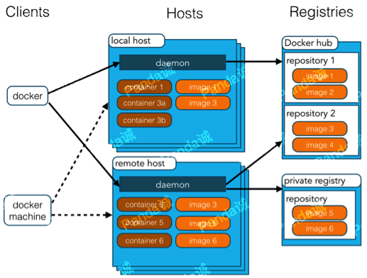
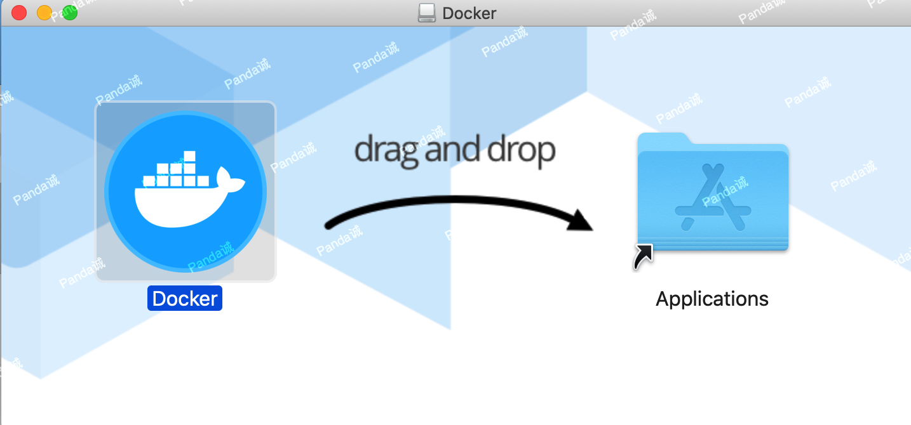
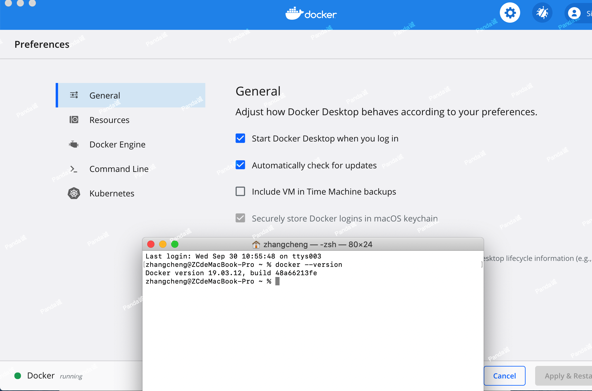

Docker 是一个开源的应用容器引擎，基于 Go 语言 并遵从 Apache2.0 协议开源。Docker 可以让开发者打包他们的应用以及依赖包到一个轻量级、可移植的容器中，然后发布到任何流行的 Linux 机器上，也可以实现虚拟化。容器是完全使用沙箱机制，相互之间不会有任何接口（类似 iPhone 的 app）,更重要的是容器性能开销极低。Docker 从 17.03 版本之后分为 CE（Community Edition: 社区版） 和 EE（Enterprise Edition: 企业版），我们用社区版就可以了。

## Docker 架构

Docker 使用客户端-服务器 (C/S) 架构模式，使用远程API来管理和创建Docker容器。Docker 容器通过 Docker 镜像来创建。容器与镜像的关系类似于面向对象编程中的对象与类。

Docker的三个基本概念:

- 镜像（Image）：Docker 镜像（Image），就相当于是一个 root 文件系统。比如官方镜像 ubuntu:16.04 就包含了完整的一套 Ubuntu16.04 最小系统的 root 文件系统。
- 容器（Container）：镜像（Image）和容器（Container）的关系，就像是面向对象程序设计中的类和实例一样，镜像是静态的定义，容器是镜像运行时的实体。容器可以被创建、启动、停止、删除、暂停等。
- 仓库（Repository）：仓库可看成一个代码控制中心，用来保存镜像。

| 概念 | 说明 |
|--|--|
| Docker 镜像(Images) | Docker 镜像是用于创建 Docker 容器的模板，比如 Ubuntu 系统。 |
| Docker 容器(Container) | 容器是独立运行的一个或一组应用，是镜像运行时的实体。 |
| Docker 客户端(Client) | Docker 客户端通过命令行或者其他工具使用 Docker SDK (https://docs.docker.com/develop/sdk/) 与 Docker 的守护进程通信。 |
| Docker 主机(Host) | 一个物理或者虚拟的机器用于执行 Docker  守护进程和容器。 |
| Docker Registry | Docker 仓库用来保存镜像，可以理解为代码控制中的代码仓库。 Docker Hub([https://hub.docker.com](https://hub.docker.com/)) 提供了庞大的镜像集合供使用。 一个 Docker Registry 中可以包含多个仓库（Repository）；每个仓库可以包含多个标签（Tag）；每个标签对应一个镜像。  通常，一个仓库会包含同一个软件不同版本的镜像，而标签就常用于对应该软件的各个版本。我们可以通过 <仓库名>:<标签> 的格式来指定具体是这个软件哪个版本的镜像。如果不给出标签，将以 **latest** 作为默认标签。 |
| Docker Machine | Docker Machine是一个简化Docker安装的命令行工具，通过一个简单的命令行即可在相应的平台上安装Docker，比如VirtualBox、 Digital Ocean、Microsoft Azure。 |

## 安装docker(MAC)

下载Docker.dmg http://mirrors.aliyun.com/docker-toolbox/mac/docker-for-mac/stable/

## Docker镜像加速

## 公众号

关注公众号 得到第一手文章/文档更新推送。

