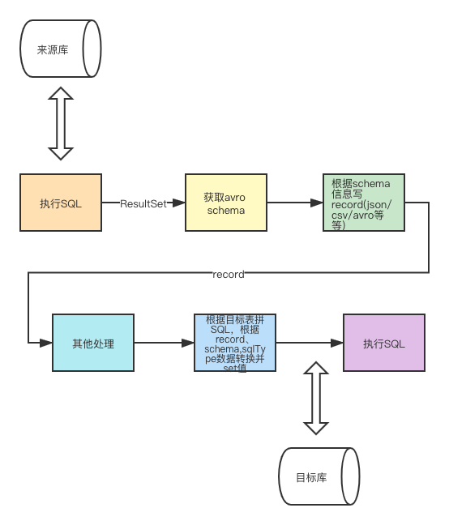
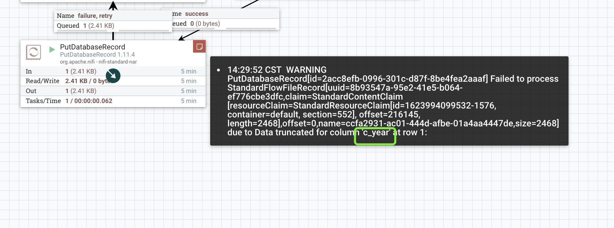

## 读写数据库过程



NIFI对关系型数据库的读写大多会经历以下的过程
1. 根据执行的查询SQL结果元数据，获取avro schema信息
2. 根据avro schema将查询的Result转成record(json avro csv等等，过程中会进行一些数据的转换)
3. 用户可以对record进行一些数据处理
4. 根据目标表的元数据信息，record的schema信息，拼接参数化SQL，设置参数化value(过程中会进行一些数据的转换)


## NiFi支持的java.sql.Types

NiFi支持的sql.Types，以及这些sql.TypesType最终会映射的schema.Type。

| sql.Type | 数字 | 支持 | schema.Type |
|--|--|--|--|
| CHAR | 1 | true | string |
| LONGNVARCHAR | -16 | true | string |
| LONGVARCHAR | -1 | true | string |
| NCHAR | -15 | true | string |
| NVARCHAR | -9 | true | string |
| VARCHAR | 12 | true | string |
| CLOB | 2005 | true | string |
| NCLOB | 2011 | true | string |
| OTHER | 1111 | true | string |
| SQLXML | 2009 | true | string |
| ROWID | -8 | true | string |
| BIT | -7 | true | boolean |
| BOOLEAN | 16 | true | boolean |
| INTEGER(带正负号或者位数大于0且小于9) | 4 | true | int |
| INTEGER(⬆️否则) | 4 | true | long |
| SMALLINT | 5 | true | int |
| TINYINT | -6 | true | int |
| BIGINT(位数小于0或大于19) | -5 | true | string |
| BIGINT(⬆️否则) | -5 | true | long |
| FLOAT | 6 | true | float |
| REAL | 7 | true | float |
| (Oracle BINARY_FLOAT) | 100 | true | float |
| DOUBLE | 8 | true | double |
| (Oracle BINARY_DOUBLE) | 101 | true | double |
| DECIMAL(使用avro逻辑约束) | 3 | true | bytes(带precision和scale) |
| DECIMAL(⬆️否则) | 3 | true | string |
| NUMERIC(使用avro逻辑约束) | 2 | true | bytes(带precision和scale) |
| NUMERIC(⬆️否则) | 2 | true | string |
| DATE(使用avro逻辑约束) | 91 | true | int |
| DATE(⬆️否则) | 91 | true | string |
| TIME(使用avro逻辑约束) | 92 | true | int |
| TIME(⬆️否则) | 92 | true | string |
| TIMESTAMP(使用avro逻辑约束) | 93 | true |  |
| TIMESTAMP(⬆️否则) | 93 | true |  |
| TIMESTAMP_WITH_TIMEZONE(使用avro逻辑约束) | 2014 | true | long |
| TIMESTAMP_WITH_TIMEZONE(⬆️否则) | 2014 | true | string |
| (Oracle's TIMESTAMP WITH TIME ZONE)(使用avro逻辑约束) | -101 | true | long |
| (Oracle's TIMESTAMP WITH TIME ZONE)(⬆️否则) | -101 | true | string |
| (Oracle's TIMESTAMP WITH LOCAL TIME ZONE)(使用avro逻辑约束) | -102 | true | long |
| (Oracle's TIMESTAMP WITH LOCAL TIME ZONE)(⬆️否则) | -102 | true | string |
| BINARY | -2 | true | bytes |
| VARBINARY | -3 | true | bytes |
| LONGVARBINARY | -4 | true | bytes |
| ARRAY | 2003 | true | bytes |
| BLOB | 2004 | true | bytes |
| 其他 | 其他 | false |  |


## MySQL所有字段类型支持情况

```sql
CREATE TABLE `all_types` (
  `c_tinyint` tinyint(4) DEFAULT NULL,
  `c_smallint` smallint(6) DEFAULT NULL,
  `c_mediumint` mediumint(9) DEFAULT NULL,
  `c_int` int(11) DEFAULT NULL,
  `c_integer` int(11) DEFAULT NULL,
  `c_bigint` bigint(20) NOT NULL,
  `c_float` float DEFAULT NULL,
  `c_double` double DEFAULT NULL,
  `c_real` double DEFAULT NULL,
  `c_decimal` decimal(10,0) DEFAULT NULL,
  `c_numeric` decimal(10,0) DEFAULT NULL,
  `c_date` date DEFAULT NULL,
  `c_time` time DEFAULT NULL,
  `c_year` year(4) DEFAULT NULL,
  `c_datetime` datetime DEFAULT NULL,
  `c_timestamp` timestamp NULL DEFAULT NULL ON UPDATE CURRENT_TIMESTAMP,
  `c_char` char(10) DEFAULT NULL,
  `c_varchar` varchar(255) DEFAULT NULL,
  `c_binary` binary(10) DEFAULT NULL,
  `c_varbinary` varbinary(1024) DEFAULT NULL,
  `c_tinyblob` tinyblob,
  `c_mediumblob` mediumblob,
  `c_blob` blob,
  `c_longblob` longblob,
  `c_tinytext` tinytext,
  `c_mediumtext` mediumtext,
  `c_text` text,
  `c_longtext` longtext,
  `c_bit` bit(1) DEFAULT NULL,
  `c_enum` enum('n','y') DEFAULT NULL,
  `c_set` set('y','n') DEFAULT NULL,
  `c_geometry` geometry DEFAULT NULL,
  `c_geometrycollection` geometrycollection DEFAULT NULL,
  `c_json` json DEFAULT NULL,
  `c_linestring` linestring DEFAULT NULL,
  `c_multilinestring` multilinestring DEFAULT NULL,
  `c_point` point DEFAULT NULL,
  `c_multipoint` multipoint DEFAULT NULL,
  `c_polygon` polygon DEFAULT NULL,
  `c_multipolygon` multipolygon DEFAULT NULL,
  PRIMARY KEY (`c_bigint`)
) ENGINE=InnoDB DEFAULT CHARSET=utf8;
```


| column | sql.Types | Types名称 | NiFi支持 | NiFi读支持 | NiFi写支持 |
|--|--|--|--|--|--|
| tinyint | -6 | TINYINT | true | true | true |
| smallint | 5 | SMALLINT | true | true | true |
| mediumint | 4 | MEDIUMINT | true | true | true |
| int(integer) | 4 | INT | true | true | true |
| bigint | -5 | BIGINT | true | true | true |
| float | 7 | FLOAT | true | true | true |
| double | 8 | DOUBLE | true | true | true |
| real | 8 | DOUBLE | true | true | true |
| decimal | 3 | DECIMAL | true | true | true |
| numeric | 3 | DECIMAL | true | true | true |
| date | 91 | DATE | true | true | true |
| time | 92 | TIME | true | true | true |
| datetime | DATETIME | 93 | true | true | true |
| timestamp | TIMESTAMP | 93 | true | true | true |
| char | 1 | CHAR | true | true | true |
| varchar | 12 | VARCHAR | true | true | true |
| tinytext | -1 | VARCHAR | true | true | true |
| mediumtext | -1 | VARCHAR | true | true | true |
| text | -1 | VARCHAR | true | true | true |
| longtext | VARCHAR | -1 | true | true | true |
| bit | -7 | BIT | true | true | true |
| enum | 1 | CHAR | true | true | true |
| set | 1 | CHAR | true | true | true |
|--|--|--|--|--|--|
| year | 91 | YEAR | false | true | false |
| binary | -2 | BINARY | false | true | false |
| varbinary | -3 | VARBINARY | false | true | false |
| tinyblob | -3 | TINYBLOB | false | true | false |
| mediumblob | -4 | MEDIUMBLOB | false | true | false |
| blob | -4 | BLOB | false | true | false |
| longblob | -4 | LONGBLOB | false | true | false |
| geometry | -2 | GEOMETRY | false | true | false |
| geometrycollection | -2 | GEOMETRY | false | true | false |
| json | 1 | JSON | true | true | true |
| linestring | -2 | GEOMETRY | false | true | false |
| multilinestring | -2 | GEOMETRY | false | true | false |
| point | -2 | GEOMETRY | false | true | false |
| multipoint | -2 | GEOMETRY | false | true | false |
| polygon | -2 | GEOMETRY | false | true | false |

### 读支持

所有字段类型NiFi全部支持读(一下是读出来的一条json数据)：
```json
[ {
  "c_tinyint" : 1,
  "c_smallint" : 1,
  "c_mediumint" : 1,
  "c_int" : 1,
  "c_integer" : 1,
  "c_bigint" : "2",
  "c_float" : 1.1,
  "c_double" : 2.1,
  "c_real" : 2.1,
  "c_decimal" : "3",
  "c_numeric" : "3",
  "c_date" : "1623945600000",
  "c_time" : "11135000",
  "c_year" : "1609430400000",
  "c_datetime" : "1623985543000",
  "c_timestamp" : "1623996895000",
  "c_char" : "666",
  "c_varchar" : "666",
  "c_binary" : [ 54, 54, 54, 54, 0, 0, 0, 0, 0, 0 ],
  "c_varbinary" : [ 49, 49, 49 ],
  "c_tinyblob" : [ 16 ],
  "c_mediumblob" : [ 16 ],
  "c_blob" : [ 16 ],
  "c_longblob" : [ 16 ],
  "c_tinytext" : "111",
  "c_mediumtext" : "111",
  "c_text" : "111",
  "c_longtext" : "111",
  "c_bit" : true,
  "c_enum" : "n",
  "c_set" : "y,n",
  "c_geometry" : [ 0, 0, 0, 0, 1, 1, 0, 0, 0, -33, -5, 27, -76, 87, 94, 94, 64, 45, 123, 18, -40, -100, 59, 63, 64 ],
  "c_geometrycollection" : [ 0, 0, 0, 0, 1, 7, 0, 0, 0, 3, 0, 0, 0, 1, 1, 0, 0, 0, 0, 0, 0, 0, 0, 0, 36, 64, 0, 0, 0, 0, 0, 0, 36, 64, 1, 1, 0, 0, 0, 0, 0, 0, 0, 0, 0, 62, 64, 0, 0, 0, 0, 0, 0, 62, 64, 1, 2, 0, 0, 0, 2, 0, 0, 0, 0, 0, 0, 0, 0, 0, 46, 64, 0, 0, 0, 0, 0, 0, 46, 64, 0, 0, 0, 0, 0, 0, 52, 64, 0, 0, 0, 0, 0, 0, 52, 64 ],
  "c_json" : "{\"id\": 1}",
  "c_linestring" : [ 0, 0, 0, 0, 1, 2, 0, 0, 0, 3, 0, 0, 0, -33, -5, 27, -76, 87, 94, 94, 64, 45, 123, 18, -40, -100, 59, 63, 64, -109, -90, 65, -47, 60, 94, 94, 64, 18, 74, 95, 8, 57, 59, 63, 64, 15, 15, 97, -4, 52, 94, 94, 64, 112, -46, 52, 40, -102, 59, 63, 64 ],
  "c_multilinestring" : [ 0, 0, 0, 0, 1, 5, 0, 0, 0, 2, 0, 0, 0, 1, 2, 0, 0, 0, 2, 0, 0, 0, 0, 0, 0, 0, 0, 0, 36, 64, 0, 0, 0, 0, 0, 0, 36, 64, 0, 0, 0, 0, 0, 0, 52, 64, 0, 0, 0, 0, 0, 0, 52, 64, 1, 2, 0, 0, 0, 2, 0, 0, 0, 0, 0, 0, 0, 0, 0, 46, 64, 0, 0, 0, 0, 0, 0, 46, 64, 0, 0, 0, 0, 0, 0, 62, 64, 0, 0, 0, 0, 0, 0, 46, 64 ],
  "c_point" : [ 0, 0, 0, 0, 1, 1, 0, 0, 0, -33, -5, 27, -76, 87, 94, 94, 64, 45, 123, 18, -40, -100, 59, 63, 64 ],
  "c_multipoint" : [ 0, 0, 0, 0, 1, 4, 0, 0, 0, 3, 0, 0, 0, 1, 1, 0, 0, 0, 0, 0, 0, 0, 0, 0, 0, 0, 0, 0, 0, 0, 0, 0, 0, 0, 1, 1, 0, 0, 0, 0, 0, 0, 0, 0, 0, 52, 64, 0, 0, 0, 0, 0, 0, 52, 64, 1, 1, 0, 0, 0, 0, 0, 0, 0, 0, 0, 78, 64, 0, 0, 0, 0, 0, 0, 78, 64 ],
  "c_polygon" : [ 0, 0, 0, 0, 1, 3, 0, 0, 0, 1, 0, 0, 0, 7, 0, 0, 0, -40, -42, 79, -1, 89, 94, 94, 64, -4, -57, 66, 116, 8, 60, 63, 64, -127, 4, -59, -113, 49, 94, 94, 64, 70, -106, -52, -79, -68, 59, 63, 64, 79, 92, -114, 87, 32, 94, 94, 64, -120, 99, 93, -36, 70, 59, 63, 64, -125, 108, 89, -66, 46, 94, 94, 64, 62, -105, -87, 73, -16, 58, 63, 64, -98, -46, -63, -6, 63, 94, 94, 64, -103, 103, 37, -83, -8, 58, 63, 64, 24, -52, 95, 33, 115, 94, 94, 64, 72, 51, 22, 77, 103, 59, 63, 64, -40, -42, 79, -1, 89, 94, 94, 64, -4, -57, 66, 116, 8, 60, 63, 64 ],
  "c_multipolygon" : [ 0, 0, 0, 0, 1, 6, 0, 0, 0, 2, 0, 0, 0, 1, 3, 0, 0, 0, 1, 0, 0, 0, 5, 0, 0, 0, 0, 0, 0, 0, 0, 0, 0, 0, 0, 0, 0, 0, 0, 0, 0, 0, 0, 0, 0, 0, 0, 0, 36, 64, 0, 0, 0, 0, 0, 0, 0, 0, 0, 0, 0, 0, 0, 0, 36, 64, 0, 0, 0, 0, 0, 0, 36, 64, 0, 0, 0, 0, 0, 0, 0, 0, 0, 0, 0, 0, 0, 0, 36, 64, 0, 0, 0, 0, 0, 0, 0, 0, 0, 0, 0, 0, 0, 0, 0, 0, 1, 3, 0, 0, 0, 1, 0, 0, 0, 5, 0, 0, 0, 0, 0, 0, 0, 0, 0, 20, 64, 0, 0, 0, 0, 0, 0, 20, 64, 0, 0, 0, 0, 0, 0, 28, 64, 0, 0, 0, 0, 0, 0, 20, 64, 0, 0, 0, 0, 0, 0, 28, 64, 0, 0, 0, 0, 0, 0, 28, 64, 0, 0, 0, 0, 0, 0, 20, 64, 0, 0, 0, 0, 0, 0, 28, 64, 0, 0, 0, 0, 0, 0, 20, 64, 0, 0, 0, 0, 0, 0, 20, 64 ]
} ]
```

### 写支持

#### year

year不支持是因为对应的sql.types是91，跟date(2021-06-18)是一样的，所以写的时候也认为是yyyy-MM-dd，但是year类型只接受yyyy，所以会报错的。



如果要解决需要在代码逻辑上依靠sql.Types名称，对相同的sql.Types中的不同字段类型进一步进行判别

#### binary varbinary

暂时不支持，如果需要支持，需要在写入前解析bytes

#### tinyblob mediumblob blob longblob

暂时不支持，如果需要支持，需要在写入前解析bytes

#### GEOMETRY

所有的地理字段类型都不支持，geometry，geometrycollection，linestring，multilinestring，point，multipoint，polygon

