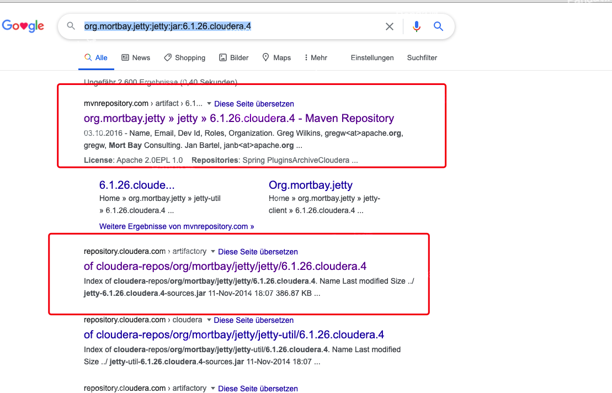
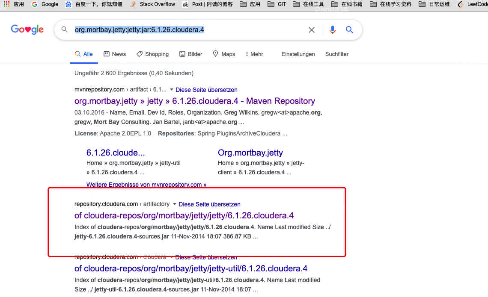

最近新来了一次代码，构建的时候心血来潮，又重新过了一遍(回想17年刚毕业的时候构建的是一塌糊涂。。。啥也不知道，懵懵的)

国内拉取源码还是建议用码云
```
git clone -b master git@github.com:mirrors/nifi.git
```

如果网络环境(翻的速度也很好)很好，那可以直接用IDE打开项目，构建maven项目。

但通常国内的开源代码编译环境不是那么如人意

其实大部分的依赖在阿里云都可以下载到，以下我以阿里镜像为主，新建了一个maven setting文件，可能有些repo不是必须的，但我也就不一一去测了，干脆把阿里仓库都加上了。

除了阿里仓库和martiansoftware，其他的仓库都代理到阿里public上

```xml
<?xml version="1.0" encoding="UTF-8"?>
<settings
    xmlns="http://maven.apache.org/SETTINGS/1.0.0"
    xmlns:xsi="http://www.w3.org/2001/XMLSchema-instance"
	xsi:schemaLocation="http://maven.apache.org/SETTINGS/1.0.0 http://maven.apache.org/xsd/settings-1.0.0.xsd">
    <localRepository>/Users/zhangcheng/.m2/repository</localRepository>
    <pluginGroups></pluginGroups>
    <proxies></proxies>
    <mirrors>
        <mirror>
        <!-- 以防有未知的仓库  把未知的仓库都给代理到阿里public了 -->
            <id>aliyunmaven</id>
            <mirrorOf>external:*,!central,!jcenter,!martiansoftware,!spring,!google,!gradle-plugin,!spring-plugin,!grails-core,!apache-snapshots,!cloudera-repos</mirrorOf>
            <name>阿里云公共仓库</name>
            <url>http://maven.aliyun.com/nexus/content/groups/public/</url>
        </mirror>
    </mirrors>
    <servers>
    </servers>
    <profiles>
        <profile>
            <id>nexus</id>
            <properties>
                <downloadSources>false</downloadSources>
                <downloadJavadocs>false</downloadJavadocs>
            </properties>
            <repositories>
            <repository>
                <id>central</id>
                <url>https://maven.aliyun.com/repository/central</url>
                <snapshots>
                    <enabled>true</enabled>
                    <updatePolicy>always</updatePolicy>
                </snapshots>
                <releases>
                    <enabled>true</enabled>
                    <updatePolicy>daily</updatePolicy>
                </releases> 
            </repository>
            <repository>
                <id>jcenter</id>
                <url>https://maven.aliyun.com/repository/jcenter</url>
                <snapshots>
                    <enabled>true</enabled>
                    <updatePolicy>always</updatePolicy>
                </snapshots>
                <releases>
                    <enabled>true</enabled>
                    <updatePolicy>daily</updatePolicy>
                </releases> 
            </repository>
            <repository>
                <id>spring</id>
                <url>https://maven.aliyun.com/repository/spring</url>
                <snapshots>
                    <enabled>true</enabled>
                    <updatePolicy>always</updatePolicy>
                </snapshots>
                <releases>
                    <enabled>true</enabled>
                    <updatePolicy>daily</updatePolicy>
                </releases> 
            </repository>
            <repository>
                <id>google</id>
                <url>https://maven.aliyun.com/repository/google</url>
                <snapshots>
                    <enabled>true</enabled>
                    <updatePolicy>always</updatePolicy>
                </snapshots>
                <releases>
                    <enabled>true</enabled>
                    <updatePolicy>daily</updatePolicy>
                </releases> 
            </repository>
            <repository>
                <id>gradle-plugin</id>
                <url>https://maven.aliyun.com/repository/gradle-plugin</url>
                <snapshots>
                    <enabled>true</enabled>
                    <updatePolicy>always</updatePolicy>
                </snapshots>
                <releases>
                    <enabled>true</enabled>
                    <updatePolicy>daily</updatePolicy>
                </releases> 
            </repository>
            <repository>
                <id>spring-plugin</id>
                <url>https://maven.aliyun.com/repository/spring-plugin</url>
                <snapshots>
                    <enabled>true</enabled>
                    <updatePolicy>always</updatePolicy>
                </snapshots>
                <releases>
                    <enabled>true</enabled>
                    <updatePolicy>daily</updatePolicy>
                </releases> 
            </repository>
            <repository>
                <id>grails-core</id>
                <url>https://maven.aliyun.com/repository/grails-core</url>
                <snapshots>
                    <enabled>true</enabled>
                    <updatePolicy>always</updatePolicy>
                </snapshots>
                <releases>
                    <enabled>true</enabled>
                    <updatePolicy>daily</updatePolicy>
                </releases> 
            </repository>
            <repository>
                <id>apache-snapshots</id>
                <url>https://maven.aliyun.com/repository/apache-snapshots</url>
                <snapshots>
                    <enabled>true</enabled>
                    <updatePolicy>always</updatePolicy>
                </snapshots>
                <releases>
                    <enabled>true</enabled>
                    <updatePolicy>daily</updatePolicy>
                </releases> 
            </repository>
            <!-- 不知道是不是我用MAC的缘故，有个jar包 需要在这个仓库里下 -->
             <repository>
                <id>martiansoftware</id>
                <url>http://mvn.martiansoftware.com/</url>
                <snapshots>
                    <enabled>true</enabled>
                    <updatePolicy>always</updatePolicy>
                </snapshots>
                <releases>
                    <enabled>true</enabled>
                    <updatePolicy>daily</updatePolicy>
                </releases>                  
            </repository>
            <!-- 用了有些Cloudera的包 比如Kite里的jetty -->
            <repository>
                <id>cloudera-repos</id>
                <url>https://repository.cloudera.com/artifactory/cloudera-repos/</url>
                <snapshots>
                    <enabled>true</enabled>
                    <updatePolicy>always</updatePolicy>
                </snapshots>
                <releases>
                    <enabled>true</enabled>
                    <updatePolicy>daily</updatePolicy>
                </releases>                  
            </repository>
            </repositories>
        </profile>
    </profiles>
    <activeProfiles>
        <activeProfile>nexus</activeProfile>
    </activeProfiles>
</settings>


```

因人而异，其实配置不配置mirror不重要，你用了那些仓库也不重要，重要的是你再clean install的时候发现缺失jar包，你要知道依赖的jar包在哪个仓库下可以下载到。
 
比如：org.mortbay.jetty:jetty:jar:6.1.26.cloudera.4

搜一下



一般使用[https://mvnrepository.com/](https://mvnrepository.com/),查询缺失的jar，在Note找到对应的仓库就可以了。


但org.mortbay.jetty:jetty:jar:6.1.26.cloudera.4，在Spring Plugins repository (https://repo.spring.io/plugins-release/)里找不到，在Cloudera 3rd-P里可以找到。


或者直接搜到的Cloudera仓库



大体上就是这么个思路。


