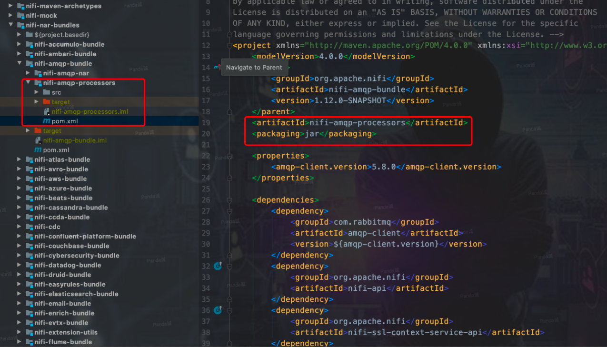

NIFI本身提供了几百个Processor给我们使用，但有的时候我们需要自定义一些组件来使用(这种情况个人觉得百分之八十是因为想实现一个功能，而且这个功能需求原框架就能cover住的，只是不知道在哪或者知道在哪或者不会用，干脆就自己写了->还能出活->老板你看！现在用的都是我自己写的组件->老板：厉害！加薪！)

废话不多说，直接上干货

## 在哪写？

现在我们要自定义一个Processor，假设它叫MyProcessor.java，那么这个Java文件写在哪里呢？

如果你要自定义一个Processor，可以写在以下这两种地方(方式)

1. 写在`nifi-standard-processors`这个项目里，`nifi-standard-processors`这个项目看名字就知道，它定义了一组NIFI标准Processor组件。如下图所示，写在这个位置即可。


2. 自定义一个独立的子Moudle，子Moudle里面有两个子项目:`processors`和`processor-nar`子项目。以NIFI源码的amqp为例


   `processors`里面写MyProcessor.jav，打jar包，


   把`processors`的jar包依赖放到`processor-nar`项目里，打nar包，


   最后把这个nar包依赖放到`nifi-assembly`的pom.xml里即可


   当然，上面说的是最简单的，不涉及到nar包依赖的情况。如果涉及到nar包依赖(什么是nar包间的依赖？简单来说，你要使用另一个nar包的Java类，那么你就得确保你的这个nar包是依赖那个你需要的Java类所在的nar，nar的依赖是传递的，每个nar只能依赖一个其他的nar包。如果想继续了解为什么，看文档`NIFI源码系列`目录下`NIFI nar包加载机制源码解读`)，比如说`nifi-amqp-nar`就依赖了`nifi-standard-services-api-nar`


其实NIFI源码里提供了Processor的maven archetype，只要create Moudle from archetype，把一些变量填上就OK了，详细的看`nifi-maven-archetypes`这个Moudle。

正常来讲，入门级别的自定义Processor采用第一种方式就可以了，比较简单。高级点的，还是建议使用自定义Moudle的方式，这样对源码的侵入性较低，利于后期的升级。那么有没有更高级的方式去做自定义，有的。如果你是要自定义挺多的东西(不仅仅Processor)，可以参考我在github开源的NIFI自定义开发规范，里面以最小侵入代码的方式，将自定义代码与源码分离，项目结构清晰明了，易升级。地址：(https://github.com/zhangchengk/custom-nar-bundles)[https://github.com/zhangchengk/custom-nar-bundles]


## 怎么写？

我们自定义Processor时最常用的是继承AbstractProcessor，首先看一下AbstractProcessor的继承关系:

```java
public abstract class AbstractProcessor extends AbstractSessionFactoryProcessor {

    // 控制器是先调用的AbstractProcessor实现的这个onTrigger方法，然后再调用用户自定义实现的(下面的)onTrigger
    @Override
    public final void onTrigger(final ProcessContext context, final ProcessSessionFactory sessionFactory) throws ProcessException {
        final ProcessSession session = sessionFactory.createSession();
        try {
            onTrigger(context, session);
            session.commit();
        } catch (final Throwable t) {
            session.rollback(true);
            throw t;
        }
    }
    //这个onTrigger方法就是我们最常见的在自定义Processor里需要去实现功能逻辑的了
    public abstract void onTrigger(final ProcessContext context, final ProcessSession session) throws ProcessException;
}
```

这里额外多提一点：NIFI的会话(session)是可以支持事务的，AbstractProcessor的第一个onTrigger方法中我们就可以看到，如果调度执行过程中抛出异常，那么就回滚会话，否则就提交会话。对于支持事务的组件都有哪些意义，大家在深入NIFI的使用和阅读源码的时候慢慢体会(我也在慢慢体会)。

那么接下来，我们在这个MyProcessor.java类中直接继承AbstractProcessor就可以了。以下以我之前写的一个组件为例(被要求写的，用JOLT组件完全hold住，反正我觉得这么写自定义组件没啥意思，感觉如果给社区提PR都不带被搭理的)

```java
/**
 * 给简单的二级结构的json数据添加常量值
 *
 * @author 酷酷的诚
 * @date 2019-07-03 10:07
 */
@EventDriven
@SideEffectFree
@SupportsBatching
@InputRequirement(Requirement.INPUT_REQUIRED)
@Tags({"JSON", "Transform", "address"})
@CapabilityDescription("输入为json数组，为数组中的每一个元素增加常量")
public class JsonAddConstant extends AbstractJsonCleaningProcessor {
    public static final PropertyDescriptor CONSTANT_KEY = new PropertyDescriptor.Builder()
            .name("常量字段名")
            .description("增量常量的字段名称")
            .expressionLanguageSupported(ExpressionLanguageScope.FLOWFILE_ATTRIBUTES)
            .required(true)
            .defaultValue("")
            .addValidator(StandardValidators.NON_EMPTY_VALIDATOR)
            .build();
    public static final PropertyDescriptor CONSTANT_VALUE = new PropertyDescriptor.Builder()
            .name("常量值")
            .description("增量的常量值")
            .expressionLanguageSupported(ExpressionLanguageScope.FLOWFILE_ATTRIBUTES)
            .required(true)
            .defaultValue("")
            .addValidator(StandardValidators.NON_EMPTY_VALIDATOR)
            .build();

    @Override
    protected void init(final ProcessorInitializationContext context) {
        final Set<Relationship> relationships = new HashSet<>();
        relationships.add(REL_SUCCESS);
        this.relationships = Collections.unmodifiableSet(relationships);
        final List<PropertyDescriptor> properties = new ArrayList<>();

        properties.add(CONSTANT_KEY);
        properties.add(CONSTANT_VALUE);

        this.properties = Collections.unmodifiableList(properties);
    }

    @Override
    public void onTrigger(ProcessContext context, ProcessSession session) throws ProcessException {
        FlowFile flowFile = session.get();
        if (flowFile == null) {
            return;
        }
        String constantKey = context.getProperty(CONSTANT_KEY).evaluateAttributeExpressions(flowFile).getValue();
        String constantValue = context.getProperty(CONSTANT_VALUE).evaluateAttributeExpressions(flowFile).getValue();

        ArrayNode arrayNode = validateAndEstablishJsonArray(session, flowFile);
        for (JsonNode jsonNode : arrayNode) {
            ((ObjectNode) jsonNode).put(constantKey, constantValue);
        }
        if (arrayNode.size() > 0) {
            // REL_SUCCESS
            session.transfer(session.write(flowFile, out -> out.write(arrayNode.toString().getBytes(StandardCharsets.UTF_8))), REL_SUCCESS);
        }
    }
```

```java
/**
 * @author 酷酷的诚
 * @date 2019-06-20 13:59
 */
public abstract class AbstractJsonCleaningProcessor extends AbstractProcessor {
    public Set<Relationship> relationships;
    public List<PropertyDescriptor> properties;
    public static final Relationship REL_SUCCESS = new Relationship.Builder().name("success")
            .description("清洗后数据路由到此关系").build();
    public static final Relationship REL_FAILURE = new Relationship.Builder().name("failure")
            .description("清洗失败的数据路由到此关系").build();

    /**
     * flowfile转json node 并验证
     */
    public ArrayNode validateAndEstablishJsonArray(ProcessSession session, FlowFile flowFile) {
        final ObjectMapper mapper = new ObjectMapper();
        final AtomicReference<JsonNode> rootNodeRef = new AtomicReference<>(null);
        try {
            session.read(flowFile, in -> {
                try (final InputStream bufferedIn = new BufferedInputStream(in)) {
                    rootNodeRef.set(mapper.readTree(bufferedIn));
                }
            });
        } catch (final ProcessException pe) {
            getLogger().error("Failed to parse {} as JSON due to {}; routing to failure", new Object[]{flowFile, pe.toString()}, pe);
            session.transfer(flowFile, REL_FAILURE);
            return null;
        }
        final JsonNode rootNode = rootNodeRef.get();

        final ArrayNode dataJsonArray;
        if (rootNode.isArray()) {
            dataJsonArray = (ArrayNode) rootNode;
        } else {
            final JsonNodeFactory nodeFactory = JsonNodeFactory.instance;
            dataJsonArray = new ArrayNode(nodeFactory);
            dataJsonArray.add(rootNode);
        }
        return dataJsonArray;
    }

    @Override
    public void onTrigger(ProcessContext context, ProcessSession session) throws ProcessException {

    }

    @Override
    public Set<Relationship> getRelationships() {
        return relationships;
    }

    @Override
    public List<PropertyDescriptor> getSupportedPropertyDescriptors() {
        return properties;
    }
}

```

简单说一下：
1. 一个Processor的属性就是对于我们定义的`PropertyDescriptor`，比如上面这个组件自定义的`常量字段名`和`常量值`，然后在`init`方法里把他们放到`List<PropertyDescriptor>`，然后在override的`getSupportedPropertyDescriptors`方法中返回这个list就可以了(比如`AbstractJsonCleaningProcessor`)。
2. 一个Processor的路由(success、failure等等)就对应我们定义的`Relationship`，比如上面我们定义了success、failure，同样的，在`init`方法里把他们放到`Set<Relationship>`，然后在override的`getRelationships`方法中返回这个set就可以了。
3. 一个Processor的调度方法对应的就是onTrigger，在这里实现对流文件数据的处理。常见的两个参数ProcessContext可以拿到当前Processor的属性配置，ProcessSession用来读写流文件内容、流文件属性。
4. 对于`init` `onTrigger` `onScheduled`等等这些方法想要进一步了解和使用的，看文档`NIFI源码系列`目录下`Processor组件类的一些方法` `nifi 注解`。


## 怎么用？

现在我们的自定义Processor已经写完了，怎么发布到NIFI上呢。每一个Processor的Moudle，在resource下都定义了一个`org.apache.nifi.processor.Processor`的文件，把你自定义Processor的全类名写上去就可以的。如下图：


然后回顾我们前面的`在哪写？`，把`custom-standard-processors`对应的jar包依赖发布到`custom-standard-nar`,再把nar包依赖发布到`nifi-assembly`里(或者你只是想发布到线上环境，那直接把打出的nar包仍到你运行的NIFI环境的lib目录重启NIFI，或者把nar包扔到extensions目录下nifi会自动加载->当然如果是删除替换还是需要重启的)。


