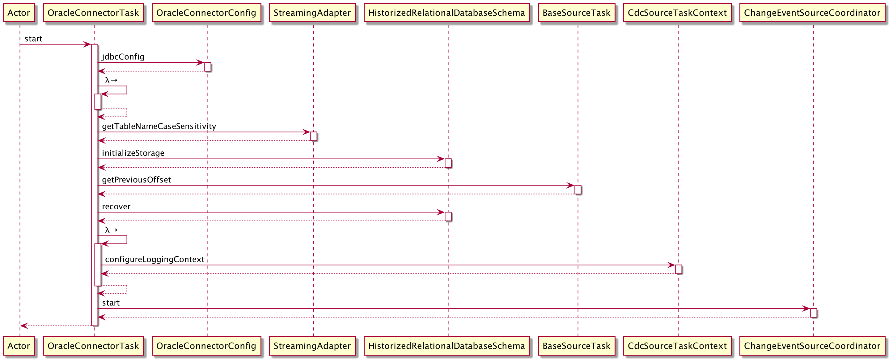
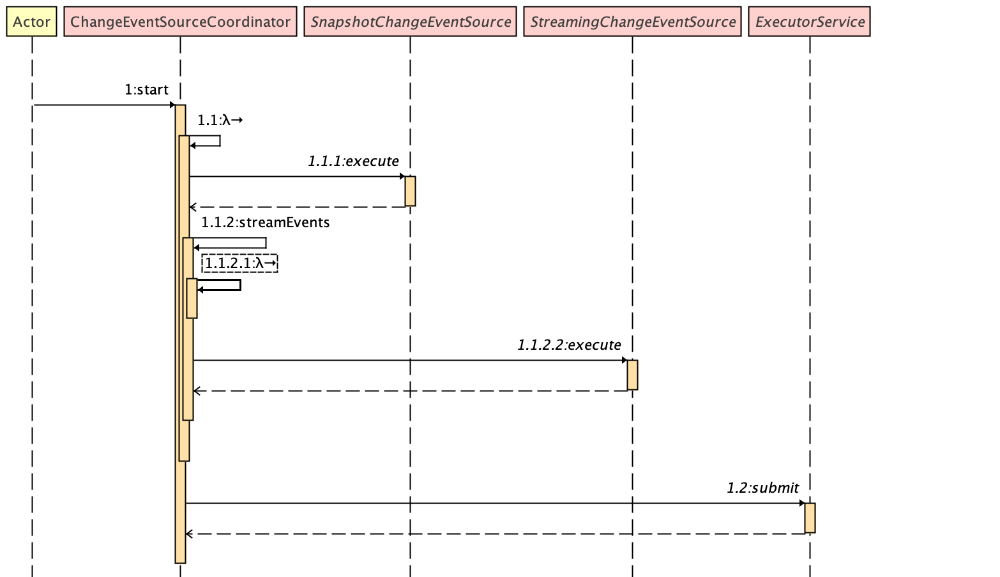
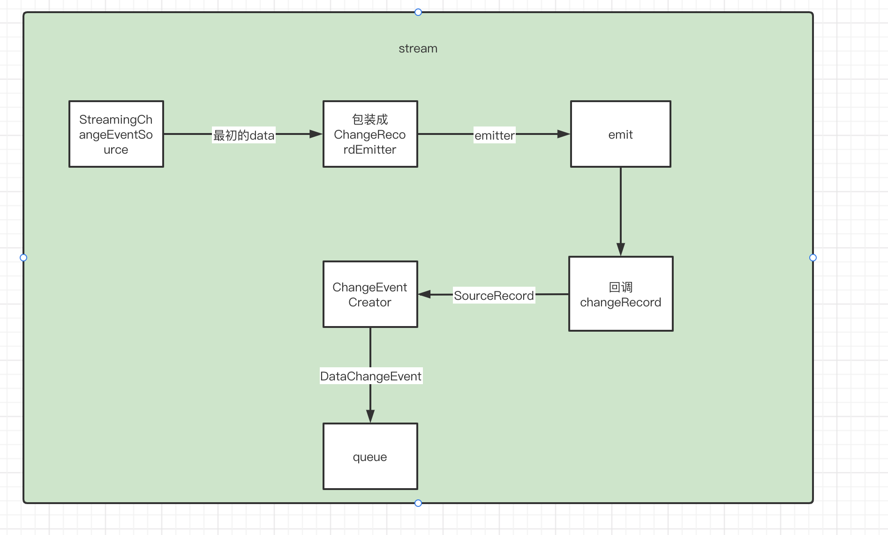
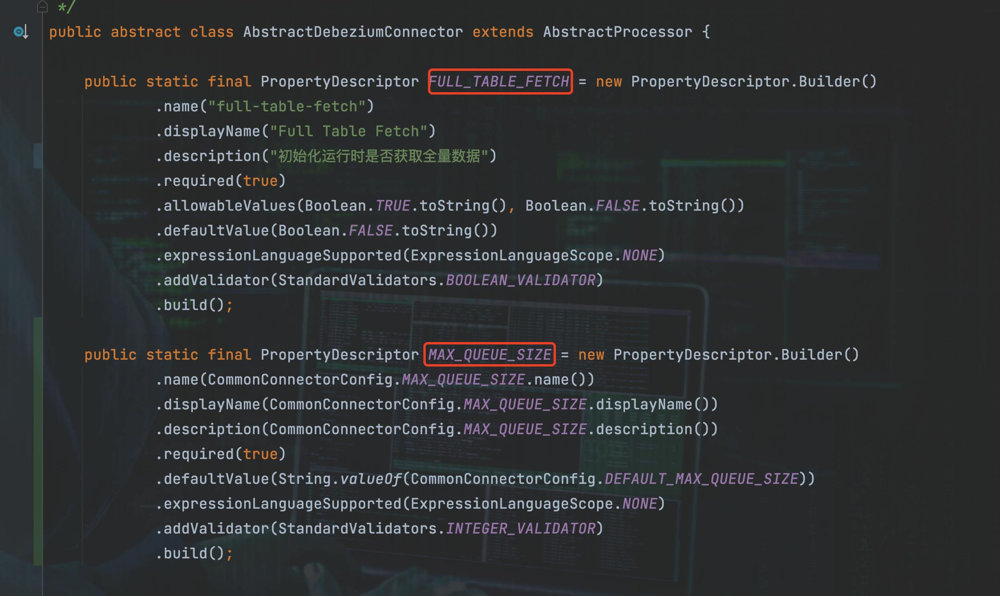

# 一、嵌入NIFI整体思路

考虑到充分利用开源项目Debezium的能力，以及本身团队研发力量的不足，最终决定还是在NIFI直接使用Debezium内置引擎的方式，主要的代价就是带来额外的线程消耗，以及融入NIFI、解决Debezium自身一些不足的开发工作。

# 二、Processor蓝图


# 三、需要解决Debezium哪些不足？

Debezium本身，以及将它嵌入NIFI有一些不满足我们需求的地方：

## 3.1 全表CDC问题

Debezium的全表采集实现非常检漏，以关系型数据库为主就是 select * from .....，没有分页逻辑并且默认最大2000条(可配置)。虽然官方在做这件事情，但是可能还需要一段时间。


这里我们要解决的问题是：

1.  如何依据Debezium的配置信息，在我们的Processor中自定义实现满足我们需求的全表采集。
2.  自定义实现的全表采集的数据格式
3.  避免Debezium的锁表

默认的Snapshot是锁表的，这一点我们无法接受。如果没有提供一种不锁表的机制，那么源码的Snapshot我们还是不会使用的。

## 3.2 数据丢失或重复

NIFI的整体架构是参考SEDA模型，并且内部提供了对FlowFile处理的事务逻辑。如果直接使用现有的Debezium，在NIFI重启等情况下，可能会造成采集不连贯，数据丢失，数据重复等现象。

1.  代码分析，整合Debezium到NIFI，一个采集任务少则两个异步过程，多则三个，即三个线程或者4个线程，需要解决某些异步过程的通信。
2.  Debezium提供的原生offset存储机制，与NIFI的事务机制属于两个异步过程，解决  采集的数据整合进FlowFIle与offset存储事务一致性，避免丢数据，数据重复。
3.  集群模式下 自定义解决方案是否可以hold

## 3.3 关系型DB历史schema问题(DatabaseHistory)

Debezium为大多数关系型DB提供了历史元数据信息的存储机制，在采集数据事件会根据对应的schema进行数据处理。

1.  在采集的过程中，如果发现当前采集的数据事件(offset标记)在历史schema中查找不到对应的信息，会使用antlr解析DDL得到schema，经过测试，此过程现在版本极易报错(尤其是Oracle PG)。
2.  只有使用Debezium原生Snapshot(全量)时，部分DB会使用jdbc api(DatabaseMetadata)采集{Oracle、pg、sql server}，另一部分仍旧是使用antlr解析DDL{mysql}，并且根据现有条件和需求我们无法使用Debezium原生Snapshot(全量)。
3.  经过代码分析pg的CDC不依赖DatabaseHistory
4.  集群模式下 自定义解决方案是否可以hold


## 3.4 数据格式

1.  Debezium自己抽象出一套统一格式的event，自定义全表数据数据需要格式统一。
    1.  第一是整体Event的抽象的数据格式的统一
    2.  第二是具体到子类类型的数据格式的统一
2.  目前移动产品(数据清洗、分区逻辑、公式转换)统一使用NIFI 中avro逻辑模型的JSON格式record，如何定位这里的功能。(可以先不考虑)

## 3.5 适配同步功能

1.  采集到的数据基本含有before after两个版本，目前移动的功能以及NIFI中组件 数据变更都是以主键值为基础的。这里要进行一定适配。

## 3.6 数据体积

1.  由于很多产品化的规则，同步模板都是使用的json，在Debezium中json序列化的event体积大


## 3.7 异常捕获


## 3.8 数据的schema

自定义实现的全表采集，携带的schema信息的获取。

## 3.9 数据转换


## 3.10 表更改

即使我们将初始化的DatabaseHistory的问题，在运行过程中监听到表的修改event，还是会触发诸如Oracle pg解析DDL获取元数据的行为，这也可能会引发一些错误。

# 四、Debezium内置引擎运行过程分析


## 4.1 OffsetBackingStore


## 4.2 SourceConnector


## 4.3 SourceTask


SourceTask.start是抽象方法,由BaseSourceTask实现

## 4.4 BaseSourceTask.start()


start抽象方法，由各个xxxConnectorTask实现。

### 4.4.1 OracleConnectorTask.start为例



前期准备，最终调用ChangeEventSourceCoordinator.start

这里Oracle有个点，这里如果发现有哪一张表的schema(会携带offset)在指定的pre offset之前(包括)，那么程序会认为当前存储的schema可能是过时的，会更新schema，然后会查数据字典获取建表sql, antlr4词法语法解析得到schema信息，这里Oracle(还有pg)极易报错导致运行不下去。


## 4.5 ChangeEventSourceCoordinator.start



## 4.6 SnapshotChangeEventSource


### 4.6.1AbstractSnapshotChangeEventSource.execute


### 4.6.2 RelationalSnapshotChangeEventSource.doExecute

重点要看两处，第一处锁表，第二处全量采集实现


#### 4.6.2.1 锁表

AbstractSnapshotChangeEventSource.execute中会先判断是否skip Snapshot，否，则继续执行。


判断是否skip Snapshot,通用是既不schema，也不data；MongoDB特例，不data就skip。


先假设skip为false，对于关系型数据库来说(MongoDB后面讨论)，会锁所有采集schema的表，条件是snapshottingTask.snapshotSchema()是true，那么我们解决锁表就是让这个返回为false


##### 4.6.2.1.1 MySQL

若要使得MySQL 不锁表，

第一在有previousOffset，SnapshotMode绝不选择使用SCHEMA_ONLY_RECOVERY，那么snapshotSchema就是false；

第二在没有previousOffset，SnapshotMode只能选择使用NEVER ，那么snapshotSchema就是false；


##### 4.6.2.1.2 Oracle

若要使得Oracle 不锁表，

第一在有previousOffset，snapshotSchema就是false；

第二在没有previousOffset，snapshotSchema就是true；

所以在处理Oracle，我们一定一定使其任何时候都有previousOffset！！！。


##### 4.6.2.1.3 PostgreSql
 
若要使得pg 不锁表，snapshotter.shouldSnapshot()一定要返回false，使用NeverSnapshotter


##### 4.6.2.1.4 SqlServer

若要使得SqlServer 不锁表，同Oracle一样，我们一定一定使其任何时候都有previousOffset！！！。


##### 4.6.2.1.5 MongoDB

首先没有所谓锁表逻辑，但在实现MongoDB的Snapshot底层会去阻塞主节点！


但是，在做Snapshot时，每个Collection的查询全部数据都会executeBlocking阻塞主节点

MongoDbSnapshotChangeEventSource.doExecute   →   snapshotReplicaSet   →  createDataEvents   →   createDataEventsForReplicaSet   →  createDataEventsForCollection


如果要避免阻塞MongoDB，就要skip Snapshot！！即MongoDB的SnapshotData是false。

#### 4.6.2.2 全量Snapshot实现

##### 4.6.2.2.1 关系型数据库全表sql

RelationalSnapshotChangeEventSource.doExecute  →  createDataEvents   →   createDataEventsForTable   →   determineSnapshotSelect  →  得到  select sql(**<u>select * from t</u>**)

然后执行查询SQL会设置fetchSize(可配置‘snapshot.fetch.size’)，没有则使用默认值。

经过代码分析默认值:

* Oracle 2000
* SqlServer 2000
* PostgreSql 10240
* Mysql Integer.MIN_VALUE  https://issues.jboss.org/browse/DBZ-94


##### 4.6.2.2.2 MongoDB

因为会阻塞节点，无序进一步分析。

### 4.6.3 总结

由上面各处细节点，结论，我们的程序应该想尽办法不触发Debezium的Snapshot逻辑。

* MySQL SnapshotMode 设置为NEVER
* Oracle  SnapshotMode 设置为SCHEMA_ONLY，并且**必须外部预置offset**
* SqlServer  SnapshotMode 设置为SCHEMA_ONLY，并且**必须外部预置offset**
* PostgreSql SnapshotMode 设置为NEVER
* MongoDB SnapshotMode 设置为NEVER

注：各个数据库的SnapshotMode模式都是有自己的定义的；MySQL 和PG从代码逻辑上分析不强制外部预置offset，
不预置offset的结果待进一步运行，观察，确定影响,但在使用自定义snapshot的前提下仍需要预置offset，防止丢数据。

## 4.7  StreamingChangeEventSource cdc

StreamingChangeEventSource.execute 主要执行读取数据库日志，这里我们主要看一下Debezium的数据组装过程。


### 4.7.1  LogMinerStreamingChangeEventSource.execute为例

processor.processResult(rs);


TransactionalBuffer


### 4.7.2 EventDispatcher


### 4.7.3 ChangeRecordEmitter


### 4.7.4 总结



而内置引擎会取出SourceRecord转成EmbeddedEngineChangeEvent

举一个Oracle中最终的事件数据为例

```json
{
    "schema": {
        "type": "struct",
        "fields": [
            {
                "type": "struct",
                "fields": [
                    {
                        "type": "int32",
                        "optional": false,
                        "field": "ID"
                    },
                    {
                        "type": "string",
                        "optional": false,
                        "field": "FIRST_NAME"
                    },
                    {
                        "type": "string",
                        "optional": false,
                        "field": "LAST_NAME"
                    },
                    {
                        "type": "string",
                        "optional": false,
                        "field": "EMAIL"
                    }
                ],
                "optional": true,
                "name": "server1.DEBEZIUM.CUSTOMERS.Value",
                "field": "before"
            },
            {
                "type": "struct",
                "fields": [
                    {
                        "type": "int32",
                        "optional": false,
                        "field": "ID"
                    },
                    {
                        "type": "string",
                        "optional": false,
                        "field": "FIRST_NAME"
                    },
                    {
                        "type": "string",
                        "optional": false,
                        "field": "LAST_NAME"
                    },
                    {
                        "type": "string",
                        "optional": false,
                        "field": "EMAIL"
                    }
                ],
                "optional": true,
                "name": "server1.DEBEZIUM.CUSTOMERS.Value",
                "field": "after"
            },
            {
                "type": "struct",
                "fields": [
                    {
                        "type": "string",
                        "optional": true,
                        "field": "version"
                    },
                    {
                        "type": "string",
                        "optional": false,
                        "field": "name"
                    },
                    {
                        "type": "int64",
                        "optional": true,
                        "field": "ts_ms"
                    },
                    {
                        "type": "string",
                        "optional": true,
                        "field": "txId"
                    },
                    {
                        "type": "string",
                        "optional": true,
                        "field": "scn"
                    },
                    {
                        "type": "string",
                        "optional": true,
                        "field": "commit_scn"
                    },
                    {
                        "type": "boolean",
                        "optional": true,
                        "field": "snapshot"
                    }
                ],
                "optional": false,
                "name": "io.debezium.connector.oracle.Source",
                "field": "source"
            },
            {
                "type": "string",
                "optional": false,
                "field": "op"
            },
            {
                "type": "int64",
                "optional": true,
                "field": "ts_ms"
            }
        ],
        "optional": false,
        "name": "server1.DEBEZIUM.CUSTOMERS.Envelope"
    },
    "payload": {
        "before": null,
        "after": {
            "ID": 1004,
            "FIRST_NAME": "Anne",
            "LAST_NAME": "Kretchmar",
            "EMAIL": "annek@noanswer.org"
        },
        "source": {
            "version": "1.6.1.Final",
            "name": "server1",
            "ts_ms": 1520085154000,
            "txId": "6.28.807",
            "scn": "2122185",
            "commit_scn": "2122185",
            "snapshot": false
        },
        "op": "c",
        "ts_ms": 1532592105975
    }
}
```

## 4.8 Debezium内置引擎总结

以上是Debezium内置引擎运行的总体过程，最后总结一下：


# 五、 嵌入NIFI实现

以使用JSON为例。


## 5.1 顶级抽象AbstractDebeziumConnector

在AbstractDebeziumConnector层，高度抽象和封装出了NIFI内置Debezium的总体过程。

### 5.1.1 公共配置及子类配置入口




### 5.1.2 初始化

#### 5.1.2.1 设置Debezium配置


#### 5.1.2.2 使用自定义的Offset存储实现

这里顺便看一下StateMapOffsetBackingStore


#### 5.1.2.3 初始化JSON转换器


#### 5.1.2.4 初始化offset


#### 5.1.2.5 初始化Debezium引擎


### 5.1.3 调度执行

#### 5.1.3.1 自定义全量Snapshot


#### 5.1.3.2 Debezium event → NIFI FlowFile

