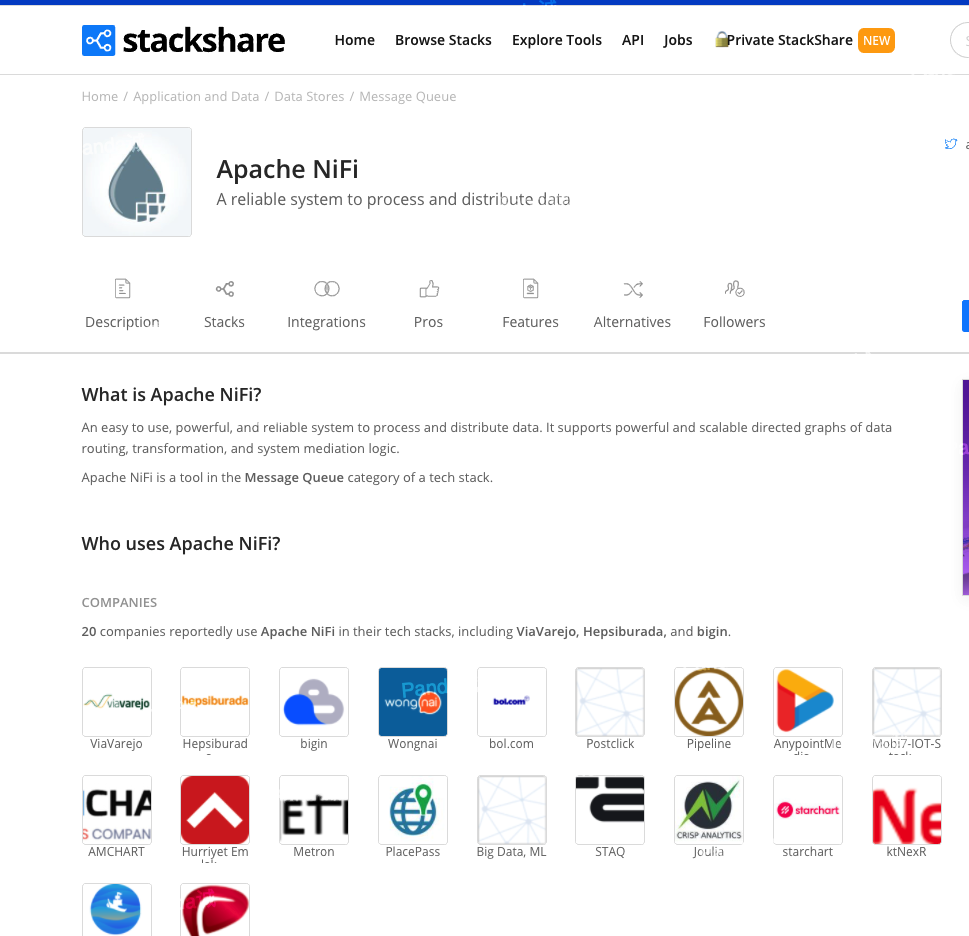

## Apache NIFI简要历史

- 2006年NiFi由美国国家安全局（NSA）的Joe Witt创建。

- 2015年7月20日，Apache 基金会宣布Apache NiFi顺利孵化成为Apache的顶级项目之一。

<!-- more -->

- NiFi初始的项目名称是Niagarafiles，当NiFi项目开源之后，一些早先在NSA的开发者们创立了初创公司Onyara，Onyara随之继续NiFi项目的开发并提供相关的支持。

- Hortonworks公司收购了Onyara并将其开发者整合到自己的团队中，形成HDF（Hortonworks Data Flow）平台。

- 2018年Cloudera与Hortonworks合并后，新的CDH整合HDF，改名为Cloudera Data Flow(CDF)，并且在最新的CDH6.2中直接打包，参考《0603-Cloudera Flow Management和Cloudera Edge Management正式发布》，而Apache NiFi就是CFM的核心组件。

提到Cloudera我们第一个想到的就是Hadoop，在Hadoop生态系统中，规模最大、知名度最高的公司就是Cloudera。

## Apache NIFI PMC

Joe Witt现在是Apache NIFI PMC和Cloudera VP Eng。

以下是根据GitHub和领英收集到的Apache NIFI PMC(项目管理委员会)成员信息，仅供参考

| Name | Company |
|--|--|
| Aldrin Piri | Senior Engineering Manager at Cloudera |
| Brandon DeVries | Senior Solutions Architect at Cloudera |  |
| Jason Carey | Software Engineer at Lyft |  |
| Joe Witt | Cloudera VP Eng |
| Mark Payne | Co-creator of Apache NiFi; Principal Software Engineer at Cloudera |
| Jenn Barnabee |  |
| Matt Gilman | Senior Engineering Manager Cloudera |
| Adam Taft | Software Engineer at Requitest Inc |
| Tony Kurc | Founder at papercdcase.com |
| Dan Bress | Senior Software Engineer at Twitter |
| Bryan Bende | Principal software engineer at Cloudera |
| Sean Busbey | Software Engineer at Cloudera |
| Joe Percivall | Principal Software Engineer at Dragos Inc |
| Andy LoPresto | Principal Software Engineer at Cloudera |
| Matt Burgess | Senior Software Engineer at Cloudera |
| Andre F de Miranda | Fluenda |
| Joe Skora | www.eitccorp.com |
| James Wing | Director of DevOps and Analytics at Mediarails |
| Oleg Zhurakousky | Spring Engineer at Pivotal |
| Yolanda M. Davis | Principal Engineer at Cloudera |
| Pierre Villard | Product Manager, Data in Motion chez Cloudera |
| Koji Kawamura | Education Engineer at Elastic |
| Michael Moser | Principal Software Engineer at Onyx Point |
| Scott Aslan | Staff Software Engineer at Cloudera |
| Marc Parisi | Professional Segfault Creator - Azure CAT at Microsoft |
| Jeremy Dyer | Senior Engineer at NVIDIA |
| Kevin Doran | Software Engineer at Cloudera |
| Peter Wicks | Senior Solution Architect at Micron Technology |
| Jeff Storck(2020年心脏病突发去世) | Principal Software Engineer at Cloudera |

从PMC成员信息可以看出来主要的团队还是Cloudera。

## 哪些公司在用Apache NIFI

Cloudera就不用说了，项目目前主要的贡献就是来源于Cloudera。

以下是Apache NIFI官方公布的主动声明使用了Apache NIFI的公司

| Company | 产品 | 概述 |
|--|--|--|
| Micron | Semiconductor Manufacturing | Micron（美国美光）半导体是全球第三大内存芯片厂，是全球著名的半导体存储器方案供应商，是美国500强企业之一。美光的企业分析和数据团队使用NiFi获取全球制造数据，并将其输入对应的全球数据仓库。 |
| Macquarie Telecom Group | Cloud and Telecommunications | 是面向中型企业和政府客户的澳大利亚数据中心，云，网络安全和电信公司。使用Apache NiFi安全可靠地跨多个数据中心传输、转换、丰富和交付每天数十亿个独立事件(即安全日志、系统指标、聚合数据集等)。 |
| Dovestech | Cyber Security | 美国Dovestech的网络安全可视化产品ThreatPop使用Apache NiFi将数百万与网络安全相关的事件清洗和规范到中央数据库中，该数据库允许客户通过游戏引擎可视化技术与网络安全事件进行交互。 |
| Flexilogix | Big Data / IoT | 使用NiFi构建所有数据提取管道。 已部署NiFi群集，以采集，转换并交付给数据分析后端，这些后端可提供实时和批处理数据。 |
| Payoff | Financial Wellness (fintech) | 美国的一家金融服务公司，使用NiFi作为Kafka和HDFS之间的消费者。NiFi还为事件流提供模式验证，同时允许我们修改和重新发布安全的事件流以供一般使用。NiFi从第三方(包括HDFS/s3/Kafka/sftp)中提取和标准化大型数据集。 |
| Onyx Point | Commercial/Federal Consulting | 使用大型NIFI群集，以实现大量摄取/流出，并提供日常运营支持和维护 |
| Slovak Telekom | Telecommunications | 使用Apache NiFi来支持主动监视。在监控各种网络设备的过程中，使用SNMP作为统一协议进行通信。Apache NiFi处于主动查询模式，定期查询这些设备。SNMP响应的转换以及它们到HDFS和Elastic的传输也是使用Apache NiFi构建的。 |
| GoDataDriven | Data Science & Engineering | GoDataDriven是一家从事数据科学和工程领域的荷兰服务公司，它帮助客户实时接收和处理来自最不同设备(包括但不限于火车)的数据。 |
| Looker | SaaS & Analytics Software | Looker于2012年在美国加州成立，是商业智能软件和大数据分析平台，19年6月6日，谷歌宣布将收购Looker，收购完成后将并入谷歌云部门。部署了NiFi集群来摄取、转换和交付数据到各种后端，如谷歌Big Query、Amazon Redshift和Amazon S3。 |
| Think Big, A Teradata Company | Data Science & Engineering | Think Big的开源数据湖管理平台Kylo提供了一个完整的、企业级的数据湖解决方案，集成了元数据管理、治理和安全方面的最佳实践，这些最佳实践来自Think Big的150多个大数据实施项目。Kylo使用Apache NiFi作为底层调度器和编排引擎，以及其他技术，如Apache Hadoop和Apache Spark。 |
| Hashmap, Inc. | Big Data / IoT | Hashmap使用Apache NiFi安全收集、传输和转换数据，并将其摄入和交付到我们的物联网/时间序列加速器平台... |
| Hastings Group | Insurance | Hastings是一个快速发展的，灵活的，数字化的一般保险提供商，为英国汽车，货车，自行车和家庭保险市场提供服务,使用Apache NiFi来处理和消化数百万项数据。 |
| Ona | International Development and Humanitarian Aid | Ona是一家软件工程和设计公司，总部设在肯尼亚内罗毕和华盛顿特区。我们的使命是提高人道主义和发展援助的效率，使世界各地的组织能够获得集体和可行动的情报。我们使用Apache NiFi摄取、处理和传播来自不同来源的全球健康和服务交付数据。 |

还有很多公司可能使用了NIFI但是没有在NIFI官方和网上声明使用。

## 个人看法

Apache NIFI非常好，项目的架构设计的非常非常好(找不到词儿形容)，文档十分详尽，扩展自定义组件非常简单，源码质量高，开源环境积极健康，主要的贡献团队实力强大。

