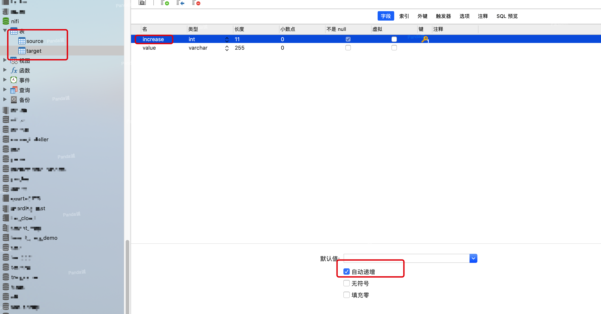
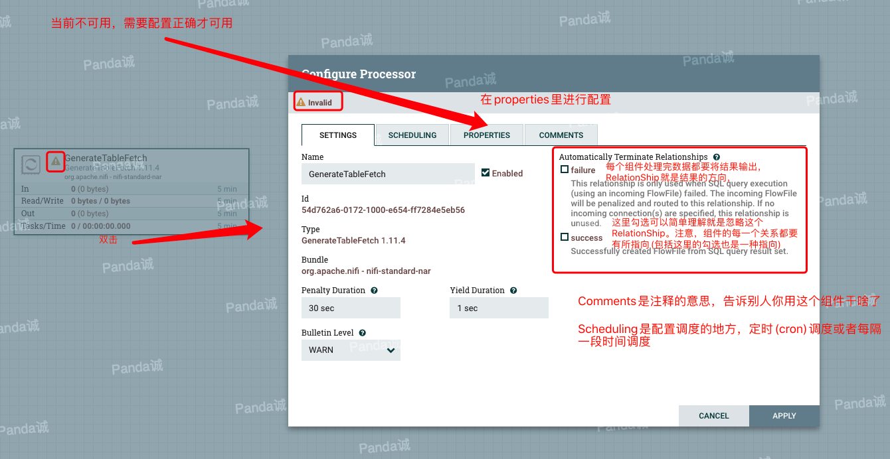

初衷：对于一些新接触Apache NIFI的小伙伴来说，他们急于想体验NIFI，恨不得直接找到一篇文章，照着做就直接能够解决目前遇到的需求或者问题，回想当初的我，也是这个心态。其实这样的心态是不对的。好多加入NIFI学习群的新手同学都会有这个问题，一些基本的概念和知识点都没有掌握，然后提出了一堆很初级的问题，对于这些问题，我们可能已经回答了几十上百次，厌倦了，所以大家一般会说"你先去看文档吧！"。其实，对于一个新手，直接看文档，也是一脸懵。所以在这里，我带领新手的你，新建一个同步的流程，并尽可能在新建流程的同时，穿插一些基本概念。跟随本文一起操作或者只是看看，最后你可能就找到了入门的感觉了。

<!-- more -->

## 环境

- Apache NIFI：1.11.4 单节点
- Linux：CentOS Linux release 7.5.1804 16G内存 48G存储 虚拟机
- DB：MySQL

## Apache NIFI 部署

### 获取安装包

- 我是直接编译的1.11.4的源码获取的安装包，将zip包上传到Linux，解压即可。如何下载源码及编译看[编译NIFI源码](../ApacheNIFI开发/001-编译NIFI源码.md)

- 通过官方网站下载对应的NIFI安装包:[官网下载](https://nifi.apache.org/download.html)

- 通过国内镜像来下载最新发布的NIFI安装包:[北理镜像](http://mirror.bit.edu.cn/apache/nifi/) [清华镜像](https://mirrors.tuna.tsinghua.edu.cn/apache/nifi/)

如果不是编译源码，建议使用国内镜像去下载，一般直接下载zip包就可以了，加入最新版本时1.11.4，那就下载nifi-1.11.4-bin.zip  

### 部署Apache NIFI

1. 上传Apache NIFI包到Linux上，解压安装包；或者将你的本地作为服务器，直接解压zip包。

2. 在解压的目录下，找到conf目录，编辑`bootstrap.conf`文件，修改NIFI的内存配置，默认的值比较小，比如这里我改成启动2g，最大10g

```properties
java.arg.2=-Xms2g
java.arg.3=-Xmx10g
```

3. 在解压的目录下，找到bin目录，可以看到里面有一些脚本

```properties
dump-nifi.bat  
nifi-env.bat  
nifi-env.sh  
nifi.sh         
run-nifi.bat  
status-nifi.bat
```

Linux或者Mac，使用`nifi.sh start`启动NIFI，`nifi.sh stop`停止NIFI，`nifi.sh restart`重启NIFI。

Windows下，直接双击`run-nifi.bat`即可，退出的时候关闭运行窗口就可以了。

在解压的目录下，找到log目录，当看到类似于下面的内容时，NIFI就启动成功了

```
2020-05-27 14:26:02,844 INFO [main] o.eclipse.jetty.server.AbstractConnector Started ServerConnector@58516c91{HTTP/1.1,[http/1.1]}{0.0.0.0:8080}
2020-05-27 14:26:02,845 INFO [main] org.eclipse.jetty.server.Server Started @151563ms
2020-05-27 14:26:02,900 INFO [main] org.apache.nifi.nar.NarAutoLoader Starting NAR Auto-Loader for directory ./extensions ...
2020-05-27 14:26:02,901 INFO [main] org.apache.nifi.nar.NarAutoLoader NAR Auto-Loader started
2020-05-27 14:26:02,902 INFO [main] org.apache.nifi.web.server.JettyServer NiFi has started. The UI is available at the following URLs:
2020-05-27 14:26:02,903 INFO [main] org.apache.nifi.web.server.JettyServer http://******:8080/nifi
2020-05-27 14:26:02,903 INFO [main] org.apache.nifi.web.server.JettyServer http://127.0.0.1:8080/nifi
2020-05-27 14:26:02,906 INFO [main] org.apache.nifi.BootstrapListener Successfully initiated communication with Bootstrap
2020-05-27 14:26:02,907 INFO [main] org.apache.nifi.NiFi Controller initialization took 65344195582 nanoseconds (65 seconds).
2020-05-27 14:27:58,182 INFO [Write-Ahead Local State Provider Maintenance] org.wali.MinimalLockingWriteAheadLog org.wali.MinimalLockingWriteAheadLog@2407f1a8 checkpointed with 0 Records and 0 Swap Files i
n 27 milliseconds (Stop-the-world time = 4 milliseconds, Clear Edit Logs time = 4 millis), max Transaction ID -1

```

## NIFI在手，跟我走！

在浏览器输入`http://127.0.0.1:8080/nifi`，进入Apache NIFI的交互界面。我们看到背景是网格式的，通常我习惯把它叫做**设计页面**，在这个设计页面上，我们可以通过拖拉拽的形式设计DataFlow。

**1.准备表结构和数据**

我在MySQL里新建了两张表，一个叫`source`来源表,一个叫`target`目标表。两张表的结构是一样的，其中`increase`设计成自动递增的，这样`increase`是一个**增量字段**。



**增量字段**顾名思义，数据库表里每次新来的数据的这个增量字段的值，都比上一次的大，严格意义上**增量字段**是递增且不重复的。(区别于将**时间戳字段**作为增量字段，通常业务里的时间戳字段都不是严格意义上的增量字段)

现在`source`表里还没有数据，这里我随意在NIFI里拉了两个组件往`source`表里写数据，你不用关心这里的处理，我只是在准备来源表的数据，你可以使用任何方式向`source`表里写数据。


最终我一共向`source`表里写了253001条数据。


**2.新建一个Process Group**

在NIFI交互界面的顶层，有一排的可拖拽按钮，按照如下图示，拖拽一个`Process Group`出来。


我们给这个`Process Group`起一个名字叫`体验流程`，在这里你可以简单的理解`Process Group`是一个组，在这个组里面可以设计你的流程，甚至设计其他的组。

双击`体验流程`这个`Process Group`，我们会进入一个新的空白的设计页面。

**3.新建一个GenerateTableFetch组件**

进入到`体验流程`这个`Process Group`后，如下图所示，我们左键点顶层第一个按钮，按住左键向空白页面拖拽，会弹出一个`Add Processor`的对话框。


在这个对话框里，我们找到`GenerateTableFetch`这个组件。

>简单说一下`GenerateTableFetch`这个组件，它的作用就是根据指定的表和表字段(通常是一个增量字段)，生成一批SQL语句，这些SQL是分页的(或者说分片的)，这样一张有很多数据的一张表，我们就可以通过多个SQL分批的查询出来，这样会更高效。如果直接去全表扫描一张大表，有可能会等待很长时间，有可能会因为数据太多发生一些异常，这都不是我们想看到的。

双击`GenerateTableFetch`这个组件，这个组件就会出现在我们的设计页面上了。双击这个`GenerateTableFetch`组件或者鼠标右键选择`Configure`，会弹出`Configure Processor`对话框。



`Configure Processor`对话框有四个页签，这里我简单说明一下，不必纠结没有提及的那些配置究竟是什么意思。其他没有提及的配置你就当成是高级应用，不明白这些配置并不影响本文的阅读

SETTINGS：可以配置`Terminate`哪些RelationShip，`Terminate`你可以简单理解为我们忽略、不在意这个RelationShip。

>RelationShip：每一个Processor处理完数据得到的结果，一般会将他们传输出去，RelationShip就是他们传输的方向。具体哪部分数据传输到哪个方向，由具体的程序代码决定。每个组件的RelationShip可能都不一样，具体的含义需要查看各个组件的详细说明文档，你可以右键组件，选择`View usage`来查看这个组件具体的用法。这里我们要注意一点就是，每个组件的所有RelationShip都应该有所指向(下面会提到将一个组件连接到另一个组件，组件中间会有一个`Connection`的东西，这个`Connection`会包含一个或多个RelationShip，那么这样的RelationShip就是有所指向的。另外`Terminate`也算是有所指向)

SCHEDUING：配置调度的地方，可用的调度的策略(`Scheduling Strategy`)有两种，一个是`Timer driven`,配置每多久执行一次调度。另一个是`CRON driven`,可以配置比如每天在几点几分执行一次调度。具体的调度时间是在`Run Schedule`里配置的。`Concurrent Tasks`是说一次调度，这个组件最多可以同时启动多少个任务来处理数据。`Execution`是针对集群的，你可以先不用理解，它是设置组件只在主节点运行还是在所有节点运行。

PROPERTIES：这个是每个组件的核心功能配置，每个组件的配置都是不一样的。

COMMENTS：注释，可以在里面添加一些描述信息。

**4.配置GenerateTableFetch组件**

`SCHEDUING`页签，我们选择`Timer driven`,`Run Schedule`配置成`5 sec`,即每5秒调度一次。


`PROPERTIES`页签，如下图，我们通过`Database Connection Pooling Service`新建了一个`DBCPConnectionPool`数据库连接池服务，`Database Type`选择了`MySQL`,`Table Name`配置填写了来源表名称`source`,`Maximum-value Columns`我们配置了增量字段`increase`


点击Apply后，回到设计页面，我们发现组件左上角是一个感叹号，感叹号你可以理解为这个组件还没有满足运行的条件，把鼠标停留在感叹号上会有提示信息


通过提示信息我们看到两个问题，第一个是`DBCPConnectionPool`数据库连接池服务还不可用，另一个是当前的组件`success`和`failure`两个RelationShip还没有指向。

**5.配置DBCPConnectionPool服务**

如下图所示，鼠标右键点击空白页面，选择`Configure`，进入`Process Group`的配置页面


进入`Process Group`的配置页面后，选择`CONTROLLER SERVICES`页签，我们可以看到我们之前建的`DBCPConnectionPool`数据库连接池服务。点击齿轮形状的配置按钮，如下图所示会弹出`Configure Controller Service`的对话框。


点击对话框的`PROPERTIES`页签，按如下图所示配置MySQL数据库的连接信息。


这里我们把本文的数据库连接列出来

```properties
jdbc:mysql://ip:port/nifi?useUnicode=true&characterEncoding=UTF-8&zeroDateTimeBehavior=convertToNull&tinyInt1isBit=false

com.mysql.jdbc.Driver

驱动包需要自己去下载，然后添加到NIFI本机的某个地方
/data/nifi-1.11.4/jdbc/mysql-connector-java-5.1.46.jar

```

配置完毕后，点击APPLY，然后如下图，点击闪电符号按钮，启用`DBCPConnectionPool`数据库连接池服务。


**6.配置GenerateTableFetch组件RelationShip**

回到设计页面，我们看到`GenerateTableFetch`这个组件黄色感叹号的提示信息关于`DBCPConnectionPool`的已经没有了，现在提示的是关于`RelationShip`的。


现在我们通过新建`GenerateTableFetch`同样的方式，在设计页面新增一个`ExecuteSQLRecord`组件，然后将鼠标停留在`GenerateTableFetch`组件上，会出现一个箭头，点击拉取这个箭头然后指向`ExecuteSQLRecord`


指向的过程中会弹出`Create Connection`的配置页面，在里面的`For Relationships`勾选`success`(后期我们可以右键点击`Connection`进入配置页面)


点击`ADD`后，再次回到设计页面


我们看到`GenerateTableFetch`这个组件黄色感叹号的提示信息只剩下`failure` RelationShip的了。

此时我们再次到`GenerateTableFetch`的配置页面，在`SETTINGS`页面的`Automatically Terminate Relationships`里勾选`failure`。


点击`APPLY`后，`GenerateTableFetch`这个组件黄色感叹号就会消失了。

**7.配置ExecuteSQLRecord组件**

>简单说一下ExecuteSQLRecord组件，执行上游传输过来的SQL语句，然后将查询结果以指定的数据格式输出到下游。

与配置`GenerateTableFetch`配置的操作流程都是大体相似的，这里不做重复性的叙述了，看过程图就可以了。


**7.配置PutDatabaseRecord组件**

我们在设计页面上新增一个`PutDatabaseRecord`组件，并做相应配置

>简单说一下PutDatabaseRecord组件，以指定格式读取上游的数据，然后将数据`insert/update/delete`到指定的数据库表。


**8.运行整个数据处理流程**

右键点击每个组件选择start或者点击空白出选择start


可以看到已经有数据在流动被处理了。

写入数据总是比较慢的，这个时候我们可以适当的停止`PutDatabaseRecord`组件修改配置提高它的并发任务数(注意只有stop这个组件，才可以对它进行配置)


当我们再次运行`PutDatabaseRecord`组件，在设计页面会发现流程报错了(这并不是意外，这是我设计好展示给你们看的效果)


我们可以看到`PutDatabaseRecord`的右上角有一个`8`,并且`GenerateTableFetch`组件右上角有一个红色告警，将鼠标停留在红色告警，会有提示信息。看报错信息的意思是说`GenerateTableFetch`无法获取到数据库连接。(`DBCPConnectionPool`数据库连接池默认是8个连接，但这8个全被`PutDatabaseRecord`拿去用了，`GenerateTableFetch`拿不到连接所以报错了。)

好了，上面的报错设计只是为了让你看到多任务时组件右上角会有任务数的提示，当发生异常时组件的右上角也会有红色告警信息。

**9.查看运行结果**

等待一段时间，流程中的数据都被处理完了(`Connection`中没有数据了)。然后我们去查询`target`表里一共被同步了多少数据，结果一看，也是`253001`条。


**10.持续运行**

那么这就完了嘛？不，我们这个流程不是一个一次性任务，它是持续的。如下图所示


此时我们向`source`添加一条数据，它是第`253002`条


添加完后观察我们正在运行的流程，发现原本组件上那些`In`、`Out`已经为0的状态现在变成了1，说明刚才有数据流过了。


然后我们去查看`target`表，发现第`253002`条数据已经被同步过来了。


**11.GenerateTableFetch监听增量字段**

这里简单说一下`GenerateTableFetch`增量同步数据的原理，右键点击`GenerateTableFetch`，选择`View state`


如下图，我们可以看到`Compontent State`这个对话框里记录了`increase`的值。


>state是NIFI提供的稳定、可靠的存储机制。它适合存储少量的数据，一般是一些状态信息。

`GenerateTableFetch`利用state记录了每次扫描`source`表`increase`最大的值，然后在下一次扫描生成SQL时，会扫描那些`increase`值大于state中记录的行，相应的生成查询这些行数据的SQL。这样就达到了增量抽取数据的目的

## 总结

如果说你跟着本文一起操作或者仔细的阅读了整篇文章，那么我相信你已经入门Apache NIFI了 。

好吧，我是骗你的，你还没有入门。这篇文章只是简单带你(替你)体验了一把Apache NIFI，如果想要入门，请看这篇文章[Apache NIFI入门(读完即入门)](./003-NIFI入门.md)


