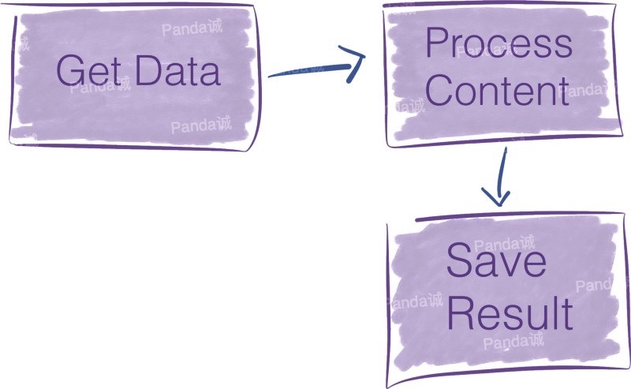
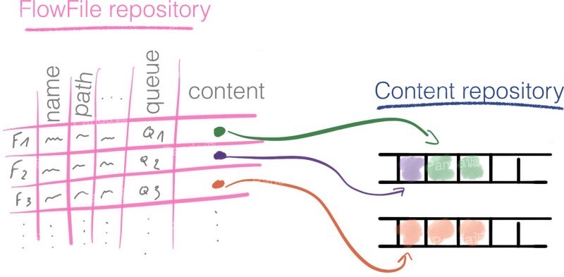

我将在本文中介绍：

- 什么是ApacheNIFI，应在什么情况下使用它，理解在NIFI中的关键概念。

我不会介绍的内容：

-NIFI集群的安装，部署，监视，安全性和管理。

<!-- more -->

## 什么是ApacheNIFI？

在ApacheNIFI项目的官网上，可以找到以下定义：

```
一个易于使用，功能强大的、可靠的处理和分发数据的系统。
```

接下来我们分析一下关键字。

### NIFI定义

**处理和分发数据**

这是NIFI的要旨。它可以在系统中移动数据，并为你提供处理该数据的工具。

NIFI可以处理各种各样的数据源和不同格式的数据。你可以从一个源中获取数据，对其进行转换，然后将其推送到另一个目标存储地。


**易于使用**

Processors-boxes-通过连接器链接-箭头创建流程。NIFI提供了一个基于流的编程体验。

NIFI让我们一眼就能理解一组数据流操作，而这或许将需要数百行源代码来实现。

考虑下面的pipeline：



如果要在NIFI中实现转换上述的数据流，只需在NIFI图形用户界面，将三个组件拖放到画布中，然后连接做配置。也就需要个两分钟。


而如果你编写代码来执行相同的操作，则可能需要数百行才能达到相似的结果。

NIFI在构建数据pipeline方面更具表现力，我们不需要写代码，而NIFI就是为此而设计的。

**强大**

NIFI提供了许多开箱即用的处理器。使用者其实是站在巨人的肩膀上。这些标准处理器可以处理你可能遇到的绝大多数需求。

NIFI是高度并发的，但其内部封装了相关的复杂性。我们看到的处理器是一个高级抽象，它掩盖了并行编程固有的复杂性。我们可以多个处理器一起运行，一个处理器也可以有多个线程运行。

并发是你不希望打开的计算型Pandora盒。NIFI使得pipeline构建器免受并发复杂性的影响。

**可靠**

NIFI的设计实现具有扎实的理论基础。与SEDA之类的模型相似(SEDA全称是：stage event driver architecture，中文直译为“分阶段的事件驱动架构”，它旨在结合事件驱动和多线程模式两者的优点，从而做到易扩展，解耦合，高并发。各个stage之间的通信由event来传递，event的处理由stage的线程池异步处理。)。

对于数据流系统，要解决的主要问题之一就是可靠性。你想确保发送到某处的数据得到了有效接收。

NIFI通过多种机制在任何时间点跟踪系统状态，从而实现了高度的可靠性。这些机制是可配置的，因此你可以在延迟和应用程序所需的吞吐量之间进行适当的权衡。

NIFI利用lineage和provenance特征来跟踪每条数据的历史记录。它使得知道每条信息发生了什么转变。

Apache NIFI提出的数据血缘解决方案被证明是审核数据pipeline的出色工具。在诸如欧盟这样的跨国参与者提出支持准确数据处理的准则的背景下，数据血缘功能对于增强人们对大数据和AI系统的信心至关重要。

### 为什么要使用NIFI？

在确定解决方案时，请记住大数据的四个特点。


- Volume — 你有多少数据？在数量级上，你接近几GB还是几百个PB？
- Variety — 你有多少个数据源？你的数据是否结构化？如果是，结构是否经常变化？
- Velocity — 你需要处理的频率是多少？是信用卡付款吗？它是物联网设备发送的每日性能报告吗？
- Veracity — 你可以信任数据吗？另外，在操作之前是否需要进行多次清洁操作？

NIFI无缝地从多个数据源提取数据，并提供了处理数据中不同模式的机制。因此，当数据种类繁多时，它就非常适用了。

如果数据准确性不高，则NIFI尤其有价值。NIFI提供了多个处理器来清理和格式化数据。

通过其配置选项，NIFI可以解决各种 volume/velocity 场景问题。

**数据路由解决方案的应用程序列表越来越多**

物联网的兴起及其生成的数据流都强调了诸如Apache NIFI之类的工具的重要性。

- 微服务是新潮。在那些松耦合的服务中，数据是服务之间的契约。NIFI是在这些服务之间路由数据的可靠方法。
- 物联网将大量数据带到云中。对从边缘到云的数据的采集和验证带来了许多新挑战，NIFI可以有效应对这些挑战（主要是通过MiNIFI，针对边缘设备的NIFI项目）
- 制定了新的准则和法规以重新调整大数据经济。在日益增加的监视范围内，对于企业来说，至关重要的是清楚地了解其数据pipeline。例如，NIFI数据血缘可能会有助于你遵守法规。

**弥合大数据专家与其他专家之间的鸿沟**

从用户界面可以看到，用NIFI表示的数据流非常适合与你的数据pipeline进行通信。它可以帮助你的组织成员更加了解数据pipeline中发生的事情。

- 分析师正在寻求有关为什么这些数据以这种方式到达此处的见解？坐在一起，并在流程中漫步。在五分钟内，你将对提取转换和加载-ETL-pipeline有深入的了解。
- 你是否需要同行的反馈，以帮助你创建新的错误处理流程？NIFI决定将错误路径视为有效结果，这是一项设计决策。期望流程审查比传统的代码审查要短。

**你应该使用它吗？或许吧**

NIFI本身就易于使用。尽管如此，它还是一个企业数据流平台。它提供了一套完整的功能，你可能只需要其中的一部分即可。

如果你是从头开始并管理来自受信任数据源的一些数据，那么最好设置ETL pipeline。你可能只需要从数据库中捕获更改数据和一些数据准备脚本即可。

另一方面，如果你在使用现有大数据解决方案（用于存储，处理或消息传递）的环境中工作，则NIFI可以很好地与它们集成，并且很可能会很快获胜。你可以利用现成的连接器连接其他大数据解决方案。

既然我们已经看到了Apache NIFI的优点，现在我们来看看它的关键概念并剖析其内部结构。

我们已经理解了“NiFi is boxes and arrow programming”。但是，如果你必须使用NIFI，则可能需要更多地了解其工作原理。

在第二部分中，我将说明Apache NIFI的关键概念。

## 剖析Apache NIFI

启动NIFI时，你会进入其Web界面。 Web UI是设计和控制数据pipeline的蓝图。


在NIFI中，处理器通过connections连接在一起。在前面介绍的示例数据流中，有三个处理器。


**理解NIFI术语**

要使用NIFI表示数据流，你必须首先掌握其语言。不用担心，只需几个术语就足以掌握其背后的概念。

那些一个个黑匣子称为处理器，它们通过称为connections的队列交换名为FlowFiles的信息块。最后，FlowFile Controller负责管理这些组件之间的资源。


让我们看看它是如何工作的。

### FlowFile
在NIFI中，FlowFile是在pipeline处理器中移动的信息包。


FlowFile分为两个部分：

- **Attributes**，即键/值对。例如，文件名，文件路径和唯一标识符是标准属性。
- **Content**，对字节流的引用构成了FlowFile内容。

FlowFile不包含数据本身，否则会严重限制pipeline的吞吐量。相反，FlowFile保留的是一个指针，该指针引用存储在本地存储中某个位置的数据。这个地方称为内容存储库(Content Repository)。


为了访问内容，FlowFile从内容存储库中声明资源(claims),然后将跟踪内容所在位置的确切磁盘偏移，并将其返回FlowFile。

并非所有处理器都需要访问FlowFile的内容来执行其操作-例如，聚合两个FlowFiles的内容不需要将其内容加载到内存中。

当处理器修改FlowFile的内容时，将保留先前的数据。NIFI的`copies-on-write`机制会在将内容复制到新位置时对其进行修改。原始信息保留在内容存储库中。

**Example**

比如一个压缩FlowFile内容的处理器。原始内容会保留在内容存储库中，NIFI并为压缩内容创建一个新条目。

内容存储库最终将返回对压缩内容的引用。 FlowFile里指向内容的指针被更新为指向压缩数据。

下图总结了带有压缩FlowFiles内容的处理器的示例。


**Reliability**

NIFI声称是可靠的，实际上如何？当前使用的所有FlowFiles的属性以及对其内容的引用都存储在`FlowFile Repository`中。

在pipeline的每个步骤中，在对流文件进行修改之前，首先将其以预写日志的方式(write-ahead log)记录在`FlowFile Repository`中。

对于系统中当前存在的每个FlowFile，`FlowFile Repository`存储：

- FlowFile属性
- 指向FlowFile内容的指针
- FlowFile的状态。例如：Flowfile在此瞬间属于哪个队列。



`FlowFile Repository`为我们提供了流程的最新状态；因此，它是从中断中恢复的强大工具。

NIFI提供了另一个工具来跟踪流程中所有FlowFiles的完整历史记录：`Provenance Repository`。

**Provenance Repository**

每次修改FlowFile时，NIFI都会获取FlowFile及其上下文的快照。NIFI中此快照的名称是`Provenance Event`。`Provenance Repository`记录`Provenance Events`。

`Provenance`使我们能够追溯数据血缘关系并为在NIFI中处理的每条信息建立完整的监管链。


除了提供完整的数据血缘之外，`Provenance Repository`还提供从任何时间点重播数据的功能。


等等，`FlowFile Repository`和`Provenance Repository`有什么区别？

`FlowFile Repository`和`Provenance Repository`背后的想法非常相似，但是它们解决的是不同的问题。

- `FlowFile Repository`是一个日志，仅包含系统中正在使用的FlowFiles的最新状态。这是flow的最新情况，可以快速从中断中恢复。
- `Provenance Repository`更为详尽，因为它可以跟踪流中每个FlowFile的完整生命周期。


可以这么理解，`FlowFile Repository`里面保存的是你此时某个动作的照片，`Provenance Repository`保存的是你这个动作的视频。你可以倒退到过去的任何时刻，研究数据，并从给定的时间重放操作。它提供了数据的完整血缘关系。

### Processor

处理器是执行操作的黑匣子。处理器可以访问FlowFile的属性和内容来执行所有类型的操作。它们使你能够在数据输入，标准数据转换/验证任务中执行许多操作，并将这些数据保存到各种数据接收器。


NIFI在安装时会附带许多处理器。如果你找不到适合自己的用例的处理器，可以构建自己的处理器。

处理器是完成一项任务的高级抽象。这种抽象非常方便，因为它使pipeline的构建免受并发编程和错误处理机制的困扰。

处理器提供了多个配置设置的界面以微调其行为。


这些处理器的属性是NIFI与你的应用程序需求之间的最后联系。细节很重要，所以pipeline建设者会花费大部分时间来微调这些属性以匹配预期的行为。

**Scaling**

对于每个处理器，你可以指定要同时运行的并发任务数。这样，流控制器将更多资源分配给该处理器，从而提高其吞吐量。处理器共享线程。如果一个处理器请求更多的线程，则其他处理器的可用线程就会少了。

横向扩展：扩展的另一种方法是增加NIFI群集中的节点数。

### Process Group

现在，我们已经了解了什么是处理器，这很简单。

一堆处理器及其连接可以组成一个`Process Group`。你添加了一个`Input Port`和一个`Output Port`，以便`Process Group`可以接收和发送数据。


### Connections

`Connections`是处理器之间的队列。这些队列允许处理器以不同的速率进行交互。就像存在不同尺寸的水管`Connections`可以具有不同的容量。


由于处理器根据它们执行的操作以不同的速率消耗和产生数据，因此`Connections`充当FlowFiles的缓冲区。

`Connections`中可以有多少数据是有限制的。同样，当水管已满时，你将无法再加水，否则水会溢出。

在NIFI中，你可以限制FlowFile的数量及其通过`Connections`的聚合内容的大小。

当你发送的数据超出`Connections`的处理能力会发生什么？

如果FlowFiles的数量或数据量超过定义的阈值，则将触发背压机制(backpressure)。在队列中没有空间之前，Flow Controller不会安排`Connections`上游的处理器再次运行。

假设你在两个处理器之间最多只能有10000个FlowFile。在某个时候，连接中有7000个元素。因为限制为10000。P1仍然可以通过`Connections`发送数据到P2。


现在，假设处理器一下子向该`Connections`发送了4000个新的FlowFiles。
7000 + 4000 = 11000→我们超过了10000个FlowFiles的连接阈值。


这个限制是软限制，表示可以超出限制，但是Flow Controller不会调度处理器P1，直到`Connections`恢复到其阈值（10000个FlowFiles）以下。


你想要设置适合于要处理的数据量和速度的`Connections`阈值，要始终考虑四个V(大数据的四个特点)。

超出限制的想法听起来很奇怪,当FlowFiles或关联数据的数量超过阈值时，将触发交换机制(swap mechanism)。


**优先处理FlowFiles**

NIFI中的`Connections`是高度可配置的。你可以选择如何在队列中确定FlowFiles的优先级，以确定接下来要处理的文件。

在可用的配置中，例如，先进先出-FIFO。但是，你甚至可以通过FlowFile中的属性来优先处理传入数据包。

### Flow Controller

Flow Controller是将一切融合在一起的粘合剂。它为处理器分配和管理线程。这就是执行数据流的方式。


此外，Flow Controller还可以添加Controller Services。

### Controller Service

这些服务有助于管理共享资源，例如数据库连接或云服务提供商凭据。Controller Services是守护进程(daemons)。它们在后台运行，并提供配置，资源和参数供处理器执行。

例如，你可以使用AWS凭证提供程序服务使你的服务与S3存储桶进行交互，而不必担心处理器级别的凭证。


与处理器一样，开箱即用的控制器服务也很多。

## 总结

如果你详细的阅读了这篇文章每一行内容，那么我相信，你已经是一个合格的NIFI设计者了，接下来你只需要考虑你的需求需要用到哪些组件，去配置那些组件就OK了。


