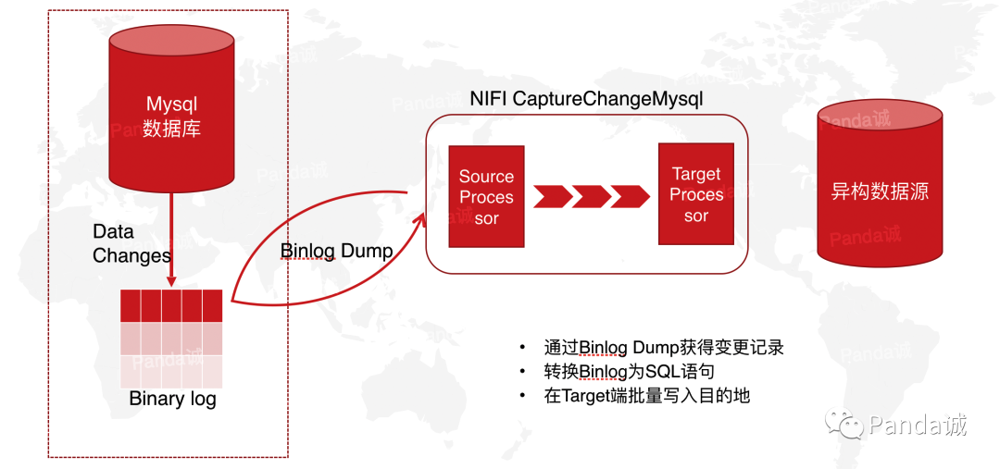

数据抽取是指从源数据源系统抽取需要的数据。实际应用中，数据源较多采用的是关系数据库。总体而言，数据抽取的常见方法有两大类，一是基于查询式的，一是基于日志的。

<!-- more -->

## 基于查询式的数据抽取

基于查询式的数据抽取，顾名思义，以从来源库来源表查询数据为主。总体又有几种：触发器方式，增量字段方式，时间戳方式等等。

### 触发器方式（又称快照式）

在要抽取的表上建立需要的触发器，一般要建立插入、修改、删除三个触发器，每当源表中的数据发生变化，就被相应的触发器将变化的数据写入一个临时表，抽取线程从临时表中抽取数据，临时表中抽取过的数据被标记或删除。

>优点：数据抽取的性能高，ETL加载规则简单，速度快，不需要修改业务系统表结构，可以实现数据的递增加载。

>缺点：要求业务表建立触发器，对业务系统有一定的影响，容易对源数据库构成威胁。

 
### 增量字段方式

它是一种基于快照比较的变化数据捕获方式，在源表上含有一个增量字段，系统中更新修改表数据的时候，同时修改增量字段的值。当进行数据抽取时，通过比较上次抽取时记录的增量字段值来决定抽取哪些数据。`严格意义上讲，增量字段要求必须递增且唯一` 。

>优点：数据抽取的性能高，ETL加载规则简单，速度快，不需要修改业务系统表结构，可以实现数据的递增加载。

>缺点：增量字段必须递增且唯一。对不支持增量字段的自动更新的数据库，需要业务系统来维护。另外，无法捕获对增量字段以前数据的delete和update 操作，在数据准确性上受到了一定的限制。无法获取delete及分别出insert和update。

### 时间戳方式

放宽松条件的增量字段方式，不要求字段唯一，满足递增即可。在源表上含有一个时间戳字段，系统中更新修改表数据的时候，同时修改增量字段的值。当进行数据抽取时，通过比较上次抽取时间与时间戳字段的值来决定抽取哪些数据。有的数据库的时间戳支持自动更新，即表的其它字段的数据发生改变时，自动更新时间戳字段的值。有的数据库不支持时间戳的自动更新，这就要求业务系统在更新业务数据时，手工更新时间戳字段。

优点：数据抽取的性能高，ETL加载规则简单，速度快，不需要修改业务系统表结构，可以实现数据的递增加载。

缺点：对不支持时间戳字段的自动更新的数据库，需要业务系统来维护，业务系统复杂的情况下有可能无法保证时间戳的递增性。另外，无法捕获对增量字段以前数据的delete和update 操作，在数据准确性上受到了一定的限制。在一次抽取过程中如果数据量大，时间戳字段相同值较多，分页查询抽取时可能会丢失数据(order by顺序不定导致)。

### 全表删除插入方式

每次ETL 操作均删除目标表数据，由ETL 全新加载数据。

>优点：ETL 加载规则简单。

>缺点：不适合大表，不可以实现数据的递增加载，如果有关联关系，需要重新进行创建。

## 基于日志的数据抽取

数据库通常借助日志来实现事务，常见的有undo log、redo log，undo/redo log都能保证事务特性，这里主要是原子性和持久性，即事务相关的操作，要么全做，要么不做，并且修改的数据能得到持久化。

我们通过采集日志把已经COMMIT的事务数据抽取出来，对于没有commit的事务不做操作，进而达到数据抽取的目的。

>优点：不需要修改业务系统表结构，数据完整准确(insert update delete)，支持事务

>缺点：环境配置复杂，需要占用数据库系统的一定资源，ETL规则复杂(采集、解析)。

比如说常见的MySQL的binlog日志同步，Oracle使用自带的LogMiner工具解析归档日志等等。

