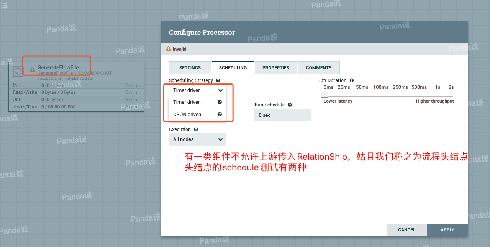
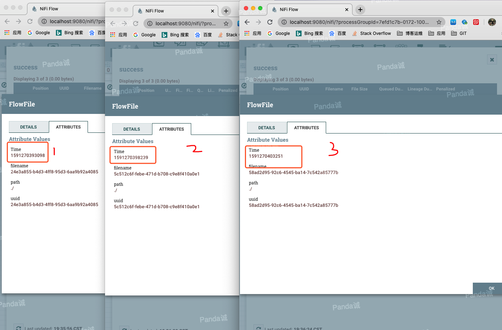
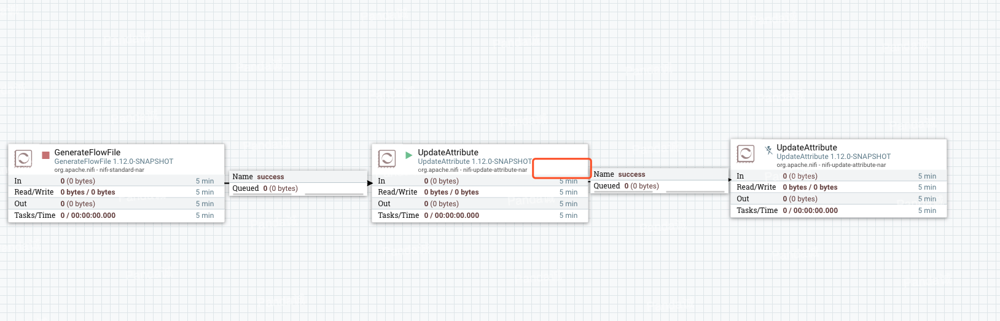
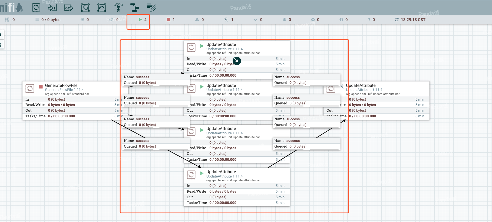
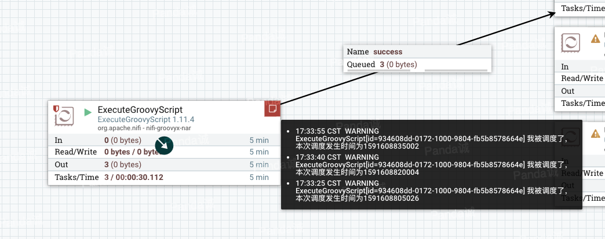
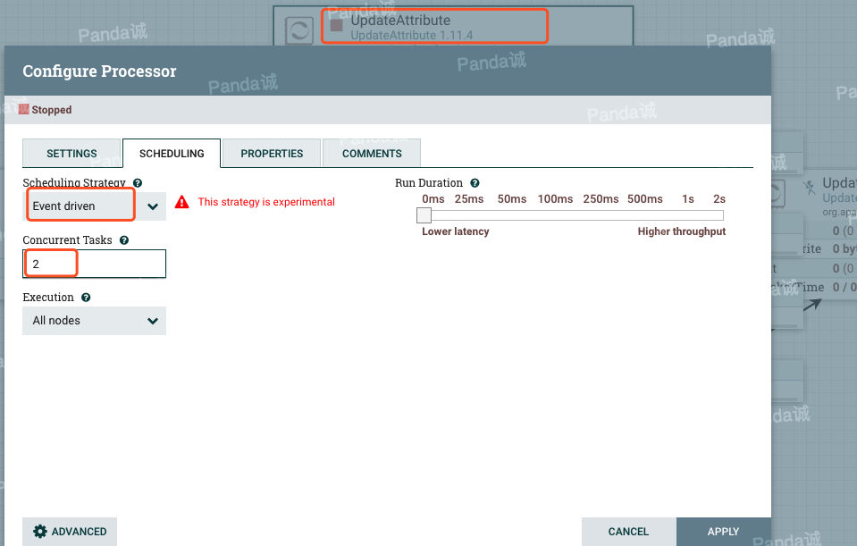

简介：本文主要讲解Apache NIFI的调度策略，对象主要是针对Processor组件。本文假定读者已经对Apache NIFI有了一定的了解和使用经验，同时作者也尽可能的去讲解的更透彻，使得本文尽可能让对NIFI接触不深的读者也能够看懂。
<!-- more -->
## NIFI的调度策略

打开任意一个Processsor，在其配置页面SCHEDULING页签我们可以配置它的调度策略，如下图所示：




在流程中有一类的Processor的实例是不允许传入FlowFIle的，我们姑且可以称之为`流程源结点`(第一个节点)。这类Processor实例的调度策略只有两种，而其他的Processor实例的调度策略有三种。(注意，这里强调的是Processor实例，有些Processor在`源组件`位置时是两种调度策略，没有Event策略，而当这些Processor不处于`源组件`位置时，它会有三种调度策略)

1.  **Timer driven**: 这是调度策略的默认模式。处理器会定期运行。处理器运行的时间间隔由`Run schedule`选项定义。

2.  **Event driven**: 如果选择此模式，则由event触发处理器运行，并且该event在FlowFiles进入到该处理器的上游Connection时发生。该模式当前被认为是实验性的，`并非所有处理器都支持`(Processor类使用@EventDriven注解标注的组件是支持Event driven的)。选择此模式后，`Run schedule`选项不可配置，因为不会触发处理器`定期`运行，而是由event触发。此外，这是可以将`Concurrent tasks`选项设置为0的唯一模式。在这种情况下，线程数仅受`Event-Driven Thread Pool`的大小限制。

3.  **CRON driven**: 当使用CRON驱动的调度模式时，处理器被调度为定期运行(比如每天凌晨调度运行)，`类似于计时器驱动的调度模式`，CRON驱动模式以增加配置复杂性为代价提供了更大的灵活性。 CRON驱动的调度值是由六个必填字段和一个可选字段组成的字符串，每个字段之间用空格分隔。

好了，以上就是本文全部内容。

全剧终。。。

好吧，上面所述都是理论知识，在官方文档里都能看到，下面我们进一步对这些调度策略进行探索总结。


## Timer driven

`Timer driven`是我们最常用的调度策略了，简单易懂，`10 sec`就是每隔10秒调度一次。

可识别的后缀如下所示：

- 纳秒："ns", "nano", "nanos", "nanosecond", "nanoseconds"
- 毫秒："ms", "milli", "millis", "millisecond", "milliseconds"
- 秒："s", "sec", "secs", "second", "seconds"
- 分钟："m", "min", "mins", "minute", "minutes"
- 小时："h", "hr", "hrs", "hour", "hours"
- 天："d", "day", "days"
- 周："w", "wk", "wks", "week", "weeks"

### 疑问1

**那么第一个问题来了，比如说每隔10秒调度一次，是什么意思？是从0秒开始，10秒，20秒，30秒。。。这样的每次去执行调度嘛？还是每次任务结束后开始计时？**

下面我们来实际求证一下。

新拉取一个`ExecuteGroovyScript`组件，选择`Timer driven`并设置2秒运行一次，然后在`Script Body`配置中添加Groovy代码

```groovy
//创建一个流文件
flowFile = session.create()

//添加一个属性，在FlowFIle中记录一个时间，姑且把这个时间当做本次调度开始时间
flowFile = session.putAttribute(flowFile, 'Time', String.valueOf(System.currentTimeMillis()))

//然后休眠3秒
try {
	Thread.sleep(3000);
	} catch (InterruptedException e) {
		e.printStackTrace();
	}
//将FlowFIle传输到success
session.transfer(flowFile, REL_SUCCESS)
```
点击运行后生成了三个流文件


我们分别来看一下这3个流文件的`Time`属性



```
1591270393098
  +5141  大约是5秒
1591270398239
  +5012  大约是5秒
1591270403251
```

所以，结果显而易见了，这里是每次任务结束后开始计时(后面疑问5里会提到源码，源码里就是上一次任务结束后计时，时间一过，然后开始下次任务)。

### 疑问2

**第二个问题 如果我们安排处理器每0秒运行一次（默认情况下），会发生什么？它会一直运行，消耗大量资源吗？**

答案显然是不会的！(如果这点都做不好，还搞啥子Apache顶级项目嘛)

在NIFI安装目录conf下的nifi.properties中有如下配置，队列中没有数据的时候也就是Processor没有可处理的数据，那么我们在这里配置隔多久再去调度**检查**一次组件是否有可做的有工作。

```properties
# If a component has no work to do (is "bored"), how long should we wait before checking again for work?
nifi.bored.yield.duration=10 millis
```

假如我们使用的是默认配置，那么意思是说虽然我们配置了处理器每0秒运行一次，但当Processor没有工作要做时(可以简单理解为上游Connection是空的)，它会等`10 millis`然后再调度一次**检查组件**是否有工作要做(在后面的疑问5里会有源码说明到这个10ms)。

### 疑问3

看到这里使用过Apache NIFI的人可能会有疑问了，怎么会这样，我们在运行流程的时候，比如下图`UpdateAttribute`设置的每0秒运行一次，它的上游Connection是空的，**我们观察它并没有被调度啊？**(组件方块右上角根本没有显示任何数字)



然后我们要明确一点，Processor右上角的那个数字的含义是`Active Tasks`


>`Active Tasks`：**该处理器**当前正在执行的任务数(有几个任务在调用Processor的onTrigger方法)。此数字受Processor配置对话框的`Scheduling`选项卡中的`Concurrent tasks`设置约束。在这里，我们可以看到处理器当前正在执行一项任务。如果NiFi实例是集群的，则此值表示集群中所有节点上当前正在执行的任务数。

额外说一些，那么显示出来的这个`Acrive Task`是怎么来的呢？首先在Apache NIFI中有一个对象`StandardProcessorNode`(可以简单这么理解，我们对于一个组件的调度、并发等等配置以及对这个组件的监控、跟踪等等信息都是存储在这个对象里，每个Processor实例都会对应一个StandardProcessorNode实例),ProcessorNode是线程安全的。在`StandardProcessorNode`中有这么这么几段代码：

```java
    @Override
    public void onTrigger(final ProcessContext context, final ProcessSessionFactory sessionFactory) {
        //获取ProcessorNode所指向的Processor
        final Processor processor = processorRef.get().getProcessor();
        //Active Task +1
        activateThread();
        try (final NarCloseable narCloseable = NarCloseable.withComponentNarLoader(getExtensionManager(), processor.getClass(), processor.getIdentifier())) {
            //这里调用的是Processor的onTrigger方法逻辑
            processor.onTrigger(context, sessionFactory);
        } finally {
            //Active Task -1
            deactivateThread();
        }
    }
```
而`activateThread()`方法

```java
    private final Map<Thread, ActiveTask> activeThreads = new HashMap<>(48);

    private synchronized void activateThread() {
        final Thread thread = Thread.currentThread();
        final Long timestamp = System.currentTimeMillis();
        activeThreads.put(thread, new ActiveTask(timestamp));
    }

```
而在NIFI Web Api里，在生成一个Processor的状态信息时会调用`public synchronized List<ActiveThreadInfo> getActiveThreads()`方法，进而就能够获取到`Acrive Task`数值，这里就不展开源码说了，感兴趣的读者直接顺着上面说的方法查看调用就可以找到了。

那我们来手动证明一次，当Processor没有需要处理的数据时，不会触发Processor的onTrigger方法,我们复用上面的groovy组件，加一行打印日志的代码

```groovy

// 打印警告日志
log.warn('我被调度了')

//创建一个流文件
flowFile = session.create()

//添加一个属性，在FlowFIle中记录一个时间，姑且把这个时间当做本次调度开始时间
flowFile = session.putAttribute(flowFile, 'Time', String.valueOf(System.currentTimeMillis()))

//然后休眠3秒
try {
	Thread.sleep(3000);
	} catch (InterruptedException e) {
		e.printStackTrace();
	}
//将FlowFIle传输到success
session.transfer(flowFile, REL_SUCCESS)
```

然后在`ExecuteGroovyScript`上游添加一个组件`GenerateFlowFile`用于生成流文件。这是持续一段时间后的截图，我们观察组件右上角并没有日志输出表明这个组件的onTrigger并没有被调用


作为对比，我们发送一个流文件，就能观察到日志输出：


总结一下：我们配置了处理器每0秒运行一次，但当Processor没有工作要做时，它会等`10 millis`然后再**检查**一次是否有工作要做，是不会触发Processor运行任务的(不会调Processor的onTrigger方法)。

>这里我们说的比较清楚，Processor没有工作要做导致了没有Active Task(不会触发Processor的onTrigger方法)，而不是说没有线程运行或者没有调度发生。

### 疑问4

**那么怎么判断Processor是否有工作要做？**

首先我们看到，一个叫`ConnectableTask`的实例会去调用`StandardProcessorNode`的`onTrigger`方法，执行的地方叫`invoke()`


而调用`ConnectableTask`的`invoke()`方法的有两个agent：`QuartzSchedulingAgent`对应**CRON driven** `TimerDrivenSchedulingAgent`对应**Timer driven**。先不管agent,在`invoke()`方法会调用`isWorkToDo()`来判断这个组件实例是否有工作要做。

```java
    private boolean isWorkToDo() {
        //Connectables意思是可以连接的组件，这里判断当前的connectable的所有上游的Connection是否都是来自于它自己
        boolean hasNonLoopConnection = Connectables.hasNonLoopConnection(connectable);
        //对FUNNEL组件特殊处理 这里我们直接跳过不看
        if (connectable.getConnectableType() == ConnectableType.FUNNEL) {
            // Handle Funnel as a special case because it will never be a 'source' component,
            // and also its outgoing connections can not be terminated.
            // Incoming FlowFiles from other components, and at least one outgoing connection are required.
            return connectable.hasIncomingConnection()
                    && hasNonLoopConnection
                    && !connectable.getConnections().isEmpty()
                    && Connectables.flowFilesQueued(connectable);
        }
        // 判断当前的组件是否是Source，也就是我们前面说的源组件。以下任意情况都可以说明此组件是源组件
        // 1 当组件被TriggerWhenEmpty注解标注的时候(这个注解你可以理解为上游Connection没有FLowFIle也执行调度)
        // 2 当组件上游没有Connection的时候(没有输入FlowFIle的Connection)
        // 3 当组件上游的所有Connection都是来自于这个组件自己(自己连自己的一个循环)，没有来自其他组价的Connection
        final boolean isSourceComponent = connectable.isTriggerWhenEmpty()
                // No input connections
                || !connectable.hasIncomingConnection()
                // Every incoming connection loops back to itself, no inputs from other components
                || !hasNonLoopConnection;

        // 如果这个组件是源组件，那么系统认为它是有工作要做的，否则得看上游Connection是否有FlowFIle
        return isSourceComponent || Connectables.flowFilesQueued(connectable);
    }
```

>`ConnectableTask`的`invoke()`方法经过一系列验证如果判断可以运行，那么后面会有一行`connectable.onTrigger(processContext, activeSessionFactory);`，就是调用Processor.onTrigger的入口。

总结一下，在`Time drven`策略下(也包括`CRON driven`)，在触发组件的onTrigger方法之前会先判断这个这个组件是否有工作要做，判断结果为true才会继续运行下去，进而调用Processor的onTrigger方法。

### 疑问5

在[理解maxThread设置](./012-理解maxThread设置.md)一文中介绍了`最大计时器线程计数(Max Timer Driven Thread Count)`，那么问题是：**在上面所述，我们检测到组件没有工作要做，在检测的时候它占用了线程池里的线程嘛？** 

先说结论，检测当前组件是否有工作可做的行为是线程池分配一个线程来执行这次调度的一部分，是在调度最前面执行的逻辑，如果判断没有工作可做，那么就不用继续往下执行了，本次调度就结束了(本次调度不执行Processor的onTrigger方法)，这个动作是**很快很快很快**的。也就是说检测是否有工作可做的时候，是要占用一个`最大计时器线程计数(Max Timer Driven Thread Count)`里的线程的。咋一听，不太合理啊。我就配置了这么多数量的线程池，你不干活还得占用我的一个线程。。。然而事实如此，下面我们分别从源码和动手验证来看一下：

首先NIFI继承`ScheduledThreadPoolExecutor`自定义了一个线程池FlowEngine(Timer Drriven和CRON Driven对应的是同一个线程池->FlowEngine实例，而Event Driven对应的是另一个线程池->FlowEngine实例)，
```java
public final class FlowEngine extends ScheduledThreadPoolExecutor 
```

>关于ScheduledThreadPoolExecutor这里简单说一下，ScheduledThreadPoolExecutor继承了ThreadPoolExecutor，也就是说ScheduledThreadPoolExecutor拥有execute()和submit()提交异步任务的基础功能,它的构造方法实际上是调用了ThreadPoolExecutor,ScheduledThreadPoolExecutor实现了ScheduledExecutorService接口，该接口定义了可延时执行异步任务和可周期执行异步任务的特有功能.而延时执行异步任务和周期执行异步任务分别就是Apache NIFI `CRON driven`和`Timer driven`策略的实现核心所在。

```java
//达到给定的延时时间后，执行任务。这里传入的是实现Runnable接口的任务，
//因此通过ScheduledFuture.get()获取结果为null
public ScheduledFuture<?> schedule(Runnable command,
                                       long delay, TimeUnit unit);
//达到给定的延时时间后，执行任务。这里传入的是实现Callable接口的任务，
//因此，返回的是任务的最终计算结果
 public <V> ScheduledFuture<V> schedule(Callable<V> callable,
                                           long delay, TimeUnit unit);

//是以上一个任务开始的时间计时，period时间过去后，
//检测上一个任务是否执行完毕，如果上一个任务执行完毕，
//则当前任务立即执行，如果上一个任务没有执行完毕，则需要等上一个任务执行完毕后立即执行
public ScheduledFuture<?> scheduleAtFixedRate(Runnable command,
                                                  long initialDelay,
                                                  long period,
                                                  TimeUnit unit);
//当达到延时时间initialDelay后，任务开始执行。上一个任务执行结束后到下一次
//任务执行，中间延时时间间隔为delay。以这种方式，周期性执行任务。
public ScheduledFuture<?> scheduleWithFixedDelay(Runnable command,
                                                     long initialDelay,
                                                     long delay,
                                                     TimeUnit unit);
```
以上是ScheduledThreadPoolExecutor执行延时和周期任务的方法，而在前面提到的`TimerDrivenSchedulingAgent`就会调用`flowEngine.scheduleWithFixedDelay`方法来周期的执行任务(对应疑问1每次任务执行完后再计时)。

`TimerDrivenSchedulingAgent`类：
```java
    @Override
    public void doSchedule(final Connectable connectable, final LifecycleState scheduleState) {
        final List<ScheduledFuture<?>> futures = new ArrayList<>();
        final ConnectableTask connectableTask = new ConnectableTask(this, connectable, flowController, contextFactory, scheduleState, encryptor);

        for (int i = 0; i < connectable.getMaxConcurrentTasks(); i++) {
            // 确定要运行的任务并创建它。
            final AtomicReference<ScheduledFuture<?>> futureRef = new AtomicReference<>();

            final Runnable trigger = createTrigger(connectableTask, scheduleState, futureRef);

            // 周期性的去执行这个trigger
            final ScheduledFuture<?> future = flowEngine.scheduleWithFixedDelay(trigger, 0L,
                connectable.getSchedulingPeriod(TimeUnit.NANOSECONDS), TimeUnit.NANOSECONDS);

            // now that we have the future, set the atomic reference so that if the component is yielded we
            // are able to then cancel this future.
            futureRef.set(future);

            // Keep track of the futures so that we can update the ScheduleState.
            futures.add(future);
        }

        scheduleState.setFutures(futures);
        logger.info("Scheduled {} to run with {} threads", connectable, connectable.getMaxConcurrentTasks());
    }    
```
然后重点看上面代码`createTrigger(connectableTask, scheduleState, futureRef)`的实现：
```java
private Runnable createTrigger(final ConnectableTask connectableTask, final LifecycleState scheduleState, final AtomicReference<ScheduledFuture<?>> futureRef) {
        final Connectable connectable = connectableTask.getConnectable();
        final Runnable yieldDetectionRunnable = new Runnable() {
            @Override
            public void run() {
                // 调用上面说的connectableTask的invoke方法(上面提到过，这里会判断组件是否有工作要做等等逻辑)
                final InvocationResult invocationResult = connectableTask.invoke();
                if (invocationResult.isYield()) {
                    logger.debug("Yielding {} due to {}", connectable, invocationResult.getYieldExplanation());
                }
                // 如果组件yielded, 则取消任务重新提交，然后过了yield时间再运行。
                //(这里说的yield有两种，一种是因为组件异常，一种是因为没有工作可做，我们重点关注第二种)
                final long newYieldExpiration = connectable.getYieldExpiration();
                final long now = System.currentTimeMillis();
                //组件处理数据发生异常(指没有被捕获已处理的那些)时，组件会被惩罚一段时间不再被调度。显然没有工作可做的组件不是这种情况
                if (newYieldExpiration > now) {
                    ...
                } //noWorkYieldNanos就是上面疑问2说的10ms
                else if (noWorkYieldNanos > 0L && invocationResult.isYield()) {
                    // Component itself didn't yield but there was no work to do, so the framework will choose
                    // to yield the component automatically for a short period of time.
                    final ScheduledFuture<?> scheduledFuture = futureRef.get();
                    if (scheduledFuture == null) {
                        return;
                    }
                    if (scheduledFuture.cancel(false)) {
                        synchronized (scheduleState) {
                            if (scheduleState.isScheduled()) {
                                //设置延迟10ms再调度一次
                                final ScheduledFuture<?> newFuture = flowEngine.scheduleWithFixedDelay(this, noWorkYieldNanos,
                                    connectable.getSchedulingPeriod(TimeUnit.NANOSECONDS), TimeUnit.NANOSECONDS);
                                scheduleState.replaceFuture(scheduledFuture, newFuture);
                                futureRef.set(newFuture);
                            }
                        }
                    }
                }
            }
        };

        return yieldDetectionRunnable;
    }
```

动手验证的思路很简单，我们在NIFI上有一些正在运行但没有处理数据的Processor(没有active task)，然后修改一些代码使得能够我们查出来这个TimeDriven的FlowEngine线程池里大概正在运行的线程数，如果为0，那么说明`检测`组件有没有工作这个动作是不占线程池资源，如果不为0，那就是印证了上面我们分析源码得到的结论，占用线程池的资源。

在NIFI中我们设置有且只有4个正在运行的但不处理数据的Processor，如图：



按照下面四个步骤修改一下代码：

1. 我们需要添加一个Rest接口帮助我们查询线程池正在运行的大概的线程数，`ControllerResource`类增加

```java
    @GET
    @Consumes(MediaType.WILDCARD)
    @Produces(MediaType.APPLICATION_JSON)
    @Path("activeThreads")
    public int getActiveThreads() {
       return flowController.timerDrivenEngineRef.get().getActiveCount();
    }
```

2. 将`ApplicationResource`中的flowController修改成public

```java
public FlowController flowController;
```

3. 将`FlowController`中的timerDrivenEngineRef修改成public

```java
public final AtomicReference<FlowEngine> timerDrivenEngineRef;
```

4. 防止线程运行太快，我们查不到正在运行的线程，我们在`TimerDrivenSchedulingAgent`类中处理没有工作可做时的逻辑中添加Thread.sleep代码

```java
if (noWorkYieldNanos > 0L && invocationResult.isYield()) {
                    logger.info("当前组件没有工作可以做，进入当前处理逻辑，防止处理太快我们查不到正在运行的线程，我们睡眠2秒");
                    try {
                        Thread.sleep(2000L);
                    } catch (InterruptedException e) {
                        e.printStackTrace();
                    }
                    // Component itself didn't yield but there was no work to do, so the framework will choose
                    // to yield the component automatically for a short period of time.
                    ...
```

编译后运行日志截图如下:


使用PostMan做Get请求结果如图：


如果我们不按第四步修改代码，日志会很快很快的打印`当前组件没有工作可以做，进入当前处理逻辑，防止处理太快我们查不到正在运行的线程，我们睡眠2秒`,并且我们通过Rest接口查询的结果通常就是0


源码分析与动手验证都证实了我们之前的结论，当这个组件启动但是没有处理数据，检测这个组件有没有工作可做也是占用线程池的一部分资源的。

>额外说一点，基于此疑问及得出的结论，我们应该知道，在NIFI中那些不再被使用到的流程和组件应该及时关闭或者清理掉。蚂蚁再小也是肉，积累多了也是会占用我们的资源的,也是基于这个原因，官方试图通过新的Event Driven策略来弥补这些不足。


### 疑问6

如果组件周期运行不是`0 sec`，我们假设是`1000 sec`，那么`检测`组件是否有工作的动作的频率还是10ms嘛？

从上面提到的源码分析，首先调度周期时间是由上一次任务运行完毕后再开始计时(调度周期偏向于FlowFIle之间流向组件的间隔)，并且在检测组件没有工作要做后的再注册的initialDelay还是10ms，那么`检测`组件是否有工作的动作的频率应该还是10ms。

动手验证很简单，基于疑问5搭建的验证场景，我们将四个运行的组件变成一个，这个组件运行的周期设置为`1000 sec`。然后我们观察日志，如果日志输出的多条日志之间是1000多秒，那么证明我们上面说的结论是错误的，如果日志之间是2秒多，那么说明`检测`组件是否有工作的动作的频率应该还是10ms。


总结一下：检测组件是否有工作的动作的周期是与组件配置的周期时间无关的，默认的就是10ms


## CRON driven

在技术实现上，它会先计算CRON表达式，得出现在的时间到定义的CRON下一次运行的时间点的时间差，然后调用的实质是Java`ScheduledThreadPoolExecutor`本身提供的延时执行策略。

CRON driven和Timer driven使用的同一个FlowEngine线程池，同时受`最大计时器线程计数(Max Timer Driven Thread Count)`控制。

CRON driven的调度配置是由六个必填字段和一个可选字段组成的字符串，每个字段之间用空格分隔。这些字段是：


Field           | Valid values    
--------------- | ----------------
Seconds         | 0-59            
Minutes         | 0-59            
Hours           | 0-23            
Day of Month    | 1-31            
Month           | 1-12 or JAN-DEC 
Day of Week     | 1-7 or SUN-SAT  
Year (optional) | empty, 1970-2099

通常，我们可以通过以下方式指定值：

* **Number**: 指定一个或多个有效值。可以使用逗号分隔的列表输入多个值。

* **Range**: 使用`<number>-<number>`语法指定范围。

* **Increment**: 使用`<start value> /<increment>`语法指定一个增量。 比如, 配置Minutes, 0/15 表示 0, 15, 30, 45.

我们还应该注意几个有效的特殊字符：

* \*  — 指示所有值对该字段均有效。

* ?  — 表示未指定特定值。该特殊字符在`Day of Month`和`Day of Week`字段中有效。

* L  — 可以将L附加到`Day of Week`值后面，以指定该天是本月的最后一次出现。例如，1L表示该月的最后一个星期日。

比如:

*  `0 0 13 * * ?` 每天下午一点执行 

* `0 20 14 ? * MON-FRI` 周一到周五每天下午2:20执行

* `0 15 10 ? * 6L 2011-2017` 2011年到2017年每月最后一个星期五上午10:15执行。

### 疑问1

基于上面的动手实验，如果中间的一个`UpdateAttribute`设置的是CRON driven，那么上面所说的`检测`组件是否有工作要做的动作还是每10ms一次嘛？

这里澄清一点，这个疑问本身就是错的。本组件是CRON策略，时间到了某时某刻，启动调度，如果有数据处理(或者是生成数据、拉取数据)就运行，如果没有工作要做，那就结束，等待下一次调度(比如等到明天的某时某刻再执行)。所以CRON driven就没有10ms周期检测组件是否有工作要处理这个动作。

### 疑问2

使用CRON策略，比如我们设置的是`0 0/10 * * * ?`每小时中0、10分钟、20分钟、30分钟、40分钟、50分钟时间执行，然后如果到了10分钟时去调度，但是上一次执行还没有结束怎么办？

我们看一下`QuartzSchedulingAgent`类中的doSchedule方法(start一个Processor就会调用这个方法)

```java
@Override
    public synchronized void doSchedule(final Connectable connectable, final LifecycleState scheduleState) {
        final List<AtomicBoolean> existingTriggers = canceledTriggers.get(connectable);
        if (existingTriggers != null) {
            throw new IllegalStateException("Cannot schedule " + connectable + " because it is already scheduled to run");
        }
        //解析CRON表达式
        final String cronSchedule = connectable.getSchedulingPeriod();
        final CronExpression cronExpression;
        try {
            cronExpression = new CronExpression(cronSchedule);
        } catch (final Exception pe) {
            throw new IllegalStateException("Cannot schedule " + connectable + " to run because its scheduling period is not valid");
        }

        final List<AtomicBoolean> triggers = new ArrayList<>();
        // 根据`Concurrent tasks`的配置，循环注册任务
        for (int i = 0; i < connectable.getMaxConcurrentTasks(); i++) {
            final ConnectableTask continuallyRunTask = new ConnectableTask(this, connectable, flowController, contextFactory, scheduleState, encryptor);

            final AtomicBoolean canceled = new AtomicBoolean(false);

            //计算下一次CRON指定的时间点
            final Date initialDate = cronExpression.getTimeAfter(new Date());
            //计算现在的时间点到下一次CRON指定执行的时间点的时间差
            final long initialDelay = initialDate.getTime() - System.currentTimeMillis();

            final Runnable command = new Runnable() {

                private Date nextSchedule = initialDate;
                //达到这个时间点，虚拟机会运行run方法
                @Override
                public void run() {
                    if (canceled.get()) {
                        return;
                    }
                    try {
                        //这里是上面提过的ConnectableTask的invoke方法，如果应该运行，就会调用Processor的onTrigger方法
                        continuallyRunTask.invoke();
                    } catch (final RuntimeException re) {
                        throw re;
                    } catch (final Exception e) {
                        throw new ProcessException(e);
                    }

                    if (canceled.get()) {
                        return;
                    }
                    //本次调度的主要工作做完了之后，再注册下一次延迟执行
                    //计算下一次任务执行的延时时间
                    nextSchedule = getNextSchedule(nextSchedule, cronExpression);
                    final long delay = getDelay(nextSchedule);

                    logger.debug("Finished task for {}; next scheduled time is at {} after a delay of {} milliseconds", connectable, nextSchedule, delay);
                    //注册下一次延时执行的任务
                    flowEngine.schedule(this, delay, TimeUnit.MILLISECONDS);
                }
            };
            //注册首次的延迟执行任务
            flowEngine.schedule(command, initialDelay, TimeUnit.MILLISECONDS);
            triggers.add(canceled);
        }

        canceledTriggers.put(connectable, triggers);
        logger.info("Scheduled {} to run with {} threads on schedule {}", connectable, connectable.getMaxConcurrentTasks(), cronSchedule);
    }
```
重要的是看一下`getNextSchedule`这个方法，
```java
    private static Date getNextSchedule(final Date currentSchedule, final CronExpression cronExpression) {
        // 由于时钟的精度不是毫秒级，因此我们必须检查是否安排了应该在该时间之后运行的下一个时间，否则我们可能最终会运行两次相同的任务
        final Date now = new Date();
        return cronExpression.getTimeAfter(now.after(currentSchedule) ? now : currentSchedule);
    }    
```

由上面源码我们来分析，比如我们设置的是`0 0/10 * * * ?`每小时中0、10分钟、20分钟、30分钟、40分钟、50分钟时间执行，然后第0分钟运行了一个任务，它执行了15分钟，在它做完所有工作后其实计算的是到第20分钟这个时间点的延迟时间。

手动验证一下，设置`0/5 * * * * ?`，每分钟每0秒、0+5...执行一次，复用上面的groovy代码。

```groovy

// 打印警告日志
log.warn('我被调度了，本次调度发生时间为'+String.valueOf(System.currentTimeMillis()))

//创建一个流文件
flowFile = session.create()

//添加一个属性，在FlowFIle中记录一个时间，姑且把这个时间当做本次调度开始时间
flowFile = session.putAttribute(flowFile, 'Time', String.valueOf(System.currentTimeMillis()))

//然后休眠10秒
try {
	Thread.sleep(10000);
	} catch (InterruptedException e) {
		e.printStackTrace();
	}
//将FlowFIle传输到success
session.transfer(flowFile, REL_SUCCESS)
```



我们得到4个流文件，一下依次是每个流文件的Time属性值
```
1591608805094
    + 15秒
1591608820004
    + 15秒
1591608835002
    + 15秒
1591608850005
```

第0秒第一次调度，如果执行的很快，那么第5秒应该执行第二次调度。但是第一次调度需要处理的数据很多，处理了10秒才完成任务，这个时候已经过了第5秒、第10秒这两个时间点，所以计算延迟时间使用的是第15秒这个时间点。而最终我们看到的各个流文件Time这个值的间隔是15秒，而不是5秒。

## Event driven

如果选择此模式，则由event触发处理器运行，并且该event在FlowFiles进入到该处理器上游Connection时发生。该模式当前被认为是实验性的，`并非所有处理器都支持`(Processor类使用@EventDriven注解标注的Processor都支持Event driven)。选择此模式后，`Run schedule`选项不可配置，因为不会触发处理器`定期`运行，而是由event触发。此外，这是可以将`Concurrent tasks`选项设置为0的唯一模式。在这种情况下，线程数仅受`Event-Driven Thread Pool`的大小限制。

### 疑问1

`Concurrent tasks`配置还有效果嘛？

如果我们选择了`Event driven`，我们会看到`Concurrent tasks`的默认值变成了0.这里我们测试配置`Concurrent tasks`为2会不会生效。




我们看到`Concurrent tasks`配置成2是有效的。


## 总结

Apache NIFI 内部对组件的调用提供了三种调度策略：Timer driven，CRON driven，Event driven。

其中我们日常使用的是Timer driven，CRON driven。他们共同使用一个线程池，共同受`最大计时器线程计数(Max Timer Driven Thread Count)`限制。

Timer driven本质是使用`ScheduledThreadPoolExecutor`的周期执行任务，CRON driven本质是使用`ScheduledThreadPoolExecutor`延时执行任务。

Event driven是实验性质的，目前也并不是所有的组件都支持，不建议使用，但我们应该知道，Event driven的想法是更好的，效率和资源使用是更优的，后期我们可以期待一下它的完成情况(当然也有可能完不成)

以上并没有说明为什么Timer driven和CRON driven使用的是同一个线程池，这里简单说明一下，在`FlowController`构造函数里，quartzSchedulingAgent和timerDrivenAgent使用的是同一个FlowEngine实例
```java
final QuartzSchedulingAgent quartzSchedulingAgent = new QuartzSchedulingAgent(this, timerDrivenEngineRef.get(), repositoryContextFactory, encryptor);
final TimerDrivenSchedulingAgent timerDrivenAgent = new TimerDrivenSchedulingAgent(this, timerDrivenEngineRef.get(), repositoryContextFactory, encryptor, this.nifiProperties);
```


                                                                                                                                                        