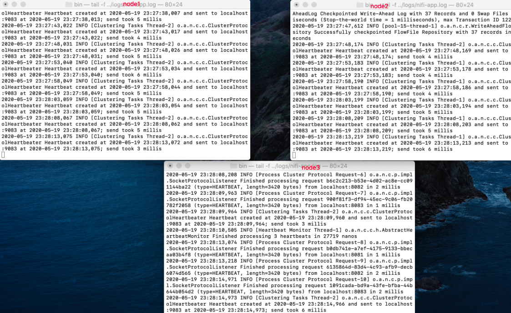

前言：本文重点在于通过模拟事故来探索Apache NIFI集群的高可用，情景假定有一个3节点的NIFI集群，其中某个节点因为未知原因与集群失联，研究集群(两个在联节点集群）和失联的节点会发生什么，各个节点上的数据会怎样。(注意：节点因为未知原因与集群失联区别于系统管理员手动卸载节点)。除此之外，其他不做重点。

我尽量详细描述探索过程，读者可以跟着本文一起实地操作验证。

<!-- more -->

 ### 搭建3节点伪集群

 本节简单说明一下在本地搭建一个3节点的伪集群配置。

 **NIFI版本**：nifi-1.12.0-SNAPSHOT(是的，你没看错，作者也是偶尔会给Apache贡献代码的人)
 **本机系统**：MacOS
 **zookeeper**：NIFI内置zookeeper

 修改nifi.properties(我把需要修改的挑选了出来)
 ```properties
# Specifies whether or not this instance of NiFi should run an embedded ZooKeeper server
nifi.state.management.embedded.zookeeper.start=true

# 3个节点分别是8081 8082 8083
nifi.web.http.port=8081

# cluster node properties (only configure for cluster nodes) #
nifi.cluster.is.node=true
# 3个节点分别是9081 9082 9083
nifi.cluster.node.protocol.port=9081

# 3个节点分别是6341 6342 6343
nifi.cluster.load.balance.port=6341

# zookeeper properties, used for cluster management #
nifi.zookeeper.connect.string=localhost:2181,localhost:2182,localhost:2183
 ```

修改zookeeper.properties(注意3.5.5之后客户端端口要配置在server字符串后面)
```properties
# 3个节点都一样
server.1=localhost:2111:3111;2181
server.2=localhost:2222:3222;2182
server.3=localhost:2333:3333;2183
```

修改state-management.xml(3个节点都一样)
```xml
<cluster-provider>
        <id>zk-provider</id>
        <class>org.apache.nifi.controller.state.providers.zookeeper.ZooKeeperStateProvider</class>
        <property name="Connect String">localhost:2181,localhost:2182,localhost:2183</property>
        <property name="Root Node">/nifi</property>
        <property name="Session Timeout">10 seconds</property>
        <property name="Access Control">Open</property>
</cluster-provider>
```

在3个节点的NIFI目录下(bin目录同级)，新建`state/zookeeper`,zookeeper文件夹里新建文件`myid`，3个节点分别写入`1`,`2`,`3`
```powershell
#3个节点分别写入 1 2 3
echo 1 > myid
```

到此为止，一个简单的本地可启动的3节点使用内置zookeeper的伪集群便配置好了。分别启动三个NIFI节点：



集群启动成功


### 模拟流程搭建

拉取`GenerateFlow`(用于生成流文件)和`LogAttribute`(打印日志，输出流文件属性)两个组件。`GenerateFlow`设置为只在主节点运行(集群模式下，一个流程的第一个节点一般都要设置为主节点运行，可以避免处理重复的数据，这是设计NIFI数据流的常识，当然了ConsumeKafka之类的组件除外)。`LogAttribute`默认设置所有节点运行即可。


配置`connection`为load balance(分发数据到各个节点，否则所有的数据其实都是在主节点运行处理)


### 探索集群节点失联后流文件的分布

由上面的流程截图状态我们看到当前流程里集群有3个节点，一共有111个流文件，现在我们手动停止一个NIFI节点，模拟因未知原因节点失联


然后等待集群重新投票选举，选举完成后我们打开NIFI集群界面


这时我们看到NIFI集群中只剩下了74个流文件了，缺失的那37个流文件还在失联的节点上。同时也可以看到，现在集群是不允许你修改流程的配置的，直到失联节点重新连回集群或者系统管理员卸载失联节点。


Apache NIFI设计就是如此，NIFI不是一个集群数据库(比如说GP之类)，它只是一个数据流处理工具，没必要在每个或者多个节点上备份流文件，这会增加额外的不必要的IO和磁盘存储，会影响到NIFI的性能。

(这里就省略了查看失联节点是否有37个流文件的描述，如果你要查看验证的话，首先将集群所有节点停止，然后启动我们模拟失联的那个节点，等到它启动成功后，这就是一个因为某些原因与集群失联的但仍在运行的节点)

**结论**：**如果其中一个节点发生故障，集群中的其他节点将不会自动承担丢失节点的负载。数据仍然存在于失联的NIFI节点上。**

### 探索集群节点故障后流文件的处理

我们重启失联节点恢复3节点伪集群，`connection`中已经有111个流文件(由上面的探索可知，这111个流文件是分布在3个节点上的)，此时我们启动`LogAttribute`组件，模拟集群中正在处理数据的动作。


启动后，我们立马停止其中一个节点来模拟故障(这里我直接kill掉了一个节点)


等到集群完成重新选举打开集群界面，观察失联节点后的集群：


通过上面3张图我们发现，**失联节点后的集群仍然在处理数据**

那么失联节点如果仍在运行状态(不是被kill，没有stop)，会发生什么呢？

我们模拟因为未知原因，节点与集群失联但仍在运行(停止NIFI集群，重启失联NIFI节点)


如下图，这是一个与集群失联的节点，我们还可以访问到它的用户界面


通过截图我们能看到这个失联节点它仍在处理数据，对比一下时间可以更清晰的看到这个NIFI节点在失联后仍在处理数据，最后一条`LogAttribute`打印的日志是`23:43:13`,下图是我关闭NIFI集群的时间`23:40:--`,并且我是在停止NIFI集群后才启动那个失联节点的。


(额外提一点，上面提到的这个失联节点，是可以修改流程的，这么设计是OK的，但我们如果是还想要这个节点顺利的重新连回集群，那么我们就要避免这个失联节点有修改流程的现象发生)

**结论**：集群中有节点发生故障，集群仍然会继续处理数据，如果失联的节点也在运行的话，失联的节点也会继续处理数据。

### 探索集群节点故障后设置为主节点运行的组件的状态

重新连回节点恢复集群后，我们停止`LogAttribute`，启动`GenerateFlow`


重复上面模拟节点失联，查看集群`GenerateFlow`的状态


可以看到，设置为主节点运行的`GenerateFlow`仍在运行生成流文件。

而失联节点在观察了几分钟后，`GenerateFlow`都没有生成流文件。


**结论**：集群中有节点发生故障，集群中设置为在主节点运行的组件仍继续运行处理数据，如果失联的节点也在运行的话，设置为在主节点运行的组件是不继续运行处理数据的。

### 你可以继续验证

你可以深入继续验证，将`GenerateFlow`设置为所有节点运行，也可以对应场景将`LogAttribute`设置为只在主节点运行，按照上面介绍的'套路'，来进一步验证集群中节点发生故障时，集群和失联节点的表现。

### 总结

首先在我们的流程设计是科学合理的大前提下，当集群节点发生故障时，在保证数据的完整性，准确性已经任务的持续执行方面，Apache NIFI集群是有一定程度的高可用的。如果失联的节点仍在运行，那么我们的数据是完整的，准确的。如果失联的节点宕掉了，而且这个节点上还有没处理完的流文件，那么在人工介入之前，这部分数据其实算是暂时丢失的，当然只要你集群还在，你的任务是一直在运行的。只要我们合理科学的使用Apache NIFI，做好集群的健康监控，他的集群模式应用在一些生产环境上，这种程度的集群高可用是完全可以支撑我们的业务的。(比如说支持业务的实时性比较高的一些同数据步流程)