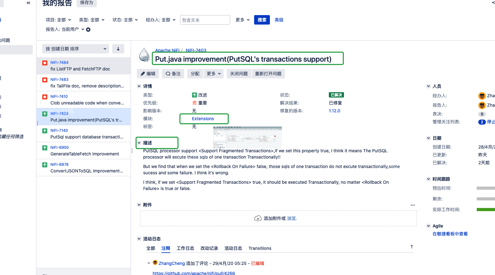
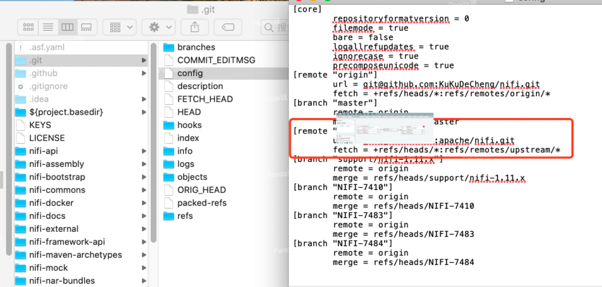

简介：根据个人的一些提交代码的经历,分享一下给Apache社区贡献代码的小经验。
<!-- more -->
## Apache NIFI使用的开发技术

Apache NiFi的后端是用Java编写的,Web层使用JAX-RS,并且JavaScript被广泛用于提供用户界面,依赖于多个第三方JavaScript库,其中包括D3和JQuery。使用Apache Maven构建,将Git用于版本控制系统。文档在AsciiDoc中创建。

## 提交Issue

首先,你应该拥有(注册)一个Apache JIRA的账号。在网上搜索一下JIRA地址

点击登录或者新注册一个用户

进入JIRA后,新建一个issue(新功能或者是bug描述等等)

然后再填写详细的描述信息

以我之前提的新增功能点的NIFI-7403为例(这个已经被合并到master分支,所以状态显示跟新建的会不一样)

## Fork源码

在GitHub上找到Apache NIFI的 项目,然后fork到自己的GitHub

把你自己GitHub账号里fork后的代码拉到你的开发环境,这里别忘了应该配置git的upstream,以便你可以同步Apache NIFI的最新代码

>git remote add upstream https://github.com/apache/nifi.git

现在我们在自己fork的master这个分支,以后这个分支就留作跟踪 upstream 的远程代码

>git pull upstream master 

## 开发代码

按照开发惯例,我们一般不在自己代码仓库的master上提交新的代码,而是需要为每一个新增的功能或者bugfix新增一个新的branch,新分支名称与你在JIRA新建的issue的编号一样。

创建新的分支,现在我们可以在这个分支上更改代码: 

>git checkout -b NIFI-7403

开发完成后,commit push到自己的分支。

这里有几个注意点：

1. 代码风格要与源码一致 常见的有空格、不允许import.*、文档及注释清洗
2. 单元测试很重要,NIFI提供了强大的mock,你需要仔细设计Unit Test,尽可能的覆盖所有的功能测试
3. PR前尽量不要频繁的去commit,仔细点,用心点(给人的感觉可能会好点,因为在PR后review中可能还要不断的修改)

## 提交Pull Request前合并冲突

在我们提交完我们的代码更新之后,一个常见的问题是远程的upstream（即apache/nifi)已经有了新的更新,从而会导致我们提交Pull Request时会导致conflict。为此我们可以在提交自己这段代码前手动先把远程其他开发者的commit与我们的commit合并。

本地开发环境切到自己的master分支

>git checkout master

拉取Apache NIFI master分支最新代码：

>git pull upstream master 

切换回 NIFI-7403 分支,使用

>git checkout NIFI-7403
>git rebase master

然后把自己在NIFI-7403分支中的代码更新到在自己github代码仓库的NIFI-7403分支中去：

>git push origin NIFI-7403 

## 提交PR(Pull Request)

这时候可以在自己的Github仓库页面跳转到自己的NIFI-7403分支,然后点击 new pull request。(或者直接到NIFI的GitHub,会有PR自动提示)

尽可能的描述清楚你的PR(对于英语不好的人来说,不要束手束脚,也不用太在意语法,借助一些翻译工具就OK了,老外同志们都是能看懂的,重要的是让他们能Get到我们的点)

提交PR后会自动编译检测(期间会运行单元测试),一般上需要检测成功后才会被Review

## PR Review

一般情况,社区会分配一个Reviewer给这个PR,但有时候社区的人会很忙,没有人来review,这时候你可以主动一些,在jira或Github里@一些人(如果是修改别人的代码,那就@那些作者是最好的),也可以在`dev@nifi.apache.org`里发邮件申请(发邮件很少见到有人这么做)

之后经过一些讨论和修改,顺利的话,你的代码就会被合并到Apache NIFI  master分支上了。

一开始的时候,你可以适当的修改一些错误的文档来参与贡献,Apache NIFI的文档很多,更新迭代也很快,难免会有一些错误的地方,而且修改文档的PR处理起来很简单,风险也小。

