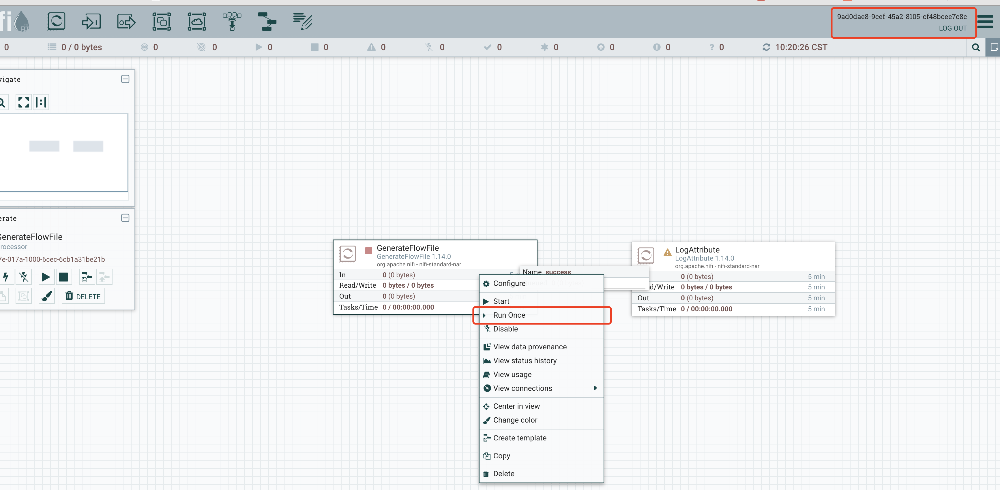
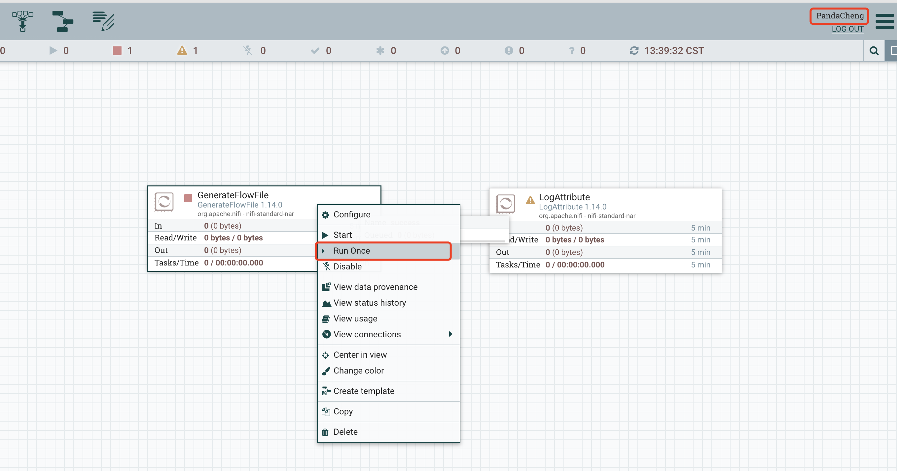
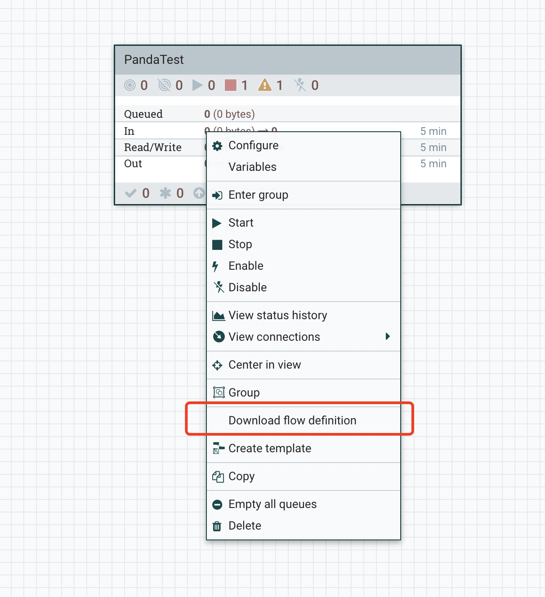
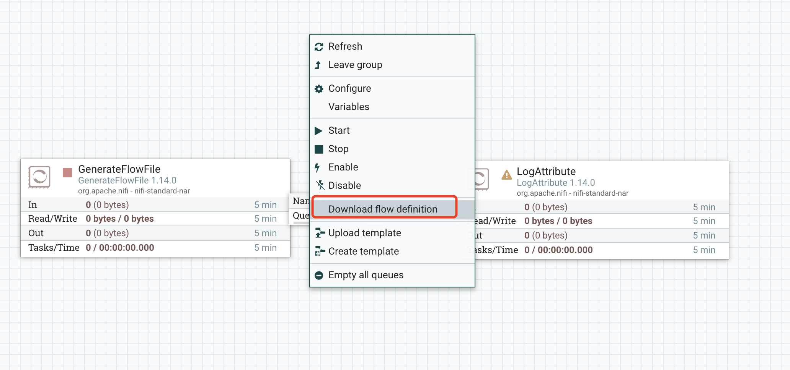

## Version 1.14.0的重大功能更新

Apache NiFi 1.14.0 版是一个增加了重要的功能、改进和bug修复的版本，发布日期2021年7月14日。

1.14.0 版本的亮点包括：

1.  NiFi now starts up in a mode enabling security features by default.  This means NiFi starts up with HTTPS only now instead of HTTP and it requires a specific auto generated username and password to login or the user can explicitly set the username and password which will be used via the provided toolkit.  Gone are the days of firing a default NiFi and it is accessible via HTTP without authentication.  That convenience was wonderful but we found far too many users did this and left wide open NiFi nodes and even clusters accessible on the Internet.  Our secure configuration by default model generates a self-signed server certificate which obviously means that itself isn't very trustworthy for any given client so your browser will likely flag this but we're taking reasonable steps in the right direction.  All the normal recommended security steps are still recommended to ensure a fully secure setup but the default mode is now far better than ever before. 
2.  We have merged the codebases of the Apache NiFI, Apache NiFI MiNiFI Java, and Apache NiFi Registry codebases.  This means every time we release Apache NiFi we are releasing NiFi, MiNiFi Java, and the Registry all at once and with fully aligned codebases.  This means more releases of these components and better compatibility guarantees and easier maintenance and usage and security.
3.  NiFi's Jetty server can be configured to auto detect keystore changes and reload.
4.  Now support Azure Active Directory user group provider.
5.  Now support AWS Kinesis Stream fetching.
6.  Now provide an ASN.1 record reader.
7.  Can now right click on a processor and tell it to 'Run Once' - hugely beneficial for common user experience patterns.
8.  New EncryptContentPGP and DecryptContentPGP processors intended to replace PGP handling in EncryptContent
9.  Can now use Hashicorp Vault encryption for NiFi properties.
10.  Now support the usage of an HDFS/S3/etc.. blob storage to hot load NARs.
11.  100s of other bugs and improvements and features...

基于我们国内的生态环境和使用场景，重点我们要看一下 1、7、10三条。

### 默认HTTPS，不推荐HTTP

在最新1.14.0版本中，NIFI的运行不推荐HTTP模式(http://127.0.0.1:8080/nifi)，默认启动就是HTTPS(https://127.0.0.1:8443/nifi)，并且默认会给你提供一个自签证书(conf目录下)，并且默认提供了一个单用户登录机制，下面我来实地操作体验一番。

首先可以在国内一些镜像网站上下载最新版本的NIFI(这里以1.14.0为例)。

我常用的两个镜像：

- 北理的镜像网站 https://mirrors.bit.edu.cn/apache/nifi/
- 清华的镜像网站 https://mirrors.tuna.tsinghua.edu.cn/apache/nifi/


解压之后注意conf目录，


然后启动NIFI，


启动完成后注意观察：
- conf目录中多了keystore和truststore文件
- 日志控制台输出打印了自动生成的用户名和密码
- 登陆地址是https://127.0.0.1:8443/nifi

由于这里使用的是自签证书，所以浏览器会报不安全，忽略继续前往即可


复制自动生成的用户名和密码，登陆NIFI：


然后新建一个组件



需要注意的是，默认的机制里NIFI提供的是单用户，并且会为你生成一个用户名和密码，所以这里是没有租户和权限一说的，如果想要自己指定用户名和密码？

```shell
./nifi.sh set-single-user-credentials PandaCheng @admin@admin
```

单用户的用户名和加密后的密码会存在login-identity-providers.xml文件中，密码修改前：


修改密码以及修改密码后：


修改完密码需要重启NIFI后才生效。

最后，如果我就想想用HTTP呢？把对应的配置修改一下就可以了。
```
nifi.remote.input.secure=false
nifi.web.http.host=127.0.0.1
nifi.web.http.port=8443
nifi.web.https.host=
nifi.web.https.port=
```

注意的是，想用哪个模式一开始就确定好，不然可能会遇到一些问题(毕竟是新加的功能)，比如我在使用Https模式下建的任务，然后修改成Http后，操作就遇到了下面一些问题：


### Run Once

只调度运行一次，然后就自动stop。这个功能可谓是很实用了，操作也非常简单，就不用多说了。




但是感觉有个小bug，在我将调度模式调成Cron的时候，Run Once之后，线程的停止似乎有些问题：


### HDFS热加载Nar

在此之前已经有一个本地热加载的功能我们先复习一下，在nifi.properties里有一个配置，
```
nifi.nar.library.autoload.directory=./extensions
```
场景是我们在`不重启NIFI`的情况下，将我们自定义的新写的组件所在的nar放在这个目录下，就可以被自动加载，注意，如果是平时的开发要更新已存在的nar，还是要重启的。但是这个功能在集群模式下就很不友好了，所以期望在集群模式下，可以有一个第三方的存储nar的地方，我们直接把nar放进去就好了嘛。

所以新版本提供了NAR Providers的功能，可以远程的把nar下载下来并拷贝到`nifi.nar.library.autoload.directory`，然后就实现了自动加载了。

以HDFS NAR Provider为例在nifi.properties里配置的例子：

```
nifi.nar.library.provider.hdfs1.implementation=org.apache.nifi.nar.hadoop.HDFSNarProvider
nifi.nar.library.provider.hdfs1.resources=/etc/hadoop/core-site.xml
nifi.nar.library.provider.hdfs1.source.directory=/customNars

nifi.nar.library.provider.hdfs2.implementation=org.apache.nifi.nar.hadoop.HDFSNarProvider
nifi.nar.library.provider.hdfs2.resources=/etc/hadoop/core-site.xml
nifi.nar.library.provider.hdfs2.source.directory=/other/dir/for/customNars
```

由于手里没有HDFS环境，就不做实地实验了，外部拉取nar的默认是5分钟拉取一次。(`nifi.nar.library.autoload.directory`目录是5秒监听拉取一次)。

### 上传流程定义

新版本中拉取一个ProcessGroup的时候多了一个上传流程定义文件(json文件)的功能。这个小功能也很赞，想想以前我们是如何迁移流程的(导flow.xml、建模板手动配置等等)，现在只需要用流程定义下载上传就可以了。


之前有一个下载流程定义的功能，可以下载到一个json文件。




在流程上和流程内点击下载的效果是一样的。


需要注意的是，流程定义不包含敏感信息比如数据库密码等等。其他的组件配置、注解、变量注册表的信息都会携带。


