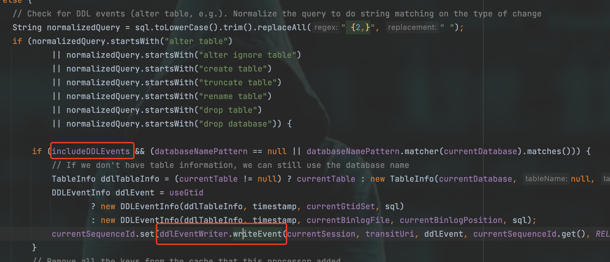

在[数据抽取的常见理论方法](./004-数据抽取的常见方法.md)一文中，我们历数了各种的数据抽取的方式，其中基于查询式的抽取方式侵入性最小，但往往无法满足我们的需求，触发器的方式就不说了(嗯，有可能你一说用触发器，领导们脸色就变了，其实在少量的同步数据抽取采集我感觉反而触发器性价比基于日志的会更高)，最后就是基于日志的。基于日志的数据采集我开发和研究过MySQL的binlog日志和Oracle的redo日志，这篇文章就一起研究一下NIFI中的基于binlog日志的MySQL实时采集组件`CaptureChangeMySQL`。

## 描述

从MySQL数据库中捕获变更数据的CDC事件。 CDC事件包括 `INSERT、UPDATE、DELETE`操作。事件作为单独的流文件输出，按操作发生的时间排序。

## 配置

以下挑选主要的几个配置进行说明讲解(用户名 密码 驱动等等啥的就不说了)。

### MySQL Hosts

必填项，与`MySQL集群`中的节点对应的主机名/端口条目`列表`(例如host1:port,host2:port,....)。该处理器将尝试按顺序连接到列表中的主机。如果一个节点出现故障并为集群启用了故障转移，则处理器将连接到其他活动节点。

很简单，就是配置数据库地址的。

### Server ID

非必填项(`但真的要填啊！`)，连接到MySQL复制组的客户端实际上是一个简化的副本（服务器），此处的Server ID在整个复制组中必须是唯一的（即不同于任何主服务器或副本使用的任何其他Server ID）。因此，CaptureChangeMySQL的`每个实例`在整个复制组中都必须具有唯一的服务器ID。如果未指定服务器ID，则默认为65535。

总而言之，言而总之，就是要 `唯一`、`唯一`、还是`唯一`。（我习惯直接使用当前的Long型的时间戳填进去。）并且是合格的long值，因为代码里对这个配置进行了Long值校验。

那我不唯一能咋地？能咋地？(这里就是贱贱的反问，不是打错字)

还能咋地，报错呗。

### Database/Schema Name Pattern

非必填项(`但一般要填啊！不然事件太多了啊 ==！`)，一个正则表达式（regex），用于根据CDC事件列表匹配数据库（或schema，具体取决于RDBMS的术语）。 正则表达式必须与存储在RDBMS中的数据库名称匹配。如果未设置此属性，则数据库名称将不会用于筛选CDC事件。NOTE: DDL事件，即使它们影响不同的数据库，也与用来执行DDL的数据库会话相关联。这意味着，如果连接到一个数据库，但DDL针对另一个数据库发出，则连接的数据库将是与指定模式匹配的数据库。

从库名(schema名称)来过滤事件，其实从Java定义的api角度看MySQL这里应该叫catalog。

>简单来说，Java定义了一系列的接口定义，各个数据库厂商按照规范去实现，来提高一个驱动。比如说其中有一个查询主键的接口定义`databaseMetaData.getPrimaryKeys(catalogName, schemaName, tableName)`， 对于MySQL来说库名称是对应catalogName的。再比如说Oracle，就是对应schemaName的。

然后他Note我们(虽然翻译的比较别扭，其实大家应该都能看懂，但我这边再啰嗦啰嗦)，说假如哈，你连接的是一个databaseName叫A的数据库，然后你修改了一个databaseName叫B的数据库里的表(`alter table b.test ..... `)，但这个DDL事件是挂载A的名下的。而假如你用这个配置，只要A库的事件，那不幸的是，刚刚上面说的修改`b.test`的DDL事件也是合法的。

阿诚啊！这里有个问题啊。在描述里不是说只有DML的三种事件嘛，这里怎么又冒出来DDL事件了呢？

答案你可能想不到！真相只有一个！NIFI关于CaptureChangeMySQL组件功能描述没写全！！ 惊不惊喜？意不意外？

什么？正则表达式怎么写？？

我也记不住，复杂点的也是查教程，然后试着试着就写出来了。

### Table Name Pattern

非必填项(`但一般要填啊！不然事件太多了啊 ==！`)，上面已经说了Database/Schema Name Pattern，这个就不多说了吧。

### Distributed Map Cache Client

非必填项(`但真的要填啊！`)

标识用于保存处理器所需的各种`表`、`列`等信息的分布式映射缓存客户端控制器服务。如果未指定，则生成的事件将`不包括列类型或名称信息`。

第一，这个配置叫分布式缓存`客户端`(那肯定对应有`服务端`的)，第二，如果你不配置这个东西，生成的事件就`不包括列类型或名称信息`，那你就看不懂这个事件。

说白了这个就是让你提供一个Map(存东西的地方)，key是tableId，value是关于这张表的元数据信息。而tableId呢，就是个数字，

