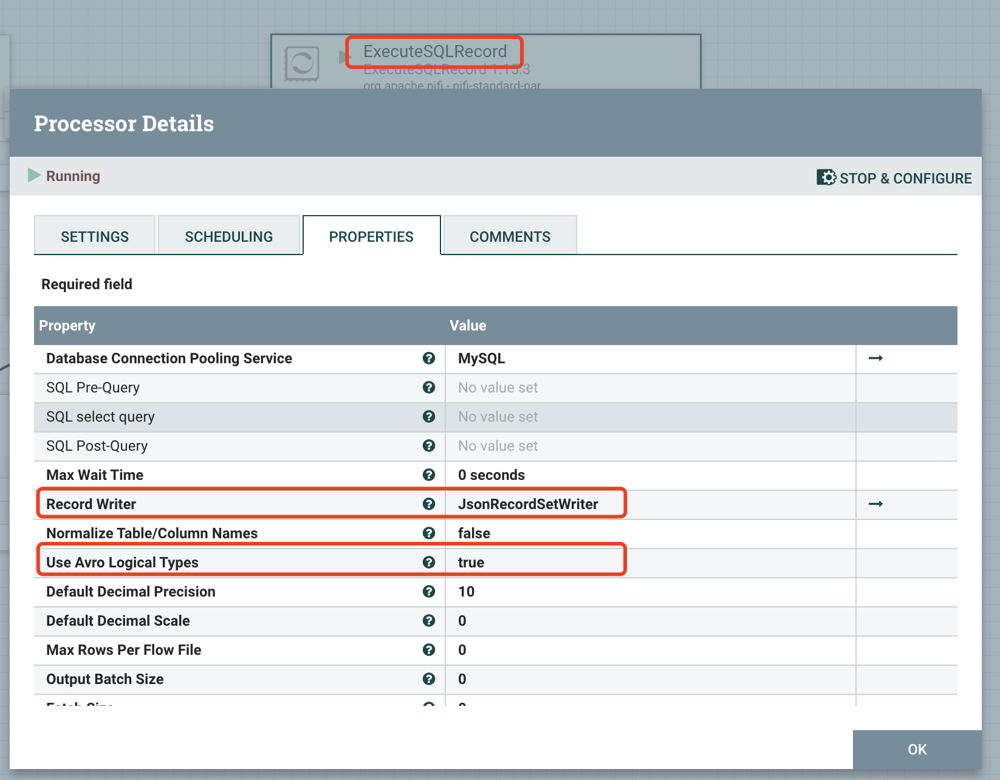
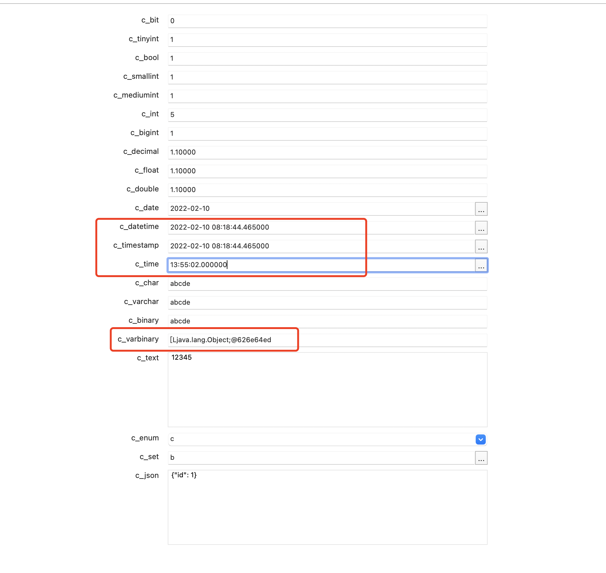

## 准备

MySQL 5.7

```log
jdbc:mysql://ip:3306/zc?serverTimezone=Asia/Shanghai&useUnicode=true&characterEncoding=UTF-8&zeroDateTimeBehavior=convertToNull&tinyInt1isBit=false&useSSL=false
```

全字段建表语句
```sql
CREATE TABLE `test` (
  `c_bit` bit(1) DEFAULT b'0',
  `c_bit_m` bit(10) DEFAULT b'1',
  `c_tinyint` tinyint(127) DEFAULT '1',
  `c_bool` tinyint(1) DEFAULT '1',
  `c_smallint` smallint(6) DEFAULT '1',
  `c_mediumint` mediumint(9) DEFAULT '1',
  `c_int` int(11) NOT NULL AUTO_INCREMENT,
  `c_bigint` bigint(20) DEFAULT '1',
  `c_decimal` decimal(10,5) DEFAULT '1.10000',
  `c_float` float(10,5) DEFAULT '1.10000',
  `c_double` double(10,5) DEFAULT '1.10000',
  `c_date` date DEFAULT '2022-02-10',
  `c_datetime` datetime(6) NOT NULL DEFAULT CURRENT_TIMESTAMP(6) ON UPDATE CURRENT_TIMESTAMP(6),
  `c_timestamp` timestamp(6) NOT NULL DEFAULT CURRENT_TIMESTAMP(6) ON UPDATE CURRENT_TIMESTAMP(6),
  `c_time` time(6) DEFAULT '13:55:02.000000',
  `c_year` year(4) DEFAULT '2022',
  `c_char` char(5) DEFAULT 'abcde',
  `c_varchar` varchar(255) DEFAULT 'abcde',
  `c_binary` binary(5) DEFAULT 'abcde',
  `c_varbinary` varbinary(255) DEFAULT 'abcde',
  `c_tinyblob` tinyblob,
  `c_tinytext` tinytext,
  `c_blob` blob,
  `c_text` text,
  `c_mediumblob` mediumblob,
  `c_mediumtext` mediumtext,
  `c_longblob` longblob,
  `c_longtext` longtext,
  `c_enum` enum('a','b','c') DEFAULT 'c',
  `c_set` set('a','b','c') DEFAULT 'b',
  `c_geometry` geometry DEFAULT NULL,
  `c_point` point DEFAULT NULL,
  `c_linestring` linestring DEFAULT NULL,
  `c_polygon` polygon DEFAULT NULL,
  `c_multipoint` multipoint DEFAULT NULL,
  `c_multilinestring` multilinestring DEFAULT NULL,
  `c_multipolygon` multipolygon DEFAULT NULL,
  `c_geometrycollection` geometrycollection DEFAULT NULL,
  `c_json` json DEFAULT NULL,
  PRIMARY KEY (`c_int`)
) ENGINE=InnoDB AUTO_INCREMENT=4 DEFAULT CHARSET=utf8mb4;
```
插入测试数据(有默认值的就不用管了)
```sql
INSERT INTO `zc`.`test` (
	`c_tinyblob`,
	`c_tinytext`,
	`c_blob`,
	`c_text`,
	`c_mediumblob`,
	`c_mediumtext`,
	`c_longblob`,
	`c_longtext`,
	`c_enum`,
	`c_set`,
	`c_geometry`,
	`c_point`,
	`c_linestring`,
	`c_polygon`,
	`c_multipoint`,
	`c_multilinestring`,
	`c_multipolygon`,
	`c_geometrycollection`,
	`c_json` 
)
VALUES
	(
		0x307833303339,
		'12345',
		0x307833303339,
		'12345',
		0x307833303339,
		'12345',
		0x307833303339,
		'12345',
		'c',
		'b',
		ST_GeomFromText ( 'POINT(1 1)' ),
		ST_GeomFromText ( 'POINT(1 1)' ),
		ST_GeomFromText ( 'LINESTRING(2 1, 6 6)' ),
		ST_GeomFromText ( 'POLYGON((0 5, 2 5, 2 7, 0 7, 0 5))' ),
		ST_GeomFromText ( 'MULTIPOINT(1 1)' ),
		ST_GeomFromText ( 'MULTILINESTRING((2 1, 6 6))' ),
		ST_GeomFromText ( 'MULTIPOLYGON(((0 5, 2 5, 2 7, 0 7, 0 5)))' ),
		ST_GeomFromText ( 'MULTIPOINT(1 1)' ),
	'{\"id\": 1}' 
	);
```

原表数据(blob和text就不展示出来了)


## 创建测试FLOW

搭建一个简单的测试flow如下


查询原表数据组件配置如下


执行写入目标表组件配置如下


## 测试

逐个测试并记录读写结果

| Column Name | Read | Write |
|--|--|--|
| c_bit | Y | Y |
| c_bit_m | `N` | - |
| c_tinyint | Y | Y |
| c_bool | Y | Y |
| c_smallint | Y | Y |
| c_mediumint | Y | Y |
| c_int | Y | Y |
| c_bigint | Y | Y |
| c_decimal | Y | Y |
| c_float | Y | Y |
| c_double | Y | Y |
| c_date | Y | Y |
| c_datetime | `Y(loss micromills)` |  |
| c_timestamp | `Y(loss micromills)` |  |
| c_time | `Y(loss micromills)` | Y |
| c_year | Y | `N` |
| c_char | Y | Y |
| c_varchar | Y | Y |
| c_binary | Y | Y |
| c_varbinary | Y | `N` |
| c_tinyblob | Y | Y |
| c_tinytext | Y | Y |
| c_blob | Y | `N` |
| c_text | Y | Y |
| c_mediumblob | Y | `N` |
| c_mediumtext | Y | Y |
| c_longblob | Y | `N` |
| c_longtext | Y | Y |
| c_enum | Y | Y |
| c_set | Y | Y |
| c_geometry | Y | `N` |
| c_point | Y | `N` |
| c_linestring | Y | `N` |
| c_polygon | Y | `N` |
| c_multipoint | Y | `N` |
| c_multilinestring | Y | `N` |
| c_multipolygon | Y | `N` |
| c_geometrycollection | Y | `N` |
| c_json | Y | Y |


### 读数据结果及不支持字段

avro.schema
```json
{
    "type": "record",
    "name": "nifiRecord",
    "namespace": "org.apache.nifi",
    "fields": [
        {
            "name": "c_bit",
            "type": [
                "null",
                "boolean"
            ]
        },
        {
            "name": "c_bit_m",
            "type": [
                "null",
                "boolean"
            ]
        },
        {
            "name": "c_tinyint",
            "type": [
                "null",
                "int"
            ]
        },
        {
            "name": "c_bool",
            "type": [
                "null",
                "int"
            ]
        },
        {
            "name": "c_smallint",
            "type": [
                "null",
                "int"
            ]
        },
        {
            "name": "c_mediumint",
            "type": [
                "null",
                "int"
            ]
        },
        {
            "name": "c_int",
            "type": "int"
        },
        {
            "name": "c_bigint",
            "type": [
                "null",
                "string"
            ]
        },
        {
            "name": "c_decimal",
            "type": [
                "null",
                {
                    "type": "bytes",
                    "logicalType": "decimal",
                    "precision": 10,
                    "scale": 5
                }
            ]
        },
        {
            "name": "c_float",
            "type": [
                "null",
                "float"
            ]
        },
        {
            "name": "c_double",
            "type": [
                "null",
                "double"
            ]
        },
        {
            "name": "c_date",
            "type": [
                "null",
                {
                    "type": "int",
                    "logicalType": "date"
                }
            ]
        },
        {
            "name": "c_datetime",
            "type": {
                "type": "long",
                "logicalType": "timestamp-millis"
            }
        },
        {
            "name": "c_timestamp",
            "type": {
                "type": "long",
                "logicalType": "timestamp-millis"
            }
        },
        {
            "name": "c_time",
            "type": [
                "null",
                {
                    "type": "int",
                    "logicalType": "time-millis"
                }
            ]
        },
        {
            "name": "c_year",
            "type": [
                "null",
                {
                    "type": "int",
                    "logicalType": "date"
                }
            ]
        },
        {
            "name": "c_char",
            "type": [
                "null",
                "string"
            ]
        },
        {
            "name": "c_varchar",
            "type": [
                "null",
                "string"
            ]
        },
        {
            "name": "c_binary",
            "type": [
                "null",
                "bytes"
            ]
        },
        {
            "name": "c_varbinary",
            "type": [
                "null",
                "bytes"
            ]
        },
        {
            "name": "c_tinyblob",
            "type": [
                "null",
                "bytes"
            ]
        },
        {
            "name": "c_tinytext",
            "type": [
                "null",
                "string"
            ]
        },
        {
            "name": "c_blob",
            "type": [
                "null",
                "bytes"
            ]
        },
        {
            "name": "c_text",
            "type": [
                "null",
                "string"
            ]
        },
        {
            "name": "c_mediumblob",
            "type": [
                "null",
                "bytes"
            ]
        },
        {
            "name": "c_mediumtext",
            "type": [
                "null",
                "string"
            ]
        },
        {
            "name": "c_longblob",
            "type": [
                "null",
                "bytes"
            ]
        },
        {
            "name": "c_longtext",
            "type": [
                "null",
                "string"
            ]
        },
        {
            "name": "c_enum",
            "type": [
                "null",
                "string"
            ]
        },
        {
            "name": "c_set",
            "type": [
                "null",
                "string"
            ]
        },
        {
            "name": "c_geometry",
            "type": [
                "null",
                "bytes"
            ]
        },
        {
            "name": "c_point",
            "type": [
                "null",
                "bytes"
            ]
        },
        {
            "name": "c_linestring",
            "type": [
                "null",
                "bytes"
            ]
        },
        {
            "name": "c_polygon",
            "type": [
                "null",
                "bytes"
            ]
        },
        {
            "name": "c_multipoint",
            "type": [
                "null",
                "bytes"
            ]
        },
        {
            "name": "c_multilinestring",
            "type": [
                "null",
                "bytes"
            ]
        },
        {
            "name": "c_multipolygon",
            "type": [
                "null",
                "bytes"
            ]
        },
        {
            "name": "c_geometrycollection",
            "type": [
                "null",
                "bytes"
            ]
        },
        {
            "name": "c_json",
            "type": [
                "null",
                "string"
            ]
        }
    ]
}
```
读取数据结果展示：
```json
[ {
  "c_bit" : false,
//   "c_bit_m" : not supported,
  "c_tinyint" : 1,
  "c_bool" : 1,
  "c_smallint" : 1,
  "c_mediumint" : 1,
  "c_int" : 5,
  "c_bigint" : "1",
  "c_decimal" : 1.1,
  "c_float" : 1.1,
  "c_double" : 1.1,
  "c_date" : 1644451200000,
  "c_datetime" : 1644481124465, // loss micromills
  "c_timestamp" : 1644481124465,// loss micromills
  "c_time" : 50102000,
  "c_year" : 1640995200000,
  "c_char" : "abcde",
  "c_varchar" : "abcde",
  "c_binary" : [ 97, 98, 99, 100, 101 ],
  "c_varbinary" : [ 97, 98, 99, 100, 101 ],
  "c_tinyblob" : [ 48, 120, 51, 48, 51, 57 ],
  "c_tinytext" : "12345",
  "c_blob" : [ 48, 120, 51, 48, 51, 57 ],
  "c_text" : "12345",
  "c_mediumblob" : [ 48, 120, 51, 48, 51, 57 ],
  "c_mediumtext" : "12345",
  "c_longblob" : [ 48, 120, 51, 48, 51, 57 ],
  "c_longtext" : "12345",
  "c_enum" : "c",
  "c_set" : "b",
  "c_geometry" : [ 0, 0, 0, 0, 1, 1, 0, 0, 0, 0, 0, 0, 0, 0, 0, -16, 63, 0, 0, 0, 0, 0, 0, -16, 63 ],
  "c_point" : [ 0, 0, 0, 0, 1, 1, 0, 0, 0, 0, 0, 0, 0, 0, 0, -16, 63, 0, 0, 0, 0, 0, 0, -16, 63 ],
  "c_linestring" : [ 0, 0, 0, 0, 1, 2, 0, 0, 0, 2, 0, 0, 0, 0, 0, 0, 0, 0, 0, 0, 64, 0, 0, 0, 0, 0, 0, -16, 63, 0, 0, 0, 0, 0, 0, 24, 64, 0, 0, 0, 0, 0, 0, 24, 64 ],
  "c_polygon" : [ 0, 0, 0, 0, 1, 3, 0, 0, 0, 1, 0, 0, 0, 5, 0, 0, 0, 0, 0, 0, 0, 0, 0, 0, 0, 0, 0, 0, 0, 0, 0, 20, 64, 0, 0, 0, 0, 0, 0, 0, 64, 0, 0, 0, 0, 0, 0, 20, 64, 0, 0, 0, 0, 0, 0, 0, 64, 0, 0, 0, 0, 0, 0, 28, 64, 0, 0, 0, 0, 0, 0, 0, 0, 0, 0, 0, 0, 0, 0, 28, 64, 0, 0, 0, 0, 0, 0, 0, 0, 0, 0, 0, 0, 0, 0, 20, 64 ],
  "c_multipoint" : [ 0, 0, 0, 0, 1, 4, 0, 0, 0, 1, 0, 0, 0, 1, 1, 0, 0, 0, 0, 0, 0, 0, 0, 0, -16, 63, 0, 0, 0, 0, 0, 0, -16, 63 ],
  "c_multilinestring" : [ 0, 0, 0, 0, 1, 5, 0, 0, 0, 1, 0, 0, 0, 1, 2, 0, 0, 0, 2, 0, 0, 0, 0, 0, 0, 0, 0, 0, 0, 64, 0, 0, 0, 0, 0, 0, -16, 63, 0, 0, 0, 0, 0, 0, 24, 64, 0, 0, 0, 0, 0, 0, 24, 64 ],
  "c_multipolygon" : [ 0, 0, 0, 0, 1, 6, 0, 0, 0, 1, 0, 0, 0, 1, 3, 0, 0, 0, 1, 0, 0, 0, 5, 0, 0, 0, 0, 0, 0, 0, 0, 0, 0, 0, 0, 0, 0, 0, 0, 0, 20, 64, 0, 0, 0, 0, 0, 0, 0, 64, 0, 0, 0, 0, 0, 0, 20, 64, 0, 0, 0, 0, 0, 0, 0, 64, 0, 0, 0, 0, 0, 0, 28, 64, 0, 0, 0, 0, 0, 0, 0, 0, 0, 0, 0, 0, 0, 0, 28, 64, 0, 0, 0, 0, 0, 0, 0, 0, 0, 0, 0, 0, 0, 0, 20, 64 ],
  "c_geometrycollection" : [ 0, 0, 0, 0, 1, 4, 0, 0, 0, 1, 0, 0, 0, 1, 1, 0, 0, 0, 0, 0, 0, 0, 0, 0, -16, 63, 0, 0, 0, 0, 0, 0, -16, 63 ],
  "c_json" : "{\"id\": 1}"
} ]
```

#### bit(m) m>1

报错日志
```log
2022-02-10 07:50:33,530 ERROR [Timer-Driven Process Thread-4] o.a.n.p.standard.ExecuteSQLRecord ExecuteSQLRecord[id=e297af85-017e-1000-33fd-32eea74adb5e] Unable to execute SQL select query SELECT * FROM test WHERE c_int <= 5 ORDER BY c_int LIMIT 10000 for StandardFlowFileRecord[uuid=2303cacc-c84b-455e-ae02-58fc9d3f8792,claim=StandardContentClaim [resourceClaim=StandardResourceClaim[id=1644479395111-1, container=default, section=1], offset=0, length=62],offset=0,name=2303cacc-c84b-455e-ae02-58fc9d3f8792,size=62] due to org.apache.nifi.processor.exception.ProcessException: java.io.IOException: org.apache.nifi.serialization.record.util.IllegalTypeConversionException: Cannot convert value [[B@2ab9022f] of type class [B to Boolean for field c_bit_m; routing to failure: org.apache.nifi.serialization.record.util.IllegalTypeConversionException: Cannot convert value [[B@2ab9022f] of type class [B to Boolean for field c_bit_m
↳ causes: java.io.IOException: org.apache.nifi.serialization.record.util.IllegalTypeConversionException: Cannot convert value [[B@2ab9022f] of type class [B to Boolean for field c_bit_m
↳ causes: org.apache.nifi.processor.exception.ProcessException: java.io.IOException: org.apache.nifi.serialization.record.util.IllegalTypeConversionException: Cannot convert value [[B@2ab9022f] of type class [B to Boolean for field c_bit_m
org.apache.nifi.processor.exception.ProcessException: java.io.IOException: org.apache.nifi.serialization.record.util.IllegalTypeConversionException: Cannot convert value [[B@2ab9022f] of type class [B to Boolean for field c_bit_m
	at org.apache.nifi.processors.standard.AbstractExecuteSQL.lambda$onTrigger$1(AbstractExecuteSQL.java:321)
	at org.apache.nifi.controller.repository.StandardProcessSession.write(StandardProcessSession.java:2909)
	at org.apache.nifi.processors.standard.AbstractExecuteSQL.onTrigger(AbstractExecuteSQL.java:317)
	at org.apache.nifi.processor.AbstractProcessor.onTrigger(AbstractProcessor.java:27)
	at org.apache.nifi.controller.StandardProcessorNode.onTrigger(StandardProcessorNode.java:1273)
	at org.apache.nifi.controller.tasks.ConnectableTask.invoke(ConnectableTask.java:214)
	at org.apache.nifi.controller.scheduling.TimerDrivenSchedulingAgent$1.run(TimerDrivenSchedulingAgent.java:103)
	at org.apache.nifi.engine.FlowEngine$2.run(FlowEngine.java:110)
	at java.util.concurrent.Executors$RunnableAdapter.call(Executors.java:511)
	at java.util.concurrent.FutureTask.runAndReset(FutureTask.java:308)
	at java.util.concurrent.ScheduledThreadPoolExecutor$ScheduledFutureTask.access$301(ScheduledThreadPoolExecutor.java:180)
	at java.util.concurrent.ScheduledThreadPoolExecutor$ScheduledFutureTask.run(ScheduledThreadPoolExecutor.java:294)
	at java.util.concurrent.ThreadPoolExecutor.runWorker(ThreadPoolExecutor.java:1149)
	at java.util.concurrent.ThreadPoolExecutor$Worker.run(ThreadPoolExecutor.java:624)
	at java.lang.Thread.run(Thread.java:748)
Caused by: java.io.IOException: org.apache.nifi.serialization.record.util.IllegalTypeConversionException: Cannot convert value [[B@2ab9022f] of type class [B to Boolean for field c_bit_m
	at org.apache.nifi.processors.standard.sql.RecordSqlWriter.writeResultSet(RecordSqlWriter.java:88)
	at org.apache.nifi.processors.standard.AbstractExecuteSQL.lambda$onTrigger$1(AbstractExecuteSQL.java:319)
	... 14 common frames omitted
Caused by: org.apache.nifi.serialization.record.util.IllegalTypeConversionException: Cannot convert value [[B@2ab9022f] of type class [B to Boolean for field c_bit_m
	at org.apache.nifi.serialization.record.util.DataTypeUtils.toBoolean(DataTypeUtils.java:1480)
	at org.apache.nifi.serialization.record.util.DataTypeUtils.convertType(DataTypeUtils.java:186)
	at org.apache.nifi.serialization.record.util.DataTypeUtils.convertType(DataTypeUtils.java:172)
	at org.apache.nifi.json.WriteJsonResult.writeValue(WriteJsonResult.java:329)
	at org.apache.nifi.json.WriteJsonResult.writeRecord(WriteJsonResult.java:201)
	at org.apache.nifi.json.WriteJsonResult.writeRecord(WriteJsonResult.java:150)
	at org.apache.nifi.serialization.AbstractRecordSetWriter.write(AbstractRecordSetWriter.java:59)
	at org.apache.nifi.serialization.AbstractRecordSetWriter.write(AbstractRecordSetWriter.java:52)
	at sun.reflect.NativeMethodAccessorImpl.invoke0(Native Method)
	at sun.reflect.NativeMethodAccessorImpl.invoke(NativeMethodAccessorImpl.java:62)
	at sun.reflect.DelegatingMethodAccessorImpl.invoke(DelegatingMethodAccessorImpl.java:43)
	at java.lang.reflect.Method.invoke(Method.java:498)
	at org.apache.nifi.controller.service.StandardControllerServiceInvocationHandler.invoke(StandardControllerServiceInvocationHandler.java:254)
	at org.apache.nifi.controller.service.StandardControllerServiceInvocationHandler.access$100(StandardControllerServiceInvocationHandler.java:38)
	at org.apache.nifi.controller.service.StandardControllerServiceInvocationHandler$ProxiedReturnObjectInvocationHandler.invoke(StandardControllerServiceInvocationHandler.java:240)
	at com.sun.proxy.$Proxy184.write(Unknown Source)
	at org.apache.nifi.processors.standard.sql.RecordSqlWriter.writeResultSet(RecordSqlWriter.java:82)
	... 15 common frames omitted
```

#### datetime timestamp time

实际存储精度可达到微妙级别，但读取出来的数据最多到毫秒。有可能丢失精度。

### 写数据结果及不支持字段



#### year

报错日志
```log
2022-02-10 11:01:28,626 ERROR [Timer-Driven Process Thread-9] o.a.n.p.standard.PutDatabaseRecord PutDatabaseRecord[id=e29c741b-017e-1000-9b5f-741c90f15ca5] Failed to put Records to database for StandardFlowFileRecord[uuid=1468e8c8-f3a6-4b24-bc3d-552c914be23a,claim=StandardContentClaim [resourceClaim=StandardResourceClaim[id=1644479395111-1, container=default, section=1], offset=3603, length=1691],offset=0,name=711bd6ec-9ffa-47fd-a995-a18c29c2da61,size=1691]. Routing to failure.: java.sql.BatchUpdateException: Data truncated for column 'c_year' at row 1
java.sql.BatchUpdateException: Data truncated for column 'c_year' at row 1
	at sun.reflect.NativeConstructorAccessorImpl.newInstance0(Native Method)
	at sun.reflect.NativeConstructorAccessorImpl.newInstance(NativeConstructorAccessorImpl.java:62)
	at sun.reflect.DelegatingConstructorAccessorImpl.newInstance(DelegatingConstructorAccessorImpl.java:45)
	at java.lang.reflect.Constructor.newInstance(Constructor.java:423)
	at com.mysql.jdbc.Util.handleNewInstance(Util.java:425)
	at com.mysql.jdbc.Util.getInstance(Util.java:408)
	at com.mysql.jdbc.SQLError.createBatchUpdateException(SQLError.java:1163)
	at com.mysql.jdbc.PreparedStatement.executeBatchSerially(PreparedStatement.java:1778)
	at com.mysql.jdbc.PreparedStatement.executeBatchInternal(PreparedStatement.java:1262)
	at com.mysql.jdbc.StatementImpl.executeBatch(StatementImpl.java:970)
	at org.apache.commons.dbcp2.DelegatingStatement.executeBatch(DelegatingStatement.java:242)
	at org.apache.commons.dbcp2.DelegatingStatement.executeBatch(DelegatingStatement.java:242)
	at sun.reflect.NativeMethodAccessorImpl.invoke0(Native Method)
	at sun.reflect.NativeMethodAccessorImpl.invoke(NativeMethodAccessorImpl.java:62)
	at sun.reflect.DelegatingMethodAccessorImpl.invoke(DelegatingMethodAccessorImpl.java:43)
	at java.lang.reflect.Method.invoke(Method.java:498)
	at org.apache.nifi.controller.service.StandardControllerServiceInvocationHandler.invoke(StandardControllerServiceInvocationHandler.java:254)
	at org.apache.nifi.controller.service.StandardControllerServiceInvocationHandler.access$100(StandardControllerServiceInvocationHandler.java:38)
	at org.apache.nifi.controller.service.StandardControllerServiceInvocationHandler$ProxiedReturnObjectInvocationHandler.invoke(StandardControllerServiceInvocationHandler.java:240)
	at com.sun.proxy.$Proxy181.executeBatch(Unknown Source)
	at org.apache.nifi.processors.standard.PutDatabaseRecord.executeDML(PutDatabaseRecord.java:790)
	at org.apache.nifi.processors.standard.PutDatabaseRecord.putToDatabase(PutDatabaseRecord.java:931)
	at org.apache.nifi.processors.standard.PutDatabaseRecord.onTrigger(PutDatabaseRecord.java:489)
	at org.apache.nifi.processor.AbstractProcessor.onTrigger(AbstractProcessor.java:27)
	at org.apache.nifi.controller.StandardProcessorNode.onTrigger(StandardProcessorNode.java:1273)
	at org.apache.nifi.controller.tasks.ConnectableTask.invoke(ConnectableTask.java:214)
	at org.apache.nifi.controller.scheduling.TimerDrivenSchedulingAgent$1.run(TimerDrivenSchedulingAgent.java:103)
	at org.apache.nifi.engine.FlowEngine$2.run(FlowEngine.java:110)
	at java.util.concurrent.Executors$RunnableAdapter.call(Executors.java:511)
	at java.util.concurrent.FutureTask.runAndReset(FutureTask.java:308)
	at java.util.concurrent.ScheduledThreadPoolExecutor$ScheduledFutureTask.access$301(ScheduledThreadPoolExecutor.java:180)
	at java.util.concurrent.ScheduledThreadPoolExecutor$ScheduledFutureTask.run(ScheduledThreadPoolExecutor.java:294)
	at java.util.concurrent.ThreadPoolExecutor.runWorker(ThreadPoolExecutor.java:1149)
	at java.util.concurrent.ThreadPoolExecutor$Worker.run(ThreadPoolExecutor.java:624)
	at java.lang.Thread.run(Thread.java:748)
Caused by: java.sql.SQLException: Data truncated for column 'c_year' at row 1
	at com.mysql.jdbc.SQLError.createSQLException(SQLError.java:965)
	at com.mysql.jdbc.MysqlIO.checkErrorPacket(MysqlIO.java:3976)
	at com.mysql.jdbc.MysqlIO.checkErrorPacket(MysqlIO.java:3912)
	at com.mysql.jdbc.MysqlIO.sendCommand(MysqlIO.java:2530)
	at com.mysql.jdbc.MysqlIO.sqlQueryDirect(MysqlIO.java:2683)
	at com.mysql.jdbc.ConnectionImpl.execSQL(ConnectionImpl.java:2486)
	at com.mysql.jdbc.PreparedStatement.executeInternal(PreparedStatement.java:1858)
	at com.mysql.jdbc.PreparedStatement.executeUpdateInternal(PreparedStatement.java:2079)
	at com.mysql.jdbc.PreparedStatement.executeBatchSerially(PreparedStatement.java:1756)
	... 27 common frames omitted
```

#### 空间类型

`GEOMETRY` `POINT` `LINESTRING` `POLYGON` `MULTIPOINT` `MULTILINESTRING` `MULTIPOLYGON` `GEOMETRYCOLLECTION`

报错日志
```log
2022-02-10 11:04:08,004 ERROR [Timer-Driven Process Thread-5] o.a.n.p.standard.PutDatabaseRecord PutDatabaseRecord[id=e29c741b-017e-1000-9b5f-741c90f15ca5] Failed to put Records to database for StandardFlowFileRecord[uuid=880102bf-77d1-43ae-af79-64feb9adc184,claim=StandardContentClaim [resourceClaim=StandardResourceClaim[id=1644479395111-1, container=default, section=1], offset=5334, length=1691],offset=0,name=12ba4906-c3bc-4e7a-86ff-7d2065596e16,size=1691]. Routing to failure.: java.sql.BatchUpdateException: Data truncation: Cannot get geometry object from data you send to the GEOMETRY field
java.sql.BatchUpdateException: Data truncation: Cannot get geometry object from data you send to the GEOMETRY field
	at sun.reflect.NativeConstructorAccessorImpl.newInstance0(Native Method)
	at sun.reflect.NativeConstructorAccessorImpl.newInstance(NativeConstructorAccessorImpl.java:62)
	at sun.reflect.DelegatingConstructorAccessorImpl.newInstance(DelegatingConstructorAccessorImpl.java:45)
	at java.lang.reflect.Constructor.newInstance(Constructor.java:423)
	at com.mysql.jdbc.Util.handleNewInstance(Util.java:425)
	at com.mysql.jdbc.Util.getInstance(Util.java:408)
	at com.mysql.jdbc.SQLError.createBatchUpdateException(SQLError.java:1163)
	at com.mysql.jdbc.PreparedStatement.executeBatchSerially(PreparedStatement.java:1778)
	at com.mysql.jdbc.PreparedStatement.executeBatchInternal(PreparedStatement.java:1262)
	at com.mysql.jdbc.StatementImpl.executeBatch(StatementImpl.java:970)
	at org.apache.commons.dbcp2.DelegatingStatement.executeBatch(DelegatingStatement.java:242)
	at org.apache.commons.dbcp2.DelegatingStatement.executeBatch(DelegatingStatement.java:242)
	at sun.reflect.NativeMethodAccessorImpl.invoke0(Native Method)
	at sun.reflect.NativeMethodAccessorImpl.invoke(NativeMethodAccessorImpl.java:62)
	at sun.reflect.DelegatingMethodAccessorImpl.invoke(DelegatingMethodAccessorImpl.java:43)
	at java.lang.reflect.Method.invoke(Method.java:498)
	at org.apache.nifi.controller.service.StandardControllerServiceInvocationHandler.invoke(StandardControllerServiceInvocationHandler.java:254)
	at org.apache.nifi.controller.service.StandardControllerServiceInvocationHandler.access$100(StandardControllerServiceInvocationHandler.java:38)
	at org.apache.nifi.controller.service.StandardControllerServiceInvocationHandler$ProxiedReturnObjectInvocationHandler.invoke(StandardControllerServiceInvocationHandler.java:240)
	at com.sun.proxy.$Proxy181.executeBatch(Unknown Source)
	at org.apache.nifi.processors.standard.PutDatabaseRecord.executeDML(PutDatabaseRecord.java:790)
	at org.apache.nifi.processors.standard.PutDatabaseRecord.putToDatabase(PutDatabaseRecord.java:931)
	at org.apache.nifi.processors.standard.PutDatabaseRecord.onTrigger(PutDatabaseRecord.java:489)
	at org.apache.nifi.processor.AbstractProcessor.onTrigger(AbstractProcessor.java:27)
	at org.apache.nifi.controller.StandardProcessorNode.onTrigger(StandardProcessorNode.java:1273)
	at org.apache.nifi.controller.tasks.ConnectableTask.invoke(ConnectableTask.java:214)
	at org.apache.nifi.controller.scheduling.TimerDrivenSchedulingAgent$1.run(TimerDrivenSchedulingAgent.java:103)
	at org.apache.nifi.engine.FlowEngine$2.run(FlowEngine.java:110)
	at java.util.concurrent.Executors$RunnableAdapter.call(Executors.java:511)
	at java.util.concurrent.FutureTask.runAndReset(FutureTask.java:308)
	at java.util.concurrent.ScheduledThreadPoolExecutor$ScheduledFutureTask.access$301(ScheduledThreadPoolExecutor.java:180)
	at java.util.concurrent.ScheduledThreadPoolExecutor$ScheduledFutureTask.run(ScheduledThreadPoolExecutor.java:294)
	at java.util.concurrent.ThreadPoolExecutor.runWorker(ThreadPoolExecutor.java:1149)
	at java.util.concurrent.ThreadPoolExecutor$Worker.run(ThreadPoolExecutor.java:624)
	at java.lang.Thread.run(Thread.java:748)
Caused by: com.mysql.jdbc.MysqlDataTruncation: Data truncation: Cannot get geometry object from data you send to the GEOMETRY field
	at com.mysql.jdbc.MysqlIO.checkErrorPacket(MysqlIO.java:3974)
	at com.mysql.jdbc.MysqlIO.checkErrorPacket(MysqlIO.java:3912)
	at com.mysql.jdbc.MysqlIO.sendCommand(MysqlIO.java:2530)
	at com.mysql.jdbc.MysqlIO.sqlQueryDirect(MysqlIO.java:2683)
	at com.mysql.jdbc.ConnectionImpl.execSQL(ConnectionImpl.java:2486)
	at com.mysql.jdbc.PreparedStatement.executeInternal(PreparedStatement.java:1858)
	at com.mysql.jdbc.PreparedStatement.executeUpdateInternal(PreparedStatement.java:2079)
	at com.mysql.jdbc.PreparedStatement.executeBatchSerially(PreparedStatement.java:1756)
	... 27 common frames omitted
```

#### varbinary

原表值是`abcde`，到目标表值是`[Ljava.lang.Object;@626e64ed`。对比看到写到目标表的值是错误的。

#### blob mediumblob longblob


对比看到写到目标表的值是错误的。


