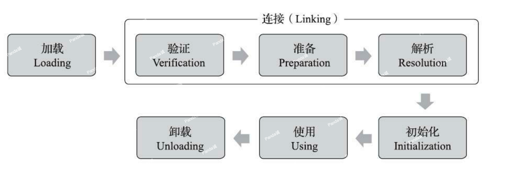

## 类加载机制

Java虚拟机把描述类的数据从Class文件加载到内存，并对数据进行校验、转换解析和初始化，最终形成可以被虚拟机直接使用的Java类型，这个过程被称作虚拟机的类加载机制。与那些在编译时需要进行连接的语言不同，在Java语言里面，类型的加载、连接和初始化过程都是在程序运行期间完成的，这种策略让Java语言进行提前编译会面临额外的困难，也会让类加载时稍微增加一些性能开销，但是却为Java应用提供了极高的扩展性和灵活性，Java天生可以动态扩展的语言特性就是依赖运行期动态加载和动态连接这个特点实现的。例如，编写一个面向接口的应用程序，可以等到运行时再指定其实际的实现类，用户可以通过Java预置的或自定义类加载器，让某个本地的应用程序在运行时从网络或其他地方上加载一个二进制流作为其程序代码的一部分。这种动态组装应用的方式目前已广泛应用于Java程序之中，从最基础的Applet、JSP到相对复杂的OSGi技术，都依赖着Java语言运行期类加载才得以诞生。

## 类的生命周期

一个类型从被加载到虚拟机内存中开始，到卸载出内存为止，它的整个生命周期将会经历加载（Loading）、验证（Verification）、准备（Preparation）、解析（Resolution）、初始化（Initialization）、使用（Using）和卸载（Unloading）七个阶段，其中验证、准备、解析三个部分统称为连接（Linking）。



加载、验证、准备、初始化和卸载这五个阶段的顺序是确定的，类型的加载过程必须按照这种顺序`按部就班`地开始，而解析阶段则不一定：它在某些情况下可以在初始化阶段之后再开始，这是为了支持Java语言的运行时绑定特性（也称为动态绑定或晚期绑定）。

>按部就班地“开始”，而不是按部就班地“进行”或按部就班地“完成”，强调这点是因为这些阶段通常都是互相交叉地混合进行的，会在一个阶段执行的过程中调用、激活另一个阶段。

### 加载

“加载”（Loading）阶段是整个“类加载”（Class Loading）过程中的一个阶段，不要混淆这两个看起来很相似的名词。关于在什么情况下需要开始类加载过程的第一个阶段“加载”，《Java虚拟机规范》中并没有进行强制约束，这点可以交给虚拟机的具体实现来自由把握。

在加载阶段，Java虚拟机需要完成以下三件事情：

1. 通过一个类的全限定名来获取定义此类的二进制字节流。(《Java虚拟机规范》没有指明要从哪里获取、如何获取。)
    - 可以从ZIP压缩包中读取，这很常见，最终成为日后JAR、EAR、WAR格式的基础。
    - 可以从网络中获取，这种场景最典型的应用就是Web Applet。
    - 可以在运行时计算生成，这种场景使用得最多的就是动态代理技术，在java.lang.reflect.Proxy中，就是用了ProxyGenerator.generateProxyClass()来为特定接口生成形式为“*$Proxy”的代理类的二进制字节流。
    - 可以由其他文件生成，典型场景是JSP应用，由JSP文件生成对应的Class文件。
    - 可以从数据库中读取，这种场景相对少见些，例如有些中间件服务器（如SAP Netweaver）可以选择把程序安装到数据库中来完成程序代码在集群间的分发。
    - 可以从加密文件中获取，这是典型的防Class文件被反编译的保护措施，通过加载时解密Class文件来保障程序运行逻辑不被窥探。
    - ...
2. 将这个字节流所代表的静态存储结构转化为方法区的运行时数据结构。
3. 在内存中生成一个代表这个类的java.lang.Class对象，作为方法区这个类的各种数据的访问入口。

相对于类加载过程的其他阶段，非数组类型的加载阶段（准确地说，是加载阶段中获取类的二进制字节流的动作）是开发人员可控性最强的阶段。加载阶段既可以使用Java虚拟机里内置的类加载器来完成，也可以由用户自定义的类加载器去完成，开发人员通过定义自己的类加载器去控制字节流的获取方式（重写一个类加载器的findClass()或loadClass()方法。可以参考[Java类加载器](./Java类加载器.md)），实现根据自己的想法来赋予应用程序获取运行代码的动态性。

对于数组类而言，情况就有所不同，数组类本身不通过类加载器创建，它是由Java虚拟机直接在内存中动态构造出来的。但数组类与类加载器仍然有很密切的关系，因为数组类的元素类型（ElementType，指的是数组去掉所有维度的类型）最终还是要靠类加载器来完成加载，一个数组类（下面简称为C）创建过程遵循以下规则：

- 如果数组的组件类型（Component Type，指的是数组去掉一个维度的类型，注意和前面的元素类型区分开来）是引用类型，那就递归采用本节中定义的加载过程去加载这个组件类型，数组C将被标识在加载该组件类型的类加载器的类名称空间上（一个类型必须与类加载器一起确定唯一性）。
- 如果数组的组件类型不是引用类型（例如int[]数组的组件类型为int），Java虚拟机将会把数组C标记为与引导类加载器关联。
- 数组类的可访问性与它的组件类型的可访问性一致，如果组件类型不是引用类型，它的数组类的可访问性将默认为public，可被所有的类和接口访问到。

加载阶段结束后，Java虚拟机外部的二进制字节流就按照虚拟机所设定的格式存储在`方法区`之中了，方法区中的数据存储格式完全由虚拟机实现自行定义，《Java虚拟机规范》未规定此区域的具体数据结构。类型数据妥善安置在方法区之后，会在`Java堆内存`中实例化一个java.lang.Class类的对象，这个对象将作为程序访问方法区中的类型数据的外部接口。

加载阶段与连接阶段的部分动作（如一部分字节码文件格式验证动作）是交叉进行的，加载阶段尚未完成，连接阶段可能已经开始，但这些夹在加载阶段之中进行的动作，仍然属于连接阶段的一部分，这两个阶段的开始时间仍然保持着固定的先后顺序。

## 连接之验证

验证是连接阶段的第一步，这一阶段的目的是确保Class文件的字节流中包含的信息符合《Java虚拟机规范》的全部约束要求，保证这些信息被当作代码运行后不会危害虚拟机自身的安全。

从整体上看，验证阶段大致上会完成下面四个阶段的检验动作：文件格式验证、元数据验证、字节码验证和符号引用验证。

### 文件格式验证

第一阶段要验证字节流是否符合Class文件格式的规范，并且能被当前版本的虚拟机处理。这一阶段可能包括下面这些验证点：

- 是否以魔数0xCAFEBABE开头。
- 主、次版本号是否在当前Java虚拟机接受范围之内。
- 常量池的常量中是否有不被支持的常量类型（检查常量tag标志）。
- 指向常量的各种索引值中是否有指向不存在的常量或不符合类型的常量。
- CONSTANT_Utf8_info型的常量中是否有不符合UTF-8编码的数据。
- Class文件中各个部分及文件本身是否有被删除的或附加的其他信息。
- ...

这阶段的验证是基于二进制字节流进行的，只有通过了这个阶段的验证之后，这段字节流才被允许进入Java虚拟机内存的方法区中进行存储，所以后面的三个验证阶段全部是基于方法区的存储结构上进行的，不会再直接读取、操作字节流了。

### 元数据验证

第二阶段是对字节码描述的信息进行语义分析，以保证其描述的信息符合《Java语言规范》的要求，这个阶段可能包括的验证点如下：

- 这个类是否有父类（除了java.lang.Object之外，所有的类都应当有父类）。
- 这个类的父类是否继承了不允许被继承的类（被final修饰的类）。
- 如果这个类不是抽象类，是否实现了其父类或接口之中要求实现的所有方法。
- 类中的字段、方法是否与父类产生矛盾（例如覆盖了父类的final字段，或者出现不符合规则的方法重载，例如方法参数都一致，但返回值类型却不同等）。
- ……

第二阶段的主要目的是对类的元数据信息进行语义校验，保证不存在与《Java语言规范》定义相悖的元数据信息。

### 字节码验证

第三阶段是整个验证过程中最复杂的一个阶段，主要目的是通过数据流分析和控制流分析，确定程序语义是合法的、符合逻辑的。在第二阶段对元数据信息中的数据类型校验完毕以后，这阶段就要对类的方法体（Class文件中的Code属性）进行校验分析，保证被校验类的方法在运行时不会做出危害虚拟机安全的行为，例如：

- 保证任意时刻操作数栈的数据类型与指令代码序列都能配合工作，例如不会出现类似于“在操作栈放置了一个int类型的数据，使用时却按long类型来加载入本地变量表中”这样的情况。
- 保证任何跳转指令都不会跳转到方法体以外的字节码指令上。
- 保证方法体中的类型转换总是有效的，例如可以把一个子类对象赋值给父类数据类型，这是安全的，但是把父类对象赋值给子类数据类型，甚至把对象赋值给与它毫无继承关系、完全不相干的一个数据类型，则是危险和不合法的。
- ......

由于数据流分析和控制流分析的高度复杂性，Java虚拟机的设计团队为了避免过多的执行时间消耗在字节码验证阶段中，在JDK 6之后的Javac编译器和Java虚拟机里进行了一项联合优化，把尽可能多的校验辅助措施挪到Javac编译器里进行。具体做法是给方法体Code属性的属性表中新增加了一项名为“StackMapTable”的新属性，这项属性描述了方法体所有的基本块（Basic Block，指按照控制流拆分的代码块）开始时本地变量表和操作栈应有的状态，在字节码验证期间，Java虚拟机就不需要根据程序推导这些状态的合法性，只需要检查StackMapTable属性中的记录是否合法即可。这样就将字节码验证的类型推导转变为类型检查，从而节省了大量校验时间。理论上StackMapTable属性也存在错误或被篡改的可能，所以是否有可能在恶意篡改了Code属性的同时，也生成相应的StackMapTable属性来骗过虚拟机的类型校验，则是虚拟机设计者们需要仔细思考的问题。JDK 6的HotSpot虚拟机中提供了-XX：-UseSplitVerifier选项来关闭掉这项优化，或者使用参数-XX：+FailOverToOldVerifier要求在类型校验失败的时候退回到旧的类型推导方式进行校验。而到了JDK 7之后，尽管虚拟机中仍然保留着类型推导验证器的代码，但是对于主版本号大于50（对应JDK6）的Class文件，使用类型检查来完成数据流分析校验则是唯一的选择，不允许再退回到原来的类型推导的校验方式。

### 符号引用验证

最后一个阶段的校验行为发生在虚拟机将`符号引用`转化为`直接引用`的时候，这个转化动作将在连接的第三阶段——`解析阶段`中发生。符号引用验证可以看作是对类自身以外（常量池中的各种符号引用）的各类信息进行匹配性校验，通俗来说就是，该类是否缺少或者被禁止访问它依赖的某些外部类、方法、字段等资源。本阶段通常需要校验下列内容：

>符号引用（Symbolic References）：符号引用以一组符号来描述所引用的目标，符号可以是任何形式的字面量，只要使用时能无歧义地定位到目标即可。符号引用与虚拟机实现的内存布局无关，引用的目标并不一定是已经加载到虚拟机内存当中的内容。各种虚拟机实现的内存布局可以各不相同，但是它们能接受的符号引用必须都是一致的，因为符号引用的字面量形式明确定义在《Java虚拟机规范》的Class文件格式中。

>直接引用（Direct References）：直接引用是可以直接指向目标的指针、相对偏移量或者是一个能间接定位到目标的句柄。直接引用是和虚拟机实现的内存布局直接相关的，同一个符号引用在不同虚拟机实例上翻译出来的直接引用一般不会相同。如果有了直接引用，那引用的目标必定已经在虚拟机的内存中存在。

<!-- 关于更多符号引用的知识参考[Class文件结构](./Class文件结构.md) -->

- 符号引用中通过字符串描述的全限定名是否能找到对应的类。
- 在指定类中是否存在符合方法的字段描述符及简单名称所描述的方法和字段。
- 符号引用中的类、字段、方法的可访问性（private、protected、public、`<package>`）是否可被当前类访问。
- ……

符号引用验证的主要目的是确保解析行为能正常执行，如果无法通过符号引用验证，Java虚拟机将会抛出一个java.lang.IncompatibleClassChangeError的子类异常，典型的如：java.lang.IllegalAccessError、java.lang.NoSuchFieldError、java.lang.NoSuchMethodError等。


验证阶段对于虚拟机的类加载机制来说，是一个非常重要的、但却不是必须要执行的阶段，因为验证阶段只有通过或者不通过的差别，只要通过了验证，其后就对程序运行期没有任何影响了。如果程序运行的全部代码（包括自己编写的、第三方包中的、从外部加载的、动态生成的等所有代码）都已经被反复使用和验证过，在生产环境的实施阶段就可以考虑使用-Xverify：none参数来关闭大部分的类验证措施，以缩短虚拟机类加载的时间。

## 连接之准备

准备阶段是正式为类中定义的变量（即静态变量，被static修饰的变量）分配内存并设置类变量初始值的阶段，从概念上讲，这些变量所使用的内存都应当在方法区中进行分配，但必须注意到`方法区本身是一个逻辑上的区域`，在JDK 7及之前，HotSpot使用永久代来实现方法区时，实现是完全符合这种逻辑概念的；而在JDK 8及之后，`类变量则会随着Class对象一起存放在Java堆中，这时候“类变量在方法区”就完全是一种对逻辑概念的表述了`。

这时候进行内存分配的仅包括`类变量`，而`不包括实例变量`，实例变量将会在对象实例化时随着对象一起分配在Java堆中。其次是这里所说的初始值“通常情况”下是数据类型的零值.

```java
public static int value = 123;
```

那变量value在准备阶段过后的初始值为0而不是123，因为这时尚未开始执行任何Java方法，而把value赋值为123的putstatic指令是程序被编译后，存放于`类构造器<clinit>()方法`之中，所以把value赋值为123的动作要到类的`初始化阶段`才会被执行。

上面提到在“通常情况”下初始值是零值，那言外之意是相对的会有某些“特殊情况”：如果类字段的字段属性表中存在ConstantValue属性，那在准备阶段变量值就会被初始化为ConstantValue属性所指定的初始值，假设上面类变量value的定义修改为：
```java
public static final int value = 123;
```

编译时Javac将会为value生成ConstantValue属性，在准备阶段虚拟机就会根据Con-stantValue的设置将value赋值为123。

## 连接之解析

解析阶段是Java虚拟机将常量池内的符号引用替换为直接引用的过程。

《Java虚拟机规范》之中并未规定解析阶段发生的具体时间，只要求了在执行ane-warray、checkcast、getfield、getstatic、instanceof、invokedynamic、invokeinterface、invoke-special、invokestatic、invokevirtual、ldc、ldc_w、ldc2_w、multianewarray、new、putfield和putstatic这17个用于操作符号引用的字节码指令之前，先对它们所使用的符号引用进行解析。所以虚拟机实现可以根据需要来自行判断，到底是在类被加载器加载时就对常量池中的符号引用进行解析，还是等到一个符号引用将要被使用前才去解析它。

类似地，对方法或者字段的访问，也会在解析阶段中对它们的可访问性（public、protected、 private、`<package>`）进行检查。

解析动作主要针对类或接口、字段、类方法、接口方法、方法类型、方法句柄和调用点限定符这7类符号引用进行，分别对应于常量池的CONSTANT_Class_info、CON-STANT_Fieldref_info、CONSTANT_Methodref_info、CONSTANT_InterfaceMethodref_info、CONSTANT_MethodType_info、CONSTANT_MethodHandle_info、CONSTANT_Dyna-mic_info和CONSTANT_InvokeDynamic_info 8种常量类型。

下面讲解前4种引用的解析过程

#### 类或接口的解析

假设当前代码所处的类为`D`，如果要把一个从未解析过的`符号引用N`解析为一个`类或接口C的直接引用`，那虚拟机完成整个解析的过程需要包括以下3个步骤：

1. 如果`C`不是一个数组类型，那虚拟机将会把`代表N的全限定名`传递给`D的类加载器`去加载这个类C。在加载过程中，由于元数据验证、字节码验证的需要，又可能触发其他相关类的加载动作，例如加载这个类的父类或实现的接口。一旦这个加载过程出现了任何异常，解析过程就将宣告失败。
2. 如果`C`是一个数组类型，并且数组的元素类型为对象，也就是N的描述符会是类似“[Ljava/lang/Integer”的形式，那将会按照第一点的规则加载数组元素类型。如果N的描述符如前面所假设的形式，需要加载的元素类型就是“java.lang.Integer”，接着由虚拟机生成一个代表该数组维度和元素的数组对象。
3. 如果上面两步没有出现任何异常，那么`C`在虚拟机中实际上已经成为一个有效的类或接口了，但在解析完成前还要进行符号引用验证，确认`D`是否具备对`C`的访问权限。如果发现不具备访问权限，将抛出java.lang.IllegalAccessError异常。
4. 
针对上面第3点访问权限验证，在JDK 9引入了模块化以后，一个public类型也不再意味着程序任何位置都有它的访问权限，我们还必须检查模块间的访问权限。

如果我们说一个`D`拥有`C`的访问权限，那就意味着以下3条规则中至少有其中一条成立：

- 被访问类`C`是public的，并且与访问类`D`处于同一个模块。
- 被访问类`C`是public的，不与访问类D处于同一个模块，但是被访问类C的模块允许被访问类D的模块进行访问。
- 被访问类C不是public的，但是它与访问类D处于同一个包中。


#### 字段解析

要解析一个未被解析过的`字段符号引用`，首先将会对字段表内class_index项中索引的 CONSTANT_Class_info符号引用进行解析，也就是字段所属的类或接口的符号引用。如果在解析这个类或接口符号引用的过程中出现了任何异常，都会导致字段符号引用解析的失败。如果解析成功完成，那把这个字段所属的类或接口用C表示，《Java虚拟机规范》要求按照如下步骤对C进行后续字段的搜索：

1. 如果C本身就包含了简单名称和字段描述符都与目标相匹配的字段，则返回这个字段的直接引用，查找结束。
2. 否则，如果在C中实现了接口，将会按照继承关系从下往上递归搜索各个接口和它的父接口，如果接口中包含了简单名称和字段描述符都与目标相匹配的字段，则返回这个字段的直接引用，查找结束。
3. 否则，如果C不是java.lang.Object的话，将会按照继承关系从下往上递归搜索其父类，如果在父类中包含了简单名称和字段描述符都与目标相匹配的字段，则返回这个字段的直接引用，查找结束。
4. 否则，查找失败，抛出java.lang.NoSuchFieldError异常。

如果查找过程成功返回了引用，将会对这个字段进行权限验证，如果发现不具备对字段的访问权限，将抛出java.lang.IllegalAccessError异常。

#### 方法解析

方法解析的第一个步骤与字段解析一样，也是需要先解析出方法表的class_index[4]项中索引的方法所属的类或接口的符号引用，如果解析成功，那么我们依然用C表示这个类，接下来虚拟机将会按照如下步骤进行后续的方法搜索：

1. 由于Class文件格式中类的方法和接口的方法符号引用的常量类型定义是分开的，如果在类的方法表中发现class_index中索引的C是个接口的话，那就直接抛出java.lang.IncompatibleClassChangeError异常。
2. 如果通过了第一步，在类C中查找是否有简单名称和描述符都与目标相匹配的方法，如果有则返回这个方法的直接引用，查找结束。
3. 否则，在类C的父类中递归查找是否有简单名称和描述符都与目标相匹配的方法，如果有则返回这个方法的直接引用，查找结束。
4. 否则，在类C实现的接口列表及它们的父接口之中递归查找是否有简单名称和描述符都与目标相匹配的方法，如果存在匹配的方法，说明类C是一个抽象类，这时候查找结束，抛出java.lang.AbstractMethodError异常。
5. 否则，宣告方法查找失败，抛出java.lang.NoSuchMethodError。最后，如果查找过程成功返回了直接引用，将会对这个方法进行权限验证，如果发现不具备对此方法的访问权限，将抛出java.lang.IllegalAccessError异常。

#### 接口方法解析

接口方法也是需要先解析出接口方法表的class_index项中索引的方法所属的类或接口的符号引用，如果解析成功，依然用C表示这个接口，接下来虚拟机将会按照如下步骤进行后续的接口方法搜索：

1. 与类的方法解析相反，如果在接口方法表中发现class_index中的索引C是个类而不是接口，那么就直接抛出java.lang.IncompatibleClassChangeError异常。
2. 否则，在接口C中查找是否有简单名称和描述符都与目标相匹配的方法，如果有则返回这个方法的直接引用，查找结束。
3. 否则，在接口C的父接口中递归查找，直到java.lang.Object类（接口方法的查找范围也会包括Object类中的方法）为止，看是否有简单名称和描述符都与目标相匹配的方法，如果有则返回这个方法的直接引用，查找结束。
4. 对于规则3，由于Java的接口允许多重继承，如果C的不同父接口中存有多个简单名称和描述符都与目标相匹配的方法，那将会从这多个方法中返回其中一个并结束查找，《Java虚拟机规范》中并没有进一步规则约束应该返回哪一个接口方法。但与之前字段查找类似地，不同发行商实现的Javac编译器有可能会按照更严格的约束拒绝编译这种代码来避免不确定性。
5. 否则，宣告方法查找失败，抛出java.lang.NoSuchMethodError异常。

在JDK 9之前，Java接口中的所有方法都默认是public的，也没有模块化的访问约束，所以不存在访问权限的问题，接口方法的符号解析就不可能抛出java.lang.IllegalAccessError异常。但在JDK 9中增加了接口的静态私有方法，也有了模块化的访问约束，所以从JDK 9起，接口方法的访问也完全有可能因访问权限控制而出现java.lang.IllegalAccessError异常。

## 初始化

类的初始化阶段是类加载过程的最后一个步骤，之前介绍的几个类加载的动作里，除了在`加载阶段用户应用程序可以通过自定义类加载器的方式局部参与外`，其余动作都完全由Java虚拟机来主导控制。`直到初始化阶段，Java虚拟机才真正开始执行类中编写的Java程序代码，将主导权移交给应用程序`。

进行准备阶段时，变量（类变量即静态变量，被static修饰的变量）已经赋过一次系统要求的初始零值，而在初始化阶段，则会根据程序员通过程序编码制定的主观计划去初始化类变量和其他资源。我们也可以从另外一种更直接的形式来表达：`初始化阶段就是执行类构造器<clinit>()方法的过程`。`<clinit>()并不是程序员在Java代码中直接编写的方法，它是Javac编译器的自动生成物`，但我们非常有必要了解这个方法具体是如何产生的，以及`<clinit>()方法`执行过程中各种可能会影响程序运行行为的细节，这部分比起其他类加载过程更贴近于
普通的程序开发人员的实际工作

- `<clinit>()方法`是由编译器自动收集类中的所有`类变量`的赋值动作和`静态语句块（static{}块）`中的语句`合并`产生的，`编译器收集的顺序是由语句在源文件中出现的顺序决定的`，静态语句块中只能访问到定义在静态语句块之前的变量，定义在它之后的变量，在前面的静态语句块可以赋值，但是不能访问。

```java
public class Test {
 static {
 i = 0; // 给变量复制可以正常编译通过
 System.out.print(i); // 这句编译器会提示“非法向前引用”
 }
 static int i = 1;
}
```

- `<clinit>()方`法与类的构造函数（即在虚拟机视角中的`实例构造器<init>()方法`）不同，它不需要显式地调用父类构造器，Java虚拟机会保证在`子类的<clinit>()方法`执行前，`父类的<clinit>()方法`已经执行完毕。因此在Java虚拟机中第一个被执行的`<clinit>()方法`的类型肯定是java.lang.Object。

- 由于`父类的<clinit>()方法先执行`，也就意味着`父类中定义的静态语句块要优先于子类的变量赋值操作`，字段B的值将会是2而不是1。
```java
static class Parent {
 public static int A = 1;
 static {
 A = 2;
 }
}
static class Sub extends Parent {
 public static int B = A;
}
public static void main(String[] args) {
 System.out.println(Sub.B);
}
```

- `<clinit>()方法`对于类或接口来说并不是必需的，如果一个类中没有静态语句块，也没有对变量的赋值操作，那么编译器可以不为这个类生成`<clinit>()方法`。
- 接口中不能使用静态语句块，但仍然`有变量初始化的赋值操作`，因此接口与类一样都会生成`<clinit>()方法`。但接口与类不同的是，执行`接口的<clinit>()方法不需要先执行父接口的<clinit>()方法`，因为只有当父接口中定义的变量被使用时，父接口才会被初始化。此外，接口的`实现类`在初始化时也一样不会执行`接口的<clinit>()方法`。
- Java虚拟机必须保证`一个类的<clinit>()方法在多线程环境中被正确地加锁同步`，如果多个线程同时去初始化一个类，那么只会有其中`一个线程去执行这个类的<clinit>()方法`，`其他线程都需要阻塞等待`，直到活动线程执行完毕`<clinit>()方法`。如果在一个类的`<clinit>()方法`中有耗时很长的操作，那就可能造成多个进程阻塞，在实际应用中这种阻塞往往是很隐蔽的。
```java
static class DeadLoopClass {
     static {
         // 如果不加上这个if语句，编译器将提示“Initializer does not complete normally” 并拒绝编译
         if (true) {
             System.out.println(Thread.currentThread() + "init DeadLoopClass");
             while (true) {
             }
         }
     }
}
public static void main(String[] args) {
     Runnable script = new Runnable() {
         public void run() {
             System.out.println(Thread.currentThread() + "start");
             DeadLoopClass dlc = new DeadLoopClass();
             System.out.println(Thread.currentThread() + " run over");
         }
     };
     Thread thread1 = new Thread(script);
     Thread thread2 = new Thread(script);
     thread1.start();
     thread2.start();
}
```

运行结果如下，一条线程在死循环以模拟长时间操作，另外一条线程在阻塞等待：

```properties
Thread[Thread-0,5,main]start
Thread[Thread-1,5,main]start
Thread[Thread-0,5,main]init DeadLoopClass
```

但是对于初始化阶段，《Java虚拟机规范》则是严格规定了`有且只有`六种情况必须立即对类进行“初始化”（而加载、验证、准备自然需要在此之前开始）：

1. 遇到new、getstatic、putstatic或invokestatic这四条字节码指令时，如果类型没有进行过初始化，则需要先触发其初始化阶段。
    - 使用new关键字实例化对象的时候。
    - 读取或设置一个类型的静态字段（被final修饰、已在编译期把结果放入常量池的静态字段除外）的时候。
    - 调用一个类型的静态方法的时候。
2. 使用java.lang.reflect包的方法对类型进行反射调用的时候，如果类型没有进行过初始化，则需要先触发其初始化。
3. 当初始化类的时候，如果发现其父类还没有进行过初始化，则需要先触发其父类的初始化。
4. 当虚拟机启动时，用户需要指定一个要执行的主类（包含main()方法的那个类），虚拟机会先初始化这个主类。
5. 当使用JDK 7新加入的动态语言支持时，如果一个java.lang.invoke.MethodHandle实例最后的解析结果为REF_getStatic、REF_putStatic、REF_invokeStatic、REF_newInvokeSpecial四种类型的方法句柄，并且这个方法句柄对应的类没有进行过初始化，则需要先触发其初始化。
6. 当一个接口中定义了JDK 8新加入的默认方法（被default关键字修饰的接口方法）时，如果有这个接口的实现类发生了初始化，那该接口要在其之前被初始化。

参考：深入理解Java虚拟机


