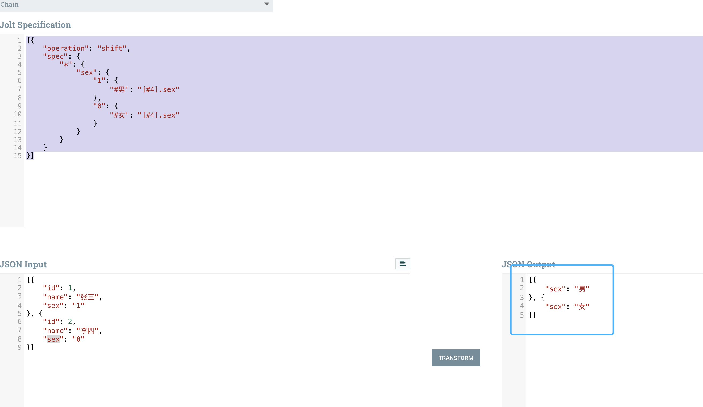

## 场景需求

现在有一组JSON格式的数据如下，可能因为各种原因吧，其中表示性别的`sex`字段并没有使用`男` `女`这样直接的值来表达，然后老板说：“我不要1、0，你给我换成我能看得懂的汉字”

```json
[{
	"id": 1,
	"name": "张三",
	"sex": "1"
}, {
	"id": 2,
	"name": "李四",
	"sex": "0"
}]
```
那么小子斗胆问老板，想要下面这样的数据对嘛？然后老板开心的点了点头，拍了拍你的肩膀说：“小伙子我看好你哦，今天加个班搞定它！”
```json
[{
	"id": 1,
	"name": "张三",
	"sex": "男"
}, {
	"id": 2,
	"name": "李四",
	"sex": "女"
}]
```

小子心想：“洒洒水啦，小case啦，几行代码就搞定的事，:) ”。

然后老板说：“哦，对了，我不要你写代码解决，就用jolt库去解这个事情，咱们用的Apache NIFI里也有现成的JOLT组件，你们自己写的代码质量高不高不说，通用性是真的不高，来来回回这么多人写了那么多垃圾，人一走扔一堆破代码，不好用还各种问题。”

小子 :( ，“好嘞！好嘞” (== 我C)

## JOLT脚本方案

```json
[{
	"operation": "shift",
	"spec": {
		"*": {
			"sex": {
				"1": {
					"#男": "[#4].sex"
				},
				"0": {
					"#女": "[#4].sex"
				}
			},
			"*": "[#2].&"
		}
	}
}]
```

效果图


## 详解

JOLT呢，是一个使用脚本语言处理JSON的库，脚本语言也是使用的JSON格式。之前年轻，去试着解读源码并出了一份教程，哈哈哈哈哈哈(回过头来看教程有些内容我自己都看不懂了，尤其是涉及到walkpath的那些)。

JOLT有几个`operation`，今天这儿我们用到的叫`shift`，这个操作不细究的话，可以这么简单的去理解它的脚本：`脚本JSON中的key一层一层的去匹配你的数据中的字段名，然后把匹配到的 字段值 写到 脚本JSON的value所指向的位置`。

### shift基本格式

```json
[{
	"operation": "shift",
	"spec": {
		// ... 这是shift的规范格式，spec中的是核心的匹配逻辑和输出逻辑
	}
}]
```

### 原值输出脚本解释

接下来我们把脚本中关于男女值替换的逻辑去掉看下效果

```json
[{
	"operation": "shift",
	"spec": {
		"*": {
			"*": "[#2].&"
		}
	}
}]
```

效果图可以看到，未改变数据原样输出。


虽然是没有修改数据，但这个过程一定是发生了神马的，对吧。针对这个简化的脚本我们解释一下其中一些符号的作用。

>符号在左侧和右侧的意义往往是不同的，有的甚至允许只在左侧或只在右侧。在下面的符号解释中，我们只针对本文的脚本库来说，不要单独拉出去看，不全面。而如果全面的去解释，会有点绕圈懵逼哒。

1. `*`通配符，匹配任意。第一个`*`匹配了原JSON数组中的每一个元素，第二个`*`匹配了原JSON数组中元素里的每一个key。
2. `[]`是数组的意思，中间的`#2`值表示数组的下标，这里的`#2`会通过计算获取到第一个`*`所匹配到的数组下标。
3. `&`在右侧表示取当前同一层的左侧所匹配到的原JSON的key (虽然不严谨，但先简单这样的去理解)

再简单些，去掉第二个`*`和右侧`&`的上面简化后的脚本可以等价于下面的脚本：

```json
[{
	"operation": "shift",
	"spec": {
		"*": {
			"id": "[#2].id",
			"name": "[#2].name",
			"sex": "[#2].sex"
		}
	}
}]
```

效果图：


再去掉第一个`*`和`#2`上面简化后的脚本可以等价于下面的脚本：

```json
[{
	"operation": "shift",
	"spec": {
		"0": {
			"id": "[0].id",
			"name": "[0].name",
			"sex": "[0].sex"
		},
		"1": {
			"id": "[1].id",
			"name": "[1].name",
			"sex": "[1].sex"
		}
	}
}]
```

效果图：


那么看到最后这个啰里啰嗦臃肿不堪显得就不那么高端大气上档次的感觉像是没穿衣服而且实际上只能匹配两个数组元素还绑死了所有字段名字的没啥软用的脚本，你应该看懂的！(没看懂可以再看几遍，废话不好写啊)

### 男女值替换脚本解释

下面再单独来看看替换男女值的脚本

```json
[{
	"operation": "shift",
	"spec": {
		"*": {
			"sex": {
				"1": {
					"#男": "[#4].sex"
				},
				"0": {
					"#女": "[#4].sex"
				}
			}
		}
	}
}]
```

1. 第一个`*`匹配了原JSON数组中的每一个元素。
2. `sex`匹配了每个元素中字段名称叫sex的元素。
3. 常量值 `1` `0` 分别匹配了sex的值。
4. `#男` `#女` 就不是匹配的意思了，而是表示将`#`符号后面的值作为value输出到右侧脚本指定的位置。
5. `[]`是数组的意思，中间的`#4`值表示数组的下标，这里的`#4`会通过计算获取到第一个`*`所匹配到的数组下标。

效果图



去掉第一个`*`和`#4`上面简化后的脚本可以等价于下面的脚本：

```json
[{
	"operation": "shift",
	"spec": {
		"0": {
			"sex": {
				"1": {
					"#男": "[0].sex"
				},
				"0": {
					"#女": "[0].sex"
				}
			}
		},
		"1": {
			"sex": {
				"1": {
					"#男": "[1].sex"
				},
				"0": {
					"#女": "[1].sex"
				}
			}
		}
	}
}]
```

效果图(就不贴了，就是皮)。

## 最后

按照我的实际经验，jolt脚本大家可以不用理解的很清楚，也不用刻意去记忆去背诵，多收集多攒几个经典的例子，真正需要的时候首先将你的原JSON值和期望得到的JSON值列出来，对照收集的例子不停的去试脚本，就可以了。

NIFI中JOLT使用


