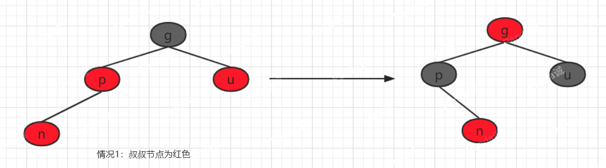
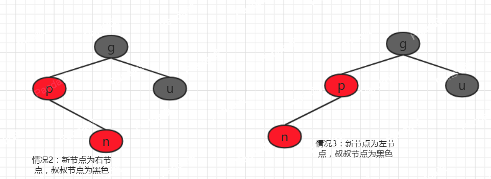
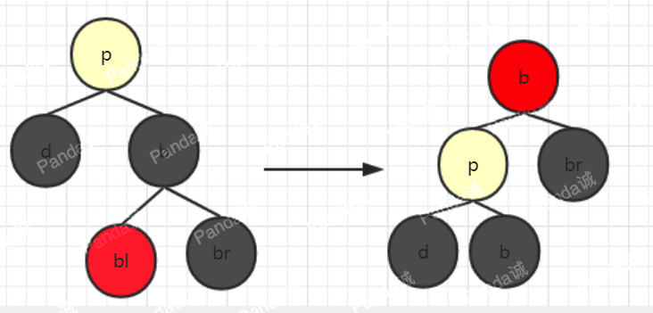

有随机数节点组成的二叉树的平均高度为logn，所以正常情况下二叉树查找的时间复杂度为O(logn)。但是，根据二叉树的特性，在最坏的情况下，比如存储的是一个有序的数据的话，那么所以的数据都会形成一条链，此时二叉树的深度为n，时间复杂度为O(n)。红黑树就是为了解决这个问题的，它能够保证在任何情况下树的深度都保持在log(n)左右。

<!-- more -->

红黑树通过一下约束来完成这个特性：

1. 每个节点不是红色就是黑色。

2. 根节点为黑色。

3. 每个叶子节点都是黑色的。

4. 每个红色节点的子节点都是黑色。

5. 任意节点，到其任意叶节点的所有路径都包含相同的黑色节点。

关于它的特性，需要注意的是：
第一，特性3中的叶子节点，是只为空(NIL或null)的节点。
第二，特性5，确保没有一条路径会比其他路径长出俩倍。因而，红黑树是相对是接近平衡的二叉树。

结构如下图：


红黑树的基本操作包括删除和添加。在删除或者添加一个节点的时候就有可能打破原有的红黑树维持的平衡，那么就需要通过着色和旋转的方式来使红黑树重新达到平衡。着色是非常简单的，直接将节点的颜色改变就可以了，多以要理解红黑树，就必须需要懂得如何进行旋转，旋转又分为左旋和右转，两个操作相反的，所以理解了一个旋转的操作就很容易理解另一个旋转了。

左旋：


如图所示，红色节点为旋转支点，支点往左子树移动即为左旋。左旋之后我们可以看到原支点的位置被原支点的右子节点代替，新支点的左子节点变为了原来为父节点的原支点，新支点的左子节点变为原支点的右子节点，因此左旋操作总共右3个节点，以为旋转前的结构举例，分别为红色节点（原支点），黄色节点（新支点）和L节点。Java代码实现如下：

```java
    /**
     * 左旋
     * @param e 支点
     */
    private void leftRotate(Entry<K,V> e){
        //支点的右子节点
        Entry<K,V> right = e.right;
        //支点右子节点的左子节点
        Entry<K,V> rightOfLeft = right.left;
        //新旧支点的替换
        right.parent = e.parent;
        if (e.parent == null){
            root = right;
        }else {
            if (e == e.parent.left)
                e.parent.left = right;
            else
                e.parent.right = right;
        }
        //将原支点变为新支点的左节点
        right.left = e;
        e.parent = right;
        //将新支点的左节点变为就支点的右节点
        e.right = rightOfLeft;
        if (rightOfLeft != null)
            rightOfLeft.parent = e;
    }
```

因为在红黑树中每个节点都有一个指针指向自己的父节点，父节点也有指针指向子节点，因为在改动一个节点的时候都需要分别改动当前节点和父节点的指向，结合左旋的示意图，用Java代码实现起来就不会很困难了。

右旋:


右旋操作和左旋相反的，两者互反。依然是红色作为旋转支点，右旋后黄色节点代替了红色节点原来的位置，黄色节点的右节点旋转后变为红色节点的左节点。Java 代码实现如下：
```java
/**
     * 右旋
     * @param e 旋转支点
     */
    private void rightRotate(Entry<K,V> e){
        //原支点的左节点
        Entry<K,V> left = e.left;
        //原支点的左节点的右节点
        Entry<K,V> leftOfRight = left.right;
        //新旧支点的替换
        left.parent = e.parent;
        if (e.parent == null){//支点的父节点为根节点的情况
            root = left;
        }else {//非跟节点
            if (e == e.parent.left)
                e.parent.left = left;
            else
                e.parent.right = left;
        }
        //将原支点变为新支点的右节点
        left.right = e;
        e.parent = left;
        //将新支点未旋转前的右节点变为转换后的原支点的左节点
        e.left = leftOfRight;
        if (leftOfRight != null)
            leftOfRight.parent = e;
    }
```

红黑树插入节点与二叉树是一致的，所以每次添加节点肯定是添加到叶子节点上，具体步骤如下：

 　 第一步：将新节点插入到红黑树中。红黑树本身就是一颗二叉查找树，将节点插入后，该树仍然是一颗二叉查找树。也就意味着，树的键值仍然是有序的。此外，无论是左旋还是右旋，若旋转之前这棵树是二叉查找树，旋转之后它一定还是二叉查找树。这也就意味着，任何的旋转和重新着色操作，都不会改变它仍然是一颗二叉查找树的事实。

　　第二步：将新节点设置为红色。这里为什么需要设置成红色呢？主要是为了满足特性5，这样在插入节点后就少解决了一个冲突，也就少一点麻烦。插入完成后，我们来看一下还有那些特性是有可能发生冲突的，特性1每个节点不是红色就是黑色的，这明显没有冲突，特性2根节点为黑色，当插入节点为根节点的时候就会有冲突了，这种就很简单了，直接将根节点着色为黑色即可。特性3每个叶子节点都是黑色，这个明显没有冲突。特性4每个红色节点的子节点都是黑色的，这个特性就有可能会冲突，因为在插入新节点的时候我们无法确定新节点的父节点的颜色是黑色的还是红色，如果新节点的父节为黑色，那么就不会有冲突，否则就会违背了特性4。特性5任意节点，到其任意子节点的所有路径都包含相同的黑色节点，因为我们插入的新节点被着色为红色，所以并不会影响到每个路径的黑色节点的数量，因此也不会有冲突。综上所诉，那么在插入新节点的时候，只有特性4有可能发生冲突。

　　第三步：平衡红黑树，使之成为新的红黑树。

　　根据第二步得到的结论，我们可以知道只有一种情况是需要解决冲突的，那就是新节点的父节点为红色的时候违背了特性4。接下来我们将要讨论这个问题，因为在新插入一个节点之前是一颗已经平衡了的红黑树，因此根据特新4，新节点的父节点为红色的时候，新节点的祖父节点必定为黑色。根据这种情况，我们又可以分为以下四种情况：

　　情况1：新节点为左节点，叔叔节点为红色；

　　情况2：新节点为左节点，叔叔节点为黑色；

　　情况3：新节点为右节点，叔叔节点为红色；

　　情况4：新节点为右节点，叔叔节点为黑色；


情况1和情况3的情况是一样的，只需要变色(将父节点和叔叔节点变色为黑色，将祖父节点变色为红色)，所以我们可以将这两种情况看作是一种情况，所以我们可以归结为3种情况：

　　情况1：叔叔节点是红色节点；

　　情况2：叔叔节点是黑色节点，新节点为右节点；

　　情况3：叔叔节点是黑色节点，新节点为左节点；

情况1这种情况处理起来比较简单，只需要将祖父节点变为红色节点，父节点和叔叔节点变为黑色即可，这仅仅只是当整个红黑树只有这几个节点的时候是可以了，但事实并非如此，这仅仅只是达到了局部平衡。



上图，我们看到已经达到了局部的平衡，但是，我们还会有其他的情况，那就是祖父节点有可能也会有父节点。那么又会有两种情况，1是祖父节点的父节点可能是黑色的，2是可能是红色的，如果黑色那么整个红黑树就达到平衡了。不知道大家感觉到了没有，这两种情况是不是跟新插入一个节点的情况是一致的，是不是又回到了插入新节点的问题了(递归思想啊)？于是我将局部收到影响的部分画出来，如图：


图a就是将情况1从新着色后的部分受影响的节点，当然只是其中的一种情况，此时我们将已经平衡的部分去掉就变成的图b的情况，这种情况是不是很熟悉呢？我们的祖父节点当成新节点，是不是相当于上面讨论的情况1呢？不过与上面讨论的情况不同的是，这里3中可能情况都可能出现，因为叔叔节点有可能为红色或黑色。所以这时候才有可能出现真正的三种情况：

　　情况1：叔叔节点是红色节点；

　　情况2：叔叔节点是黑色节点，新节点为右节点；

　　情况3：叔叔节点是黑色节点，新节点为左节点；

　　如果为情况1的话，我们一层一层的往上平衡就可以了，当祖父节点为根节点的时候，我们直接将根节点着色为黑色即可，因为祖父节点的两个子节点都是黑色的，所以变为黑色后仍然是平衡的。

    接下来我们来讨论下情况2和3。


    情况2以父节点为支点左旋，然后将父节点和新节点互换可以得到情况3：


情况3进行的操作是，首先将父节点着色为黑色，祖父节点着色为红色，此时破坏了特性5，父亲这个分支黑色节点总数没变，叔叔那个分支因为祖父由黑变红，少了一个黑色节点，所以希望通过旋转把父节点移到祖父的位置，来平衡两个分支的黑色节点的数量。然后以祖父为支点进行右旋


情况3旋转结束后整棵红黑也已经重新恢复平衡了。单从部分其实并看不出已经平衡了，我们可以将三个情况连起来就可以看到了，如下图：


上图中都是以n节点为参考点的，其余无关的节点就不标出来了。n节点即为插入节点，但是除了第一次操作n节点为真正的新节点，此后的操作所指的n节点只是有助于我们的理解把他当成新节点。当然，这只是其中的一种情况，其他其他的情况可以通过不断向上旋转或着色，最终也会达到这种情况或者顶部是p节点为根节点的时候，第二种情况直接将根节点着色为黑色即可。

上面是讨论左子树的问题，因为红黑色具有堆成性，因此在处理右子树的时候与处理左子树相反即可。Java代码示例如下：

```java
    /**
     * 插入新节点后平衡红黑树
     * @param e 新节点
     */
    private void fixAfterInsertion(Entry<K, V> e) {
        //将新插入节点设置为红色
        setRed(e);
        Entry<K,V> p,g,u;//父节点和祖父节点和叔叔节点
        Entry<K,V> current = e;//新节点
        /**
         * 这里通过循环不断向上平衡
         */
        while ((p = parentOf(current)) != null && isRed(p)){
            g = parentOf(p);//祖父节点
            if (p == g.left){
                u = g.right;
                //情况1：叔叔节点为红色
                if (u != null && isRed(u)){
                    setBlack(p);//父节点设为黑色
                    setBlack(u);//叔叔节点设为黑色
                    setRed(g);//祖父节点设为红色
                    current = g;//把祖父节点设为当前节点
                    //继续向上平衡
                    continue;
                }
                //情况2：当前节点为右节点，叔叔节点为黑色
                if (current == p.right){
                    leftRotate(p);//父节点为支点左旋
                    Entry<K,V> tmp = p;
                    p = current;//父节点和当前节点互换
                    current = tmp;//父节点设为当前节点
                }
                //情况3：当前节点为左节点，叔叔节点为黑色
                setBlack(p);//父节点设为黑色
                setRed(g);//祖父节点设为红色
                rightRotate(g);//祖父节点为支点右旋
            }else {//相反的操作
                u = g.left;
                if (u != null && isRed(u)){
                    setBlack(p);
                    setBlack(u);
                    setRed(g);
                    current = g;
                    continue;
                }
                if (current == p.left){
                    rightRotate(p);
                    Entry<K,V> tmp = p;
                    p = current;
                    current = tmp;
                }
                setBlack(p);
                setRed(g);
                leftRotate(g);
            }
        }
        //最后将根节点设置为红色
        setBlack(root);
    }
```

删除节点

　　在二叉树中删除一个节点的时候有3中情况：

　　1、删除节点没有子节点

　　2、删除节点只有一个子节点

　　3、删除节点有两个子节点

　　首先，我们逐个来分析每种情况删除节点后对整颗红黑树的平衡性的影响。在删除节点时候红黑树的特性1，2，3肯定不会违背，所以只需要考虑特性4，5即可。

　　对于情况1，肯定不会违背特性4，如果删除节点为红色，那么对整颗红黑树的平衡性都不会影响，如果是黑色则违背了特性5，我们先将这种情况记录下来，稍后再进一步讨论。

　　对于情况2，有可能删除的是左子树或右子树，暂且不讨论。如果删除的节点为红色，不影响平衡性，如果删除的是黑色，那么肯定会和特性5有冲突，当删除节点的父节点为红色，子节点为红色是也和特性4有冲突。

　　对于情况3，其实最后删除的是它的替代节点，根据替代节点的特点，最终其实是回到了1这种情况或者情况2。

　　总结上面的3种情况可得到一个结论，只有删除节点为黑色时才会破坏红黑树原来的平衡，因在删除节点之前红黑树是出于平衡状态的，删除之后很明显的其兄弟节点分支必然比删除节点的分支多了一个黑色的节点，因此我们只需要改变兄弟节点的颜色即可，我们只讨论左节点，右节点对称。

一、删除节点的兄弟节点是红色

　　将兄弟节点设为黑色，父节点设为红色，以父节点为支点左旋转，然后将父节点的右节点放到兄弟节点上：


二、兄弟节点是黑色的，兄弟的两个子节点也都是黑色的

　　兄弟节点设为红色，把父节点设置为新的删除节点：


三、兄弟节点是黑色的，且兄弟节点的左子节点是红色，右子节点是黑色

　　将兄弟节点的左子节点设为黑色，兄弟节点设为红色，以兄弟节点为支点右旋，把父节点的右节点设置为兄弟节点


四、兄弟节点是黑色的，且兄弟节点的右子节点是红色，左子节点任意颜色

　　把兄弟节点的设为父节点的颜色，父节点设为黑色，父节点的右节点设为黑色，父节点为支点左旋


　　删除的Java代码示例：

```java
    public V remove(Object key){
        if (key == null) return null;
        Entry<K,V> delEntry;
        delEntry = getEntry(key);
        if (delEntry == null) return null;
        size--;
        Entry<K,V> p = delEntry.parent;
        if (delEntry.right == null && delEntry.left == null){
            if (p == null){
                root = null;
            }else {
                if (p.left == delEntry){
                    p.left = null;
                }else {
                    p.right = null;
                }
            }
        }else if (delEntry.right == null){//只有左节点
            Entry<K,V> lc = delEntry.left;
            if (p == null) {
                lc.parent = null;
                root = lc;
            } else {
                if (delEntry == p.left){
                    p.left = lc;
                }else {
                    p.right = lc;
                }
                lc.parent = p;
            }
        }else if (delEntry.left == null){//只有右节点
                Entry<K,V> rc = delEntry.right;
            if (p == null) {
                rc.parent = null;
                root = rc;
            }else {
                if (delEntry == p.left)
                    p.left = rc;
                else
                    p.right = rc;
                rc.parent = p;
            }
        }else {//有两个节点,找到后继节点，将值赋给删除节点，然后将后继节点删除掉即可
            Entry<K,V> successor = successor(delEntry);//获取到后继节点
            boolean color = successor.color;
            V old = delEntry.value;
            delEntry.value = successor.value;
            delEntry.key = successor.key;
            if (delEntry.right == successor){//后继节点为右子节点，
                if (successor.right != null) {//右子节点有右子节点
                    delEntry.right = successor.right;
                    successor.right.parent = delEntry;
                }else {//右子节点没有子节点
                    delEntry.right = null;
                }
            }else {
                successor.parent.left = null;
            }
            if (color == BLACK)
                //fixUpAfterRemove(child,parent);
            return old;
        }
        V old = delEntry.value;
        if (delEntry.color == BLACK)//删除为黑色时，需要重新平衡树
            if (delEntry.right != null)//删除节点的子节点只有右节点
                fixUpAfterRemove(delEntry.right,delEntry.parent);
            else if (delEntry.left != null)//删除节点只有左节点
                fixUpAfterRemove(delEntry.left,delEntry.parent);
            else
                fixUpAfterRemove(null,delEntry.parent);
        delEntry.parent = null;
        delEntry.left = null;
        delEntry.right = null;
        return old;
    }

    private Entry<K, V> getEntry(Object key) {
        if (key == null) return null;
        Entry<K, V> delEntry = null;
        Entry<K, V> current = root;
        int ret;
        if (comparator == null){
            Comparable<K> k = (Comparable<K>) key;
            while (current != null){
                ret = k.compareTo(current.key);
                if (ret < 0)
                    current = current.left;
                else if (ret > 0)
                    current = current.right;
                else{
                    delEntry = current;
                    break;
                }
            }
        }else {
            for (;current != null;){
                ret = comparator.compare(current.key, (K) key);
                if (ret < 0)
                    current = current.left;
                else if (ret > 0)
                    current = current.right;
                else{
                    delEntry = current;
                    break;
                }
            }
        }
        return delEntry;
    }

    //node表示待修正的节点，即后继节点的子节点（因为后继节点被挪到删除节点的位置去了）
    private void fixUpAfterRemove(Entry<K, V> node,Entry<K,V> parent) {
        Entry<K,V> other;
        while((node == null || isBlack(node)) && (node != root)) {
            if(parent.left == node) { //node是左子节点，下面else与这里的刚好相反
                other = parent.right; //node的兄弟节点
                if(isRed(other)) { //case1: node的兄弟节点other是红色的
                    setBlack(other);
                    setRed(parent);
                    leftRotate(parent);
                    other = parent.right;
                }

                //case2: node的兄弟节点other是黑色的，且other的两个子节点也都是黑色的
                if((other.left == null || isBlack(other.left)) &&
                        (other.right == null || isBlack(other.right))) {
                    setRed(other);
                    node = parent;
                    parent = parentOf(node);
                } else {
                    //case3: node的兄弟节点other是黑色的，且other的左子节点是红色，右子节点是黑色
                    if(other.right == null || isBlack(other.right)) {
                        setBlack(other.left);
                        setRed(other);
                        rightRotate(other);
                        other = parent.right;
                    }

                    //case4: node的兄弟节点other是黑色的，且other的右子节点是红色，左子节点任意颜色
                    setColor(other, colorOf(parent));
                    setBlack(parent);
                    setBlack(other.right);
                    leftRotate(parent);
                    node = this.root;
                    break;
                }
            } else { //与上面的对称
                other = parent.left;

                if (isRed(other)) {
                    // Case 1: node的兄弟other是红色的
                    setBlack(other);
                    setRed(parent);
                    rightRotate(parent);
                    other = parent.left;
                }

                if ((other.left==null || isBlack(other.left)) &&
                        (other.right==null || isBlack(other.right))) {
                    // Case 2: node的兄弟other是黑色，且other的俩个子节点都是黑色的
                    setRed(other);
                    node = parent;
                    parent = parentOf(node);
                } else {

                    if (other.left==null || isBlack(other.left)) {
                        // Case 3: node的兄弟other是黑色的，并且other的左子节点是红色，右子节点为黑色。
                        setBlack(other.right);
                        setRed(other);
                        leftRotate(other);
                        other = parent.left;
                    }

                    // Case 4: node的兄弟other是黑色的；并且other的左子节点是红色的，右子节点任意颜色
                    setColor(other, colorOf(parent));
                    setBlack(parent);
                    setBlack(other.left);
                    rightRotate(parent);
                    node = this.root;
                    break;
                }
            }
        }
        if (node!=null)
            setBlack(node);
    }

    private Entry<K, V> successor(Entry<K, V> delEntry) {
        Entry<K,V> r = delEntry.right;//assert r != null;
        while (r.left != null){
            r = r.left;
        }
        return r;
    }
```
完整的代码示例：
```java
public class MyTreeMap<K,V> {

    private static final boolean BLACK = true;
    private static final boolean RED = false;

    private Entry<K,V> root;
    private int size = 0;
    private final Comparator<K> comparator;
    MyTreeMap(){
        comparator =null;
    }

    public MyTreeMap(Comparator comparator){
        this.comparator = comparator;
    }

    public V put(K key,V value){
        if (root == null){
            root = new Entry<>(key,value,null);
            size++;
            return null;
        }else {
            int ret = 0;
            Entry<K,V> p = null;
            Entry<K,V> current = root;
            if (comparator == null){
                if (key == null) throw  new NullPointerException("key = null");
                Comparable<K> k = (Comparable<K>) key;
                while (current != null){
                    p =current;
                    ret = k.compareTo(current.key);
                    if (ret < 0)
                        current = current.left;
                    else if(ret > 0)
                        current = current.right;
                    else {
                        current.value = value;
                        return current.value;
                    }
                }
            }else {
                do {
                    p = current;
                    ret = comparator.compare(key,current.key);
                    if (ret < 0)
                        current = current.left;
                    else if (ret > 0)
                        current = current.right;
                    else {
                        current.value = value;
                        return value;
                    }
                }while (current != null);
            }
            Entry<K,V> e = new Entry<>(key,value,p);
            if (ret < 0)
                p.left = e;
            else
                p.right = e;
            size++;
            fixAfterInsertion(e);
            return e.value;
        }
    }

    /**
     * 插入新节点后平衡红黑树
     * @param e 新节点
     */
    private void fixAfterInsertion(Entry<K, V> e) {
        //将新插入节点设置为红色
        setRed(e);
        Entry<K,V> p,g,u;//父节点和祖父节点和叔叔节点
        Entry<K,V> current = e;//新节点
        /**
         * 这里通过循环不断向上平衡
         */
        while ((p = parentOf(current)) != null && isRed(p)){
            g = parentOf(p);//祖父节点
            if (p == g.left){
                u = g.right;
                //情况1：叔叔节点为红色
                if (u != null && isRed(u)){
                    setBlack(p);//父节点设为黑色
                    setBlack(u);//叔叔节点设为黑色
                    setRed(g);//祖父节点设为红色
                    current = g;//把祖父节点设为当前节点
                    //继续向上平衡
                    continue;
                }
                //情况2：当前节点为右节点，叔叔节点为黑色
                if (current == p.right){
                    leftRotate(p);//父节点为支点左旋
                    Entry<K,V> tmp = p;
                    p = current;//父节点和当前节点互换
                    current = tmp;//父节点设为当前节点
                }
                //情况3：当前节点为左节点，叔叔节点为黑色
                setBlack(p);//父节点设为黑色
                setRed(g);//祖父节点设为红色
                rightRotate(g);//祖父节点为支点右旋
            }else {//相反的操作
                u = g.left;
                if (u != null && isRed(u)){
                    setBlack(p);
                    setBlack(u);
                    setRed(g);
                    current = g;
                    continue;
                }
                if (current == p.left){
                    rightRotate(p);
                    Entry<K,V> tmp = p;
                    p = current;
                    current = tmp;
                }
                setBlack(p);
                setRed(g);
                leftRotate(g);
            }
        }
        //最后将根节点设置为红色
        setBlack(root);
    }

    public boolean containsKey(Object key){
        return getEntry(key) != null;
    }

    public Set<Entry<K,V>> entrySet(){
        Set<Entry<K,V>> list = new HashSet<>(size + 4);
        entries(root,list);
        return list;
    }

    private void entries(Entry<K,V> e,Set<Entry<K,V>> list){
        if (e != null){
            entries(e.left,list);
            list.add(e);
            entries(e.right,list);
        }
    }

    public boolean containsValue(V v){
        return values().contains(v);
    }

    public V get(Object key){
        Entry<K, V> entry = getEntry(key);
        return entry == null ? null : entry.getValue();
    }

    private void setColor(Entry<K,V> e,boolean color){
        if (e != null) e.color = color;
    }

    private void setRed(Entry<K,V> e){
        setColor(e,RED);
    }

    private void setBlack(Entry<K,V> e){
        setColor(e,BLACK);
    }

    private void setParent(Entry<K,V> e,Entry<K,V> p){
        if (e != null) e.parent = p;
    }

    private boolean isBlack(Entry<K,V> e){
        return colorOf(e) == BLACK;
    }

    private boolean isRed(Entry<K,V> e){
        return !isBlack(e);
    }

    private Entry<K,V> parentOf(Entry<K,V> e){
        return e == null ? null : e.parent;
    }

    private boolean colorOf(Entry<K,V> e){
        return e == null ? BLACK : e.color;
    }

    /**
     * 右旋
     * @param e 旋转支点
     */
    private void rightRotate(Entry<K,V> e){
        //原支点的左节点
        Entry<K,V> left = e.left;
        //原支点的左节点的右节点
        Entry<K,V> leftOfRight = left.right;
        //新旧支点的替换
        left.parent = e.parent;
        if (e.parent == null){//支点的父节点为根节点的情况
            root = left;
        }else {//非跟节点
            if (e == e.parent.left)
                e.parent.left = left;
            else
                e.parent.right = left;
        }
        //将原支点变为新支点的右节点
        left.right = e;
        e.parent = left;
        //将新支点未旋转前的右节点变为转换后的原支点的左节点
        e.left = leftOfRight;
        if (leftOfRight != null)
            leftOfRight.parent = e;
    }

    /**
     * 左旋
     * @param e 支点
     */
    private void leftRotate(Entry<K,V> e){
        //支点的右子节点
        Entry<K,V> right = e.right;
        //支点右子节点的左子节点
        Entry<K,V> rightOfLeft = right.left;
        //新旧支点的替换
        right.parent = e.parent;
        if (e.parent == null){
            root = right;
        }else {
            if (e == e.parent.left)
                e.parent.left = right;
            else
                e.parent.right = right;
        }
        //将原支点变为新支点的左节点
        right.left = e;
        e.parent = right;
        //将新支点的左节点变为就支点的右节点
        e.right = rightOfLeft;
        if (rightOfLeft != null)
            rightOfLeft.parent = e;
    }

    public int getDeep(){
        return deep(root);
    }

    private int deep(Entry<K,V> e){
        int deep = 0;
        if (e != null){
            int leftDeep = deep(e.left);
            int rightDeep = deep(e.right);
            deep = leftDeep > rightDeep ? leftDeep + 1 : rightDeep + 1;
        }
        return deep;
    }

    public V remove(Object key){
        if (key == null) return null;
        Entry<K,V> delEntry;
        delEntry = getEntry(key);
        if (delEntry == null) return null;
        size--;
        Entry<K,V> p = delEntry.parent;
        if (delEntry.right == null && delEntry.left == null){
            if (p == null){
                root = null;
            }else {
                if (p.left == delEntry){
                    p.left = null;
                }else {
                    p.right = null;
                }
            }
        }else if (delEntry.right == null){//只有左节点
            Entry<K,V> lc = delEntry.left;
            if (p == null) {
                lc.parent = null;
                root = lc;
            } else {
                if (delEntry == p.left){
                    p.left = lc;
                }else {
                    p.right = lc;
                }
                lc.parent = p;
            }
        }else if (delEntry.left == null){//只有右节点
                Entry<K,V> rc = delEntry.right;
            if (p == null) {
                rc.parent = null;
                root = rc;
            }else {
                if (delEntry == p.left)
                    p.left = rc;
                else
                    p.right = rc;
                rc.parent = p;
            }
        }else {//有两个节点,找到后继节点，将值赋给删除节点，然后将后继节点删除掉即可
            Entry<K,V> successor = successor(delEntry);//获取到后继节点
            boolean color = successor.color;
            V old = delEntry.value;
            delEntry.value = successor.value;
            delEntry.key = successor.key;
            if (delEntry.right == successor){//后继节点为右子节点，
                if (successor.right != null) {//右子节点有右子节点
                    delEntry.right = successor.right;
                    successor.right.parent = delEntry;
                }else {//右子节点没有子节点
                    delEntry.right = null;
                }
            }else {
                successor.parent.left = null;
            }
            if (color == BLACK)
                //fixUpAfterRemove(child,parent);
            return old;
        }
        V old = delEntry.value;
        if (delEntry.color == BLACK)//删除为黑色时，需要重新平衡树
            if (delEntry.right != null)//删除节点的子节点只有右节点
                fixUpAfterRemove(delEntry.right,delEntry.parent);
            else if (delEntry.left != null)//删除节点只有左节点
                fixUpAfterRemove(delEntry.left,delEntry.parent);
            else
                fixUpAfterRemove(null,delEntry.parent);
        delEntry.parent = null;
        delEntry.left = null;
        delEntry.right = null;
        return old;
    }

    private Entry<K, V> getEntry(Object key) {
        if (key == null) return null;
        Entry<K, V> delEntry = null;
        Entry<K, V> current = root;
        int ret;
        if (comparator == null){
            Comparable<K> k = (Comparable<K>) key;
            while (current != null){
                ret = k.compareTo(current.key);
                if (ret < 0)
                    current = current.left;
                else if (ret > 0)
                    current = current.right;
                else{
                    delEntry = current;
                    break;
                }
            }
        }else {
            for (;current != null;){
                ret = comparator.compare(current.key, (K) key);
                if (ret < 0)
                    current = current.left;
                else if (ret > 0)
                    current = current.right;
                else{
                    delEntry = current;
                    break;
                }
            }
        }
        return delEntry;
    }

    //node表示待修正的节点，即后继节点的子节点（因为后继节点被挪到删除节点的位置去了）
    private void fixUpAfterRemove(Entry<K, V> node,Entry<K,V> parent) {
        Entry<K,V> other;
        while((node == null || isBlack(node)) && (node != root)) {
            if(parent.left == node) { //node是左子节点，下面else与这里的刚好相反
                other = parent.right; //node的兄弟节点
                if(isRed(other)) { //case1: node的兄弟节点other是红色的
                    setBlack(other);
                    setRed(parent);
                    leftRotate(parent);
                    other = parent.right;
                }

                //case2: node的兄弟节点other是黑色的，且other的两个子节点也都是黑色的
                if((other.left == null || isBlack(other.left)) &&
                        (other.right == null || isBlack(other.right))) {
                    setRed(other);
                    node = parent;
                    parent = parentOf(node);
                } else {
                    //case3: node的兄弟节点other是黑色的，且other的左子节点是红色，右子节点是黑色
                    if(other.right == null || isBlack(other.right)) {
                        setBlack(other.left);
                        setRed(other);
                        rightRotate(other);
                        other = parent.right;
                    }

                    //case4: node的兄弟节点other是黑色的，且other的右子节点是红色，左子节点任意颜色
                    setColor(other, colorOf(parent));
                    setBlack(parent);
                    setBlack(other.right);
                    leftRotate(parent);
                    node = this.root;
                    break;
                }
            } else { //与上面的对称
                other = parent.left;

                if (isRed(other)) {
                    // Case 1: node的兄弟other是红色的
                    setBlack(other);
                    setRed(parent);
                    rightRotate(parent);
                    other = parent.left;
                }

                if ((other.left==null || isBlack(other.left)) &&
                        (other.right==null || isBlack(other.right))) {
                    // Case 2: node的兄弟other是黑色，且other的俩个子节点都是黑色的
                    setRed(other);
                    node = parent;
                    parent = parentOf(node);
                } else {

                    if (other.left==null || isBlack(other.left)) {
                        // Case 3: node的兄弟other是黑色的，并且other的左子节点是红色，右子节点为黑色。
                        setBlack(other.right);
                        setRed(other);
                        leftRotate(other);
                        other = parent.left;
                    }

                    // Case 4: node的兄弟other是黑色的；并且other的左子节点是红色的，右子节点任意颜色
                    setColor(other, colorOf(parent));
                    setBlack(parent);
                    setBlack(other.left);
                    rightRotate(parent);
                    node = this.root;
                    break;
                }
            }
        }
        if (node!=null)
            setBlack(node);
    }

    private Entry<K, V> successor(Entry<K, V> delEntry) {
        Entry<K,V> r = delEntry.right;//assert r != null;
        while (r.left != null){
            r = r.left;
        }
        return r;
    }

    List<V> values(){
        List<V> set = new ArrayList<>(size+4);
        midIterator(root,set);
        return set;
    }

    private void midIterator(Entry<K,V> e, List<V> values){
        if (e != null){
            midIterator(e.left,values);
            values.add(e.value);
            midIterator(e.right,values);
        }
    }

    public void clear(){
        clear(root);
        root = null;
    }

    private void clear(Entry<K,V> node) {
        if (node != null){
            clear(node.left);
            node.left = null;
            clear(node.right);
            node.right = null;
        }
    }

    public int size(){return size;}

    static final class Entry<K,V>{
        private K key;
        private V value;
        private Entry<K,V> left;
        private Entry<K,V> right;
        private Entry<K,V> parent;
        private boolean color = BLACK;
        Entry(K key,V value,Entry<K,V> parent){
            this.key = key;
            this.value = value;
            this.parent = parent;
        }
        public K getKey() {
            return key;
        }

        public V getValue() {
            return value;
        }
    }

}
```