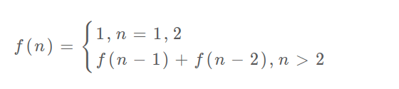

@slidestart

---

## 动态规划

- 动态规划问题的一般形式就是<font color=red>求最值</font>。
- 动态规划其实是运筹学的一种<font color=green>最优化</font>方法，只不过在计算机问题上应用比较多，比如说让你求<font color=orange>最长递增子序列</font>，<font color=blue>最小编辑距离</font>等等。
- 求解动态规划的核心问题是 <font color=pink>穷举</font> 。因为要求最值，肯定要把所有可行的答案穷举出来，然后在其中找最值呗。
- 这类问题存在<font color=purple>「重叠子问题」</font>，如果暴力穷举的话效率会极其低下，所以需要<font color=brown>「备忘录」</font>或者<font color=camel>「DP table」</font>来优化穷举过程，避免不必要的计算。
- 动态规划问题一定会具备<font color=yellowgreen>「最优子结构」</font>，才能通过子问题的最值得到原问题的最值。
- 只有列出正确的<font color=tomato>「状态转移方程」</font>才能正确地穷举。
- 明确 base case -> 明确「状态」-> 明确「选择」 -> 定义 dp 数组/函数的含义。

---

## 斐波那契数列

- 0、1、1、2、3、5、8、13、21、34
- F(0)=0，F(1)=1, F(n)=F(n - 1)+F(n - 2)（<font color=royalblue>n ≥ 2</font>，n ∈ N*）
- 但凡遇到需要递归的问题，最好都<font color=brown>画出递归树</font>，这对你分析算法的复杂度，寻找算法低效的原因都有巨大帮助。
- <font color=turquoise>递归算法的时间复杂度怎么计算？</font>就是用<font color=red>子问题个数</font>乘以<font color=green>解决一个子问题需要的时间</font>。


---

## 暴力递归
```java
int fib(int N) {
    if (N == 1 || N == 2) return 1;
    return fib(N - 1) + fib(N - 2);
}
// 本算法的时间复杂度是 O(2^n)
```

- 算法低效的原因：存在大量重复计算，比如 f(18) 被计算了两次，而且你可以看到，以 f(18) 为根的这个递归树体量巨大，多算一遍，会耗费巨大的时间。更何况，还不止 f(18) 这一个节点被重复计算，所以这个算法及其低效。

---

## 带备忘录的递归解法
```Java
public class Test{
    public static void main(String[] args){
        int[] mem = new int[21];
        System.out.println(fib(20, mem));
    }
    static int fib(int N, int[] mem) {
        if (N == 1 || N == 2) return 1;
        if(mem[N]!=0){
            return mem[N];
        }
        mem[N]= fib(N - 1,mem)+fib(N - 2,mem);
        return mem[N];
    }
}
// 本算法的时间复杂度是 O(n)
```


---

## dp 数组的迭代解法
- 上面的方法叫做「自顶向下」，动态规划叫做「自底向上」。
- 有了上一步「备忘录」的启发，我们可以把这个「备忘录」独立出来成为一张表，就叫做 DP table 吧，在这张表上完成「自底向上」的推算岂不美哉！
```Java
public class Test{
    public static void main(String[] args){
        System.out.println(fib(20));
    }
    static int fib(int N) {
        if (N < 1) return 0;
        if (N == 1 || N == 2) return 1;
        int[] dp = new int[21];
        // base case
        dp[1] = dp[2] = 1;
        for (int i = 3; i <= N; i++){
            dp[i] = dp[i - 1] + dp[i - 2];
        }
        return dp[N];
    }
}
// 本算法的时间复杂度是 O(n)
```

--


---

## 状态转移方程



- 把<font color=chocolate>f(n)</font>想做一个状态<font color=amber>n</font>，这个状态<font color=powderblue>n</font>是由状态<font color=tomato>n-1</font>和状态 <font color=green>n-2</font>相加转移而来，这就叫状态转移

- 千万不要看不起暴力解，动态规划问题最困难的就是写出这个暴力解，即状态转移方程。

---

## 空间复杂度降为 O(1)

```java
public class Test{
    public static void main(String[] args){
        System.out.println(fib(20));
    }
    static int fib(int N) {
        if (N < 1) return 0;
        if (N == 1 || N == 2) return 1;
        // base case
        int prev = 1,curr =1, sum;
        for (int i = 3; i <= N; i++){
            sum = prev + curr;
            prev = curr;
            curr = sum;
        }
        return curr;
    }
}
```

---

## 凑零钱问题

给你<font color=red>k</font>种面值的硬币，面值分别为<font color=green>c1, c2 ... ck</font>，每种硬币的数量无限，再给一个总金额<font color=blue>amount</font>，问你最少需要几枚硬币凑出这个金额，如果不可能凑出，算法返回 -1 。

比如说 k = 3，面值分别为 1，2，5，总金额 amount = 11。那么最少需要 3 枚硬币凑出，即 11 = 5 + 5 + 1。

首先，这个问题是动态规划问题，因为它具有<font color=purple>「最优子结构」</font>的。要符合<font color=purple>「最优子结构」</font>，子问题间必须<font color=pink>互相独立</font>。

- 相互独立:比如说，假设你考试，每门科目的成绩都是互相独立的。你的原问题是考出最高的总成绩，那么你的子问题就是要把语文考到最高，数学考到最高…… 为了每门课考到最高，你要把每门课相应的选择题分数拿到最高，填空题分数拿到最高…… 当然，最终就是你每门课都是满分，这就是最高的总成绩。“每门科目考到最高”这些子问题是互相独立，互不干扰的。

- 回到凑零钱问题，为什么说它符合最优子结构呢？比如你想求 amount = 11 时的最少硬币数（原问题），如果你知道凑出 amount = 10 的最少硬币数（子问题），你只需要把子问题的答案加一（再选一枚面值为 1 的硬币）就是原问题的答案。因为硬币的数量是没有限制的，所以子问题之间没有相互制，是互相独立的。

---

## 分析题目

1. 确定<font color=brown>base case</font>，这个很简单，显然<font color=chocolate>目标金额amount为0时算法返回0</font>，因为不需要任何硬币就已经凑出目标金额了。

2. 确定<font color=camel>「状态」</font>，也就是原问题和子问题中会变化的变量。由于硬币数量无限，硬币的面额也是题目给定的，只有目标金额会不断地向<font color=brown>base case</font>靠近，所以唯一的<font color=camel>「状态」</font>就是<font color=chocolate>目标金额amount</font>。

3. 定<font color=amber>「选择」</font>，也就是导致<font color=camel>「状态」</font>产生变化的行为。目标金额为什么变化呢，因为你在选择硬币，你每选择一枚硬币，就相当于减少了目标金额。所以说所有硬币的面值，就是你的<font color=amber>「选择」</font>。

4. 明确<font color=red>dp 函数/数组的定义</font>。我们这里讲的是自顶向下的解法，所以会有一个递归的dp函数，一般来说函数的参数就是状态转移中会变化的量，也就是上面说到的<font color=camel>「状态」</font>；函数的返回值就是题目要求我们计算的量。就本题来说，状态只有一个，即<font color=green>「目标金额」</font>，题目要求我们计算凑出目标金额所需的最少硬币数量。所以我们可以这样定义 dp 函数：dp(n) 的定义：输入一个目标金额 n，返回凑出目标金额 n 的最少硬币数量。

--

## 暴力递归

```java
public class Test{
    public static void main(String[] args){
        int amount = 11;
        int[] coins = {1,2,5};
        System.out.println(coinChange(coins, amount));
    }
    static int coinChange(int[] coins, int amount) {
        // base case
        if (amount == 0) return 0;
        if (amount < 0) return -1;
        int result = Integer.MAX_VALUE;
        for(int coin : coins) {
            int subResult = coinChange(coins, amount-coin);
            if(subResult == -1) continue;
            result = Math.min(result, 1+subResult);
        }
        if(result == Integer.MAX_VALUE) return -1;
        return result;
    }
}
```

状态转移方程:


--

## 画出递归树

- 递归算法的时间复杂度分析：子问题总数为递归树节点个数，这个比较难看出来，是 O(n^k)，总之是指数级别的。每个子问题中含有一个 for 循环，复杂度为 O(k)。所以总时间复杂度为 O(k * n^k)，指数级别。


---

## 带备忘录的递归

```java
public class Test{
    public static void main(String[] args){
        int amount = 11;
        int[] coins = {1,2,5};
        int[] mem = new int[amount+1];
        System.out.println(coinChange(coins, amount, mem));
    }
    static int coinChange(int[] coins, int amount, int[] mem) {
        if (mem[amount] != 0) return mem[amount];
        // base case
        if (amount == 0) return 0;
        if (amount < 0) return -1;
        int result = Integer.MAX_VALUE;
        for(int coin : coins) {
            int subResult = coinChange(coins, amount-coin);
            if(subResult == -1) continue;
            result = Math.min(result, 1+subResult);
        }
        if(result == Integer.MAX_VALUE) result = -1;
        mem[amount] = result
        return mem[amount];
    }
}
```
- 子问题总数不会超过金额数 n，即子问题数目为 O(n)。处理一个子问题的时间不变，仍是 O(k)，所以总的时间复杂度是 O(kn)。

---

## dp 数组的迭代解法

```java
import java.util.Arrays;
public class Test{
    public static void main(String[] args){
        int amount = 11;
        int[] coins = {1,2,5};
        // coinAmount数组的定义：当目标金额为 i 时，至少需要 coinAmount[i] 枚硬币凑出。
        int[] coinAmount = new int[amount+1];
        Arrays.fill(coinAmount, amount+1);
        // base case
        coinAmount[0] = 0;
        System.out.println(coinChange(coins, amount, coinAmount));
    }
    static int coinChange(int[] coins, int amount, int[] coinAmount) {
        // 外层 for 循环在遍历所有状态的所有取值
        for(int i= 0;i<coinAmount.length;i++) {
            // 内层 for 循环在求所有选择的最小值
            for(int coin : coins) {
                // 子问题无解，跳过
                if (i - coin < 0) continue;
                coinAmount[i] = Math.min(coinAmount[i], 1+ coinAmount[i - coin]);
            }
        }
        if(coinAmount[amount] == amount + 1) return -1;
        return coinAmount[amount];
    }
}
```

---

## 最后总结

- 第一个斐波那契数列的问题，解释了如何通过<font color=red>「备忘录」</font>或者<font color=green>「dp table」</font>的方法来优化递归树，并且明确了这两种方法本质上是一样的，只是<font color=blue>自顶向下</font>和<font color=purple>自底向上</font>的不同而已。

- 第二个凑零钱的问题，展示了如何流程化确定<font color=chocolate>「状态转移方程」</font>，只要通过状态转移方程写出暴力递归解，剩下的也就是优化递归树，消除重叠子问题而已。

- 计算机解决问题其实没有任何奇技淫巧，它唯一的解决办法就是<font color=amber>穷举</font>，穷举所有可能性。算法设计无非就是先思考“如何穷举”，然后再追求<font color=yellowgreen>如何聪明地穷举</font>。

- 备忘录、DP table 就是在追求“如何聪明地穷举”。用空间换时间的思路，是降低时间复杂度的不二法门，除此之外，试问，还能玩出啥花活？ 


@slideend